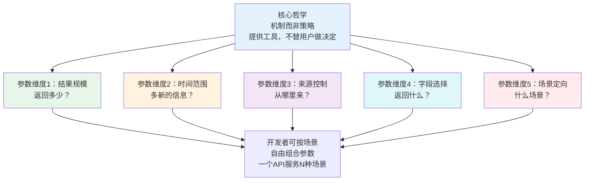

> **来源**：火山引擎豆包搜索（SearchInfinity）产品深度分析（2026-07-06）——豆包搜索提供结果数量、时间范围、来源控制、字段选择、站点定向五大类可配置参数，一个API通过参数化设计服务从快速问答到深度调研的N种场景
> **验证次数**：1次（火山引擎豆包搜索API）

# AI API极致参数化模式

## 模式类型
方法论模式（产品增长/API产品设计）

## 成熟度
L1 初始模式（1次成功实战验证，与"场景驱动参数取舍"形成硬件/软件互补模式对）

## 适用场景

| 场景 | 是否适用 | 说明 |
|------|---------|------|
| B端API/平台产品设计 | ✅ 核心场景 | 面向开发者的SaaS API、云服务API |
| AI/LLM基础设施API | ✅ 核心场景 | 搜索API、RAG检索、模型调用服务 |
| 一个产品服务多种差异场景 | ✅ 核心场景 | 同一API被快速问答/深度调研/垂直行业等不同场景使用 |
| 开发者工具/平台 | ✅ 核心场景 | 需要给予开发者充分控制权的工具链产品 |
| 面向终端用户的C端产品 | ❌ 不适用 | C端产品应做智能默认，不应暴露大量参数给用户 |
| 内部单一用途API | ⚠️ 部分适用 | 内部调用场景固定，参数化需求低 |
| 强合规/强约束场景 | ⚠️ 谨慎使用 | 金融、医疗等有严格合规要求的场景，参数化可能引入风险 |

## 问题背景

B端API产品设计中常见的"默认配置困境"：

1. **一刀切默认值**：产品团队设计一套"最优"默认配置，假设所有用户场景相同
2. **永远调不好的默认值**：快速问答场景用户抱怨返回太多内容浪费token，深度调研场景用户抱怨返回结果不够全面
3. **垂直场景需求无法满足**：医疗场景用户希望限定权威医疗站点，舆情监测用户希望限定新闻媒体，通用API无法支持
4. **产品方疲于应对**：收到各种定制化需求，为每个大客户做特殊参数，产品膨胀、维护成本飙升

**根本原因**：产品设计采用"策略而非机制"——替用户决定最优策略（固定默认值），而不是提供灵活的机制（参数化配置）让用户自行决定适合自己场景的策略。这种设计在C端产品中是对的（用户需要简单），但在B端API产品中是错的（开发者需要控制权）。

**核心洞察**：B端API的核心竞争力之一是灵活性——"一个API服务N种场景"的关键不是智能默认值，而是极致参数化。

---

## 核心规则：机制而非策略

### 规则1：识别核心参数维度——按"用户决策点"划分参数

参数化不是"暴露所有内部参数"，而是识别开发者在使用API时需要做出的**关键决策点**，将这些决策点开放为可配置参数。

豆包搜索实践的五大参数维度：

| 参数维度 | 解决的问题 | 典型配置 | 场景举例 |
|---------|-----------|---------|---------|
| **结果数量** | 快速问答需要1-3条精简结果，深度调研需要20-50条全面结果 | 1-50条可配置 | 客服问答→3条；研报生成→30条 |
| **时间范围** | 热点事件需要最新信息，历史研究需要特定时期数据 | 自定义时间范围筛选 | 今日新闻→24h内；行业研究→近1年 |
| **来源控制** | 不同场景对信息来源可信度要求不同 | 域名白名单/黑名单 | 医疗问答→只取权威医疗站点 |
| **字段选择** | 不同场景需要不同详细程度的返回 | 摘要/正文/元数据按需选择 | 快速问答→只取摘要；引用溯源→取完整字段 |
| **站点定向** | 特定行业/场景需要限定搜索范围 | 限定特定站点/站点类型 | 舆情分析→限定新闻媒体站点 |

> **设计原则**：每个参数维度对应一个真实的用户决策——"我需要多少结果？""我需要多新的信息？""我信任哪些来源？""我需要多详细的内容？"如果一个参数没有对应到真实的场景决策点，它可能是不应该暴露的内部实现细节。

### 规则2：提供合理默认值——参数化不等于让用户每次都配置所有参数

极致参数化 ≠ 强迫用户理解所有参数。正确做法是：

1. **智能默认值**：为最常见场景设置合理默认值（如默认返回10条、默认不限时间）
2. **渐进式暴露**：核心参数（如count）放在最显眼位置，高级参数（如字段过滤）作为可选配置
3. **预设组合**：提供场景预设（如`preset=chat`/`preset=research`），一键配置参数组合
4. **文档示例**：每种典型场景给出参数配置示例代码，开发者复制即用

| 设计要素 | 要求 | 示例 |
|---------|------|------|
| 默认值 | 覆盖80%常见场景 | count默认10条 |
| 参数文档 | 每个参数说明用途、取值范围、默认值 | count: 返回结果数, 1-50, 默认10 |
| 场景预设 | 提供预设组合快速上手 | preset=fast_chat/research/medical |
| 示例代码 | 每种典型场景给完整示例 | "快速问答场景：count=3&fields=snippet" |

### 规则3：参数之间正交独立——避免参数组合爆炸

参数设计应满足**正交性**：每个参数独立控制一个维度，参数之间不相互依赖、不产生冲突。

✅ **好的参数设计**：
- `count=10`（数量） + `time_range=1d`（时间） + `fields=snippet,authority_score`（字段）
- 每个参数独立控制一个维度，可以自由组合

❌ **坏的参数设计**：
- `mode=fast` 隐含count=3+fields=snippet+time_range=1d，但不暴露独立参数
- `detail_level=high` 隐含返回更多字段，但开发者无法精确控制需要哪些字段
- 参数之间相互影响：设置A参数后B参数自动变化，产生意外行为

> **为什么正交性重要？** 如果参数之间不正交，参数组合会爆炸式增长，测试和维护成本急剧上升。正交参数使得N个参数可以覆盖2^N种组合，而组合爆炸问题不会出现。

### 规则4：参数扩展向后兼容——新增参数不破坏旧调用

参数化API必然持续演进，必须遵循向后兼容原则：

1. **新参数可选**：所有新增参数必须是可选的（有默认值），旧调用不传新参数行为不变
2. **参数只增不删**：废弃参数要经历"标记废弃→保留兼容→至少1个版本周期→移除"的过程
3. **枚举值只增不删**：枚举类型参数新增值没问题，但删除或改名会破坏现有调用
4. **版本化API**：大的不兼容变更通过新版本API路径引入（如v2），不破坏v1用户

### 规则5：双向控制——既支持"包含"也支持"排除"

对于来源、类型等过滤维度，同时提供白名单（包含）和黑名单（排除）两种控制方式：

| 控制方式 | 参数示例 | 适用场景 |
|---------|---------|---------|
| **白名单（包含）** | `include_domains=gov.cn,edu.cn` | 已知信任哪些来源，只从这些来源获取 |
| **黑名单（排除）** | `exclude_domains=spam.com,forum.com` | 知道要排除哪些低质量来源 |
| **类型过滤** | `source_type=official,news` | 按类型筛选（官方/新闻/博客/论坛） |
| **无过滤** | 不传该参数 | 综合搜索，不特别限制来源 |

白名单和黑名单满足不同场景需求：高信任场景（医疗/法律）用白名单，通用场景用黑名单排除已知垃圾源。

---

## 参数化维度详细设计

以搜索API为例，五个核心参数维度的详细设计：

### 维度一：结果规模控制

| 参数名 | 类型 | 默认值 | 说明 |
|--------|------|--------|------|
| `count` | integer | 10 | 返回结果数量 |
| `offset` | integer | 0 | 分页偏移量 |

**设计考量**：
- 上下限合理：最少1条（减少到极致），上限根据服务能力设定（如50条）
- 分页支持：offset/cursor方式支持大量结果获取
- 成本控制：count上限防止滥用，但不要限制过低影响深度调研场景

### 维度二：时间范围控制

| 参数名 | 类型 | 默认值 | 说明 |
|--------|------|--------|------|
| `start_date` | ISO 8601 date | null | 起始时间 |
| `end_date` | ISO 8601 date | null | 结束时间 |
| `freshness` | enum | any | 预设时效：any/hour/day/week/month/year |

**设计考量**：
- 同时支持精确范围和便捷预设（freshness），兼顾灵活性和便捷性
- 时间格式统一使用ISO 8601，避免格式混乱
- 不传参数默认不限时间（不是默认"最近"，那是替用户做策略）

### 维度三：来源控制

| 参数名 | 类型 | 默认值 | 说明 |
|--------|------|--------|------|
| `include_domains` | string[] | null | 域名白名单 |
| `exclude_domains` | string[] | null | 域名黑名单 |
| `source_type` | enum[] | null | 来源类型筛选：official/gov/wiki/news/blog/forum/social |
| `site_search` | string | null | 限定搜索特定站点 |

**设计考量**：
- 数组类型参数支持多值（多个白名单域名）
- 白名单和黑名单互斥处理：同时传时白名单优先
- 提供site_search便捷参数（等价于include_domains但更易用）

### 维度四：字段选择

| 参数名 | 类型 | 默认值 | 说明 |
|--------|------|--------|------|
| `fields` | string[] | ["title","snippet","url","published_at"] | 返回字段列表 |
| `include_content` | boolean | false | 是否返回正文内容 |
| `include_metadata` | boolean | true | 是否返回元数据 |

**设计考量**：
- fields参数是token成本优化的核心——开发者按需选择字段，减少不必要的数据传输
- 提供便捷开关（include_content）覆盖常见需求
- 默认返回核心字段，正文字段默认关闭（大字段、token消耗大）

### 维度五：场景定向

| 参数名 | 类型 | 默认值 | 说明 |
|--------|------|--------|------|
| `search_mode` | enum | general | 搜索模式：general/academic/news/medical/legal |
| `preset` | enum | null | 场景预设：fast_chat/deep_research/rag_retrieval |
| `language` | string | null | 内容语言过滤 |

**设计考量**：
- 预设参数（preset）提供一键配置，降低使用门槛
- 模式参数（search_mode）触发不同的排序策略和来源权重
- 场景模式与独立参数正交：设置preset后仍可覆盖个别参数

---

## 实施检查清单

设计B端API时：

- [ ] **决策点识别**：是否识别了用户使用API时的关键决策点？每个决策点对应一个参数维度？
- [ ] **默认值合理**：默认配置是否覆盖80%常见场景？
- [ ] **正交独立**：参数之间是否正交独立，不产生隐式依赖和冲突？
- [ ] **渐进式暴露**：核心参数是否简单易用，高级参数是否可选？
- [ ] **场景预设**：是否提供preset等便捷参数降低新手门槛？
- [ ] **双向过滤**：对于过滤类参数，是否同时支持白名单（包含）和黑名单（排除）？
- [ ] **字段选择**：是否支持字段裁剪，帮助用户控制返回数据量和成本？
- [ ] **向后兼容**：新参数是否可选（有默认值）？是否有版本化策略？
- [ ] **文档示例**：每个典型场景是否有完整的参数配置示例代码？
- [ ] **上限保护**：是否设置了合理的参数上下限防止滥用？

---

## 正例：火山引擎豆包搜索的参数化实践

| 参数维度 | 豆包搜索实践 | 场景价值 |
|---------|------------|---------|
| **结果数量** | 1-50条可配置 | 快速问答→1-3条节省token；深度研报→30-50条全面覆盖 |
| **时间范围** | 自定义时间筛选 | 热点追踪→24h内；历史研究→不限时间 |
| **来源控制** | 域名黑白名单、站点定向 | 医疗问答→限定权威医疗站点；舆情分析→限定新闻媒体 |
| **字段选择** | 摘要/正文/元数据按需选择 | Agent调用→只取摘要+元数据；引用溯源→取完整正文 |
| **站点定向** | 可限定特定行业/站点搜索 | 竞品分析→只搜竞争对手站点；行业研究→限定行业媒体 |

**典型场景参数配置对比**：

| 场景 | count | time_range | fields | source控制 | 效果 |
|------|-------|-----------|--------|-----------|------|
| 智能客服快速问答 | 3 | 不限 | snippet+authority | 黑名单排除垃圾站 | 最低token成本、快速响应 |
| 内容创作素材搜集 | 10 | 近1年 | snippet+url+time | 新闻+博客优先 | 多样素材、时效性较好 |
| 市场调研报告 | 30 | 近3年 | 完整字段 | 不限来源 | 全面覆盖、深度分析 |
| 医疗问答 | 5 | 不限 | snippet+authority+url | 白名单：医疗权威站点 | 高可信度、来源可追溯 |
| 竞品舆情监测 | 20 | 24h | title+snippet+time | 白名单：新闻+社交媒体 | 实时性强、定向监测 |

---

## 反模式警示

| 反模式 | 表现 | 后果 | 正确做法 |
|--------|------|------|---------|
| **一刀切默认** | 只提供固定默认配置，无参数可调 | 所有场景都不满意，用户流失 | 识别决策点，开放为参数 |
| **参数爆炸** | 暴露大量内部参数，几十个参数让开发者困惑 | 学习成本极高，没人会用高级参数 | 核心参数5±2个，高级参数分组隐藏 |
| **策略硬编码** | "我们认为用户最需要X条结果"，固定返回数量 | 无法满足差异化场景需求 | 提供count参数让用户决定 |
| **参数耦合** | 设置mode=detailed自动返回10+字段，无法单独控制 | 想要3条详细结果做不到，想要10条精简结果也做不到 | 参数正交独立，自由组合 |
| **无默认值** | 所有参数必填，新手无法快速上手 | 接入门槛高，开发者放弃使用 | 合理默认值+场景预设，渐进式配置 |
| **字段全返回** | 每次返回所有字段，不支持裁剪 | 快速场景浪费token和带宽 | 支持fields参数，默认返回核心字段 |
| **破坏性变更** | 新参数必传或修改默认行为 | 旧代码升级后出现故障 | 新参数可选+默认值不变，大版本走v2路径 |

---

## 跨领域迁移

"机制而非策略"的参数化原则可迁移到各类平台产品：

| 产品类型 | 参数化维度 | 机制而非策略的体现 |
|---------|-----------|-----------------|
| **云存储API** | 文件类型/访问权限/存储类型/过期策略/加密选项 | 不替用户决定用什么存储类型，提供参数让用户按冷热数据选择 |
| **支付API** | 支付渠道/货币/分期选项/回调地址/风控等级 | 不替用户决定用什么支付方式，提供参数让商户按场景配置 |
| **消息推送API** | 推送渠道/优先级/过期时间/静默推送/分组 | 不替用户决定推送策略，提供参数让开发者按消息类型配置 |
| **AI模型API** | temperature/max_tokens/top_p/frequency_penalty/stop | 不替用户决定模型创造力，提供参数让开发者按任务类型调整 |
| **数据分析API** | 时间粒度/维度聚合/指标选择/过滤条件/排序 | 不替用户决定看什么维度，提供参数让分析师自由探索 |
| **CDN/缓存API** | TTL/缓存策略/刷新规则/压缩选项/HTTPS配置 | 不替用户决定缓存策略，提供参数让运维按资源类型配置 |

**核心迁移问题**：你的产品中，哪些决策是产品团队在替用户做？这些决策是否应该开放为参数，让用户（开发者）自行决定？

---

## 与其他模式的关系

| 关联模式 | 关系类型 | 关系说明 |
|---------|---------|---------|
| [ai-native-user-reversal-design.md](ai-native-user-reversal-design.md) | 父模式 | 极致参数化是AI原生设计原则在API设计层的具体体现 |
| [ai-consumption-metadata-design.md](ai-consumption-metadata-design.md) | 配套 | 元数据增强解决"返回什么判断信号"，参数化解决"开发者如何控制返回内容" |
| [scenario-driven-parameter-tradeoff.md](scenario-driven-parameter-tradeoff.md) | 互补模式对 | 硬件参数取舍是"做减法"——保守选择恰到好处的参数；API极致参数化是"做加法"——提供充分参数让开发者灵活选择。两者统一于"场景驱动"原则，但方向相反：硬件是产品方替用户做减法选择，API是给用户加法工具自行选择 |
| [technology-encapsulation-user-simplicity.md](technology-encapsulation-user-simplicity.md) | 张力统一 | 技术封装强调"对用户隐藏复杂性"，极致参数化强调"给开发者控制权"——两者并不矛盾：面向终端用户隐藏复杂性，面向开发者暴露控制权 |
| [hardware-generic-interface-service-differentiation.md](hardware-generic-interface-service-differentiation.md) | 思想同源 | 通用接口+服务差异化与极致参数化共享"通用机制+场景适配"的设计哲学 |

---

## 模式演进方向

当前版本为L1（1次验证），后续可在以下方向迭代：
1. 在更多B端API产品（云服务、支付、推送、存储）中验证普适性
2. 补充"参数设计优先级矩阵"——哪些参数应该优先暴露
3. 研究参数数量与用户体验的平衡曲线（参数太少不够灵活，太多学习成本高）
4. 补充参数设计的反模式案例库
5. 探索"智能默认+参数覆盖"的最佳实践——既给新手开箱即用的体验，又给老手充分的控制权
6. 与"场景驱动参数取舍"模式形成完整的"产品参数设计"模式对，统一为更高层级的模式组
