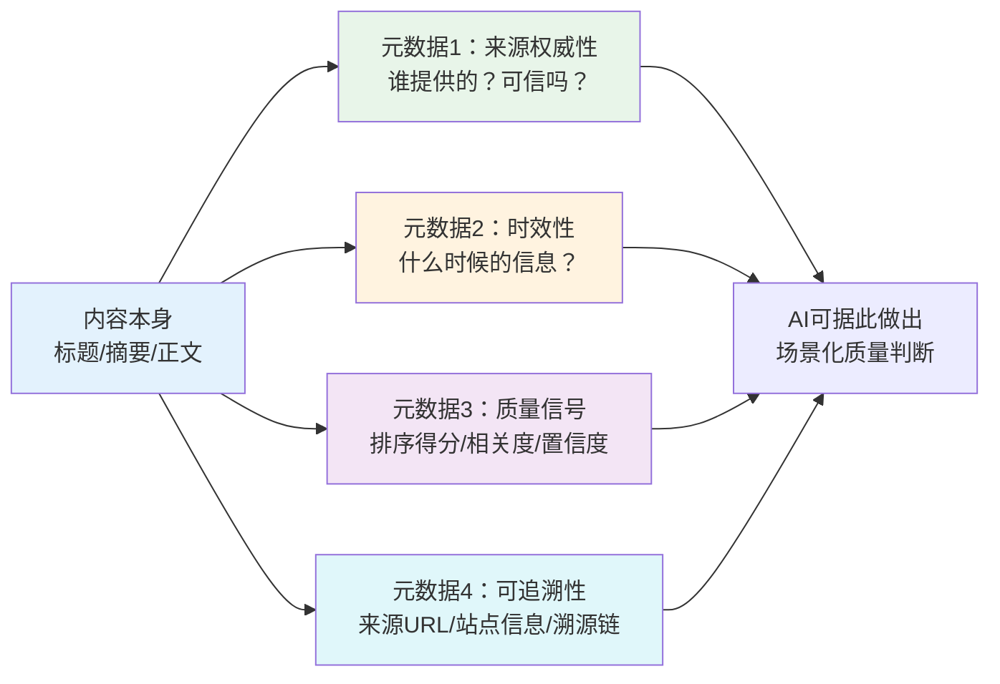

> **来源**：火山引擎豆包搜索（SearchInfinity）产品深度分析（2026-07-06）——豆包搜索返回权威评级、排序得分、发布时间、站点信息等完整元数据，帮助AI判断信息可信度，这是对抗幻觉的基础设施级设计
> **验证次数**：1次（火山引擎豆包搜索API）

# AI消费元数据增强模式

## 模式类型
方法论模式（产品增长/AI API设计）

## 成熟度
L1 初始模式（1次成功实战验证，需更多数据/API产品案例验证普适性）

## 适用场景

| 场景 | 是否适用 | 说明 |
|------|---------|------|
| 面向LLM的搜索/检索API | ✅ 核心场景 | RAG检索、联网搜索、知识问答 |
| 新闻/内容类数据API | ✅ 核心场景 | 时效性强、来源质量参差不齐的内容服务 |
| 聚合类数据服务 | ✅ 核心场景 | 整合多来源数据的API |
| 企业内部知识库API | ✅ 核心场景 | 企业文档检索需要区分文档权威性和更新时间 |
| 纯交易/操作类API | ⚠️ 部分适用 | 操作类API元数据需求较低，但返回操作溯源信息仍有价值 |
| 公开数据查询（如天气、汇率） | ❌ 不适用 | 单一权威来源、事实性数据无需可信度元数据 |

## 问题背景

在AI广泛使用数据API的时代，API设计者普遍存在一个盲区：**假设AI"知道"返回内容的质量如何**。

这导致三个核心问题：

1. **幻觉放大**：模型无法区分权威来源和低质量内容，将两者同等对待，导致输出中引用不可靠信息
2. **时效性误判**：模型不知道信息发布时间，可能将过时信息当作最新事实
3. **无法做质量阈值**：调用方无法根据质量分做过滤（"只返回可信度>0.8的结果"），只能接受API返回的所有结果

**根本原因**：传统API设计面向人类消费者，人可以自行判断信息质量（看域名、看发布日期、直觉判断可信度），但API设计者将这种人类的判断能力"想当然"地投射到AI身上，忘记了AI需要显式的信号来做判断。

典型症状：
- 搜索API只返回标题、摘要、URL，不返回来源可信度
- 新闻API不返回发布时间或时间格式不标准
- 聚合API不标注哪条结果来自哪个来源
- 知识库检索不返回文档版本/更新时间/作者权威性

---

## 核心规则：元数据增强四原则

面向AI的API不应假设AI能"推断"信息质量，而应显式提供判断所需的元数据——**提供判断依据，而非判断结论**。



### 原则1：不要假设AI"知道"什么是可信的——显式标注来源权威性

人类可以通过域名直觉判断来源可信度（`.gov`比个人博客可信，`wikipedia.org`比不知名论坛可信），但AI做不到——除非你明确告诉它。

**应提供的可信度元数据**：

| 元数据字段 | 类型 | 说明 | AI使用方式 |
|-----------|------|------|-----------|
| `source_authority_score` | float 0-1 | 来源权威度评分（基于站点类型、历史可信度等） | 阈值过滤（"只取score>0.7"）、加权排序 |
| `source_type` | enum | 来源类型枚举：official/gov/wiki/news/blog/forum/social/other | 按场景偏好不同来源（医疗场景偏好official/gov） |
| `domain` | string | 来源域名 | 调用方自行维护域名白名单/黑名单 |
| `is_exclusive` | boolean | 是否为API提供方独家内容 | 独家内容通常质量更高、时效性更好 |

**豆包搜索实践**：返回权威评级、站点类型信息，让Agent可以根据场景决定信任阈值——医疗咨询场景可以只取权威度>0.9的官方来源，娱乐闲聊可以放宽到0.5以上。

> **为什么是分数而不是标签？** 不要只返回"可信/不可信"二元标签——不同场景对可信度的阈值要求不同。医疗问答需要极高可信度，创意写作可以容忍较低可信度。提供连续的分数让调用方自行决定阈值，这是"机制而非策略"原则的体现。

### 原则2：提供判断依据而非判断结论——由Agent决定如何使用

元数据增强的核心哲学：**API提供信号，Agent做决策**。

| 错误做法（替AI做判断） | 正确做法（提供依据让AI判断） |
|---------------------|------------------------|
| 只返回"过滤后的优质结果"（硬编码质量阈值） | 返回所有结果+每条结果的质量分，由调用方设置阈值 |
| 标注"这条是真的" | 标注来源类型、权威度分、发布时间，让Agent结合场景判断 |
| 自动删除"过时"内容 | 返回发布时间，由调用方决定多老的信息算"过时"（历史研究可能需要10年前的数据，新闻需要当天数据） |
| 固定排序策略 | 返回排序得分，调用方可按需求重排（按时间、按权威度、按相关度） |

> **为什么？** 不同场景的质量标准完全不同。API设计者无法预判所有使用场景，因此应该提供丰富的信号（元数据），将策略决定权交给调用方。

### 原则3：元数据要可机读——结构化、数值化、标准化

元数据必须是程序可以直接解析和使用的格式，避免模糊的自然语言描述。

| 不推荐的做法 | 推荐的做法 |
|------------|-----------|
| `"source": "一个很权威的网站"` | `"source_domain": "gov.cn", "authority_score": 0.95` |
| `"date": "很久以前"` | `"published_at": "2026-07-01T08:00:00Z"` (ISO 8601) |
| `"quality": "high quality"` | `"relevance_score": 0.92, "authority_score": 0.88` |
| 自由文本格式描述 | 结构化JSON字段，明确schema，枚举类型限定取值范围 |

**元数据设计标准**：
- **数值化**：评分、相关度等使用0-1浮点数，便于阈值比较和加权计算
- **枚举化**：来源类型、内容类型等使用有限枚举值，避免自由文本
- **标准化**：时间使用ISO 8601格式，语言使用ISO 639-1代码，国家使用ISO 3166代码
- **Schema化**：提供JSON Schema，字段语义明确、无歧义
- **可选扩展**：核心元数据必填，扩展元数据可选，保持向后兼容

### 原则4：性能与运行元数据也要返回——支持可观测性和优化

除了内容相关元数据，还应返回API运行本身的元数据，支持调用方监控、优化和调试：

| 元数据字段 | 类型 | 说明 |
|-----------|------|------|
| `request_id` | string | 请求唯一ID，用于问题排查和链路追踪 |
| `latency_ms` | integer | 搜索/检索耗时，便于调用方监控性能 |
| `total_results` | integer | 符合条件的总结果数（用于分页判断） |
| `result_count` | integer | 本次返回的结果数 |
| `processing_warnings` | array | 处理过程中的警告信息（如"部分来源超时"） |
| `model_version` | string | 使用的算法/模型版本（便于结果复现和A/B测试） |

这些运行元数据对于AI Agent的可靠性工程至关重要——Agent需要知道API调用是否异常、是否降级、结果是否完整。

---

## 元数据完整清单

面向AI的检索/数据API应包含以下四类元数据：

### 一、来源可信度元数据

| 字段 | 必要性 | 说明 |
|------|--------|------|
| `source_domain` | 必须 | 来源域名 |
| `source_type` | 必须 | 来源类型枚举（official/gov/wiki/news/blog/forum/social/other） |
| `authority_score` | 必须 | 来源权威度评分（0-1） |
| `is_exclusive` | 推荐 | 是否为独家/自有内容 |
| `content_freshness` | 可选 | 内容新鲜度（针对时效性内容） |

### 二、时效性元数据

| 字段 | 必要性 | 说明 |
|------|--------|------|
| `published_at` | 必须 | 内容发布时间（ISO 8601） |
| `updated_at` | 推荐 | 内容最后更新时间（ISO 8601） |
| `crawled_at` | 推荐 | API抓取/索引该内容的时间 |
| `time_relevance` | 可选 | 内容时效类型：evergreen/news/breaking（用于场景化过滤） |

### 三、质量与相关度元数据

| 字段 | 必要性 | 说明 |
|------|--------|------|
| `relevance_score` | 必须 | 查询相关度评分（0-1） |
| `rank_position` | 推荐 | 原始排序位置 |
| `content_quality_score` | 可选 | 内容质量评分（完整性、深度、无垃圾内容等） |
| `deduplication_group` | 可选 | 去重分组ID（相似内容归为一组） |

### 四、可追溯性元数据

| 字段 | 必要性 | 说明 |
|------|--------|------|
| `source_url` | 必须 | 原始来源URL |
| `title` | 必须 | 内容标题 |
| `snippet` | 必须 | 摘要/精准摘要 |
| `content_fields_available` | 推荐 | 可获取的内容字段列表（摘要/正文/图片等） |

---

## 实施检查清单

设计或增强面向AI的API时：

- [ ] **可信度标注**：每条结果是否返回来源权威度评分和来源类型？
- [ ] **时效性**：是否返回ISO 8601格式的发布时间和更新时间？
- [ ] **质量信号**：是否返回相关度评分、排序位置等质量信号？
- [ ] **可追溯性**：是否返回来源URL、标题等溯源信息？
- [ ] **数值化评分**：评分是否为0-1浮点数而非模糊标签？
- [ ] **Schema明确**：元数据字段是否有明确的JSON Schema定义？
- [ ] **运行元数据**：是否返回request_id、latency_ms、total_results等运行信息？
- [ ] **机制而非策略**：是否提供信号让调用方自行决定阈值，而非硬编码过滤？
- [ ] **向后兼容**：元数据新增是否保持向后兼容？
- [ ] **文档说明**：每个元数据字段的含义、取值范围、计算方式是否有清晰文档？

---

## 正例：火山引擎豆包搜索的元数据设计

豆包搜索返回的每条结果包含丰富的元数据：

| 元数据类别 | 豆包搜索实践 | AI价值 |
|-----------|------------|--------|
| **权威评级** | 返回站点权威度分数 | Agent可设置"只参考权威来源"抗幻觉 |
| **发布时间** | 返回内容发布时间 | Agent可判断信息时效性，优先使用最新信息 |
| **排序得分** | 返回相关性和排序分数 | Agent可根据场景重排序或阈值过滤 |
| **站点信息** | 返回来源域名、站点类型 | Agent可做域名白名单/黑名单控制 |
| **搜索耗时** | 返回检索耗时指标 | 便于监控性能、优化调用策略 |
| **精准摘要** | 返回AI优化后的摘要而非原始网页片段 | 降低token消耗，减少二次爬取 |
| **结构化字段** | 支持字段选择（要摘要/正文/哪些元数据） | Agent按需选择，节省token成本 |

**典型Agent使用场景**：
```
医疗问答Agent：
1. 调用搜索API，设置参数：count=5
2. 遍历返回结果，过滤authority_score < 0.8的结果（排除非权威来源）
3. 优先使用published_at在最近1年内的结果
4. 综合3-5条高质量结果生成回答，引用来源
```

---

## 反模式警示

| 反模式 | 表现 | 后果 | 正确做法 |
|--------|------|------|---------|
| **元数据缺失** | API只返回内容本身，无任何元数据 | AI无法判断质量，幻觉风险高 | 至少返回来源URL、发布时间、权威度评分 |
| **替AI做判断** | 硬编码只返回"优质结果"，不返回评分 | 不同场景需求不同，硬编码阈值无法满足所有场景 | 返回评分+全量结果，让调用方设阈值 |
| **元数据不可机读** | 时间用"3天前"这种相对时间，评分用"高/中/低"标签 | AI无法精确计算和比较 | 使用ISO 8601绝对时间、0-1浮点评分 |
| **黑盒排序** | 排序逻辑不透明，不返回排序得分 | 调用方无法理解排序依据，无法按需求重排 | 返回relevance_score，说明排序因子 |
| **元数据堆砌** | 返回大量无用元数据，核心信号被淹没 | 增加token成本，关键信号被噪音掩盖 | 核心元数据必填，扩展元数据按需选择返回 |
| **Schema随意变更** | 字段含义不明确，版本间不兼容 | Agent解析失败，大规模故障 | JSON Schema严格定义，版本化API |

---

## 跨领域迁移

元数据增强模式可迁移到各类面向AI的数据服务：

| 数据服务类型 | 核心元数据 | 应用价值 |
|------------|-----------|---------|
| **RAG检索** | 文档来源、chunk位置、文档更新时间、作者权威性 | 减少知识库问答的幻觉，引用可溯源 |
| **新闻API** | 发布时间精确到秒、来源可信度、情感倾向、事实核查标记 | 事实性问答优先使用权威来源，避免过时新闻 |
| **企业知识库** | 文档密级、最后修改人、文档状态（草稿/正式/归档）、访问权限 | 避免引用草稿内容，遵守权限控制 |
| **代码搜索** | 代码仓库star数、最后commit时间、license类型、安全扫描结果 | Agent生成代码时优先使用活跃维护的、license兼容的代码 |
| **学术论文API** | 期刊影响因子、引用数、peer-review状态、发表年份 | 科研场景优先使用高引用、同行评审的论文 |
| **电商产品API** | 商品评分、评论数、店铺等级、价格变动历史 | Agent做购买推荐时参考商品可信度和性价比 |

**核心迁移问题**：你的数据领域，AI需要什么"额外信息"才能判断返回内容的质量和适用性？

---

## 与其他模式的关系

| 关联模式 | 关系类型 | 关系说明 |
|---------|---------|---------|
| [ai-native-user-reversal-design.md](ai-native-user-reversal-design.md) | 父模式 | 元数据增强是用户逆向定位的核心实施手段——为AI重新设计必须包含元数据增强 |
| [ai-api-extreme-parameterization.md](ai-api-extreme-parameterization.md) | 配套 | 极致参数化允许调用方选择返回哪些元数据字段，两者协同优化token效率 |
| [b2b-product-page-ux-five-dimensions.md](../research-knowledge/b2b-product-page-ux-five-dimensions.md) | 思想同源 | UX五维框架的"价值量化"原则与元数据增强都强调"用具体数据替代模糊描述" |
| [technology-encapsulation-user-simplicity.md](technology-encapsulation-user-simplicity.md) | 互补 | 技术封装对人类用户隐藏复杂性，元数据增强对AI用户暴露必要的判断信号——看似相反实则统一：人类需要简单，AI需要信号 |
| [prove-usefulness-check.md](../governance-strategy/prove-usefulness-check.md) | 方法论支撑 | 每个元数据字段必须证明其对AI判断的价值——"AI真的需要这个字段来做决策吗？" |

---

## 模式演进方向

当前版本为L1（1次验证），后续可在以下方向迭代：
1. 在RAG系统、企业知识库、新闻API等不同类型数据服务中验证普适性
2. 补充元数据Schema最佳实践（推荐字段名、类型、取值范围标准）
3. 增加不同场景（医疗/法律/创意/编程）的元数据权重配置建议
4. 补充元数据缺失/错误时的降级策略
5. 增加"元数据ROI"分析——哪些元数据字段性价比最高、哪些是nice-to-have
