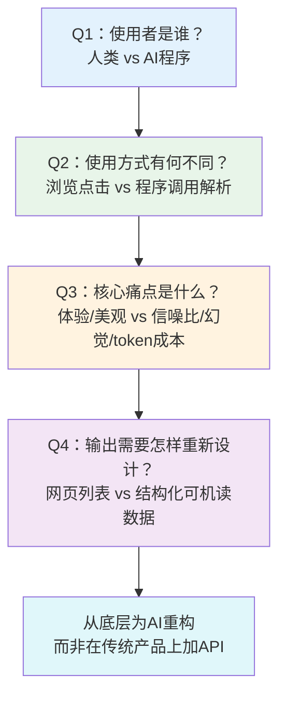

> **来源**：火山引擎豆包搜索（SearchInfinity）产品深度分析（2026-07-06）——对比传统搜索引擎为人类浏览设计 vs 豆包搜索为AI Agent程序调用设计的根本差异，提炼出"为AI而非人重新设计"的产品定位方法论
> **验证次数**：1次（火山引擎豆包搜索API产品）

# AI原生用户逆向定位模式

## 模式类型
方法论模式（产品增长/AI产品策略）

## 成熟度
L1 初始模式（1次成功实战验证，需更多AI API产品案例验证普适性）

## 适用场景

| 场景 | 是否适用 | 说明 |
|------|---------|------|
| 新AI API/基础设施产品设计 | ✅ 核心场景 | 从零设计面向LLM/Agent的API服务 |
| 传统能力AI化改造 | ✅ 核心场景 | 搜索引擎、数据库、知识库等传统能力加AI接口 |
| AI Agent工具链产品规划 | ✅ 核心场景 | 为Agent生态提供底层能力的产品 |
| AI产品差异化定位分析 | ✅ 核心场景 | 竞品分析时判断对方是否真正AI原生 |
| 面向人类的ToC/ToB应用 | ❌ 不适用 | 终端用户产品遵循正常用户中心设计即可 |
| 内部系统/非API产品 | ⚠️ 部分适用 | 内部调用场景对"AI友好"要求较低 |

## 问题背景

在AI Agent生态爆发的背景下，大量"AI原生产品"涌现，但存在一个普遍的定位误区：

1. **增量改进误区**：在传统产品上加个API就声称是"AI版"，底层仍是为人类设计的架构
2. **使用者混淆**：假设AI使用信息的方式和人类一样——浏览网页、点击链接、阅读长文
3. **痛点错配**：解决的是人类的痛点（界面美观、交互流畅），而非AI的痛点（信噪比、token成本、幻觉风险、可信度判断）
4. **格式不适配**：返回人类可读的HTML/富文本，而非结构化、可机读的数据格式

**根本原因**：产品设计者没有进行"用户逆向定位"——没有深入思考"当用户是AI程序而非人类时，产品需要怎样重新设计"。传统产品设计思维的路径依赖导致"新瓶装旧酒"。

---

## 核心规则：用户逆向定位四问

设计面向AI的产品时，必须回答四个根本问题，从底层重构而非表层包装：

### 规则1：识别使用者差异——人类浏览 vs AI程序调用

人类和AI使用信息服务的方式存在本质差异：

| 维度 | 人类使用者 | AI使用者（LLM/Agent） |
|------|-----------|---------------------|
| **交互方式** | 视觉浏览、点击跳转、滚动阅读 | API调用、JSON解析、程序化处理 |
| **信息处理** | 理解自然语言、容错能力强、能看懂图片 | 依赖结构化数据、对格式错误敏感、token计数敏感 |
| **判断能力** | 能直觉判断信息可信度、识别广告和垃圾内容 | 无法可靠判断来源质量、容易被误导产生幻觉 |
| **成本模型** | 时间成本（阅读需要时间） | token成本（每次调用消耗token，长文本成本高） |
| **容错机制** | 遇到错误可以重试、换关键词、换个链接 | 一次调用失败可能导致整个Agent任务失败 |
| **信噪比偏好** | 可以容忍一定噪音，喜欢丰富多样的信息 | 信噪比要求极高，冗余信息直接增加成本和错误率 |

> **为什么？** 人类的大脑经过亿万年进化，擅长模式识别、容错处理、模糊理解；而LLM本质是统计模型，在结构化、精确、高信噪比的输入上表现最好。为人类设计的信息架构包含大量"人类友好"但"AI不友好"的元素（导航栏、广告、相关推荐、装饰性文案），这些对AI来说都是噪音和成本。

### 规则2：重新设计输出——从"吸引点击"到"供模型直接消费"

传统搜索引擎为人类设计输出的核心目标是"吸引点击"——标题要吸引眼球、摘要要勾起好奇心、结果要多样化让用户有选择空间。

为AI设计的输出核心目标完全不同：**让大模型以最低的token成本获得最准确、最可信、最结构化的信息，直接用于推理和回答**。

关键设计转变：

| 设计维度 | 面向人类的设计 | 面向AI的设计 |
|---------|--------------|-------------|
| **结果格式** | HTML网页、带格式的富文本 | 结构化JSON、清晰字段分隔 |
| **摘要策略** | 留悬念、勾起好奇心、吸引点击 | 精准摘要、直接给出答案、减少跳转 |
| **排序逻辑** | 商业价值+SEO+相关性混合 | 纯相关性+权威性优先，无商业干扰 |
| **信息密度** | 适当留白、图文混排、视觉舒适 | 高密度信息、无装饰性内容 |
| **元数据** | 可有可无，人能自己判断 | 必须包含来源权威性、时间、置信度等判断依据 |
| **冗余控制** | 提供多条结果让用户选择 | 最优结果+备选，控制数量减少token消耗 |

### 规则3：解决AI特有痛点——而非人类痛点

面向AI的产品需要解决AI的四大特有痛点：

| AI特有痛点 | 表现 | 设计对策 |
|-----------|------|---------|
| **信噪比问题** | 传统搜索结果包含大量广告、SEO垃圾、无关内容，增加模型处理成本和错误率 | 精准摘要过滤、结果去重、内容质量分级 |
| **幻觉风险** | 模型无法可靠判断信息可信度，可能将不可靠来源作为事实依据 | 权威评级标注、来源可信度分数、站点白名单机制 |
| **token成本** | 长文本结果直接增加API调用成本，降低响应速度 | 字段裁剪、按需返回、摘要压缩、正文可选 |
| **可信度判断** | 模型不知道哪条信息更新、哪个来源更权威 | 元数据增强（发布时间、权威评级、排序得分、站点信息） |

### 规则4：不做增量改进——从底层为AI重构

最关键的规则：**AI原生产品不是"传统产品+API"，而是从底层为AI的使用特点重新架构**。

"加API"的增量改进 vs "为AI重构"的本质区别：

| 做法 | 本质 | 结果 |
|------|------|------|
| 在传统搜索引擎后加个API返回网页列表 | 增量改进 | AI拿到的仍然是为人类排序的结果，需要自己爬取网页、解析HTML、过滤噪音——本质还是"AI模拟人类浏览" |
| 重新设计检索管道：权威优先排序、精准摘要生成、结构化字段输出、元数据标注 | 底层重构 | AI拿到可直接消费的高质量数据，无需二次处理，真正实现"AI原生" |

> **反模式警告**：如果你的产品需要让AI"先调用API拿到链接，再去爬取网页内容，再解析HTML提取正文"，这不是AI原生——这是让AI模拟人类上网。真正的AI原生搜索应该直接返回AI需要的结构化信息，无需二次爬取和解析。

---

## 实施检查清单

设计或评估面向AI的API产品时，逐项检查：

- [ ] **使用者定位**：是否明确区分了"给人用的产品"和"给AI用的API"的设计差异？
- [ ] **输出格式**：返回的是结构化可机读数据（JSON），还是需要解析的HTML/富文本？
- [ ] **信噪比控制**：是否过滤了广告、导航、装饰性内容等对AI无意义的噪音？
- [ ] **幻觉应对**：是否提供了来源可信度标注，帮助模型判断信息质量？
- [ ] **token效率**：是否支持字段裁剪、按需返回，避免返回AI不需要的冗余内容？
- [ ] **元数据完整性**：是否返回发布时间、来源权威度、排序得分等元数据供AI判断？
- [ ] **架构层面**：是从底层为AI重新设计，还是在传统产品上包装了一层API？
- [ ] **参数灵活性**：是否允许AI根据场景调整结果数量、时间范围、来源类型等参数？（参见 [ai-api-extreme-parameterization.md](ai-api-extreme-parameterization.md)）
- [ ] **错误处理**：是否返回清晰的结构化错误信息，便于Agent程序化处理？
- [ ] **成本可预测**：token消耗是否可预测、可控制？是否有token上限保护？

---

## 正例：火山引擎豆包搜索的实践

豆包搜索体现了典型的AI原生用户逆向定位设计：

| 设计要素 | 传统搜索（面向人类） | 豆包搜索（面向AI） | 逆向定位体现 |
|---------|-------------------|------------------|------------|
| **结果输出** | 10条蓝色链接+网页摘要 | 精准摘要+结构化字段+元数据 | 直接给答案而非给链接 |
| **排序策略** | 综合排序（含商业因素） | 权威优先、相关性优先 | AI需要可信答案而非"吸引点击" |
| **摘要设计** | 片段截取，留悬念吸引点击 | 精准摘要，直接回答问题 | 减少token消耗和二次请求 |
| **可信度信号** | 无（人类自己判断） | 权威评级、站点信息标注 | 帮助模型抗幻觉 |
| **参数配置** | 简单筛选（时间/类型） | 五大类可配置参数（数量/时间/来源/字段/站点） | 开发者可按场景定制 |
| **内容来源** | 全网搜索 | 优先头条/抖音百科等独家生态 | 独家内容壁垒（参见 [ecosystem-barrier-evaluation.md](../ai-collaboration/ecosystem-barrier-evaluation.md)） |

---

## 反模式警示

| 反模式 | 表现 | 后果 | 正确做法 |
|--------|------|------|---------|
| **API包装反模式** | 传统搜索引擎加个API，返回的还是网页列表 | AI需要自己爬取解析，token成本高、错误率高 | 从检索管道开始重构，直接返回结构化结果 |
| **人类中心反模式** | API文档用"用户体验"、"界面美观"描述产品优势 | AI不关心界面，关心数据质量和结构化程度 | 用"信噪比"、"结构化程度"、"元数据完整性"描述AI友好性 |
| **功能堆砌反模式** | 把所有功能都塞进API返回，认为"越全越好" | 冗余字段增加token成本，增加模型处理负担 | 支持字段选择，默认返回核心字段，可选扩展 |
| **格式随意反模式** | 返回非标准格式、字段含义不清晰、无schema | AI解析困难，格式变更导致调用方大规模故障 | 严格JSON Schema、版本化API、字段语义明确 |
| **黑盒排序反模式** | 排序逻辑不透明，商业内容混在自然结果中 | AI无法判断结果质量和可信度，可能引用广告内容 | 明确标注结果类型（自然/权威/独家）、提供排序得分 |

---

## 可借鉴场景迁移

"用户逆向定位"思维不仅适用于搜索API，可以迁移到所有"传统IT能力+AI"场景：

| 传统能力 | 面向人类的设计 | AI原生逆向定位设计 |
|---------|--------------|------------------|
| **数据库** | SQL查询、表格展示、报表可视化 | 自然语言转结构化查询、返回推理友好的数据格式、自动聚合分析 |
| **知识库/Wiki** | 页面浏览、目录导航、全文检索 | 语义检索+精准片段返回、来源追溯、相关概念关联 |
| **代码仓库** | 代码浏览、PR review界面、Web IDE | 结构化代码上下文返回、依赖关系图、符号级精准检索 |
| **CRM/ERP** | 表单录入、列表视图、数据看板 | 实体关系结构化输出、业务事件推送、自然语言查询→结构化操作 |
| **邮件/日历** | 收件箱浏览、日历界面、通知提醒 | 重要性分级摘要、待办提取、日程冲突检测结构化结果 |

**核心迁移问题**：对于你的产品领域，回答"AI怎么用这个能力？和人用有什么不同？需要做哪些重新设计？"

---

## 与其他模式的关系

| 关联模式 | 关系类型 | 关系说明 |
|---------|---------|---------|
| [ai-consumption-metadata-design.md](ai-consumption-metadata-design.md) | 子模式/配套 | 元数据增强是用户逆向定位的具体实施手段之一——为AI提供判断依据 |
| [ai-api-extreme-parameterization.md](ai-api-extreme-parameterization.md) | 子模式/配套 | 极致参数化是AI原生API的核心设计原则，让开发者按场景定制 |
| [ecosystem-barrier-evaluation.md](../ai-collaboration/ecosystem-barrier-evaluation.md) | 互补 | 用户逆向定位解决"为谁设计"的问题，生态壁垒解决"凭什么持续赢"的问题 |
| [technology-encapsulation-user-simplicity.md](technology-encapsulation-user-simplicity.md) | 思想同源 | 两者都强调"隐藏复杂性"——技术封装向人类用户隐藏复杂性，用户逆向定位向AI用户隐藏不必要的信息 |
| [professional-capability-democratization.md](professional-capability-democratization.md) | 上游 | 专业能力民主化是AI时代的大趋势，用户逆向定位是专业能力被AI民主化使用的设计前提 |
| [vendor-product-learning-twelve-step-template.md](../research-knowledge/vendor-product-learning-twelve-step-template.md) | 使用关系 | 产品学习模板的Step 4（差异化能力分析）使用本模式判断AI原生程度 |

---

## 模式演进方向

当前版本为L1（1次验证），后续可在以下方向迭代：
1. 增加更多AI API产品案例验证（向量数据库、RAG检索、代码搜索等）
2. 补充"AI友好度"量化评估矩阵
3. 细化不同类型AI使用者（LLM vs Agent vs 传统程序）的差异化设计要求
4. 增加API schema设计最佳实践
5. 补充token成本优化的具体设计模式
