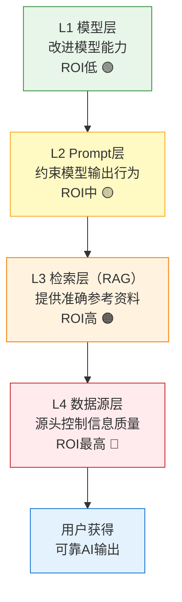

> **来源**：火山引擎豆包搜索（SearchInfinity）产品深度分析（2026-07-06）——豆包搜索的幻觉治理思路是不在模型层死磕，而是从数据源层就做好质量控制，配合权威评级元数据，形成四层纵深防御体系
> **验证次数**：1次（火山引擎豆包搜索幻觉治理实践）

# AI可靠性四层纵深防御模型

## 模式类型
方法论模式（产品增长/AI产品可靠性设计）

## 成熟度
L1 初始模式（1次成功实战验证，需在更多AI产品中验证普适性）

## 适用场景

| 场景 | 是否适用 | 说明 |
|------|---------|------|
| RAG系统设计优化 | ✅ 核心场景 | 检索增强生成系统的质量保障 |
| AI搜索/问答产品 | ✅ 核心场景 | 联网搜索、知识问答类AI产品 |
| Agent工具链设计 | ✅ 核心场景 | AI Agent调用外部工具时的结果可信度保障 |
| 企业知识库AI应用 | ✅ 核心场景 | 企业内部RAG、智能客服、知识助手 |
| 纯生成类AI（写作/创意） | ⚠️ 部分适用 | 创意类场景对事实准确性要求较低，防御重点不同 |
| 非AI软件系统 | ❌ 不适用 | 传统软件可靠性有成熟的工程方法（测试/监控/熔断），本模式针对AI特有幻觉问题 |

## 问题背景

大模型幻觉（Hallucination）是AI产品落地的核心障碍之一，但解决幻觉的思路普遍存在两个误区：

1. **单一层面思维**：试图通过单一手段（改进模型、写好Prompt）解决所有幻觉问题，效果有限
2. **投入错配**：在模型层投入大量资源调优，却忽视了数据源质量——而数据源才是信息质量的根本
3. **缺乏体系化**：没有分层防御思路，不知道在哪一层投入ROI最高

**根本原因**：幻觉不是单一原因导致的，而是从数据输入到最终输出的全链路问题。模型训练数据的偏差、Prompt的模糊性、检索结果的噪音、数据源本身的不可靠——每个环节都可能引入幻觉。单一层面的优化只能解决部分问题。

---

## 核心框架：四层纵深防御

**核心洞察**：解决AI可靠性问题需要全链路协同，**越靠近数据源的防御层，ROI越高**。数据源层的质量控制是第一道也是最重要的关口——如果输入给模型的信息本身就是垃圾，再好的模型和Prompt也无法输出可靠结果（GIGO原则：Garbage In, Garbage Out）。

### 四层防御详细说明

| 防御层 | 核心手段 | 解决的问题 | 效果 | 投入产出比 | 责任方 |
|--------|---------|-----------|------|-----------|--------|
| **L1 模型层** | 训练数据清洗、RLHF、模型微调、让模型"学会诚实" | 模型本身的事实准确性、偏见、拒答能力 | 有限——模型本质是概率生成系统，无法保证100%准确 | ⭐⭐ 低 | 模型团队 |
| **L2 Prompt层** | System Prompt约束、"只根据上下文回答"、"不知道就说不知道"、Few-shot示例 | 约束模型输出格式和行为，减少无依据生成 | 有效果但不稳定——Prompt注入、边界case仍可能突破 | ⭐⭐⭐ 中 | 应用开发团队 |
| **L3 检索层（RAG）** | 提供准确的参考资料、检索结果重排序、相关度过滤、去重 | 通过给模型喂准确资料，大幅减少无中生有 | 效果显著——是当前主流方案，但检索质量决定天花板 | ⭐⭐⭐⭐ 高 | 检索/RAG团队 |
| **L4 数据源层** | 从源头控制信息质量、优先权威来源、提供可信度元数据、独家高质量数据 | 确保输入给检索层的数据本身就是可靠的 | 根本性解决——源头质量决定了整条链路的上限 | ⭐⭐⭐⭐⭐ 最高 | 数据/平台团队 |

> **为什么纵深防御有效？** 与安全领域的Defense in Depth原理相同：即使某一层被突破，其他层仍能提供保护。模型可能产生幻觉，但Prompt可以约束它；Prompt可能被绕过，但RAG提供的参考资料能锚定事实；RAG可能检索到低质量结果，但数据源层从一开始就过滤了垃圾信息。四层协同远胜于任何单一手段。

---

## 各层设计指南

### L1 模型层：基础能力建设

模型层是必要基础但不是银弹。在这一层应做：
- 选择适合场景的基础模型（事实性强的模型用于问答，创造性强的用于写作）
- 使用针对事实准确性微调的模型版本
- 设置合理的temperature（低temperature用于事实性问答，高temperature用于创意生成）
- **不要期待**：仅靠模型升级解决所有幻觉问题

### L2 Prompt层：行为约束

Prompt层是成本最低的防御手段，应精心设计：
- System Prompt中明确角色定位和行为边界
- 使用"引用来源"约束：要求模型回答时标注参考来源
- 使用"不确定性表达"约束：当模型不确定时，明确说明而非编造
- 设置兜底回答：超出知识范围时礼貌拒答而非猜测
- **注意**：Prompt层防御可被绕过，不能作为唯一防线

### L3 检索层（RAG）：锚定事实

RAG是当前性价比最高的技术手段：
- 检索结果相关度优化（语义检索+关键词检索混合）
- 结果重排序（Rerank）：用专门模型对检索结果二次排序
- 相关度阈值过滤：设置最低相关度阈值，低于阈值不送入模型
- 去重与多样性：避免重复内容，确保多视角覆盖
- 片段长度控制：过长的上下文增加噪音和成本，过短丢失关键信息
- **关键原则**：RAG的质量天花板由数据源层决定——垃圾数据进，垃圾结果出

### L4 数据源层：源头治理（最被忽视、ROI最高）

数据源层是本模式最核心的洞察，也是当前行业最薄弱的环节：

| 数据源层手段 | 具体做法 | 防御价值 |
|------------|---------|---------|
| **来源权威性分级** | 对数据源建立权威度评级（官方/学术/媒体/博客/论坛），优先返回高权威来源 | ⭐⭐⭐⭐⭐ |
| **元数据增强** | 返回来源可信度评分、发布时间、来源类型等元数据，让模型和应用层可做阈值过滤（参见 [ai-consumption-metadata-design.md](ai-consumption-metadata-design.md)） | ⭐⭐⭐⭐⭐ |
| **独家高质量数据** | 接入自有/合作的独家高质量数据源，从数据层面形成壁垒（参见 [ecosystem-barrier-evaluation.md](../ai-collaboration/ecosystem-barrier-evaluation.md) 规则4） | ⭐⭐⭐⭐ |
| **内容质量分级** | 对索引内容做质量评分，过滤低质量、SEO垃圾、广告内容 | ⭐⭐⭐⭐ |
| **时效性控制** | 确保数据更新频率匹配场景需求，提供发布时间元数据 | ⭐⭐⭐ |
| **人工审核** | 关键领域数据（医疗/法律/金融）经人工审核后入库 | ⭐⭐⭐⭐⭐（高成本高价值场景） |

**豆包搜索实践**：不在模型层死磕抗幻觉，而是在数据源层就做好质量控制——优先返回权威来源、附带权威评级元数据、整合头条/抖音百科独家高质量内容。这正是L4数据源层防御的典型实践。

---

## 实施检查清单

设计或评估AI系统可靠性方案时：

- [ ] **全链路评估**：是否从L1到L4四层都做了可靠性设计，而非仅依赖单一手段？
- [ ] **L4数据源治理**：是否对数据源做了权威性分级和质量控制？
- [ ] **元数据增强**：返回结果是否包含可信度、时效性等元数据供上层决策？
- [ ] **L3检索质量**：是否有检索重排序、相关度阈值过滤、去重机制？
- [ ] **L2 Prompt约束**：Prompt中是否有来源引用要求、不确定性表达约束、兜底拒答规则？
- [ ] **L1模型选择**：是否根据场景选择合适的模型和参数配置？
- [ ] **纵深协同**：各层防御是否协同工作而非各自为战？
- [ ] **ROI优先级**：投入资源是否按ROI排序（L4 > L3 > L2 > L1），而非反序投入？
- [ ] **效果监控**：是否有幻觉率的量化监控指标，能评估各层改进的效果？
- [ ] **降级策略**：当数据源不可靠或检索结果不足时，系统是否能优雅降级（如明确告知信息不足）？

---

## 反模式警示

| 反模式 | 表现 | 后果 | 正确做法 |
|--------|------|------|---------|
| **模型万能论** | "等GPT-5/更好的模型出来幻觉问题就解决了" | 持续等待，忽视当下可做的数据源治理和RAG优化 | 分层防御，在L2-L4立即行动，模型升级作为L1持续优化 |
| **Prompt神化** | 认为靠精心设计的Prompt就能彻底解决幻觉 | Prompt可被绕过，边界case无法覆盖 | Prompt作为L2防御，配合L3/L4形成纵深 |
| **数据盲目信仰** | "我们用了全网数据所以质量高" | 全网数据中垃圾远多于优质内容，不加筛选反而是劣势 | 数据源分级+质量过滤，权威来源优先 |
| **RAG即银弹** | "做了RAG幻觉问题就解决了" | RAG检索到错误/低质量内容时，反而会"有据可依地胡说" | RAG上游必须有数据源层质量控制，下游配合Prompt约束 |
| **层间脱节** | 模型团队只调模型、检索团队只管检索、数据团队只管入库，各层不协同 | 整体可靠性低于各层独立效果之和 | 端到端可靠性目标驱动，跨层协同优化 |
| **只测理想case** | 测试用例都是"正常问题"，不测边界case和诱导性问题 | 上线后遇到对抗性输入或模糊问题时幻觉频发 | 建立幻觉测试集，包含诱导性问题、过时信息、矛盾信息等case |

---

## 跨领域迁移

四层纵深防御模型可迁移到各类需要可靠性的AI场景：

| AI场景 | L1模型层 | L2 Prompt层 | L3 检索/上下文层 | L4数据源层 |
|--------|---------|------------|----------------|-----------|
| **医疗AI问答** | 医学微调模型 | "必须标注来源和证据等级" | 临床指南/文献检索+重排序 | 权威医学数据库+临床指南+人工审核 |
| **金融投研AI** | 金融领域模型 | "数据来源必须可追溯" | 财报/公告/研报检索 | 交易所官方数据+权威研报+实时行情 |
| **法律AI助手** | 法律微调模型 | "引用法条编号和案例号" | 法条/案例检索 | 官方法条数据库+裁判文书库 |
| **企业知识库AI** | 通用/企业微调模型 | "超出知识库范围时说明无法回答" | 企业文档检索+权限过滤 | 企业内部文档+分级权限控制 |
| **代码生成AI** | 代码专用模型 | "不确定时查阅官方文档" | API文档/代码库检索 | 官方文档+经过验证的代码库 |

**核心迁移问题**：在你的AI应用场景中，四层防御各有哪些具体手段？目前最薄弱的是哪一层？在L4数据源层可以做哪些质量提升？

---

## 与其他模式的关系

| 关联模式 | 关系类型 | 关系说明 |
|---------|---------|---------|
| [ai-consumption-metadata-design.md](ai-consumption-metadata-design.md) | 子模式/实施手段 | 元数据增强是L4数据源层的核心实施手段——可信度元数据是数据源质量的信号机制 |
| [ai-native-user-reversal-design.md](ai-native-user-reversal-design.md) | 思想同源 | 用户逆向定位解决"为谁设计"，四层防御解决"如何设计得可靠"——AI原生设计必须包含可靠性设计 |
| [ecosystem-barrier-evaluation.md](../ai-collaboration/ecosystem-barrier-evaluation.md) | 互补 | 独家高质量数据既是L4可靠性防御的手段，也是竞争壁垒——数据源质量同时服务于可靠性和竞争优势 |
| [spec-level-defense-in-depth.md](../governance-strategy/spec-level-defense-in-depth.md) | 跨领域呼应 | 规范层纵深防御（规范设计安全）与本模式（AI系统可靠性防御）共享Defense-in-Depth思想，但应用领域完全不同 |
| [ai-api-extreme-parameterization.md](ai-api-extreme-parameterization.md) | 配套 | 极致参数化允许调用方设置可信度阈值（如"只返回authority_score>0.8的结果"），将L4防御能力开放给开发者 |
| [prove-usefulness-check.md](../governance-strategy/prove-usefulness-check.md) | 方法论支撑 | 每一层防御投入都应该"证明有用"——量化各层对幻觉率降低的贡献，按ROI排序投入 |

---

## 模式演进方向

当前版本为L1（1次验证），后续可在以下方向迭代：
1. 在更多AI产品（医疗AI、法律AI、代码生成等）中验证四层模型的普适性
2. 补充各层的量化指标（幻觉率、事实准确率、来源覆盖率等）
3. 增加"层间协同"的具体设计模式（如L4元数据如何传递到L2 Prompt中）
4. 补充不同场景的四层配置最佳实践（高风险场景vs低风险场景的防御强度差异）
5. 增加"幻觉测试集"构建方法
6. 探索L5（人工反馈层/输出校验层）是否应该成为独立防御层
