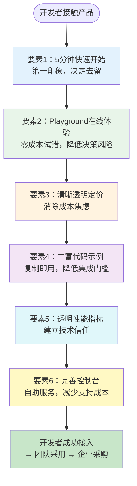

> **来源**：火山引擎豆包搜索（SearchInfinity）产品深度分析（2026-07-06）——结合对Stripe、飞书、AWS等优秀B端开发者产品的观察，提炼出B2B AI/API产品DX的六个核心要素
> **验证次数**：1次深度案例分析（豆包搜索）+ 行业最佳实践观察（Stripe/AWS/飞书等）

# B2B AI产品开发者体验六要素

## 模式类型
方法论模式（产品增长/B2B开发者产品设计）

## 成熟度
L1 初始模式（1次深度案例分析+行业最佳实践归纳，需更多B2B API产品定量验证）

## 适用场景

| 场景 | 是否适用 | 说明 |
|------|---------|------|
| AI API/云服务产品设计 | ✅ 核心场景 | 大模型API、搜索API、AI能力开放平台 |
| 开发者工具/平台产品 | ✅ 核心场景 | SDK、CLI、开发框架、MCP服务 |
| SaaS API产品 | ✅ 核心场景 | 支付API、通信API、数据API等 |
| 开源商业产品 | ✅ 核心场景 | 开源核心+商业服务模式的产品 |
| 纯终端用户ToC产品 | ❌ 不适用 | ToC产品不需要开发者体验 |
| 内部工具/私有API | ⚠️ 部分适用 | 内部API对DX要求较低，重点在文档和示例 |
| 硬件产品 | ⚠️ 部分适用 | 开发者硬件（开发板/模组）部分适用，但SDK体验只是DX的一部分 |

## 问题背景

AI时代B端产品的竞争焦点正在发生根本变化：

| 竞争维度 | 过去（技术为王） | 现在（DX为王） |
|---------|----------------|---------------|
| 核心卖点 | 模型参数、SOTA、算法领先性 | API易用性、文档完整性、接入速度 |
| 决策者 | CTO/技术负责人评估技术先进性 | 开发者先用脚投票，好用才推荐给上级 |
| 销售模式 | 重销售驱动，商务对接→POC→采购 | 产品驱动（PLG），开发者自助试用→团队采用→企业采购 |
| 竞品差异 | 技术指标差异明显 | 技术趋同，DX成为决定性差异 |

**常见DX问题**：
1. **接入门槛高**：注册→实名认证→创建应用→获取密钥→配置环境→看文档→写代码，步骤繁琐
2. **无法试用**：必须联系销售、必须充值、必须企业认证才能体验，开发者第一次接触就流失
3. **定价模糊**："价格咨询销售"——开发者最反感，无法评估成本就不敢接入
4. **文档质量差**：只有API Reference没有Tutorial，代码示例不全或不可运行
5. **黑盒体验**：没有Playground，无法在线测试API效果，必须写完代码才能知道结果
6. **调试困难**：错误信息不友好，没有请求日志和调试工具

**根本原因**：产品团队仍然用传统企业软件的思维做AI产品——重商务、重销售、重关系，忽视了AI时代开发者作为"隐性决策者"的力量。好的DX本身就是最好的销售和营销。

---

## 核心框架：DX六要素

六要素覆盖开发者从"第一次接触"到"深度使用"的完整旅程，按优先级排序。

### 要素1：5分钟快速开始（Quick Start）

**核心目标**：开发者从看到文档到成功运行第一个API调用，不超过5分钟。

**检查清单**：
- [ ] 首页/文档首页有显眼的"Quick Start"或"5分钟快速开始"入口
- [ ] 第一步就是获取API Key（或提供临时Key无需注册）
- [ ] 提供curl、Python、JavaScript三种最常用的完整可复制代码
- [ ] 代码复制后只需替换API Key即可运行，无其他依赖
- [ ] 预期输出清晰展示（"你将看到类似以下的返回"）
- [ ] 快速开始流程控制在3-5步以内，超过5步就会流失

**反模式**：
- ❌ Quick Start链接藏在文档三级页面深处
- ❌ 需要先阅读10页概念文档才能开始
- ❌ 代码示例需要安装多个依赖、配置环境变量、创建多个资源
- ❌ 示例代码有占位符但没有说明如何替换

**优秀实践**：Stripe的Quick Start——复制一段代码，替换Key，2分钟内看到第一个支付成功。

### 要素2：Playground在线体验

**核心目标**：开发者无需写代码、无需注册、无需配置环境，就能在线体验API效果。

**检查清单**：
- [ ] 产品页有显眼的"在线体验"或"立即试用"入口
- [ ] 支持参数可视化调整（滑块、下拉选择、文本输入）
- [ ] 实时展示API返回结果（格式化JSON，高亮关键字段）
- [ ] 无需注册即可使用基础功能（注册后解锁更多功能）
- [ ] Playground中提供"生成代码"功能，调试好参数后一键生成对应代码
- [ ] 提供典型场景预设（如"快速问答"、"深度检索"预设）

**反模式**：
- ❌ 必须注册/登录/实名认证才能进入Playground
- ❌ Playground只能调整输入，看不到参数配置
- ❌ 返回结果是原始未格式化的文本
- ❌ 只能测试固定demo，无法输入自定义内容

**优秀实践**：OpenAI Playground、Anthropic Console——完整的参数调节+实时预览+代码生成。

### 要素3：清晰透明定价

**核心目标**：开发者无需联系任何人，就能准确估算使用成本。

**检查清单**：
- [ ] 官网有公开的定价页面，包含详细的价格表
- [ ] 定价维度简单清晰（如按token计费、按调用次数计费），避免复杂的多维度定价
- [ ] 提供定价计算器，输入预估使用量自动算出费用
- [ ] 有免费额度（Free Tier），开发者可以零成本开始
- [ ] 明确说明是否有隐藏费用（如流量费、存储费、出站费）
- [ ] 提供不同档位（免费/基础/企业）的对比表

**反模式**：
- ❌ "联系销售获取报价"——B端开发者最反感的定价方式
- ❌ 定价维度过于复杂（按调用次数+按token+按带宽+按存储+按并发），算不清实际成本
- ❌ 免费额度有陷阱（如"免费试用1个月"但要求绑信用卡）
- ❌ 超量费用不明确，开发者担心账单爆炸

**优秀实践**：Stripe定价——公开透明、有计算器、按次计费、无隐藏费用。

### 要素4：丰富代码示例

**核心目标**：开发者在任何场景下都能找到可直接复制运行的代码示例。

**检查清单**：
- [ ] API Reference中每个接口都有至少2-3种语言的代码示例（curl/Python/JS/Java/Go）
- [ ] 提供场景化示例（如"智能客服场景"、"研报生成场景"），而非仅接口级示例
- [ ] 示例代码可直接运行（已替换为有效的demo API Key或明确提示替换位置）
- [ ] 提供完整的SDK（主流语言），而非只有HTTP API文档
- [ ] SDK有完整的类型定义/注释，IDE中可自动补全
- [ ] GitHub上有完整的Example项目/Repo，而非文档中的零散代码片段

**反模式**：
- ❌ 只有curl示例，没有Python/JS等实际开发语言的示例
- ❌ 示例代码省略关键步骤（如错误处理、分页逻辑），复制后无法正常运行
- ❌ 只有接口文档，没有场景化指南（"如何做XX"的教程）
- ❌ SDK版本滞后于API版本，文档与SDK不一致

**优秀实践**：Stripe Docs——每个接口都有多种语言的可切换示例代码，示例代码是完整的可运行片段。

### 要素5：透明性能指标

**核心目标**：开发者能客观评估API的性能和可靠性，建立技术信任。

**检查清单**：
- [ ] 公开响应时间数据（P50/P95/P99延迟）
- [ ] 公开可用性SLA（如99.9%可用性承诺）
- [ ] 有公开的Status Page（实时显示服务状态和历史故障）
- [ ] 提供性能基准测试数据（与竞品的对比，或不同参数下的性能表现）
- [ ] 文档中说明限流策略（Rate Limit）和配额限制
- [ ] 对AI API，提供质量相关指标（如摘要准确率、检索召回率等参考值）

**反模式**：
- ❌ 没有任何性能数据，"请联系商务获取详细信息"
- ❌ 只宣传"毫秒级响应"但没有具体数字
- ❌ 发生故障时没有公开通报，开发者只能自己猜
- ❌ 限流策略不明确，上线后才发现触发限流

**优秀实践**：AWS/Azure——详细的SLA承诺、公开的Status Page、透明的Service Health Dashboard。

### 要素6：完善控制台

**核心目标**：开发者能自助完成配置、监控、调试、计费管理，无需依赖人工支持。

**检查清单**：
- [ ] API Key管理（创建、吊销、权限设置）
- [ ] 请求日志查看（能看到每次API调用的请求/响应、耗时、状态码）
- [ ] 用量监控（调用量、token消耗、错误率、延迟的可视化图表）
- [ ] 费用管理（账单查看、用量预警、预算控制）
- [ ] 在线调试工具（在控制台直接测试API，类似Playground但带身份验证）
- [ ] 文档入口（控制台内可直接查阅相关文档）
- [ ] 支持工单/帮助中心入口

**反模式**：
- ❌ 只能通过API管理Key，没有可视化控制台
- ❌ 看不到请求日志，出问题只能靠自己打日志排查
- ❌ 用量数据只有总数，无法按时间/接口/Key维度细分
- ❌ 没有费用预警，月底收到账单才知道超量

**优秀实践**：Stripe Dashboard、AWS Console——功能完整、可视化强、自助服务。

---

## 实施优先级矩阵

资源有限时按以下优先级实施：

| 优先级 | 要素 | 原因 | 实施成本 |
|--------|------|------|---------|
| 🔴 P0 | 5分钟快速开始 | 直接决定首次接触的去留率 | 低（写好文档和示例即可） |
| 🔴 P0 | 清晰透明定价 | 没有价格信息开发者不敢接入 | 低（做定价页面） |
| 🟠 P1 | Playground在线体验 | 零成本试错，大幅提升转化率 | 中（需要前端开发） |
| 🟠 P1 | 丰富代码示例 | 决定集成速度和开发者满意度 | 中（需要SDK和示例维护） |
| 🟡 P2 | 透明性能指标 | 建立技术信任，影响企业级采用 | 低（收集数据+做状态页） |
| 🟡 P2 | 完善控制台 | 深度使用后的留存和自助服务 | 高（需要后端和前端开发） |

---

## 正例：行业优秀DX实践

| 产品 | DX优势要素 | 开发者体验亮点 |
|------|-----------|--------------|
| **Stripe** | 全六要素都优秀 | 交互式文档（代码示例可实时运行）、清晰定价、完美SDK、7分钟快速开始 |
| **OpenAI** | Playground、代码示例、文档 | Playground行业标杆、API Reference清晰、Cookbook丰富 |
| **Vercel** | 快速开始、控制台、部署体验 | "Import Project"一键部署、预览部署、完美的DX设计 |
| **AWS** | 控制台、文档深度、生态 | 控制台功能极全、文档极其详细、生态完善 |
| **GitHub** | API文档、SDK、开发者生态 | REST API文档清晰、Octokit SDK完善、GraphQL API灵活 |

## 反例警示

| DX问题 | 典型表现 | 开发者反应 |
|--------|---------|-----------|
| 联系销售才能用 | "申请试用"→等待销售联系→安排会议→获得试用资格 | 开发者直接流失，选择竞品 |
| 定价不公开 | "价格请咨询商务" | 开发者无法评估ROI，小项目不敢用 |
| 文档是PDF | 只有PDF版本文档，没有在线文档 | 无法搜索、无法复制代码、无法直接跳转 |
| 注册流程复杂 | 注册→企业认证→域名验证→申请权限→审批（N天） | 开发者选择注册5分钟就能用的竞品 |
| 错误信息模糊 | 返回"系统错误"或错误码无解释 | 调试困难，开发者放弃接入 |

---

## 与其他模式的关系

| 关联模式 | 关系类型 | 关系说明 |
|---------|---------|---------|
| [ai-api-extreme-parameterization.md](ai-api-extreme-parameterization.md) | 配套 | 极致参数化需要在Playground和文档中清晰展示，好的DX让参数化优势真正被开发者使用 |
| [b2b-product-page-ux-five-dimensions.md](../research-knowledge/b2b-product-page-ux-five-dimensions.md) | 上下游 | UX五维框架解决产品页（营销/转化层）的体验，本模式解决开发者接入后（产品使用层）的体验 |
| [technology-encapsulation-user-simplicity.md](technology-encapsulation-user-simplicity.md) | 思想同源 | 技术封装向人类用户隐藏复杂性，六要素向开发者用户降低复杂性——5分钟快速开始就是封装复杂性的最佳实践 |
| [pain-point-first-entry.md](pain-point-first-entry.md) | 互补 | 痛点切入解决"用户为什么要用"的问题，六要素解决"用户能不能顺畅用上"的问题 |
| [scenario-naming-user-language.md](scenario-naming-user-language.md) | 应用场景 | 场景化命名原则在代码示例和文档中同样适用——用开发者听得懂的场景语言，而非内部术语 |
| [vendor-product-learning-twelve-step-template.md](../research-knowledge/vendor-product-learning-twelve-step-template.md) | 使用关系 | 产品学习模板的Step 8（开发者体验评估）使用本框架作为检查清单 |

---

## 模式演进方向

当前版本为L1（1次深度分析+行业观察），后续可在以下方向迭代：
1. 在更多B2B API产品中定量验证六要素与转化率/留存率的关系
2. 补充不同产品阶段（MVP/成长期/成熟期）的DX优先级差异
3. 增加AI API特有的DX要素（如Prompt调试工具、token计算器、质量评估工具）
4. 补充DX成熟度评估量表（六要素各5级评分）
5. 增加竞品DX对比分析模板
6. 补充开源商业产品的DX差异化策略
