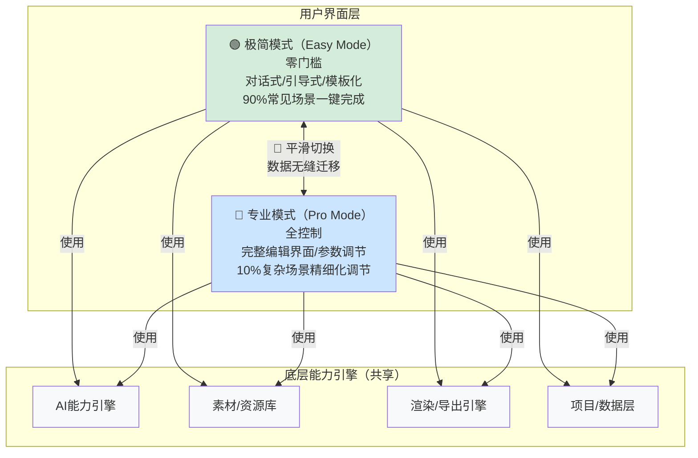

> **提炼自**：KickArt（火山引擎电商营销AI视频创作）产品深度分析（2026-07-06）——双模式用户分层架构
> **验证产品**：KickArt（对话一键成片+自由创作）、剪映/CapCut（简单剪辑+专业时间线）、Figma（快速设计+高级原型）、Canva（模板快速出图+专业编辑）

# 双模式用户分层架构（Dual-Mode User Tiering: Easy + Pro）

## 模式类型
方法论模式（产品开发与竞争策略）

## 成熟度
L4 标准化（多个跨品类生产力工具验证，行业通用最佳实践）

## 适用场景

| 场景 | 是否适用 | 说明 |
|------|---------|------|
| 有广泛用户谱系的生产力工具 | ✅ 核心场景 | 从小白到专家都用的创意/生产工具 |
| 创意软件 | ✅ 核心场景 | 视频编辑、图片设计、音频制作等 |
| SaaS平台 | ✅ 核心场景 | 零门槛入门+专业级能力的B2B2C产品 |
| 纯专业工具 | ❌ 不适用 | 目标用户就是专家（如专业3D建模软件、工业CAD），不需要入门模式 |
| 极简工具 | ❌ 不适用 | 目标就是做最简单的工具（如某些笔记App），不需要专业模式 |
| 产品早期MVP | ⚠️ 谨慎使用 | 先验证PMF再做双模式，避免资源分散 |

## 问题背景

生产力工具设计的经典两难：
- **做简单了**：小白用户能用，但满足不了专业用户的深度需求，专业用户流失
- **做复杂了**：专业用户满意，但吓跑小白用户，获客困难
- **做妥协版**：既不简单也不强大，两边都不讨好

常见的错误解法：
1. **功能开关**：让用户在"设置"里开关"高级功能"——小白用户根本找不到也不知道什么时候该开
2. **渐进式教程**：期望通过教程把小白教成专家——大部分用户没有耐心学
3. **只做中间态**：做一个"中等复杂度"的界面——小白觉得还是太复杂，专家觉得不够用

双模式架构是这个两难的成熟解法。

## 核心架构：同一内核，两种外壳

```
双模式架构 = 共享底层能力引擎 ⊕ 极简模式（零门槛，90%场景一键完成）⊕ 专业模式（全控制，10%复杂场景精细化调节）⊕ 平滑升级路径
```

### 架构图



### 双模式对比矩阵

| 维度 | 极简模式（Easy Mode） | 专业模式（Pro Mode） |
|------|---------------------|---------------------|
| **目标用户** | 新用户/小白用户/轻度用户/追求效率的用户 | 老用户/专家用户/重度用户/追求精细控制的用户 |
| **核心设计目标** | 零门槛、快速出成果、降低使用焦虑 | 精细控制、强大能力、专业级产出 |
| **交互范式** | 对话式、引导式、模板化、自动化 | 直接操纵、参数调节、时间线/图层/属性面板 |
| **覆盖场景** | 90%的常见场景 | 10%的复杂/特殊/精细化场景 |
| **用户操作** | 说目标、做选择、点确认 | 拖放、裁剪、调参数、层管理 |
| **学习成本** | 5分钟上手，几乎零学习 | 有学习曲线，但提供精细控制 |
| **KickArt示例** | 对话一键成片：输入商品链接，一句话生成视频 | 自由创作：完整时间线编辑、素材库、特效、字幕 |
| **剪映示例** | 剪同款/一键成片：选模板导入素材自动生成 | 专业剪辑：多轨道时间线、关键帧、调色、特效 |
| **Figma示例** | 模板快速创建/AI生成：快速出设计 | 完整编辑器：组件、变体、自动布局、原型 |
| **Canva示例** | 模板拖拽替换：几分钟出图 | 专业编辑：品牌套件、透明度、高级动画 |

### 关键设计原则

#### 原则1：底层能力必须复用，不是两个独立产品

- ✅ 两种模式共享同一个核心引擎、同一个素材库、同一个项目文件格式
- ✅ 同一个项目可以在两种模式间切换编辑
- ❌ 不是做两个独立产品（一个简单版一个专业版）——维护成本翻倍，数据不互通

#### 原则2：极简模式不是"功能阉割版"，是"智能封装版"

- ✅ 极简模式保留**完整的核心价值**，只是把复杂参数封装为智能默认/自动选择
- ✅ 用户在极简模式产出的质量不低于专业模式（只是可控性不同）
- ❌ 不是"专业模式去掉一半功能"——那会让极简模式产出劣质结果

#### 原则3：升级路径平滑顺畅，不强迫切换

- ✅ 提供清晰但不骚扰的升级入口——当用户在极简模式遇到限制时自然提示
- ✅ 切换后项目数据完全保留，不需要重新开始
- ✅ 用户可以在极简和专业间自由切换，不是选定就不能改
- ❌ 不强制用户"升级到专业模式"——很多用户永远不需要专业模式，那很好

#### 原则4：专业模式不做简化，为专家提供完整控制

- ✅ 专业模式应该提供该领域专业用户期望的全部功能和控制粒度
- ✅ 专业模式的交互范式符合行业专业软件的惯例
- ❌ 不要为了"一致性"让专业模式也用简单交互——专家要的就是效率和控制

### 与"双版本矩阵"的区别

本模式与[dual-version-matrix-entry-professional.md](dual-version-matrix-entry-professional.md)是相关但不同的模式：

| 维度 | dual-version-matrix（双版本矩阵） | dual-mode-user-tiering（本模式：双模式架构） |
|------|----------------------------------|-------------------------------------------|
| **核心区别** | 两个SKU/两个定价层级 | 同一个SKU内的两种交互模式 |
| **目标** | 市场覆盖+定价策略（引流+变现） | 用户体验分层（降低门槛+保留深度） |
| **差异点** | 价格、功能权限、性能/配额 | 界面复杂度、交互范式、控制粒度 |
| **共享程度** | 共享核心技术，但可能有功能/配额限制 | 底层引擎100%共享，只是上层界面不同 |
| **切换成本** | 版本升级需要付费、可能需要切换计划 | 模式切换免费、即时、数据无缝 |
| **典型案例** | Notion Free vs Plus、Figma Free vs Professional | 剪映一键成片vs专业剪辑、KickArt对话vs自由创作 |

**关系**：两个模式经常同时使用——双版本（定价分层）+ 双模式（体验分层）是覆盖广泛用户群体的完整组合拳。

## 反模式警示

| 反模式 | 表现 | 问题 |
|--------|------|------|
| **阉割版极简模式** | 极简模式导出有水印、有次数限制、核心功能不可用 | 极简模式是获客入口，如果体验差用户直接流失 |
| **隐藏的高级模式** | 高级功能藏在设置里或需要快捷键触发 | 小白找不到，专家也不知道有，等于没做 |
| **两个独立产品** | 简单版和专业版是两个独立App/独立项目格式 | 数据不互通，维护成本翻倍，用户升级需要重新学习 |
| **强行引导升级** | 用户刚进来就弹窗"试试专业模式"，或极简模式频繁骚扰引导升级 | 激怒只想简单用的用户 |
| **专业模式不够专业** | 专业模式也做了很多简化，专家觉得还不如用竞品 | 专业模式必须满足专业用户的需求，否则两头空 |
| **切换丢失数据** | 从极简切到专业，之前做的东西没了或格式错乱 | 严重破坏信任，用户不敢切换 |
| **默认专业模式** | 打开产品默认就是专业界面，小白直接被吓跑 | 默认应该是极简模式，专家自己会切换到专业模式 |

## 实施检查清单

- [ ] 两种模式是否共享100%的底层引擎和项目格式？
- [ ] 极简模式是否能产出和专业模式同等质量的结果（只是自动化程度更高）？
- [ ] 极简模式是否覆盖了90%的常见使用场景？
- [ ] 专业模式是否提供了专业用户期望的完整控制能力？
- [ ] 模式切换是否是即时的、免费的、数据完全保留的？
- [ ] 默认打开是否是极简模式？
- [ ] 升级提示是否在用户遇到限制时自然出现，而非强制弹窗？
- [ ] 是否有清晰的视觉区分让用户知道自己在哪个模式？

## 实施步骤

1. **用户分层验证**：确认产品确实存在"小白用户"和"专家用户"两类清晰群体，且需求差异显著
2. **底层能力原子化**：将核心能力重构为原子化服务，两种界面都能调用
3. **核心场景识别**：识别90%用户的90%高频场景是什么——极简模式要完美覆盖这些场景
4. **极简模式设计**：为高频场景设计对话式/模板化/引导式的零门槛交互
5. **专业模式设计**：参考行业专业软件范式，设计完整的专业控制界面
6. **项目格式统一**：确保两种模式读写同一个项目格式，数据完全互通
7. **切换入口设计**：设计清晰但不突兀的模式切换入口
8. **智能升级提示**：在用户遇到极简模式限制时（如需要微调某个参数）自然提示"试试专业模式"
9. **用户数据跟踪**：跟踪模式切换率、不同模式用户留存率、升级后满意度

## 验证记录

| 验证次序 | 产品/场景 | 双模式设计 | 验证结果 |
|---------|---------|----------|---------|
| 第1次 | KickArt（电商营销视频） | ✅ 对话一键成片（零门槛）+ 自由创作（全功能时间线） | 两种模式共享底层引擎，覆盖从新手商家到专业投手的全谱系用户 |
| 第2次 | 剪映/CapCut（视频剪辑） | ✅ 剪同款/一键成片（模板化）+ 专业剪辑（多轨道时间线） | 成为国民级视频剪辑工具的核心设计——普通人能用剪同款快速出片，专业用户也能做精细剪辑 |
| 第3次 | Figma（UI设计） | ✅ 模板快速创建/AI生成 + 完整专业编辑器 | 让非设计师也能快速出设计，同时满足专业设计师的深度需求 |
| 第4次 | Canva（平面设计） | ✅ 模板拖拽替换（零门槛）+ 专业编辑（精细调节） | 设计民主化的典范——80%用户用模板快速出图，20%用户用专业功能精细调整 |
| 第5次 | GitHub Copilot | ✅ 代码补全（Inline建议，极简）+ Copilot Chat（深度交互）+ 高级代理模式 | 从简单补全到深度AI协作的分层交互 |

**复用记录**：本模式在KickArt分析中被识别后，已作为产品设计参考模式纳入方法论库。

## 与其他模式的关系

| 关系模式 | 关系类型 | 说明 |
|---------|---------|------|
| [dual-version-matrix-entry-professional.md](dual-version-matrix-entry-professional.md) | 姊妹模式 | 双版本矩阵是定价/市场覆盖策略（两个SKU），本模式是同一SKU内的体验分层策略，两者互补经常同时使用 |
| [professional-capability-democratization.md](professional-capability-democratization.md) | 价值体现 | 双模式架构是专业能力平民化的核心实现手段——极简模式让普通人也能用上专业级能力 |
| [technology-encapsulation-user-simplicity.md](technology-encapsulation-user-simplicity.md) | 设计原则 | 技术封装用户极简是极简模式的设计原则——底层复杂但用户感知简单 |
| [progressive-context-disclosure.md](../ai-collaboration/progressive-context-disclosure.md) | UX原则支撑 | 渐进式上下文披露是双模式切换的UX原则——根据用户技能水平渐进式暴露复杂度 |
| [skill-progressive-disclosure-encapsulation.md](../ai-collaboration/skill-progressive-disclosure-encapsulation.md) | 思想同源 | Skill渐进式披露封装是AI Skill设计领域的分层暴露，本模式是产品交互领域的分层暴露 |
| [vertical-scenario-ai-three-elements.md](vertical-scenario-ai-three-elements.md) | 场景落地 | 双模式架构是垂直场景产品覆盖广泛用户群体的有效策略 |
