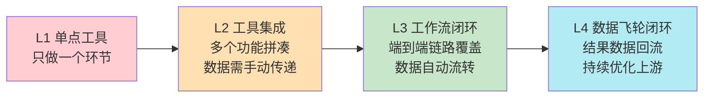

> **提炼自**：KickArt（火山引擎电商营销AI视频创作）产品深度分析（2026-07-06）——全链路闭环设计原则
> **验证产品**：KickArt（创意到分发完整链路）、Figma（设计到交付全链路）、Canva（设计到发布全链路）、HiAgent（Agent全生命周期平台）

# 全链路闭环设计原则（Full Workflow Closed-Loop）

## 模式类型
方法论模式（产品开发与竞争策略）

## 成熟度
L3 可复用（多个跨品类SaaS产品验证）

## 适用场景

| 场景 | 是否适用 | 说明 |
|------|---------|------|
| B端SaaS产品设计 | ✅ 核心场景 | 企业级工具、生产力平台 |
| 创意生产工具 | ✅ 核心场景 | 设计工具、视频工具、内容创作平台 |
| 营销科技平台 | ✅ 核心场景 | 覆盖从创意到投放的营销工具 |
| 单点效率工具 | ⚠️ 谨慎使用 | 若目标就是做单一环节的极致工具，不需要强行闭环 |
| 纯API/基础设施产品 | ❌ 不适用 | 基础设施的用户就是开发者，他们需要的是可组合的原子能力 |

## 问题背景

B端SaaS产品常见的设计误区是"单点功能极致化"——把某个环节做到最好，但用户要完成一件事需要在5-6个工具间切换：
- 视频生成工具：只生成视频，用户要自己剪、自己加字幕、自己配BGM、自己审、自己改尺寸、自己一个个平台发
- 设计工具：只做设计，用户要自己切图、自己标注、自己找开发、自己跟进落地
- 表单工具：只做表单，用户要自己导数据、自己做分析、自己同步到CRM

单点工具虽然在单个环节做到极致，但**环节间的摩擦成本**被忽略了：
- 数据格式不兼容需要手动转换
- 工作流断裂需要人工衔接
- 上下文丢失需要重复输入
- 多个工具切换有学习成本和订阅成本

结果是：单个环节效率提升了30%，但端到端整体效率可能反而下降了。

## 核心原则：闭环公式

```
闭环产品 = 工作流起点到终点完整覆盖 ⊕ 环节间数据自动流转 ⊕ 消除用户手动拼接成本
```

### 三个关键维度

| 维度 | 定义 | 判断标准 | KickArt示例 |
|------|------|---------|------------|
| **完整覆盖** | 覆盖用户从"想要做某事"到"事情做完"的完整链路 | 用户不需要跳出你的产品就能完成整个任务 | 创意策划→视频生成→智能剪辑→合规预审→多平台分发，全链路在KickArt内完成 |
| **数据自动流转** | 上一环节的输出自动成为下一环节的输入，不需要用户手动导出/导入 | 没有"导出文件再上传到下一个工具"的步骤 | 生成的视频自动进入剪辑环节，剪辑完成自动进入预审环节，预审通过自动适配各平台规格 |
| **消除拼接成本** | 消除用户在多个工具间切换、学习、对齐的隐形成本 | 用户只需要学习一个产品、管理一个订阅、登录一个账号 | 商家不需要在视频生成工具、剪辑工具、审核工具、分发工具之间切换 |

### 闭环成熟度模型



| 成熟度 | 特征 | 用户价值 | 案例 |
|--------|------|---------|------|
| L1 单点工具 | 只解决一个环节的问题 | 单一环节效率提升 | 早期AI视频生成工具（只做文生视频） |
| L2 工具集成 | 有多个功能，但数据需手动在功能间传递 | 不用切换多个产品，但操作繁琐 | 某些"AI创作平台"有生成+剪辑功能，但生成后要手动保存再导入剪辑 |
| L3 工作流闭环 | 端到端链路覆盖，数据自动流转 | 端到端效率显著提升 | KickArt从创意到分发全链路自动流转 |
| L4 数据飞轮闭环 | 最终环节的结果数据回流到上游环节，形成优化闭环 | 使用越多产品越懂用户，效果越好 | 分发后的视频数据回流，指导下一轮创意生成优化 |

## 为什么闭环价值大于单点 brilliance

用户买的不是"一个强大的功能"，而是"一件事被完成了"。

| 对比维度 | 单点极致工具 | 全链路闭环产品 |
|---------|------------|--------------|
| **用户视角** | "这个功能很强，但我还要做X/Y/Z才能用" | "我告诉它我要什么，它直接给我成品" |
| **摩擦成本** | 高——多工具切换、格式转换、上下文丢失 | 低——一个产品内完成，数据自动流转 |
| **替换成本** | 低——用户随时可以换一个单点工具 | 高——用户的工作流、数据、习惯都沉淀在闭环里 |
| **付费意愿** | 低——用户要为5个工具分别付费 | 高——一个产品解决全部问题，ROI清晰 |
| **竞争壁垒** | 低——单点功能容易被复制或超越 | 高——闭环需要对全链路的深度理解，难以复制 |

## 反模式警示

| 反模式 | 表现 | 问题 |
|--------|------|------|
| **伪闭环** | 声称覆盖全链路，但某些环节只是跳转到第三方工具（iframe嵌入或外部链接） | 本质上还是工具拼凑，数据不互通，用户体验断裂 |
| **为闭环而闭环** | 每个环节都自己做，但每个环节都做得很烂 | 与其做5个60分的环节，不如做1个90分的环节+开放API让别人补全其他环节 |
| **忽视数据回流** | 只做到"交付成品"，不回收结果数据 | 无法形成数据飞轮，产品无法持续优化 |
| **强行闭环** | 用户本来就有成熟的工具链，你非要让他用你的全套 | 不尊重用户现有习惯，引发抵触（如某些企业强推全套办公套件但员工还是用微信传文件） |
| **闭环不闭** | 最后一步需要用户手动操作（如"导出后手动上传到抖音"） | 最后一公里断裂，用户价值大打折扣 |

## 实施检查清单

- [ ] 是否画出了用户从"开始"到"完成"的完整工作流图？
- [ ] 每个环节的上一环节输出是否自动成为下一环节输入？
- [ ] 用户是否需要手动导出/导入/复制粘贴数据？
- [ ] 用户是否需要跳出产品去完成某个环节？
- [ ] 最终结果交付后，是否有数据回流机制优化上游环节？
- [ ] 每个环节的质量是否达到用户可接受的水平（而不是凑数）？
- [ ] 是否支持用户在闭环中灵活跳过/自定义某些环节（避免强推全套）？

## 实施步骤

1. **工作流映射**：通过用户访谈/观察，画出用户当前完成任务的完整工作流（包括他们用什么工具、每个工具之间怎么衔接）
2. **摩擦点识别**：识别工作流中摩擦成本最高的环节（格式转换、手动搬运数据、多工具切换等）
3. **闭环范围界定**：确定你的产品应该覆盖到哪里（不要什么都自己做，边界在哪里）
4. **数据流转设计**：设计环节间的数据自动流转机制，消除手动导出/导入
5. **渐进式闭环**：先做好核心链路的2-3个环节闭环，再逐步扩展
6. **数据飞轮设计**：设计结果数据回流机制，让使用越多效果越好
7. **开放接口**：对不属于你核心闭环的环节，提供开放API让用户接入他们偏好的工具

## 验证记录

| 验证次序 | 产品/场景 | 闭环链路 | 成熟度 | 验证结果 |
|---------|---------|---------|--------|---------|
| 第1次 | KickArt（电商营销视频） | 创意策划→视频生成→智能剪辑→合规预审→多平台分发 | L3→L4（分发后数据回流指导优化） | 六维能力矩阵覆盖完整营销链路，商家不需要在多个工具间切换 |
| 第2次 | Figma（设计工具） | 设计→原型→评审→开发标注→切图交付→设计系统管理 | L3 | 从设计到开发交付全链路在Figma内完成，消除了设计和开发间的交付摩擦 |
| 第3次 | Canva（设计平台） | 设计→协作→版本管理→多格式导出→多平台发布 | L3→L4（发布后数据回收） | 从设计到社交媒体发布全链路闭环，非专业用户也能完成专业级设计产出 |
| 第4次 | HiAgent（企业级AI Agent平台） | 智能体搭建→系统集成→训练精调→运维监控→安全防护 | L3 | 覆盖Agent完整生命周期，解决企业Agent落地"最后一公里"问题（集成、运维、安全），用户不需要自己拼搭多个开源工具踩6个月坑 |

## 与其他模式的关系

| 关系模式 | 关系类型 | 说明 |
|---------|---------|------|
| [vertical-scenario-ai-three-elements.md](vertical-scenario-ai-three-elements.md) | 组成部分 | 全链路闭环是垂直场景AI三要素模型中"场景化工作流"维度的详细展开 |
| [three-layer-delivery-pipeline.md](three-layer-delivery-pipeline.md) | 架构支撑 | 三层交付管道是实现闭环的架构设计方法 |
| [technology-encapsulation-user-simplicity.md](technology-encapsulation-user-simplicity.md) | 设计原则 | 技术封装用户极简是闭环设计的用户体验原则——内部链路复杂，但用户感知简单 |
| [saas-hardware-three-layer-funnel.md](saas-hardware-three-layer-funnel.md) | 增长配套 | 闭环产品的用户增长遵循三层漏斗模型（引流→激活→变现/留存） |
| [risk-control-copilot-pre-positioned.md](risk-control-copilot-pre-positioned.md) | 闭环关键节点 | 风控前置是闭环中合规环节的设计模式，避免最后一公里被打回 |
| [progressive-capability-tiering.md](progressive-capability-tiering.md) | 用户分层配套 | 渐进式能力分层是闭环产品的用户覆盖策略——L1入门用户快速跑通闭环，L2/L3用户深度使用闭环各环节 |
| [compliance-pre-positioning.md](compliance-pre-positioning.md) | 企业闭环必备 | 合规前置是企业级闭环的必备环节，消费级闭环可能不强调，但企业级闭环必须包含安全/合规/审计节点 |
