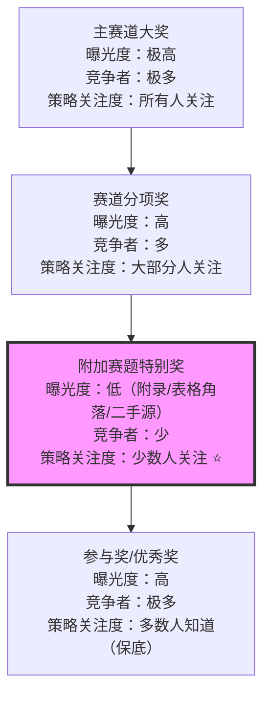

+++
id = "hidden-prize-channel-identification"
domain = "methodology"
layer = "methodology"
maturity = "L1"
validation_count = 1
reuse_count = 0
documentation_level = "basic"
source = "docs/retrospective/reports/competitive-analysis/retrospective-specweave-contest-advantage-analysis-20260624/retrospective-v12-iteration/insight-extraction.md#洞察2"

[bindings]
rules = []
references = ["zero-sum-rule-inversion.md", "information-source-tiered-collection.md"]
skills = []
+++

# 隐性奖项通道识别法

## 核心原则

赛事/投标/申请场景中的奖项结构是分层的——主赛道大奖曝光度高但竞争者极多，"附加""特别""推荐"类奖项因标签暗示"次要性"而被大多数参赛者忽略，但它们往往有独立的评审标准、独立的奖金池和少一个数量级的竞争者。逐行扫描奖项列表、识别这些隐性通道并独立构建对应叙事，能以更低竞争成本获得更高获奖概率。

## 成熟度评估

| 维度 | 评估 | 依据 |
|------|------|------|
| 实践验证 | 低 | 1次实践（TRAE大赛社会公益特别奖识别） |
| 可复用性 | 高 | 适用于所有多层级奖项结构的竞赛/投标/ grant申请 |
| 通用性 | 高 | 赛事策略/科研grant申请/创业大赛/招投标 |

## 奖项分层模型



| 奖项层级 | 可见度 | 竞争者数量 | 策略关注度 | 获奖概率 |
|---------|--------|-----------|-----------|---------|
| 全场冠军/主赛道大奖 | 极高（首页宣传） | 极多 | 所有人关注 | 极低 |
| 赛道分项奖 | 高（规则文档正文） | 多 | 大部分人关注 | 低 |
| **附加/特别奖** | **低（附录/表格角落）** | **少（少一个数量级）** | **少数人关注** | **显著较高** |
| 参与奖/优秀奖 | 高（保底奖励） | 极多 | 多数人知道 | 高（但价值低） |

核心规律：**"附加赛题"≠"次要赛题"**。当附加赛题有独立奖金池和评审标准时，它本质上是一个独立竞争赛道——而且由于其"附加"标签造成的心理暗示，竞争者往往远少于主赛道。

## 隐性奖项识别四步检查法

### Step 1：逐行扫描奖项列表

**不要只看主赛道奖项**——用Read逐字阅读奖项/资助表格的每一行，特别注意以下信号词：
- "附加""特别""推荐""专项""可选"
- "社会价值""创新应用""最佳XX"等非主赛道命名
- 出现在附录、脚注、二手汇总文档中的奖项

### Step 2：验证独立性

对每个疑似隐性奖项，确认其是否具有：
- [ ] 独立的奖金数额或资助额度
- [ ] 独立的名额数量
- [ ] 独立的评审标准或评审维度
- [ ] 非"在主赛道获奖者中额外评选"——即不需要先获得主赛道奖才能参与

三项以上为"是"→这是一个独立竞争通道，值得投入资源。

### Step 3：竞争者规模估算

| 估算方法 | 操作 |
|---------|------|
| 报名标签分析 | 如果该奖项为"附加选报"，估算选报比例（通常10-20%） |
| 叙事门槛判断 | 该奖项是否需要构建专门的叙事（如公益故事）？门槛越高，竞争者越少 |
| 信息不对称度 | 该奖项信息是否出现在非核心文档中？信息越隐蔽，知道的人越少 |

### Step 4：匹配度评估

你的作品/方案是否天然符合该奖项的评审标准？
- 高匹配→同等主攻，投入与主赛道相当的资源构建专门叙事
- 中匹配→作为辅助方向，在主赛道材料中增加对应段落
- 低匹配→不投入，避免资源分散

## 叙事构建：从"打标签"到"独立故事线"

识别隐性奖项只是第一步——大多数知道该奖项的参赛者会犯一个错误：**只打标签，不讲故事**。

```
❌ 错误做法（打标签）：
  "本作品也报名了社会公益赛道，因为传播了文化价值"
  → 评审感知：这是为了多拿奖而加的标签，不是真正的公益项目

✅ 正确做法（独立故事线）：
  构建专门的公益叙事段落，回答三个问题：
  1. 目标群体的真实痛点是什么？（不是泛泛的"人们需要文化"）
  2. 你的作品如何独特地解决这个痛点？（不是"我传播了文化"）
  3. 为什么这个解决方案只有你能提供？（差异化壁垒）
```

TRAE大赛社会公益奖的叙事对比：
- 平庸叙事："竹简悟道传播了《道德经》文化"
- 深度叙事："现代人的精神困境不是信息不足而是无人倾听，竹简悟道用帛书《道德经》千年智慧，在大加速时代逆流建造精神庇护所"

## 与其他方法论的关系

| 方法论 | 关系 |
|--------|------|
| `zero-sum-rule-inversion.md` | 互补——zero-sum讲"如何利用规则约束"，本模式讲"如何发现规则中隐藏的机会通道" |
| `information-source-tiered-collection.md` | 上游——隐性奖项信息可能隐藏在二手源或低优先级文档中，分层采集+逐行扫描是发现前提 |
| `template-homogenization-escape.md` | 下游——识别隐性奖项后，需要用差异化叙事构建（而非模板化标签）来真正抓住机会 |

## 适用条件

- 赛事/投标/grant申请具有多层级奖项结构
- 奖项列表以表格形式呈现（容易被快速浏览而遗漏细节）
- 附加奖项有独立评审标准（非主赛道的附属荣誉）

## 不适用场景

- 单一奖项结构（无分层）
- 附加奖项必须在主赛道获奖后才能参与（非独立通道）
- 附加奖项无实质价值（仅荣誉称号无奖金/资源）

> 来源：TRAE大赛社会公益赛题特别奖（4名额×¥50,000）的发现与策略构建
> 关联模块：`zero-sum-rule-inversion.md`、`information-source-tiered-collection.md`、`template-homogenization-escape.md`
