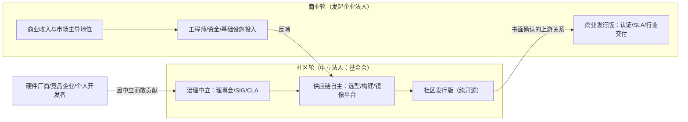

# 根社区—商业发行版双轮（Root-Community / Commercial-Distro Flywheel）

> 重资产基础软件（操作系统、数据库、芯片工具链）如何同时获得**社区中立性**与**商业可持续性**？本模式给出的答案是两个法人主体、两条反馈回路：中立基金会社区负责汇聚生态，发起企业的商业发行版负责资质、SLA 与变现，收入与影响力再反哺社区。

## 一、核心定义

**根社区—商业发行版双轮**：发起企业将基础软件资产捐赠给中立基金会（或由基金会孵化），以治理与商标中立性吸引竞争对手、硬件厂商与个人开发者共同贡献；同时保留一条**书面显式化**的商业下游链路——社区版是商业版的技术上游，商业版承担认证、SLA 与行业交付，商业收益与主导地位反哺社区投入。两个轮子互相驱动：

飞轮成立的关键不是"开源 + 卖商业版"这一形态本身，而是**中立性的可信度**与**上下游关系的显式化**：竞争对手愿意把资产投进来，是因为治理规则保证其贡献不会被发起方单方面独占；商业收入可预期，是因为产品手册等正式材料写明"社区版是商业版上游"，而非两条私下的闭源分叉。

## 二、适用边界

**适用于**：

- 需要重资产生态适配的基础软件：硬件驱动、整机认证、行业应用迁移的成本远超单一企业承担能力
- 客户侧要求商业 SLA、安全可靠测评、等保等企业资质，但技术路线又需要社区中立性来汇聚上下游
- 发起企业在该赛道已具技术与市场优势，愿意以治理让渡换取生态总量扩大
- 存在多个同赛道商业厂商，"竞品同台"能把零和竞争转化为共享底层的协作

**不适用于**：

- 纯应用层 SaaS：无分发介质、无认证诉求，社区协作面窄
- 单一企业即可闭环的内部工具，中立化没有外部受众
- 发起方不愿让渡商标、代码合并权或治理席位的项目（此时基金会只起背书作用，飞轮不转）
- 网络效应弱、外部贡献长期稀少的项目（中立化成本大于汇聚收益）

## 三、核心步骤（七步）

1. **资产捐赠入中立法人**：把代码、商标、基础设施捐赠给公认的中立基金会，或构建由治理章程保障的等效中立实体（基金会是常见载体而非唯一形态），由其提供治理框架、代码托管、法务与知识产权服务。捐赠动作本身是对外的中立性信号。
2. **建立分层治理**：理事会/咨询委员会定方向，SIG 按技术主题自治，CLA 与合规平台统一知识产权；刻意吸收同赛道竞争厂商进入理事会与 SIG。
3. **自建供应链三自主**：形成"组件自主选型 → 软件包自主编译 → 镜像自主生成"的平台化能力。这是"根社区"区别于"某上游的换皮再分发版"的工程门槛。
4. **商业下游显式化**：以产品手册、官方新闻稿等正式材料书面确认"社区版是商业版的上游"，让市场、客户与贡献者都能预期商业版跟随社区演进而非平行闭源。
5. **竞品同台机制**：把竞争厂商请进理事会/SIG 并允许其主导部分 SIG，将竞争关系转化为"共享底层、差异化发行"的协作关系，扩大生态总量。
6. **资质留在商业侧**：安全可靠测评、行业认证、SLA、定制交付由商业版承担，社区版保持纯开源形态；两类材料的市场宣传严格区分主体。
7. **国际化用社区身份**：以基金会项目而非单一企业产品的身份进入国际合作、标准组织与海外用户组，规避企业国籍带来的采购政治阻力。

> 七步是**建设清单而非严格时序**：企业可先有自建社区与供应链能力、后补捐赠与基金会治理（主案例 openKylin 的步骤 3 即早于步骤 1：1.0 时代已具备独立构建能力，2024 年才完成捐赠）；但商业变现（步骤 4/6）若长期先于中立治理（步骤 1/2/5），飞轮会退化为反模式 1/2。

## 四、检验标准（三问）

1. **多单位合入**：社区版本是否能在无发起方干预下，由多个单位主导的 SIG 合入特性？（查版本特性贡献单位名单，而非用户总数）
2. **可证明的跟随关系**：商业版是否可证明地滞后/跟随社区版发布，而不是维护一条平行闭源分叉？（查双方版本时间线与特性回流记录）
3. **发起方之外的主导权**：第三方厂商是否拥有发起方之外的 SIG 主席席位或核心维护者席位？

三问全部为"是"才算飞轮真正转动；任一为"否"，按第六节反模式对号入座。

## 五、证据案例

| 案例 | 社区轮 | 商业轮 | 证据状态 |
|---|---|---|---|
| openKylin—银河麒麟（主案例） | 2024 年捐赠开放原子开源基金会（官方称中国首例央企开源捐赠）；理事会含普华、中科方德、麒麟信安等竞品；158 个 SIG；自建 OKBS/OKIF（现 UKBS/UKIF）编译镜像流水线 | 麒麟软件产品手册明示"openKylin 是银河麒麟商业版的上游社区"，商业版承担安全可靠测评 II 级等资质 | **结构事实已核验**（多源公开材料，F-003/F-004/F-005/F-009/F-033/F-034/F-051/F-061，见[源调研报告](../../../../knowledge/tech/openkylin/index.md)）；**转动证据有缺口**：检验三问中 Q2 书面关系成立（F-051），但 Q1/Q3 所需的外部企业贡献占比、第三方 SIG 主导权无公开量化数据，源报告 V-05 明确不做"已中立"结论 |
| Fedora—RHEL | 红帽赞助的社区项目，由 Fedora Council（民选成员+红帽任命席位混合）与社区民选的 FESCo 技术委员会治理，未走基金会路径而以治理章程实现中立 | RHEL 官方定义为"Fedora 的商业支持衍生版"；订阅收入反哺（红帽为 Fedora 提供工程、市场与资金）；SLA 与认证留在 RHEL 侧 | **已核验**（官方一手材料，2026-09-29 检索：Fedora Wiki 明确"Fedora is upstream for RHEL"、Council/FESCo 治理结构、红帽赞助关系） |
| deepin—统信 UOS | deepin 已独立发展为桌面根社区 | 统信 UOS 商业发行版以 deepin 为技术源头 | 结构同构、**待独立核验**（源调研 F-057 单源，来自统信官方发布会材料） |
| openEuler—多家商业版 | 开放原子基金会托管的服务器侧社区 | 多家发行商基于 openEuler 出商业版，商业轮不唯一 | 结构同构、**待独立核验**（源报告 §5 版图表 + F-058，后者为三级信源科普综述；多下游是本模式的变体） |

> 证据纪律：openKylin 的社区规模、市场份额等数字来自官方口径或商业咨询报告，其中份额报告存在口径矛盾，[源调研报告](../../../../knowledge/tech/openkylin/index.md) §6 已做降级处理；本模式只使用结构性事实（治理关系、上下游关系、资质主体），不引用任何精确份额数字。

## 六、反模式

| # | 反模式 | 后果 | 正确做法 |
|---|---|---|---|
| 1 | **捐赠不捐治**：代码进了基金会，但商标、合并权、理事会多数仍留在企业 | 基金会沦为背书道具；竞品与外部开发者用脚投票，飞轮空转 | 对照步骤 1-2 的服务清单自查商标/席位/合并权归属 |
| 2 | **双轨闭源分叉**：商业版特性长期不回流，社区版退化为功能受限的试用版 | 贡献者流失，社区版失去上游地位，飞轮变成单向漏斗 | 步骤 4 书面化上下游关系，公开特性回流节奏 |
| 3 | **只有装机量叙事、没有贡献者结构披露** | 用户数可营销且可注水，无法证明中立性，竞争对手不敢进入 | 披露 SIG 多样性、贡献单位名单与跨企业治理席位 |
| 4 | **把资质当社区能力宣传**：用商业版获得的认证为社区版背书 | 误导政企采购决策，资质主体与交付主体错配，事故时责任不清 | 步骤 6 严格区分认证主体；社区材料只讲社区能力 |

## 七、与相邻模式的边界

- 与 [dual-version-matrix-entry-professional.md](dual-version-matrix-entry-professional.md)：双版本矩阵是**单一厂商**对同一产品线做入门/专业分层定价，两个版本归属同一法人；本模式跨**两个法人主体**（基金会与企业），解决的是生态中立性与商业可持续性的矛盾，不是版本定价问题。
- 与 [saas-hardware-three-layer-funnel.md](saas-hardware-three-layer-funnel.md)：三层漏斗是软件引流→硬件变现→服务留存的收入栈设计；本模式是治理结构与上下游关系设计，回答"谁来共同建设底层"。
- 与 [hardware-generic-interface-service-differentiation.md](hardware-generic-interface-service-differentiation.md)：后者讲单层产品的硬件标准、软件差异化；本模式中"社区汇聚硬件适配、商业版做行业交付"可视作该思想在生态层的放大。
- 与 [compliance-pre-positioning.md](compliance-pre-positioning.md)：后者指导单一 ToB 产品如何把合规资质做成竞争壁垒；本模式步骤 6 要求资质留在商业侧，是其在双轮结构下的具体落点。

## 八、跨域迁移

- **数据库与中间件**：openGauss 等"基金会社区 + 多家商业发行版"是同一结构，且商业轮可为多家（第五步竞品同台的自然延伸）。
- **芯片与 IP 联盟**：RISC-V 基金会以中立标准汇聚竞品厂商，商业公司在标准之上做芯片产品——中立轮在标准层，商业轮在实现层。
- **大型开源构建工具/语言生态**：基金会托管语言核心 + 企业发行商业支持版（如 OpenJDK 发行版生态）。
- **组织内平台治理**：企业内部"中立平台团队维护规范与共享基座 + 业务线做商业/交付实现"的双层结构是本模式的组织内同构体。

## 九、成熟度与升级条件

- **L2（2 组已核验案例结构同构）**：openKylin—银河麒麟的七步关键环节有公开一手材料支撑，但飞轮"转动程度"（检验三问 Q1/Q3）存在与源报告 V-05 一致的数据缺口，**结构成立不等于中立性已充分证实**；Fedora—RHEL 经官方材料补锚独立成立，且提供了"非基金会路径"的形态变体。另有 deepin—统信 UOS、openEuler 两组结构同构案例仅单源/三级信源支撑，未独立核验，不计入 validation_count。
- 升级 L3 的条件：补做 deepin/openEuler 中至少一组的一手材料核验（治理章程、商标归属、特性回流记录），并补充一个**失败或退化案例**（捐赠不捐治/双轨分叉的实际项目），使反模式具备反面实证；对主案例补到 Q1/Q3 的可量化数据（贡献单位统计、第三方 SIG 主席席位名单）后，可将其证据状态从"结构已核验"升为"转动已证实"。

## 参考资料

- 一手来源与事实编号：[openKylin 全面调研：从桌面根社区到 Agent OS](../../../../knowledge/tech/openkylin/index.md)（§4 模式 P1、§2 事实 F-003~F-009/F-033/F-034/F-051/F-055~F-058/F-061、§9 信源清单 S05/S09/S13/S14/S27/S28）
- Fedora 官方材料（2026-09-29 检索）：[Fedora Project Wiki — Red Hat Enterprise Linux](https://www.fedoraproject.org/wiki/Red_Hat_Enterprise_Linux/zh-cn)（"Fedora is upstream for RHEL"、订阅/SLA 主体、红帽赞助关系）、[Fedora Leadership — Council/FESCo](https://www.fedoraproject.org/wiki/Leadership)（民选与任命混合的治理结构）

<!-- changelog -->
- 2026-09-29 | feat | 从 openKylin 调研报告 §4 P1 萃取独立化：openKylin 主案例与 Fedora/deepin/openEuler 旁证分离表述，补飞轮结构图、四案例证据状态表与 L3 升级条件，与双版本矩阵等四个相邻模式划界
- 2026-09-29 | fix | V 阶段对抗审查修复（0 P0/3 P1 之 P1-1、P1-2）：validation_count 4→2（仅计已核验案例），openKylin 证据状态拆为"结构事实已核验／转动证据缺口（对齐源报告 V-05）"，Fedora—RHEL 补官方一手锚点升为已核验并注明其非基金会治理变体，deepin/openEuler 改标"结构同构待核验"；步骤 1 泛化中立法人表述，新增七步非严格时序说明；修正 OKBS/OKIF 命名与参考资料 F 编号清单
