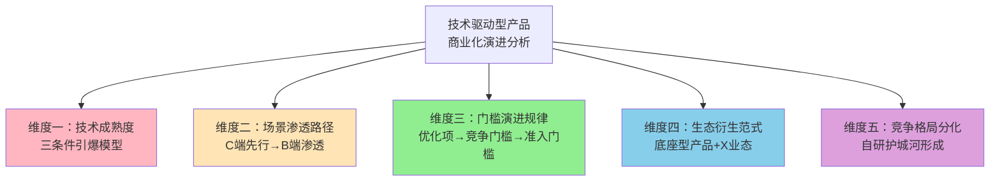
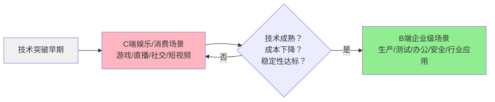
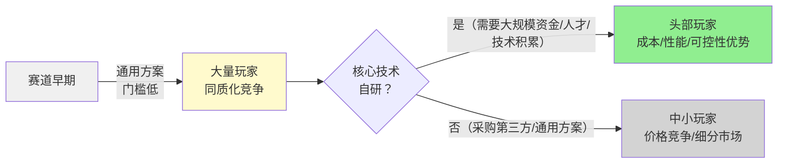

> **首次验证**：火山引擎ACEP云手机产品行业趋势分析（2026-07-07）——从云手机行业五大趋势判断中萃取，五维度在云手机赛道均有明确对应
> **验证次数**：1次（云手机/安卓云赛道）

# 技术驱动型产品商业化演进五维分析框架

## 模式类型
方法论模式（行业分析/技术趋势判断/产品战略）

## 成熟度
L1 初始模式（1次验证，需在更多技术赛道验证普适性）

## 适用场景

| 场景 | 是否适用 | 说明 |
|------|---------|------|
| 新技术产品商业化前景分析 | ✅ 核心场景 | 云服务、AI、云计算、自动驾驶、VR/AR等技术驱动型产品 |
| 行业趋势判断与写作 | ✅ 核心场景 | 竞品分析报告、行业研究、学习笔记中的趋势章节 |
| 市场进入时机评估 | ✅ 核心场景 | 判断"现在进入是否是好时机"，识别引爆三条件是否满足 |
| 竞品战略分析 | ✅ 适用 | 分析竞争对手的自研策略、生态布局、场景拓展方向 |
| 非技术驱动型产品（纯运营/内容产品） | ❌ 不适用 | 本框架针对技术驱动型产品，纯运营/内容产品逻辑不同 |
| 非常早期的技术概念（实验室阶段） | ⚠️ 部分适用 | 早期技术可以用框架做预判，但结论不确定性高 |

## 问题背景

技术驱动型产品的商业化成功从来不是"技术厉害就一定能成"的单一逻辑，而是多个条件协同作用的结果。分析技术趋势时常见的误区：

1. **技术决定论误区**：认为"技术指标达到了就一定会爆发"——忽略了基础设施、利益相关方态度、用户接受度等非技术条件
2. **静态判断误区**：认为现在的门槛就是未来的门槛——忽略了"体验优化项→竞争门槛→准入门槛"的动态演进
3. **C端/B端混淆误区**：把C端娱乐场景的热度等同于B端企业市场的成熟度——忽略了C→B渗透的时间差和条件差异
4. **产品终局误区**：只看到单一产品形态，忽略底座型产品会衍生出"X+"生态的可能性
5. **同质化误区**：认为赛道内玩家做的事情都差不多——忽略了自研vs通用的分化，以及核心技术护城河的形成

**根本原因**：缺乏系统化的技术商业化演进分析框架，只看单一维度（通常是技术指标），没有从技术引爆、场景渗透、门槛演进、生态衍生、护城河分化五个维度综合判断。

---

## 核心框架：五维分析模型

---

## 维度一：技术成熟度"三条件引爆"模型

### 核心观点
技术产品从"概念Demo"走向"规模化商用"，不是单一技术指标突破就能实现的，必须**三个条件同时满足**才能引爆：

| 条件 | 说明 | 判断标准 | 云手机案例 |
|------|------|---------|-----------|
| **条件1：技术指标突破"甜蜜点"阈值** | 核心体验指标达到用户"感知不到明显差异"的水平 | 存在一个量化阈值，低于该阈值主流用户可接受 | 云游戏操作延时<50ms是"甜蜜点"，低于此阈值大部分玩家感知不到明显迟滞 |
| **条件2：支撑基础设施完善** | 技术落地所需的配套基础设施覆盖足够广 | 网络、节点、终端等基础设施覆盖主流目标用户 | 边缘计算节点全国覆盖，用户就近接入才能实现<50ms延时 |
| **条件3：生态/利益相关方态度转变** | 产业链上下游从"抵制/观望"转向"接受/合作" | 版权方、渠道方、监管方等关键利益相关方态度转变 | 游戏版权方从视云游戏为敌人→视为新分发渠道 |

### 分析要点
- ❌ **反模式**：只看技术指标（条件1），忽略基础设施和生态条件，过早判断"技术成熟了"
- ✅ **正确做法**：三个条件逐一检查，缺一个就判断"尚未到引爆点"
- ✅ **关键指标识别**：每个技术赛道都有自己的"甜蜜点"指标（如云手机的延时、AI的推理准确率、自动驾驶的接管里程），要找到那个"一旦跨过就体验质变"的阈值
- ✅ **条件协同效应**：三个条件不是线性先后关系，而是相互促进——基础设施完善降低技术实现门槛，生态态度转变带来资金投入反过来加速技术和基础设施发展

### 判断阶段
| 阶段 | 满足条件数 | 状态 |
|------|-----------|------|
| 概念期 | 0-1个 | 只有技术概念或实验室Demo，距离规模化商用遥远 |
| 预热期 | 2个 | 有产品可用但生态或基础设施有短板，只有早期用户 |
| 引爆点 | 3个全满足 | 即将/正在进入规模化商用阶段，是市场进入窗口 |

---

## 维度二：场景渗透"C端娱乐先行→B端企业渗透"路径

### 核心观点
技术驱动型产品的场景渗透遵循通用路径规律：**先在容错度高、传播性强的C端娱乐场景验证技术可行性，待技术成熟、成本下降后，再向付费能力强、需求稳定的B端企业级场景渗透**。

### 渗透路径

| 阶段 | 场景类型 | 特点 | 为什么先做这里 |
|------|---------|------|---------------|
| **第一阶段** | C端娱乐场景 | 用户容错度高、对新事物好奇、传播性强、付费单价低 | 娱乐场景对bug和稳定性容忍度高，适合验证技术可行性；用户愿意为尝鲜付费；容易形成口碑传播 |
| **第二阶段** | B端企业场景 | 客户付费能力强、需求稳定、规模化采购、对稳定性/安全性/SLA要求极高 | B端客户要求高但付费能力强，一旦技术经过C端验证达到稳定可靠水平，B端是更大更稳定的市场 |

### 云手机案例验证
| 阶段 | 场景 | 说明 |
|------|------|------|
| 早期C端 | 云游戏、云手机托管、挂机、直播娱乐 | 云手机最早主要用于这些偏娱乐/C端场景 |
| 当前B端渗透 | 仿真测试、应用审核、安全办公、云车机、虚拟人直播 | 快速向B端/企业级场景渗透，B端成为增长最快的市场 |

### 分析要点
- ✅ **趋势判断信号**：当你看到一个技术产品在C端娱乐场景已经普及，开始有企业客户案例出现时，说明B端渗透阶段正在开启
- ✅ **价值差异**：C端卖的是"体验/好玩"，B端卖的是"降本/增效/安全"——同样的技术底座，价值主张完全不同
- ❌ **反模式**：在技术早期就强攻B端市场——B端客户对稳定性要求极高，技术未经过C端验证时强攻B端会付出巨大的售后/定制成本
- ❌ **反模式**：认为C端火了就等于市场成熟了——C端火爆可能只是尝鲜效应，B端大规模采用才是真正的商业化成熟标志

---

## 维度三：门槛演进"优化项→竞争门槛→准入门槛"规律

### 核心观点
行业发展过程中，用户体验指标的重要性不是静态的，而是随竞争格局动态演进：**早期只是加分项的体验指标，会逐步成为竞争门槛，最终成为行业准入门槛——做不到就根本无法服务核心场景**。

### 演进三阶段
| 阶段 | 指标性质 | 行业状态 | 做不到会怎样 |
|------|---------|---------|-------------|
| **阶段1：体验优化项** | 加分项 | 行业早期，玩家少 | 用户会吐槽但还是会用，不影响生存 |
| **阶段2：竞争门槛** | 必选项 | 行业成长期，玩家增多 | 没有就没有竞争力，会在竞争中落后 |
| **阶段3：准入门槛** | 入场券 | 行业成熟期，格局稳定 | 做不到就根本无法服务核心场景，无法进入市场 |

### 云手机案例验证
- 延时指标演进：
  - 早期（2018-2020）：100-200ms延时也能用，只是体验不好（优化项）
  - 中期（2021-2023）：<100ms成为主流厂商标配，高于100ms没有竞争力（竞争门槛）
  - 当前（2024-）：<70ms是通用场景门槛，云游戏场景<50ms是准入门槛，没有全国边缘节点覆盖就无法服务这些核心场景（准入门槛）

### 分析要点
- ✅ **预判方法**：跟踪核心体验指标的行业分布——当头部厂商普遍达到某个水平，这个水平很快就会从"优秀"变为"及格线"
- ✅ **战略意义**：提前布局下一阶段门槛对应的能力（如云手机厂商提前布局边缘节点），而不是满足于当前达标
- ❌ **反模式**：用静态眼光看门槛——"我们延时100ms也能用啊"，但等竞争对手都做到<70ms时，100ms就意味着出局
- ❌ **反模式**：盲目追求所有指标都做到极致——要识别哪些指标会演进为准入门槛（重点投入），哪些只是差异化加分项（适度投入）

---

## 维度四：生态衍生"底座型产品+X"范式

### 核心观点
当一个技术产品具备**通用能力、可被上层调用、与具体场景解耦**三个特征时，它就成为了"基础设施底座"，会衍生出"底座+X"的多种创新业态，而不是停留在单一产品形态。

### 底座型产品判断三特征
| 特征 | 说明 |
|------|------|
| **提供通用能力** | 能力不特定服务于某一个场景，而是多个场景都需要的通用能力（如算力、存储、安卓运行环境） |
| **可被上层调用/集成** | 提供API/SDK/接口，上层应用可以基于它构建自己的场景化产品 |
| **与具体场景解耦** | 底座本身不做场景化逻辑，保持通用性，场景逻辑由上层"X"部分实现 |

### "云手机+X"衍生案例
| 底座能力 | +X场景 | =创新业态 |
|---------|--------|---------|
| 云端安卓运行环境 | +车机 | 云车机（吉利汽车案例） |
| 云端安卓运行环境 | +虚拟人 | 云端虚拟人7×24小时直播（中科深智案例） |
| 云端安卓运行环境 | +AI Agent | 云端AI智能体手机 |
| 云端安卓运行环境 | +办公安全 | 移动安全办公空间 |
| 云端安卓运行环境 | +游戏 | 即点即玩云游戏平台（快盘科技案例） |

### 其他底座型产品参考
| 底座 | +X生态 |
|------|--------|
| 云计算（AWS/Azure） | +CRM/ERP/数据库/AI等无数SaaS业态 |
| 微信小程序 | +电商/本地生活/游戏/工具等百万级应用 |
| 大语言模型 | +客服/写作/编程/分析等无数AI应用 |

### 分析要点
- ✅ **价值判断**：如果你的产品是底座型产品，最终价值不止于产品本身，而是整个"X+"生态的价值总和——市场空间会比单一产品大一个数量级
- ✅ **战略选择**：做底座还是做X？做底座要耐得住寂寞（早期投入大、生态建设慢），做X要快速响应场景（灵活但天花板低）
- ❌ **反模式**：把底座型产品当单一功能产品卖——只卖云手机实例，而不开放API/SDK、不培育生态，错失生态衍生机会

---

## 维度五：竞争格局"自研护城河分化"规律

### 核心观点
技术驱动型赛道会随成熟度发生竞争格局分化：**早期通用方案（采购第三方/开源/转译）百花齐放、门槛低、玩家多；成熟期核心技术自研成为头部玩家护城河，自研vs通用分化加剧，头部效应越来越明显**。

### 分化规律

| 阶段 | 技术路线 | 玩家数量 | 竞争焦点 |
|------|---------|---------|---------|
| **赛道早期** | 通用方案为主（采购通用硬件、使用开源方案、转译兼容） | 多（几十个玩家） | 功能有无、市场教育、快速上线 |
| **赛道成长期** | 自研路线开始出现 | 减少（洗牌开始） | 性能指标、成本、场景覆盖 |
| **赛道成熟期** | 头部自研、中小通用分化明显 | 集中（几家头部+大量垂直小厂商） | 生态、成本、服务、稳定性 |

### 自研护城河判断标准
核心技术自研是否能形成护城河，看三个条件：
1. **资金门槛**：是否需要大规模、持续的资金投入（如芯片设计需要数十亿级投入）
2. **技术/人才门槛**：是否需要稀缺的高端人才和长期技术积累（不是挖几个人就能做）
3. **规模效应**：自研带来的性能/成本优势是否随规模扩大而放大（大规模用量摊薄研发成本）

### 云手机案例验证
- **自研路线**：火山引擎等头部厂商自研ARM服务器芯片，软硬件协同优化，性能、成本、可控性占优
- **通用路线**：采购通用ARM服务器或x86转译方案，门槛低但性能和成本优化空间有限
- **趋势判断**：自研ARM是云手机赛道的"硬核护城河"，小玩家无法复制，头部效应会越来越明显

### 分析要点
- ✅ **竞争预判**：如果赛道内核心技术满足"资金门槛高+人才门槛高+规模效应明显"三个条件，最终一定会走向自研分化，头部集中是必然趋势
- ✅ **投资/创业决策**：如果是创业公司，在自研赛道不要和头部硬拼通用场景，应该找垂直细分场景；如果是大厂，自研投入应该早做布局
- ❌ **反模式**：认为"大家都用一样的硬件/方案，竞争是公平的"——通用方案只是早期状态，一旦头部厂商完成自研布局，通用方案厂商的成本和性能劣势会越来越大

---

## 五维检查清单

分析技术驱动型产品行业趋势时，按以下清单逐一检查：

### 维度一：技术成熟度检查
- [ ] 核心体验指标是否已跨过"甜蜜点"阈值？阈值具体是多少？
- [ ] 支撑基础设施（网络/节点/终端）覆盖是否足够？
- [ ] 关键利益相关方（版权方/渠道/监管/客户）态度是否从观望转变为接受？
- [ ] 三个条件满足了几个？当前处于概念期/预热期/引爆点？

### 维度二：场景渗透检查
- [ ] 当前主流应用场景是C端娱乐还是B端企业？
- [ ] 是否已经出现从C端向B端渗透的信号（企业客户案例、B端产品发布）？
- [ ] 价值主张是否完成了从"体验/好玩"到"降本/增效/安全"的转换？

### 维度三：门槛演进检查
- [ ] 当前核心体验指标的行业分布是怎样的？头部厂商达到什么水平？
- [ ] 哪些指标正在从"优化项"演进为"竞争门槛"？
- [ ] 哪些指标未来会成为"准入门槛"？需要提前布局吗？

### 维度四：生态衍生检查
- [ ] 该产品是否具备"通用能力+可调用+场景解耦"三个底座特征？
- [ ] 已经出现了哪些"+X"衍生业态？
- [ ] 未来可能还会衍生出哪些创新场景？

### 维度五：护城河分化检查
- [ ] 核心技术自研是否满足"高资金门槛+高人才门槛+规模效应"三个护城河条件？
- [ ] 头部厂商是否已经开始自研布局？
- [ ] 自研vs通用的分化是否已经开始？

---

## 与其他模式的关系

| 关联模式 | 关系类型 | 关系说明 |
|---------|---------|---------|
| [b2b-product-seven-segment-ia.md](../research-knowledge/b2b-product-seven-segment-ia.md) | 互补 | 本框架用于分析产品所在行业的宏观趋势，七段式架构用于分析产品页面微观UX，宏观趋势判断可以指导产品页面的卖点/案例/CTA设计 |
| [b2b-value-quantification-case-validation.md](../research-knowledge/b2b-value-quantification-case-validation.md) | 指导应用 | 本框架"维度三：门槛演进"可以指导首屏量化指标的选择——应该展示当前的竞争门槛级指标，而非过时的优化项指标 |
| [scenario-driven-parameter-tradeoff.md](./scenario-driven-parameter-tradeoff.md) | 关联 | 本框架"维度二：C→B渗透"可以指导不同场景下的参数取舍——C端场景优先体验，B端场景优先稳定/安全/成本 |

---

## 实际应用案例

### 案例1：火山引擎ACEP云手机（2026-07-07）

**五维分析结果**：
1. **技术成熟度**：技术指标<50ms（云游戏条件满足）+ 边缘节点覆盖完善（基础设施条件满足）+ 游戏版权方态度转变（生态条件满足）→ **三条件全满足，处于引爆点，正在进入规模化商用**
2. **场景渗透**：C端云游戏/直播已经验证成熟，仿真测试/应用审核/安全办公/云车机等B端场景快速增长 → **C→B渗透进行中，B端是下一阶段增长主力**
3. **门槛演进**：<70ms已成为通用场景竞争门槛，<50ms成为云游戏场景准入门槛 → **边缘节点布局成为行业准入门槛**
4. **生态衍生**：云端安卓是典型底座型产品，已出现云车机/虚拟人直播/云游戏/安全办公等"+X"业态 → **生态价值远大于单一云手机产品价值**
5. **护城河分化**：自研ARM芯片满足高资金门槛+高人才门槛+规模效应 → **自研是头部硬核护城河，行业将走向头部集中**

---

## 模式演进方向

当前版本为L1（1次验证，云手机赛道），后续可在以下方向迭代：
1. 在更多技术赛道验证（AI大模型、自动驾驶、VR/AR、云计算、边缘计算等），确认普适性，向L2演进
2. 补充不同技术赛道的"甜蜜点指标"参考库
3. 制作"技术商业化阶段判断矩阵"，量化判断当前所处阶段
4. 补充"反模式案例库"——因误判趋势而失败的产品案例
5. 细化C→B渗透的时间差规律和关键转换信号识别
