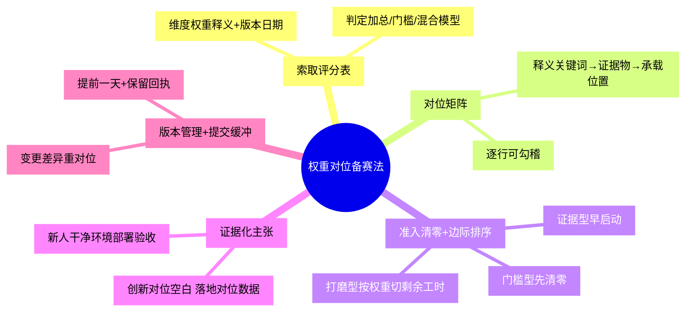

# 权重对位备赛法

## 模式概述

在评审标准（维度+权重）完全公开的竞赛、黑客松、政府项目申报、基金/课题答辩中，评分表不是参考材料，而是主办方公开的**评分契约**：它逐项声明了"什么行为被奖励、各占多少分、什么情况直接出局"。备赛的本质因此不是猜评委偏好，而是把这份契约机械对位为三样东西——**证据物清单、工时分配表、准入清零表**。

该模式由 2026 上海开源软件应用创新大赛单案例萃取。该赛事公开四维评分权重为创新 30%、落地 30%、治理 20%、长期发展 20%，且"可部署可运行可测试"占 30%、"协议依赖合规、贡献机制、文档规范"占 20%。从规则文本可观察到三个反直觉结构：

1. **治理与长期维度合计 40%，且主要靠文档工程即可得分**——许可证选择理由、依赖声明、贡献规范、Roadmap 都是可以提前补齐的确定性材料，边际成本显著低于技术创新；多数团队却把绝大多数精力花在只占 30% 的"技术创新"叙事上。
2. **赛道按"交付对象"而非技术栈切分**——三条赛道名称都含 AI，RAG、智能体等热词同时跨赛道出现，按技术名词选必然错位；按"谁是直接使用者"判据则立即清晰，且每项目限选一个赛道、不可更改。
3. **规则在备赛期内会改版**——该赛事 9 月 22 日调整了时间节点与奖项结构（排位奖扩为含定向名额的结构），静态对位会随官方改版而过期。

> **两个隐含假设（使用前必须自检）**：① 评分近似"按维度独立打分再加总"；② 评委按书面释义执行。若目标赛事明确存在**单项一票否决或入围基线**（门槛模型），本模式降级为"门槛清单优先"，权重对位仅用于过线之后的排序。

## 触发场景

**适用于**：

- 评审维度与权重完全公开的竞赛、黑客松、政府专项资金/课题申报、基金/课题答辩
- 交付物以"材料包+演示"形式提交（申报书、仓库、演示视频、答辩 PPT）
- 存在明确的资格准入硬条件（许可证、资质、材料完整性、截止时间）
- 备赛周期以天/周计，需要决定有限工时的投向

**不适用于**：

- 评审标准不公开或纯主观评审的赛事——无评分表可对位
- 以现场对决/竞技为核心、材料权重极低的比赛
- 尚在需求探索期、无真实场景可证据化的纯科研构想
- 已确认是门槛模型且自身明显达不到入围基线的申报——此时应先决定是否参赛，而非备赛

## 核心做法（5 步）

### 第 1 步：索取评分表并确认评分模型

找到官方评审维度、权重与逐维释义，并在第一行标注**版本日期与来源链接**。评分表常见位置：赛事章程/评审办法页、官方维度释义公告、答疑 FAQ 与宣讲材料、往届获奖名单与评语。没有公开权重时，向主办方索取；拿不到则按评审维度等权假设，并把"等权"显式记录为待确认项。

同时判定评分模型：

| 模型 | 文本信号 | 备赛含义 |
|------|---------|---------|
| 加总模型 | "维度一占 X%、维度二占 Y%"，无淘汰线表述 | 按权重配置资源（本模式主体） |
| 门槛模型 | "出现以下情形取消资格""不低于 X 分方可入围" | 门槛项先清零，再谈权重 |
| 混合模型 | 既有准入条件又有加权维度 | 先过准入清单，再对加权部分执行第 2–4 步 |

### 第 2 步：建立对位矩阵

每个维度一行，列出"官方释义关键词 → 需要的证据物 → 材料承载位置"，矩阵逐行可勾稽。

| 维度（权重） | 官方释义关键词 | 需要的证据物 | 材料承载位置 |
|------|---------------|-------------|-------------|
| 创新（30%） | "已有方案未解决的问题" | 对比表：既有方案局限→本方案差异点 | 申报书第 X 节 / 仓库 README |
| 落地（30%） | "可部署、可运行、可测试" | 干净环境部署记录、真实或仿真数据、演示视频 | 部署文档 / 演示视频 |
| 治理（20%） | "协议合规、贡献机制、文档规范" | LICENSE、依赖许可证清单、CONTRIBUTING、知识产权声明 | 仓库根目录 |
| 长期（20%） | 维护持续性与社区/组织支撑 | 版本 Roadmap、维护承诺、组织或社区证明 | Roadmap 文档 / 申报书 |

### 第 3 步：准入清零，再按"边际得分率"配置工时

先把每个评分项按形态分类，再决定投入顺序——**权重决定得分上限，边际得分率决定投入顺序**：

1. **门槛/准入型**（二元：做了就拿、没做出局）：开源协议、依赖合规、材料完整性、报名资格——第一优先全部清零，不投入任何加分项直到清零完成。
2. **证据型**（依赖真实积累）：真实数据、部署演示、用户反馈——有前置周期，尽早启动，无法临赛补造。
3. **档位/打磨型**（材料质量分档）：叙事、PPT、视频——剩余工时再按权重比例切分打磨。

对可通过文档工程得分的维度（治理合规、长期规划）优先补齐：其边际得分率通常高于技术创新。但**不把工时机械等比于权重**——从 60 分做到 90 分的成本，与从 0 做到及格的成本不在一个数量级。

### 第 4 步：证据化每条主张

- 所有"创新/领先"表述对位"已有方案未解决的问题"，附对比证据
- 所有"落地"表述对位真实或仿真环境数据，演示视频出现真实数据流转画面而非幻灯片讲解
- 无证据的形容词（"领先""极致""颠覆"）全部删除
- 由一名不了解项目的新人按 README 在干净环境完成部署，作为"可部署、可运行、可测试"的验收

### 第 5 步：评分表版本管理与提交缓冲

- 订阅官方更新通道（公告页、答疑群、报名邮箱），评分表每次变更后登记新版本日期，并对矩阵做**差异对位**：哪些维度权重变了、新增/取消了哪些准入项
- 至少提前一天完成提交并保留发送回执；邮件大附件预留退回重发缓冲——官网明示过期不候时，卡点 24:00 提交是把命运交给邮件服务器

### 时间不足时的降级路径

备赛时间不足一周时，不做完整 5 步，只做三件事：① 准入硬条件清零（第 3 步第 1 类）；② 一页纸最小对位矩阵（每个维度一个最强证据物）；③ 提前一天提交。其余全部放弃。

### 核心做法思维导图

## 反模式（5 个）

### 反模式1：技术独大叙事

- **来源**：本案例规则反向推演——创新维度仅占 30%，落地 30%、治理与长期合计 40%
- **表现**：90% 篇幅讲模型多新、架构多酷，场景只有设想没有数据
- **后果**：直接丢掉落地分与治理/长期分的基本盘
- **正确做法**：按对位矩阵逐维准备，无证据的技术形容词让位于可验证材料

### 反模式2：仓库临赛抛光

- **来源**：本案例准入与治理维度释义（协议合规、贡献机制、文档规范）
- **表现**：截止前才公开仓库，无 LICENSE、无第三方依赖声明、README 跑不起来
- **后果**：同时触发准入审核与开源治理双重失分，且属于本可低成本避免的确定性失分
- **正确做法**：门槛项第一优先清零，LICENSE、依赖许可证兼容性、知识产权声明、CONTRIBUTING、Roadmap 五项尽早齐备

### 反模式3：按技术名词选赛道/申报方向

- **来源**：本案例三条赛道名称都含 AI、RAG 与智能体等热词跨赛道重复出现；规则限定每项目限选一个赛道、不可更改
- **表现**：因为"用了智能体"就投终端应用赛道，实际产品是供开发者集成的框架
- **后果**：评审预期错位，且无更改机会
- **正确做法**：按"谁是直接使用者"判据——被其他开发者集成的零件→基础/平台方向；终端用户开箱即用的成品→应用方向；兼具多形态时以核心交付形态为准

### 反模式4：卡点 24:00 提交

- **来源**：本案例材料以邮件提交、官网明示过期不候
- **表现**：压着截止时刻发送大附件，遇到退回、限流、格式问题无缓冲
- **后果**：确定性的流程性出局，与作品质量无关
- **正确做法**：至少提前一天提交并保留回执

### 反模式5：承诺透支与数据化妆

- **来源**：V 阶段老板视角攻击——为拿治理/长期分与落地分而超出真实能力准备材料
- **表现**：Roadmap 写下根本不打算兑现的长期维护承诺；场景部分使用无法复现、无法说明来源的"美化数据"
- **后果**：政策选拔型赛事的评委在替产业端筛选**能被真实采用、能持续维护**的项目，虚假承诺一旦被追问即穿帮；即便入围，赛后不兑现也会透支个人与团队在开源社区的信用
- **正确做法**：承诺只写可兑现的最小集并标注时间边界；数据必须真实，或使用可复现的仿真数据并显式标注"仿真"。证据化是兑现已有事实，不是制造不存在的事实

## 检验标准

- [ ] 材料目录可逐行勾稽评分表：每个权重百分点都能指向具体证据物及其承载位置
- [ ] 准入硬条件清单全部勾销，无任何"先交了再说"的缺口
- [ ] 一名不了解项目的新人按 README 在干净环境完成部署
- [ ] 开源合规清单无空白：LICENSE、依赖许可证兼容性、知识产权声明、CONTRIBUTING、Roadmap
- [ ] 演示视频出现真实数据流转或可复现仿真画面，无无出处的美化数据
- [ ] 评分表已登记版本日期与来源，官方如有改版，矩阵已完成差异对位
- [ ] 提交在截止前至少一天完成，发送回执已留存
- [ ] 全部"领先/创新"主张均可在材料中找到对应对比证据，无裸形容词

## 跨场景迁移示例

### 迁移示例1：政府专项资金/课题申报

- **同构点**：申报指南中的评价指标即"评分表"，立项依据对位"场景落地"，团队与实施基础对位"长期发展"，财务与资质条件多为准入门槛
- **应用方式**：先清零资质与形式审查项，再按指标权重配置申报书篇幅与附件；评审指标无权重公示时按等权假设并标注
- **可行性**：与案例同构——公开指标+材料包+硬门槛+截止时点，要素齐全

### 迁移示例2：创业大赛/路演评审

- **同构点**：技术、市场、团队、财务四维公开打分时，权重即 BP 篇幅与问答准备的分配表
- **应用方式**：技术创始人按权重配置 BP 篇幅而非只讲产品；预判每个维度的评委追问并准备证据物；现场答辩占比高时本模式只覆盖书面材料部分，答辩需另作训练
- **可行性**：部分同构——现场表现在评分中占比越高，材料对位的解释力越弱，属本模式的适用边界

### 迁移示例3：企业内部晋升评审

- **同构点**：能力素质模型的各项权重即评审维度，举证材料（STAR 案例）即证据物，任职资格/年限即准入项
- **应用方式**：先核准入资格，再按能力项权重对位准备述职材料，每项主张配一个可核验的业务结果
- **可行性**：完全非赛事领域——"公开权重+证据对位+门槛前置"三要素不依赖竞赛载体

## 反目标用户与环境假设

| # | 边界场景 | 为何不适用 | 强行套用的后果 |
|---|---------|-----------|---------------|
| 1 | 评审标准不公开/纯主观评审 | 不存在可对位的评分契约 | 把猜测当权重，错配更严重 |
| 2 | 现场竞技为核心、材料权重极低 | 得分主要由临场表现决定 | 材料打磨的边际收益极低 |
| 3 | 需求探索期的纯科研构想 | 无真实场景可证据化 | 只能靠设想与形容词，恰好落入反模式1 |
| 4 | 门槛模型且达不到入围基线 | 加权部分不产生意义 | 应先做"是否参赛"决策 |
| 5 | 备赛时间不足一周 | 完整 5 步成本高于收益 | 走降级路径（准入清零+最小矩阵+提前提交） |

**未来视角（环境漂移）**：AI 辅助生成普及后，治理文档类维度的达标率会整体抬升，"文档工程低成本拿分"的窗口将收窄；长期区分度回归真实数据、真实部署与真实社区——证据型材料应作为最优先的积累项。

## 与现有模式的关系

| 相邻模式 | 关注点 | 与本模式的分工 |
|---------|-------|--------------|
| [隐性奖项通道识别法](hidden-prize-channel-identification.md) | 在多层级奖项结构中识别被忽略的独立竞争通道 | 该模式解决"**瞄准哪个奖项**"（where to play），本模式解决"**选定后如何装填材料与工时**"（how to prepare），上下游可串联 |
| [Agent 平台选型评分卡](../governance-strategy/P-AGENT-SELECT-001-agent-platform-selection-scorecard.md) | 评估方对多个候选做九维加权打分 | 视角相反、工具同构：评分卡是**评估者**手中的加权排序工具，本模式是**被评估者**逆向使用同一张评分契约做准备 |
| [净时薪四问](../governance-strategy/net-value-four-questions.md) | 投入前对外部机会做净收益真实性筛选 | 该模式用于"**这个机会值不值得投入**"的赛前筛选；本模式用于决定投入后的执行配置，前后两段可串联 |
| [时效断点优先](deadline-breakpoint-first.md) | 把时效断点作为第一约束安排行动 | 本模式第 5 步（提前一天提交+回执）是该原则在备赛场景的具体化 |

## 案例来源

| 案例 | 来源 | 验证对象 | 结果 |
|------|------|---------|------|
| 2026 上海开源软件应用创新大赛 | 七概念知识沉淀（sc-20260924-os2026-shanghai），[源文档](../../../../knowledge/opensource-contest/os2026-shanghai/concepts/04-policy-and-insights.md) | 官方四维权重（30/30/20/20）、逐维释义、资格准入、赛道单选不可更改、9 月 22 日中途改版（F-004~F-065 事实族） | 形成五步法；本模式为单案例推演，标记 L1-draft |
| 跨域迁移（待验证） | 本模式迁移示例 1–3 | 政府专项申报 / 创业路演 / 内部晋升 | 同构推演、尚未实测，构成 L2 升级所需的候选第二/三案例 |

## 对抗审查记录

本模式在知识沉淀链路 V 阶段经四视角对抗审查（8 条意见，采纳 6 条），模式内容据审查结论修正：

1. **魔鬼代言人·线性加总假设**：源文档"工时按 30/30/20/20 切分"隐含得分与工时线性相关、各维独立加总两个假设，真实评审可能是门槛模型或光环式整体打分 → 采纳：概述中显式声明两个隐含假设；第 1 步增加评分模型判定表；第 3 步改为"门槛清零→证据型早启动→打磨型按权重切剩余工时"，明确权重决定上限、边际得分率决定顺序
2. **魔鬼代言人·单案例无结果数据**：权重公开只证明"官方这么说"，不证明"按此准备就获奖"，无任何真实赛果验证 → 采纳：维持 L1-draft 与成熟度说明；检验标准只承诺"材料可勾稽"，不承诺获奖
3. **魔鬼代言人·规则中途变更**：本案例自身即有 9 月 22 日改版（F-063→F-064），静态对位会过期 → 采纳：新增第 5 步"评分表版本管理+变更差异对位"，并列入检验标准
4. **新人视角·第一步不可执行**：未说明评分表在哪找、无权重时怎么办、对位矩阵没有填写样例 → 采纳：第 1 步补评分表位置清单与等权假设规则；第 2 步给出四维填写示例行
5. **老板视角·承诺透支风险**：为拿长期分与落地分写不可兑现的维护承诺、使用美化数据，赛后透支社区信用且易被产业端评委识破 → 采纳：新增反模式5"承诺透支与数据化妆"，检验标准增加数据出处要求
6. **老板视角·时间盒**：临赛一周内启动时完整 5 步是过度工程 → 采纳：增加"时间不足时的降级路径"（准入清零+最小矩阵+提前提交）
7. **未来视角·材料通胀**（部分采纳）：AI 生成普及后文档类维度达标率普遍抬升，低成本拿分窗口收窄 → 在"未来视角"小节记录环境漂移判断，证据型材料优先；不改变当前步骤结构
8. **模式重复性审查**：与隐性奖项通道识别法、Agent 平台选型评分卡、净时薪四问、时效断点优先逐一比对 → 认定不重复，新增"与现有模式的关系"章节显式划界（瞄准/装填、评估者/被评估者、筛选/执行）
