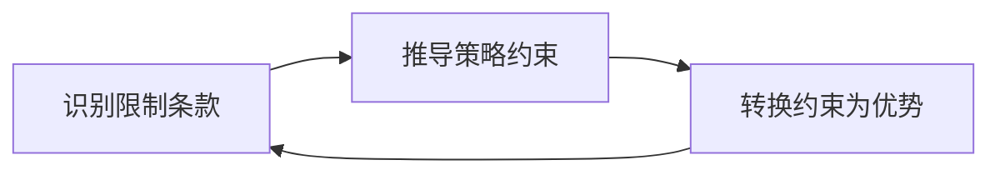

+++
id = "zero-sum-rule-inversion"
domain = "methodology"
layer = "methodology"
maturity = "L1"
validation_count = 1
reuse_count = 0
documentation_level = "basic"
source = "docs/retrospective/reports/competitive-analysis/retrospective-specweave-contest-advantage-analysis-20260624/retrospective-v11-iteration/insight-extraction.md#洞察-3"

[bindings]
rules = []
references = ["multi-source-intelligence-iteration.md"]
skills = []
+++

# 零和规则反利用

## 核心原则

在竞争性场景中（赛事、招投标、资源分配），**限制性条款往往同时是策略聚焦器**——它通过消除分散选项来迫使参与者进入 Best Shot 模式，而 Best Shot 模式下边际投入回报率递增。识别这种规则并主动拥抱其约束，而非绕行或抱怨，是从"规则限制我"到"规则帮我做选择"的策略跃迁。

## 成熟度评估

| 维度 | 评估 | 依据 |
|------|------|------|
| 实践验证 | 低 | 1 次实践（TRAE 大赛单作品 Best Shot 规则的策略反利用） |
| 可复用性 | 高 | 适用于任何有"限制条款"的竞争场景 |
| 通用性 | 高 | 赛事策略 / 招投标 / 资源分配 / 优先级决策 |

## 三阶段操作流



### 阶段一：识别限制条款

**从规则文档中提取所有"只能/只取/不超过/仅支持"类表述**，不要跳过任何一条——限制性条款中的策略信号密度远高于"可以做什么"的允诺性条款。

**竞赛场景常见模式**：

| 限制类型 | 原文示例 | 信号意义 |
|---------|---------|---------|
| 名额约束 | "专业评审通道 300 席" | 竞争规模锚定 |
| 取最优约束 | "同一账号只取得分最高的 1 个作品晋级" | 多作品策略无效 |
| 通道互斥 | "两作品分别从两通道晋级时，只保留专业评审晋级的作品" | 通道选择非独立 |
| 形式约束 | "仅支持个人参赛" | 团队协作不产生直接加分 |

**识别检查清单**：

```
□ 是否有"只取/只保留/仅支持"类表述？
□ 是否有"不超过/至多"类数量上限？
□ 是否有"同一账号/同一选手"的全局约束？
□ 是否有"不重复/不累加/不顺延"的互斥规则？
```

### 阶段二：推导策略约束

**对每条限制条款执行"如果这条规则生效，它禁止了什么策略？"** 的推导。这一步的目的是看清所有被规则关闭的路径，然后**接受这些路径的不可行性**——不再在"选 A 还是选 B"上消耗决策能量。

TRAE 大赛的策略推导：

```
规则：同一账号只取最高分 1 个作品晋级
  ↓ 禁止了什么？
  → 禁止了"多作品分散投稿增加概率"（FOMO 消除）
  → 禁止了"两个作品在两条通道分别冲击"（双通道 FOMO 消除）
  → 禁止了"A 作品冲创新性、B 作品冲完成度"的互补策略
  ↓ 剩下什么？
  → 只有一个选择：把唯一作品做到极致
```

### 阶段三：转换约束为优势

**将阶段二中"唯一剩下的选择"转化为策略上的相对优势**——因为在限制条款下，所有竞争对手都面临同样的约束，但并非所有人都能将约束转化为聚焦优势。

| 约束 | 平庸回应 | 策略回应 | 竞争优势 |
|------|---------|---------|---------|
| 只取 1 个作品 | "我只能做一个方向了，万一选错了怎么办" | "Best Shot 模式下，我已经积累的深度资产的边际优势被放大" | 前期投入的沉没成本转化为竞争壁垒 |
| 多作品无效 | "要不要同时准备两个以防万一" | "不用纠结——100% 灌注一个作品，我的 142 次对话本身就是他人无法复制的深度" | 决策成本归零，执行深度翻倍 |
| 双通道只取一 | "要不要试试抖音通道搏一搏" | "双通道只取一 → 抖音通道风险高（需 500 赞门槛）→ 100% 聚焦专业评审通道" | 消除了"通道选择"带来的资源分散风险 |

**SpecWeave 在规则反利用中的特殊角色**：

在"只取 1 个作品"规则下，SpecWeave 的定位从"独立参赛作品"变为"竹简悟道 TRAE 应用深度维度的证据放大器"。这不是对规则的妥协——这是对规则的**最大化利用**：既然规则说第二作品无法独立晋级，那就让它在其能力最强的维度（TRAE 深度 20% 权重）上对主作品产生最大的边际增益。

## 关键前提

此方法生效需要满足一个前提条件：**你至少在一个维度上拥有其他人无法在赛期内复制的深度/先发优势**。如果没有任何维度上的绝对优势，Best Shot 模式只是"平庸的集中表达"。

## 适用条件

- 竞争场景有明确的"限制性条款"（名额/取最优/排他）
- 你在限制生效前已经积累了特定维度的先发优势
- 限制条款对所有参赛者一视同仁（公平约束）
- 赛期内无法通过增量投入抹平先发差距

## 不适用场景

- 限制条款仅针对特定参与者（不平等约束）
- 你在任何维度上都无先发优势——此时 Best Shot 只是"全力以赴的平庸"
- 限制条款可以通过其他方式绕过（规则漏洞）

## 与其他方法论的关系

| 方法论 | 关系 |
|--------|------|
| `multi-source-intelligence-iteration.md` | 子模式 4（洞察→策略→行动管道）的输出——优势 14 和洞察 14 本质上就是"零和规则反利用"的具体化 |
| `positioning-drift-correction.md` | 双作品交叉叙事中的定位选择（SpecWeave 从"竞争者"变为"增强器"）是规则反利用的结果 |

> 来源：来自 TRAE 大赛"同一账号只取最高分 1 个作品晋级"规则下的双作品策略设计
> 关联模块：`multi-source-intelligence-iteration.md`、`positioning-drift-correction.md`
