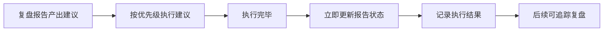

+++
id = "report-as-tracking"
domain = "methodology"
layer = "methodology"
maturity = "L2"
validation_count = 3
reuse_count = 0
documentation_level = "standard"
source = "本次改进建议执行任务的自我萃取"

[bindings]
rules = []
references = []
skills = []
+++

# 报告即追踪载体（report-as-tracking）

## 模式类型
方法论模式

## 成熟度
L2 已验证（本次任务每个建议执行后立即更新报告状态）

## 适用场景
所有复盘报告的改进建议章节，或其他需要追踪执行状态的文档。

## 问题背景
复盘报告通常产出多条改进建议，但若报告仅作为复盘产物而不追踪执行状态，会导致：
- 建议执行进度无记录
- 后续无法复盘建议执行效果
- 报告失去持续价值

## 核心原则

**复盘报告不仅是复盘产物，更是后续行动的追踪载体。**

每执行一个建议后立即更新报告中的状态，形成「执行→记录→验证」闭环。

## 状态标记体系

| 状态 | 符号 | 含义 | 适用场景 |
|------|------|------|---------|
| 已完成 | ✅ | 建议已执行，记录执行结果 | 建议执行完毕 |
| 待规划 | 📋 | 建议有实施方案但暂不投入 | 大投入建议延期 |
| 已关闭 | ❌ | 建议不再执行，记录关闭原因 | 建议不再适用 |
| 进行中 | 🔄 | 建议正在执行 | 长周期建议 |

## 操作流程



### 步骤 1：建议产出

复盘报告中改进建议章节格式：

```markdown
### 🔴 高优先级

**建议 1：xxx**

- 问题：xxx
- 建议：xxx
- 预期收益：xxx
```

### 步骤 2：执行后更新

执行完毕后立即更新：

```markdown
### 🔴 高优先级

**建议 1：xxx** ✅ 已完成

- 问题：xxx
- 建议：xxx
- 预期收益：xxx
- 执行结果：xxx（新增）
```

### 步骤 3：追踪复盘

后续可通过报告追踪：
- 建议执行率（已完成/总数）
- 待规划建议的实施方案
- 已关闭建议的关闭原因

## 关键要点

1. **立即更新而非事后补录**：执行完毕后立即更新报告状态，避免遗漏
2. **执行结果必记录**：不仅标记状态，还需记录具体执行内容
3. **报告持续价值**：报告从「一次性复盘产物」转变为「持续追踪载体」

## 成功案例

| 任务 | 建议数 | 状态更新时机 | 追踪效果 |
|------|--------|-------------|---------|
| 改进建议执行 | 4 | 每个建议执行后立即更新 | 建议执行率 75%，待规划建议有实施方案 |
| 文件命名规范制定与实施 | 4 | 每个建议执行后立即更新 | 建议执行率 50%（2/4），高优先级建议已完成 |

## 反例警示

| 错误操作 | 后果 |
|---------|------|
| 报告仅作为复盘产物，不追踪执行 | 建议执行进度无记录，后续无法复盘 |
| 事后补录而非立即更新 | 可能遗漏执行结果，状态不准确 |
| 仅标记状态不记录执行结果 | 无法了解具体执行内容，追踪价值有限 |
