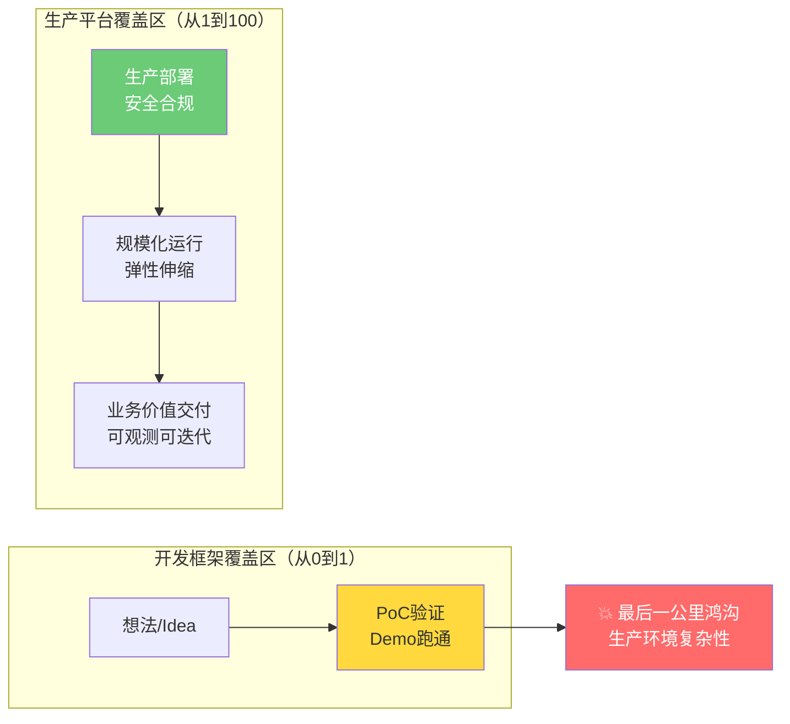
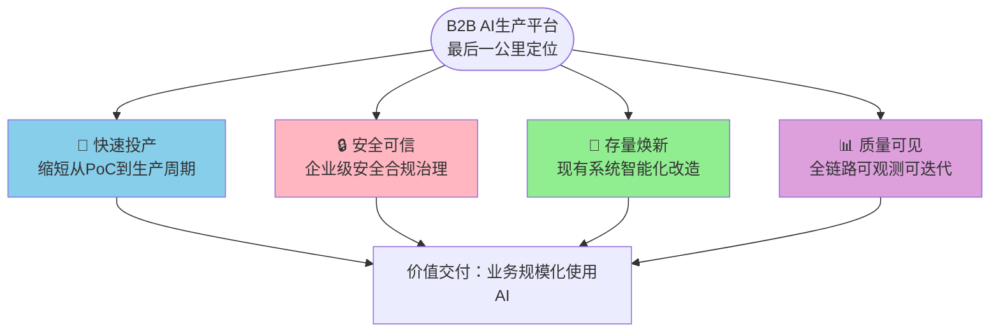

> **来源**：火山引擎AgentKit企业级AI Agent平台产品页深度分析复盘（2026-07-07）——在13章学习笔记中系统拆解了AgentKit"企业级生产平台"的定位逻辑，提炼出从"开发框架"到"生产平台"的本质差异，总结出四大价值支柱框架
> **验证次数**：1次（火山引擎AgentKit平台分析）

# B2B AI产品最后一公里定位分析框架

## 模式类型
方法论模式（外部研究与产品分析）

## 成熟度
L1 初始模式（1次成功实战验证，需更多案例验证普适性）

## 适用场景

| 场景 | 是否适用 | 说明 |
|------|---------|------|
| AI Agent平台产品分析 | ✅ 核心场景 | Agent构建平台、Agent编排工具、MLOps平台 |
| 云服务商AI产品分析 | ✅ 核心场景 | 火山引擎、阿里云、AWS、Azure等云厂商AI产品 |
| 企业级LLM平台分析 | ✅ 核心场景 | 大模型应用平台、企业知识库、AI中台产品 |
| B2B AI产品竞品分析 | ✅ 核心场景 | 识别竞品差异化定位，避免功能列表低维对比 |
| 产品战略与定位决策 | ✅ 核心场景 | 自有B2B AI产品定位、差异化战略制定 |
| 企业AI落地能力评估 | ✅ 核心场景 | 评估企业AI从PoC到生产的能力缺口 |
| 开源AI框架商业版分析 | ✅ 适用 | LangChain/Dify等开发框架的企业版/商业版定位 |
| ToC AI产品/消费级AI工具 | ❌ 不适用 | ToC产品关注用户体验和增长，不涉及企业生产环境鸿沟 |
| 纯AI研究/模型训练工具 | ⚠️ 部分适用 | 研究工具不涉及业务投产，但安全/可观测部分仍有参考价值 |

## 问题背景

分析B2B AI产品时常见的问题：

1. **功能列表对比陷阱**：罗列十几个功能点对比（Agent编排、工具调用、RAG、多模型支持），发现"竞品都有这些功能"，无法识别真正差异
2. **定位模糊误判**：所有产品都自称"AI平台"、"Agent平台"、"企业级解决方案"，无法区分是开发框架还是生产平台
3. **低估生产鸿沟**：认为"PoC跑通了就能上线"，忽略企业生产环境的复杂性（安全合规、可观测、弹性伸缩、权限管控）
4. **存量价值忽视**：只关注"新建Agent"能力，忽视"现有系统智能化改造"这一更大的企业市场
5. **缺乏分析框架**：凭感觉分析，每次分析的维度不一致，无法横向对比不同产品

**根本原因**：B2B AI产品存在一个巨大的"最后一公里"鸿沟——PoC验证通过≠能在生产环境稳定运行。开发框架解决"从0到1"的问题（让你能做出Agent），生产平台解决"从1到100"的问题（让Agent能安全、可靠、低成本地在企业环境运行）。缺乏区分这两类产品的系统框架。

---

## 核心概念：最后一公里鸿沟

### PoC到生产的鸿沟模型

### 开发框架 vs 生产平台的本质差异

| 维度 | 开发框架（从0到1） | 生产平台（从1到100，最后一公里） |
|------|-------------------|-------------------------------|
| **核心目标** | 让开发者能快速构建Agent | 让Agent能在企业生产环境安全稳定运行 |
| **目标用户** | 开发者、AI工程师、技术爱好者 | 企业IT部门、架构师、运维、安全合规 |
| **部署方式** | 本地运行、自托管、Docker | Serverless、托管服务、云原生 |
| **安全模型** | API Key管理、基础权限 | 零信任、双身份治理、最小权限、内容护栏、审计 |
| **弹性伸缩** | 手动扩容、单实例 | 秒级弹性、多租户隔离、自动扩缩容 |
| **可观测性** | 日志打印、Debug模式 | 全链路Tracing、语义级指标、AgentOps、质量评测 |
| **集成方式** | 代码对接、API调用 | MCP协议、配置化、存量系统渐进式改造 |
| **更新方式** | 重新部署、重启 | 热切换、动态加载、会话中更新模型/工具/Skill |
| **典型代表** | LangChain、Dify、AutoGen、CrewAI | 火山引擎AgentKit、AWS Bedrock Agents、Azure AI Agent Service |
| **商业价值** | 降低开发门槛、加速原型验证 | 缩短投产周期、降低运维成本、保障业务安全 |

**关键洞察**：开发框架和生产平台不是竞争关系，而是互补关系——你可能用LangChain开发Agent逻辑，但用AgentKit部署到生产环境。

---

## 核心框架：四大价值支柱

B2B AI生产平台的价值主张可以系统地分解为四大支柱，每个支柱对应企业AI落地的一个核心痛点：

### 四大支柱详细说明

| 支柱 | 核心痛点 | 平台能力特征 | 关键问题 |
|------|---------|-------------|---------|
| **1. 快速投产** | PoC做了很多但没有一个能上线；从Demo到生产需要数月 | 配置即部署（不用写代码）、Serverless弹性、模板市场、低/无代码、开箱即用 | 能否在几天/几周内（而非数月）把Agent部署到生产环境？ |
| **2. 安全可信** | 企业担心数据泄露、Agent失控、合规风险；安全部门不批准AI上线 | 零信任身份、双身份治理（用户+Agent）、IAM最小权限、内容护栏（输入输出双向检测）、审计日志、多租户隔离、数据加密 | 能否满足金融/政府/大型企业的安全合规要求？能否控制Agent的行为边界？ |
| **3. 存量焕新** | 企业已有大量IT投资（CRM/ERP/数据库/API），不想推倒重来；新建Agent无法访问存量数据 | MCP开放协议、标准化工具/数据源连接、配置化接入（不用写集成代码）、渐进式改造、Sidecar模式 | 能否利用现有系统和数据？还是需要从头构建所有能力？ |
| **4. 质量可见** | Agent在生产环境运行效果不可控；不知道效果好不好、哪里出问题、如何优化 | AgentOps全链路可观测、语义级监控（不只是CPU/内存，还有回答质量、工具调用成功率）、评测体系、Trace追踪、A/B测试、持续优化 | 能否知道Agent在生产环境运行得好不好？出了问题能否快速定位？能否持续优化效果？ |

---

## 分析流程：六步定位法

使用本框架分析B2B AI产品时，按以下六步进行：

### 步骤1：识别产品类型

判断目标产品是开发框架还是生产平台，还是两者兼有：

| 信号 | 开发框架倾向 | 生产平台倾向 |
|------|------------|------------|
| 官网宣传语 | "快速构建"、"开发框架"、"开源"、"SDK" | "企业级"、"生产就绪"、"Serverless"、"安全合规"、"一键部署" |
| 核心CTA | "GitHub"、"Quick Start"、"文档"、"自托管" | "立即咨询"、"控制台"、"免费试用"、"联系销售" |
| 架构关键词 | "Chain"、"Agent"、"Tool"、"Memory" | "Harness"、"编排"、"弹性"、"租户"、"观测"、"护栏" |
| 定价模式 | 开源免费、商业支持 | 按调用量/Token/实例付费、企业版订阅 |
| 文档结构 | 快速开始、教程、API Reference | 产品功能、安全合规、SLA、企业支持 |

### 步骤2：映射四大支柱

将产品宣传的功能和能力映射到四大价值支柱，看哪些支柱是重点、哪些缺失：

- [ ] 快速投产：是否有配置化部署、模板市场、Serverless？
- [ ] 安全可信：是否有零信任、IAM、内容护栏、审计、多租户？
- [ ] 存量焕新：是否有MCP/开放协议、标准化集成、渐进式改造方案？
- [ ] 质量可见：是否有AgentOps、Tracing、评测、监控？

### 步骤3：识别核心差异化

在四大支柱中，识别产品重点投入的1-2个支柱作为差异化核心：

- 例：AgentKit的差异化核心是"安全可信"（双身份治理）和"存量焕新"（MCP协议）
- 例：某产品可能差异化核心是"快速投产"（极致的低代码体验）
- 例：某产品可能差异化核心是"质量可见"（最强的评测和可观测能力）

### 步骤4：评估护城河

分析差异化优势是否构成真正的竞争壁垒（护城河）：

| 护城河类型 | 特征 | 可持续性 |
|-----------|------|---------|
| **技术架构壁垒** | 自研核心技术（如Harness编排引擎）、专利 | 中等，技术可被追赶 |
| **生态锁定壁垒** | MCP生态、丰富的工具/数据源连接器、模板市场 | 高，生态网络效应强 |
| **合规认证壁垒** | 等保三级、金融级安全认证、行业资质 | 高，获取周期长 |
| **云原生深度整合** | 与云基础设施（IAM/VPC/监控/日志）深度整合 | 高，迁移成本高 |
| **客户成功壁垒** | 大量企业客户案例、行业解决方案、最佳实践 | 高，信任积累需要时间 |
| **开源社区壁垒** | 活跃的开源社区、开发者生态 | 高，开发者习惯难改变 |

### 步骤5：分析目标客户画像

基于四大支柱的强弱，推断目标客户画像：

| 客户类型 | 最关注的支柱 | 产品适配度 |
|---------|------------|----------|
| 个人开发者/初创公司 | 快速投产、免费/低价 | 开发框架更适合 |
| 中型企业/互联网公司 | 快速投产、质量可见 | 生产平台基础版 |
| 金融/政府/大型企业 | 安全可信、存量焕新 | 生产平台企业版 |
| 传统企业数字化转型 | 存量焕新、快速投产 | 有行业解决方案的生产平台 |

### 步骤6：识别市场机会与空白

分析四大支柱的覆盖度，识别市场空白：

- 哪个支柱普遍被竞品忽视？
- 哪些行业/场景对特定支柱有强烈需求但供给不足？
- 存量焕新（MCP生态）是否是普遍短板？
- AgentOps（质量可见）是否是新兴需求？

---

## 实际应用案例

### 案例1：火山引擎AgentKit平台分析（2026-07-07）

**产品识别**：生产平台（最后一公里定位）
- 官网宣传语："企业级AI Agent平台"、"打通Agent应用落地最后一公里"
- 核心概念：Harness编排、Serverless、零信任、AgentOps
- 明确区别于开发框架："专为生产环境设计"

**四大支柱映射**：
| 支柱 | AgentKit能力 | 强度 |
|------|-------------|------|
| 快速投产 | Harness配置即部署、应用广场模板、Serverless秒级伸缩 | ⭐⭐⭐⭐ |
| 安全可信 | 双身份治理（用户+Agent）、零信任、IAM最小权限、内容护栏、多租户隔离 | ⭐⭐⭐⭐⭐（核心差异化） |
| 存量焕新 | MCP开放协议、标准化工具/数据源连接、动态加载 | ⭐⭐⭐⭐⭐（核心差异化） |
| 质量可见 | 全链路可观测、AgentOps、评测体系、Trace追踪 | ⭐⭐⭐⭐ |

**核心差异化**：
- 双身份安全模型（用户身份+Agent身份）是安全架构创新
- MCP开放协议+存量焕新策略（渐进式改造而非推倒重来）
- Harness编排（运行时复杂性封装，配置即部署+热切换）

**护城河评估**：
- 云原生深度整合：与火山引擎IAM/VPC/Ark大模型深度整合（高壁垒）
- 合规认证：面向企业级，预期有等保/金融级认证（高壁垒）
- 生态：MCP协议是开放标准但工具连接器生态需要时间积累（中等壁垒）

**目标客户**：金融/政府/大型企业、需要将AI投产到生产环境、有大量存量系统需要改造的企业

**结果**：
- 产出13章学习笔记+6个Mermaid图表
- 成功识别AgentKit与LangChain/Dify等开发框架的本质差异
- 提炼出四大价值支柱框架
- 验证了"最后一公里"视角在B2B AI产品分析中的有效性

---

## 反模式与注意事项

### 绝对禁止的分析反模式

| 反模式 | 为什么错误 | 正确做法 |
|--------|----------|---------|
| **功能列表对比** | "A有RAG，B也有RAG；A支持多模型，B也支持"——开发框架和生产平台都有这些功能，但定位完全不同 | 先判断产品类型（开发框架 vs 生产平台），再用四大支柱框架对比 |
| **"都是Agent平台"误判** | 把LangChain和AgentKit归为同一类竞品——前者解决开发问题，后者解决投产问题 | 按步骤1的信号识别产品定位，区分互补品和竞品 |
| **低估安全复杂度** | "加个权限控制不就行了"——企业级安全是完整体系（身份/权限/护栏/审计/隔离/加密），不是单个功能 | 用安全支柱的完整清单评估，不要简化为"有权限管理" |
| **忽视存量市场** | 只关注"新建Agent"场景，忽视企业90%的价值在存量系统中 | 分析存量焕新能力（MCP连接器、集成方案、渐进式改造路径） |
| **混淆技术先进性与产品价值** | "Harness编排听着很高级"——不分析它解决什么业务痛点 | 每个技术特性都要映射到四大支柱和业务价值（投产/安全/存量/质量） |

### 注意事项

1. **框架灵活应用**：不是每个产品都必须四大支柱全覆盖——早期产品可能只聚焦1-2个支柱
2. **区分宣传与实际**：官网说"企业级"不等于真的有企业级能力，看是否有具体的安全认证、SLA承诺、客户案例
3. **互补而非竞争**：开发框架和生产平台往往是互补关系，不是非此即彼
4. **产品阶段因素**：早期产品可能"快速投产"支柱强但"安全可信"弱，这是阶段问题不是定位错误
5. **Mermaid可视化**：分析时用Mermaid画出定位图、支柱映射图、护城河分析图，提升表达清晰度
6. **结合行业特性**：金融行业对安全可信要求极高，互联网行业对快速投产和弹性要求高，制造业对存量焕新需求强

---

## 与其他模式的关系

| 关联模式 | 关系类型 | 关系说明 |
|---------|---------|---------|
| [b2b-product-page-ux-five-dimensions.md](./b2b-product-page-ux-five-dimensions.md) | 互补 | UX五维框架分析产品页设计表达，本框架分析产品定位本身，两者结合形成完整的B2B AI产品分析 |
| [spec-nine-section-narrative.md](../product-growth/spec-nine-section-narrative.md) | 思想同源 | PRD九段叙事和本框架都遵循"痛点→价值→证明"的价值传达逻辑 |
| [vertical-saas-mcp-capability-exposure.md](../product-growth/vertical-saas-mcp-capability-exposure.md) | 下游 | 本框架"存量焕新"支柱的MCP协议能力开放模式在垂直SaaS场景的具体化 |
| [b2b-ai-developer-experience-six-elements.md](../product-growth/b2b-ai-developer-experience-six-elements.md) | 互补 | DX六要素分析开发者使用产品的体验，本框架分析产品战略定位 |
| [ai-reliability-four-layer-defense.md](../product-growth/ai-reliability-four-layer-defense.md) | 支撑 | 四层防御模型是本框架"安全可信"支柱的技术实现参考 |
| [vendor-product-learning-twelve-step-template.md](./vendor-product-learning-twelve-step-template.md) | 包含关系 | 产品学习十二步模板的"定位分析"步骤使用本框架 |
| [external-website-analysis-fallback-strategy.md](./external-website-analysis-fallback-strategy.md) | 前置依赖 | 先成功获取产品页内容，再进行定位分析 |

---

## 模式演进方向

当前版本为L1（1次验证），后续可在以下方向迭代：
1. 增加更多实战案例（分析3-5个不同B2B AI产品验证普适性，如AWS Bedrock Agents、Azure AI Agent Service、百度千帆、阿里百炼等）
2. 补充不同类型B2B AI产品的差异化权重（如Agent平台 vs LLM平台 vs MLOps平台的支柱侧重差异）
3. 开发"最后一公里定位评分卡"（四大支柱各25分，量化评估产品生产就绪程度）
4. 补充"从开发框架到生产平台"的演进路径分析（如Dify企业版、LangGraph Cloud如何向生产平台延伸）
5. 增加行业适配权重（金融/政府/互联网/制造各行业对四大支柱的不同优先级）
6. 制作B2B AI产品定位矩阵图（开发效率x轴，生产就绪y轴）
