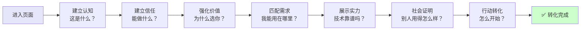
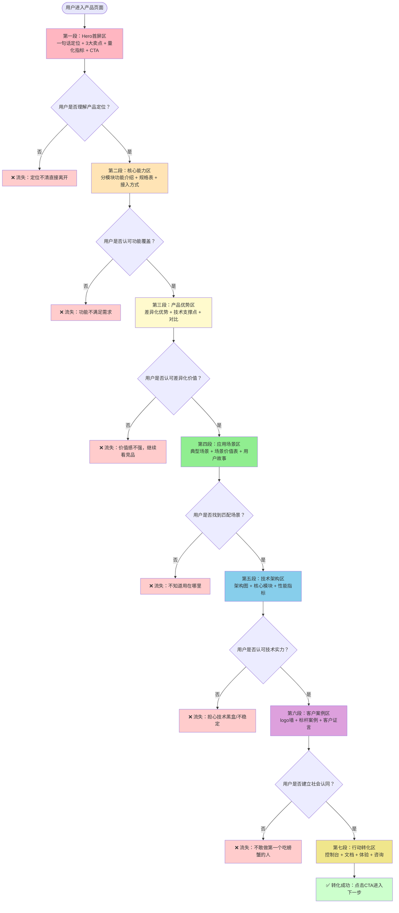

> **来源**：火山引擎SearchInfinity产品学习复盘（2026-07-06）——在950行学习笔记中识别出标准的Hero→优势→架构→场景→CTA信息结构
> **二次验证**：火山引擎HiAgent一站式数字员工派遣站产品学习（2026-07-07）——七段式结构在AI Agent产品页中完整呈现，验证了跨产品类型的适用性
> **三次验证**：火山引擎ACEP云手机产品学习（2026-07-07）——云手机产品页严格遵循七段式递进，再次验证该结构的普适性
> **验证次数**：3次（SearchInfinity搜索产品 + HiAgent Agent平台产品 + ACEP云手机基础设施产品）

# B端技术产品页面七段式认知递进信息架构

## 模式类型
方法论模式（外部研究与产品UX分析）

## 成熟度
L2 已验证（3次成功实战验证，覆盖3类不同B端技术产品：搜索API、AI Agent平台、云手机基础设施）

## 适用场景

| 场景 | 是否适用 | 说明 |
|------|---------|------|
| B端技术产品着陆页分析 | ✅ 核心场景 | 云服务、API产品、企业软件、开发者工具产品页 |
| 产品营销落地页设计 | ✅ 核心场景 | 设计新产品介绍页时直接套用标准结构 |
| 竞品页面UX拆解 | ✅ 核心场景 | 快速识别竞品页面结构完整性和转化路径设计 |
| 自有产品页评估优化 | ✅ 核心场景 | 检查哪些模块缺失，评估转化漏斗断点 |
| 结构化产品信息提取 | ✅ 核心场景 | 产品学习任务中按七段结构组织笔记章节 |
| 开源项目官网首页 | ⚠️ 部分适用 | 开源项目更侧重Quick Start和文档，商业转化模块可简化 |
| ToC消费产品页 | ❌ 不适用 | ToC是冲动消费逻辑，结构完全不同 |

## 问题背景

分析或设计B端技术产品页面时常见的问题：

1. **结构混乱**：内容随意排列，不符合用户浏览和决策路径
2. **模块缺失**：缺少关键信任建立模块（如客户案例、架构图），导致转化流失
3. **顺序错误**：把场景区放在优势区前面，用户还没建立价值认知就看应用场景
4. **缺乏标准**：每次分析都重新总结信息架构，重复劳动且标准不统一
5. **忽略决策路径**：不理解B端用户从认知到转化的七个心理阶段，内容组织没有针对性

**根本原因**：B端技术采购是理性、长周期、多角色参与的决策过程，有标准化的认知建立路径。优秀的B端产品页面不是随意堆砌功能，而是严格遵循用户决策路径设计信息架构。

---

## 核心原则：认知递进，建立信任，促成转化

B端技术产品页面的信息架构不是"有什么内容放什么"，而是**严格按照用户从进入页面到产生转化的心理路径，逐段建立认知、传递价值、打消疑虑、促成行动**。

---

## 七段式标准架构详解

### 架构总览

| 段落序号 | 模块名称 | 核心目标 | 回答用户关键问题 | 典型内容元素 | 对应决策阶段 |
|---------|---------|---------|----------------|-------------|-------------|
| **第一段** | Hero首屏区 | 建立产品认知 | "这是什么？核心价值是什么？" | 一句话定位Slogan、3个核心卖点、核心量化指标、首屏CTA按钮组 | Attention（注意） |
| **第二段** | 核心能力区 | 建立功能信任 | "具体能做什么？有什么功能？" | 分模块功能介绍、规格表、接入方式列表、能力矩阵 | Interest（兴趣） |
| **第三段** | 产品优势区 | 强化差异化价值 | "为什么选你而不是竞品？" | 分维度优势对比、技术支撑点说明、差异化卖点表格 | Interest（兴趣） |
| **第四段** | 应用场景区 | 匹配用户需求 | "我能用在什么地方？" | 典型场景列表、场景-价值对应表、用户故事、行业解决方案 | Desire（欲望） |
| **第五段** | 技术架构区 | 展示技术实力 | "技术上靠谱吗？会不会是黑盒？" | 产品架构图、核心技术模块说明、技术栈展示、性能指标 | Desire（欲望） |
| **第六段** | 客户案例区 | 提供社会证明 | "别人用得怎么样？有成功先例吗？" | 标杆客户logo墙、客户案例详情、客户证言视频/文字、合作伙伴 | Desire（欲望） |
| **第七段** | 行动转化区 | 促成试用/购买 | "怎么开始？下一步做什么？" | 控制台入口、文档链接、体验中心、联系销售、免费试用 | Action（行动） |

### 七段式完整流程图

---

## 各段详细设计规范

### 第一段：Hero首屏区（认知建立）

**核心目标**：3秒内让用户知道"这是什么产品，核心价值是什么"

**必备元素**：
- ✅ 一句话定位Slogan（避免空洞词汇，讲清"为谁解决什么问题"）
- ✅ 3个核心卖点（不要超过3个，过多稀释记忆点）
- ✅ 1-2个核心量化指标（如"端到端延时<70ms"）
- ✅ 首屏CTA按钮组（2-3个按钮，覆盖不同意向用户）

**反模式**：
- ❌ 空洞形容词堆砌（"赋能"、"助力"、"生态"、"领先"）
- ❌ 轮播图/自动播放视频分散注意力
- ❌ 只有1个CTA按钮（仅"立即咨询"，没有自助入口）

**火山引擎ACEP案例**：
- 定位："一站式云手机解决方案——自研ARM服务器可靠稳定，高品质超低延时音视频技术流畅操控，最大化模拟真机环境与性能"
- 三大卖点：自研ARM服务器、超低延时音视频、真机模拟
- 量化指标：端到端延时<70ms、游戏延时<50ms
- CTA：云手机控制台、说明文档、体验中心

---

### 第二段：核心能力区（功能信任）

**核心目标**：展示产品能做什么，让用户相信功能覆盖满足需求

**必备元素**：
- ✅ 按逻辑分组的功能模块（3-5组为宜）
- ✅ 每个能力有功能描述+业务价值说明
- ✅ 产品规格表（配置梯度、版本支持）
- ✅ 接入方式列表（API/SDK/控制台/ADB等）

**反模式**：
- ❌ 功能罗列超过8个，没有分组
- ❌ 只讲功能不讲价值（"支持XX配置" → 应该说"支持XX配置，满足XX场景需求"）

**火山引擎ACEP案例**：
- 四大核心能力：丰富的产品规格、便捷的管理运维、高品质音视频传输、全方位运维监控
- 每个能力配规格表或接入方式说明

---

### 第三段：产品优势区（价值强化）

**核心目标**：回答"为什么选你而不是竞品"，建立差异化认知

**必备元素**：
- ✅ 3-5个优势维度，每个有明确的技术支撑点
- ✅ 优势是可验证的，不是自说自话（用数据、技术细节支撑）
- ✅ 与第二段能力形成"能力→价值"的对应关系

**反模式**：
- ❌ "功能丰富"、"弹性灵活"、"安全稳定"、"流畅体验"这类空洞词汇无支撑
- ❌ 优势数量超过5个，没有重点
- ❌ 优势与功能脱节，凭空编造差异化

**火山引擎ACEP案例**：
- 四大优势：功能丰富、弹性灵活、安全稳定、流畅体验
- 每个优势配具体技术支撑点（如"流畅体验"支撑点是端到端<70ms延时、弱网优化）

---

### 第四段：应用场景区（需求匹配）

**核心目标**：让用户"对号入座"，知道自己能用这个产品解决什么具体问题

**必备元素**：
- ✅ 3-5个典型应用场景（覆盖核心目标用户群体）
- ✅ 每个场景遵循"什么用户→什么痛点→用什么能力→获得什么价值"结构
- ✅ 场景卡片或场景-价值对应表格
- ✅ 每个场景配场景专属CTA按钮（如"申请测试"）

**反模式**：
- ❌ 场景描述过于笼统（"适用于企业数字化转型"）
- ❌ 只列场景名称不说价值
- ❌ 场景数量超过6个，没有重点

**火山引擎ACEP案例**：
- 五大场景：云游戏、仿真测试、直播互娱、应用审核、安全办公
- 每个场景有场景描述+业务价值说明

---

### 第五段：技术架构区（实力展示）

**核心目标**：打消技术决策者的疑虑，证明产品不是黑盒，技术架构可靠

**必备元素**：
- ✅ 清晰的产品架构图（分层架构，从接入到基础设施）
- ✅ 核心技术模块说明（3-8个关键模块）
- ✅ 关键性能指标（延时、并发、可用性等）
- ✅ 技术栈或自研技术亮点（如"自研ARM服务器"）

**反模式**：
- ❌ 架构图过于复杂，满屏文字看不懂
- ❌ 完全没有架构图，技术用户无法评估
- ❌ 性能指标模糊（"高性能"、"低延时"无具体数字）

**火山引擎ACEP案例**：
- 八大核心模块：音视频传输、控制指令、智能调度、应用分发、边缘节点、ARM服务器、资源管理、存算分离
- 核心性能指标明确量化

---

### 第六段：客户案例区（社会证明）

**核心目标**：通过已有客户的成功案例，降低用户决策风险——"别人都在用，应该没问题"

**必备元素**：
- ✅ 标杆客户logo墙（最强社会证明）
- ✅ 3-4个详细客户案例
- ✅ 每个案例包含：客户背景、应用场景、使用产品、获得价值
- ✅ 客户证言/数据（如"效率提升300%"）

**反模式**：
- ❌ 完全没有客户案例（新用户不敢第一个尝试）
- ❌ 案例只有logo没有详情（无法证明真实使用）
- ❌ 案例与目标用户群体不匹配

**火山引擎ACEP案例**：
- 四个标杆客户：吉利汽车、中科深智、巨量引擎、快盘科技
- 每个案例有客户背景、应用场景、业务价值

---

### 第七段：行动转化区（促成行动）

**核心目标**：给不同决策阶段、不同角色的用户提供清晰的下一步行动入口

**必备元素**：
- ✅ 分层CTA策略（覆盖不同意向程度用户）：
  - 主转化按钮：立即咨询、联系销售、申请试用（高意向用户）
  - 自助体验入口：控制台、免费体验（想自己试试的用户）
  - 开发者入口：接口文档、技术文档（技术评估用户）
- ✅ CTA在多个位置重复出现（首屏、每个场景后、底部）
- ✅ 不同位置CTA文案适配上下文

**反模式**：
- ❌ 只有1个CTA按钮（如"立即购买"，把自助用户和开发者赶走）
- ❌ CTA文案与上下文不匹配（在技术架构区放"立即购买"）
- ❌ 找不到文档入口（技术用户最需要的入口）

**火山引擎ACEP案例**：
- 三个核心快速入口：云手机控制台、说明文档、体验中心
- CTA在首屏和底部都有分布

---

## 页面完整性检查清单

分析或设计B端产品页面时，用此清单快速检查：

### 认知建立检查
- [ ] Hero区是否有清晰的一句话定位（避免空洞词汇）？
- [ ] 是否有3个核心卖点，不超过3个？
- [ ] 是否有量化的核心性能指标？
- [ ] 首屏是否有2-3个分层CTA按钮？

### 功能信任检查
- [ ] 是否有按逻辑分组的核心能力模块（3-5组）？
- [ ] 每个能力是否说明了业务价值，而不仅是功能名称？
- [ ] 是否有产品规格或接入方式说明？

### 价值强化检查
- [ ] 是否有3-5个产品优势维度？
- [ ] 每个优势是否有具体支撑点（数据/技术细节）？
- [ ] 优势与能力是否形成对应关系？

### 需求匹配检查
- [ ] 是否有3-5个典型应用场景？
- [ ] 每个场景是否遵循"用户→痛点→能力→价值"结构？
- [ ] 场景卡片是否有专属CTA？

### 技术实力检查
- [ ] 是否有清晰的产品架构图？
- [ ] 是否说明了核心技术模块？
- [ ] 性能指标是否量化（有具体数字）？

### 社会证明检查
- [ ] 是否有标杆客户logo墙？
- [ ] 是否有3-4个详细客户案例？
- [ ] 案例是否说明了具体业务价值？

### 行动转化检查
- [ ] CTA是否覆盖了不同角色（业务决策者/开发者/体验用户）？
- [ ] CTA是否在页面多个位置重复出现？
- [ ] 是否有清晰的文档入口？

---

## 内容重复策略：有策略地重复，而不是简单复制

优秀的B端产品页面会**在不同模块"换框架"重复核心信息**，强化用户记忆：

| 信息 | 在Hero区 | 在优势区 | 在场景/案例区 | 重复方式 |
|------|---------|---------|-------------|---------|
| 核心价值 | 一句话概括 | 分维度详细阐述 | 通过客户案例具象化 | 概括→展开→验证 |
| 性能指标 | 首屏高亮数字 | 技术架构区详细说明 | 客户案例中说"达到XX效果" | 数字→原理→验证 |
| 差异化卖点 | 3个卖点列表 | 每个卖点展开技术支撑 | 在对应场景中体现价值 | 列表→支撑→落地 |

---

## 与其他模式的关系

| 关联模式 | 关系类型 | 关系说明 |
|---------|---------|---------|
| [b2b-product-page-ux-five-dimensions.md](./b2b-product-page-ux-five-dimensions.md) | 互补 | UX五维框架是分析维度，本模式是信息架构标准；五维框架的"维度一：信息架构"直接使用本模式作为检查标准 |
| [b2b-value-quantification-case-validation.md](./b2b-value-quantification-case-validation.md) | 子模式 | 本模式第一段（Hero区首屏量化）和第六段（客户案例验证）的具体设计方法论，提供"量化亮剑→案例验证"双闭环操作指南 |
| [multi-touchpoint-aida-conversion.md](../product-growth/multi-touchpoint-aida-conversion.md) | 理论基础 | 本模式的决策阶段划分基于AIDA模型，七段对应Attention→Interest→Desire→Action的完整转化路径 |
| [external-website-analysis-fallback-strategy.md](./external-website-analysis-fallback-strategy.md) | 前置依赖 | 先用兜底策略成功获取网页内容，再用本模式分析信息架构 |
| [vendor-product-learning-twelve-step-template.md](./vendor-product-learning-twelve-step-template.md) | 包含关系 | 产品学习十二步模板中，笔记章节划分可直接参考本模式的七段结构 |
| [spec-nine-section-narrative.md](../product-growth/spec-nine-section-narrative.md) | 思想同源 | PRD九段叙事与本模式都遵循"定位→价值→证明→行动"的认知递进逻辑 |

---

## 实际应用案例

### 案例1：火山引擎SearchInfinity豆包搜索（2026-07-06）
- **产品类型**：AI搜索API产品
- **七段完整性**：完整七段
- **分析结果**：950行学习笔记，识别出10个CTA按钮分4层设计，验证了七段式+分层CTA的有效性
- **核心发现**：架构图清晰展示API接入→配置→检索→AI处理→输出五层，符合第五段规范

### 案例2：火山引擎HiAgent一站式数字员工派遣站（2026-07-07）
- **产品类型**：AI Agent平台产品
- **七段完整性**：完整七段
- **分析结果**：跨产品类型验证了七段式架构的适用性，AI Agent平台同样遵循该结构
- **核心发现**：客户案例区详细展示了不同行业Agent应用场景，第六段（社会证明）与第四段（场景）形成良好呼应

### 案例3：火山引擎ACEP云手机（2026-07-07）
- **产品类型**：云手机基础设施产品
- **七段完整性**：完整七段
- **分析结果**：1076行/12章学习笔记，验证了基础设施类产品同样遵循该信息架构
- **核心发现**：八大技术模块架构图清晰、四个标杆客户案例完整，第五段和第六段质量很高；三大卖点（自研ARM、超低延时、真机模拟）严格遵循"3个核心卖点"规范

---

## 反模式与注意事项

### 绝对禁止的设计反模式

| 反模式 | 为什么错误 | 正确做法 |
|--------|----------|---------|
| **结构随意创新** | B端用户习惯了标准结构，"创新"结构增加认知负担 | 遵循七段式标准结构，差异化体现在内容质量而非结构 |
| **模块缺失** | 跳过客户案例或架构图，关键决策疑虑没有打消 | 按检查清单确保七段完整，早期产品可标注"即将上线" |
| **顺序颠倒** | 把场景放在优势前面，用户还没理解价值就看应用 | 严格遵循认知递进顺序：认知→能力→优势→场景→架构→案例→CTA |
| **空洞无量化** | "低延时"、"高性能"没有具体数字 | 所有优势和性能指标尽量量化，用具体数字建立信任 |
| **CTA单一** | 只有"联系销售"，把自助用户和开发者赶走 | 采用分层CTA策略，覆盖不同决策阶段的用户 |

### 注意事项

1. **结构是骨架不是枷锁**：七段是标准结构，可根据产品特点微调模块名称和顺序，但核心认知递进逻辑不变
2. **内容重复要有策略**：核心信息可以在多段重复，但要换框架（概括→展开→验证），不要简单复制粘贴
3. **CTA重复但有差异**：同一CTA在不同位置出现时，文案应适配上下文（首屏用"免费体验"，场景后用"申请该场景测试"）
4. **结合产品阶段**：早期产品可能客户案例少，可以用"内测合作伙伴"、"即将上线"等方式透明标注，不要编造案例
5. **横向对比**：分析竞品时用本框架做横向对比，更容易识别结构差异和优劣势
6. **截图辅助**：分析时配合页面截图标注各段位置，比纯文字描述更清晰

---

## 模式演进方向

当前版本为L2（3次验证，覆盖3类火山引擎产品），后续可在以下方向迭代：
1. 验证非火山引擎产品（阿里云、腾讯云、AWS、企业SaaS产品等），确认普适性，向L3演进
2. 补充不同类型B端产品（API产品/无代码平台/开源商业产品）的结构微调指南
3. 制作七段式完整性评分表（每段若干分，量化评估页面质量）
4. 补充各段反模式截图案例库
5. 开发自动化页面结构分析脚本（识别页面各模块位置和完整性）
