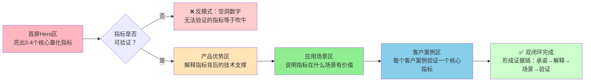

> **首次验证**：火山引擎SearchInfinity豆包搜索产品页分析（2026-07-06）——首屏量化指标（1-50条返回量等）+ 场景转化CTA设计初步验证
> **二次验证**：火山引擎ACEP云手机产品页分析（2026-07-07）——四大硬指标（&lt;70ms/&lt;50ms/24h搭建/24h直播）分别对应四个客户案例验证，形成完美双闭环
> **验证次数**：2次（AI搜索API产品 + 云手机基础设施产品）

# B端技术产品价值量化与案例验证双闭环模式

## 模式类型
方法论模式（B端产品UX设计与价值传达）

## 成熟度
L2 已验证（2次成功实战验证，覆盖API产品和基础设施产品两类B端技术产品）

## 适用场景

| 场景 | 是否适用 | 说明 |
|------|---------|------|
| B端技术产品营销页设计 | ✅ 核心场景 | 云服务、API产品、企业软件、开发者工具产品页 |
| 竞品产品页价值传达分析 | ✅ 核心场景 | 评估竞品价值传达质量，识别空洞宣传和信任缺口 |
| 客户案例撰写规范 | ✅ 核心场景 | 标准化案例结构，让案例真正成为信任背书而非Logo墙 |
| 产品首屏文案优化 | ✅ 核心场景 | 首屏指标选择和展示方式优化 |
| 自有产品页转化优化 | ✅ 核心场景 | 识别价值传达断点，提升信任建立效率 |
| ToC消费产品页 | ❌ 不适用 | ToC是感性决策，不需要严格的量化和案例验证 |
| 早期MVP产品 | ⚠️ 部分适用 | 早期客户案例少时，可以透明标注"内测中"，不要编造数据和案例 |

## 问题背景

B端技术产品价值传达中最常见的两个致命问题：

1. **形容词堆砌，没有量化**：
   -    - "超低延时" → 到底多低？50ms？200ms？1秒？
   -    - "高性能" → QPS多少？并发多少？响应时间多少？
   -    - "行业领先" → 谁评的？领先在哪里？有没有数据？
   
   B端技术决策者（开发者、架构师、技术负责人）是理性决策者，空洞形容词对他们没有说服力，甚至会引起反感——"连个数字都不敢放，肯定性能不行"。

2. **案例只有Logo，没有验证**：
   - 客户Logo墙放了20个Logo，但没有一个案例讲清楚"客户在什么场景用了产品，验证了什么指标"
   - 首屏说"<50ms延时"，但所有客户案例都不提延时指标
   - 案例和首屏卖点、产品优势完全脱节，无法形成前后呼应

**根本原因**：不理解B端技术采购的信任建立逻辑——技术人员相信具体数字胜过形容词，相信第三方验证胜过自吹自擂，相信前后呼应的证据链胜过零散信息。

---

## 核心原则：数字是技术人员的通用语言，验证是信任的唯一来源

B端技术产品价值传达遵循两个铁律：

1. **没有量化的价值不是价值**：任何"优势"如果不能用数字表达，要么是你没想清楚，要么是这个优势根本不存在
2. **没有验证的指标不是承诺**：首屏亮出的任何量化指标，必须在后面的客户案例中找到对应的验证，否则就是虚假宣传



---

## 第一闭环：首屏量化亮剑——用数字建立第一印象

### 指标选择三原则

首屏不能放太多指标，选择3-4个最核心的，遵循以下原则：

| 原则 | 说明 | 反例 | 正例 |
|------|------|------|------|
| **客户最关心** | 选择客户决策时最优先考虑的指标，不是你最想炫耀的指标 | 放"我们有100+工程师"（客户不关心） | 放"端到端延时<70ms"（游戏客户最关心） |
| **可被独立验证** | 指标必须是客户可以自己测试验证的，不是自说自话 | "用户体验提升80%"（无法验证） | "操作延时<50ms"（客户可以自己测） |
| **有行业对标意义** | 数字能让懂行的人一眼看出水平，最好暗示行业基线 | "支持高并发"（无意义） | "单节点10万并发"（知道这是什么水平） |

### 首屏指标展示规范

- ✅ **数字要具体**：用"<70ms"而非"<100ms"，用"24小时"而非"快速"，越具体可信度越高
- ✅ **位置要靠前**：放在Hero区最显眼位置，用户进入页面第一眼就能看到
- ✅ **要有场景说明**：如果是特定场景的指标，标注清楚（如"云游戏场景<50ms"而非泛泛的"<50ms"）
- ✅ **控制数量**：3-4个足够，超过5个用户记不住，反而稀释记忆点
- ❌ **不要放虚数**："服务百万用户"如果没有案例支撑就是虚数，不如不放
- ❌ **不要玩文字游戏**："延时低至XXms"——"低至"意味着只有最好情况能达到，反而显得不自信

### 火山引擎ACEP正面案例

ACEP首屏亮出四个硬指标，每个都精准命中客户痛点：

| 指标 | 为什么选这个指标 | 对应客户痛点 |
|------|----------------|-------------|
| **端到端延时<70ms** | 云手机体验的核心指标，懂行的人知道<100ms是可用门槛，<70ms是流畅 | "云手机会不会卡？操作跟手吗？" |
| **云游戏操作延时<50ms** | 云游戏是最高要求场景，能做到<50ms说明技术实力顶尖 | "能玩云游戏吗？延时够低吗？" |
| **24小时完成示例搭建** | 打消接入顾虑——"是不是要折腾几周才能跑起来？" | "接入要多久？会不会很麻烦？" |
| **直播不间断24小时** | 直播场景刚需，稳定性指标 | "能7×24小时稳定运行吗？会不会崩？" |

---

## 第二闭环：案例-场景-指标三点验证——每个案例验证一个承诺

### 三点闭环结构

客户案例不是放Logo就完事，每个案例必须包含三个要素，形成闭环：

| 要素 | 说明 | 作用 |
|------|------|------|
| **客户是谁** | 行业内有知名度的标杆客户名称和Logo | 社会证明——"这个行业的头部玩家都在用" |
| **在什么场景用** | 对应前面"应用场景区"中的一个具体场景 | 场景匹配——"和我一样场景的客户在用" |
| **验证了什么指标** | 明确说明这个案例验证了首屏亮出的哪个核心指标 | 指标验证——"他们真的做到了承诺的指标" |

**三点闭环逻辑**：客户Logo（建立信任）→ 场景匹配（产生代入感）→ 指标验证（打消最后疑虑）——三者缺一不可。

### 案例撰写黄金模板

每个客户案例按以下结构撰写：

```
【客户名称】（所属行业）
场景：客户在XX场景下遇到了XX痛点
方案：使用了我们产品的XX能力
效果：达到了XX指标（对应首屏的一个核心指标）
价值：帮助客户实现了XX业务价值
```

### 案例与指标一一对应原则

最理想的情况是：**首屏亮出的每个核心指标，都有至少一个客户案例在验证它**——形成完美的前后呼应。

### 火山引擎ACEP正面案例（完美闭环）

ACEP四个客户案例，每个验证一个核心指标/场景：

| 客户 | 对应场景 | 验证的核心指标/能力 | 闭环效果 |
|------|---------|-------------------|---------|
| **快盘科技** | 云游戏 | 操作延时<50ms | 首屏说"云游戏<50ms"，案例直接说"快盘科技实现<50ms延时"，完美验证 |
| **中科深智** | 直播互娱 | 24小时不间断运行 | 首屏说"直播24小时不间断"，案例说"中科深智实现24小时直播"，直接对应 |
| **巨量引擎** | 应用审核 | 弹性调度、批量自动化、安全隔离 | 验证"弹性灵活"、"安全稳定"优势，字节跳动自用是最强信任背书 |
| **吉利汽车** | 云车机（创新场景） | 复杂网络适应性、场景拓展能力 | 证明产品不只是云游戏，还能拓展到车载等创新场景，验证"一站式"能力 |

**ACEP案例设计的高明之处**：
1. 前两个案例（快盘、中科深智）直接验证首屏亮出的硬指标，形成最直接的证据链
2. 第三个案例（巨量引擎）是"自用案例"——字节跳动自己用，说服力极强
3. 第四个案例（吉利汽车）展示场景拓展能力，给客户想象空间
4. 四个案例覆盖了不同行业（游戏/直播/互联网广告/汽车），让不同行业客户都能找到代入感

---

## 常见反模式识别

| 反模式 | 问题表现 | 为什么无效 | 改进方向 |
|--------|---------|-----------|---------|
| **Logo墙堆砌** | 一页放20+客户Logo，没有任何案例详情 | 客户会想"这些客户真的在用吗？还是只合作过一次？" | 选择3-5个标杆客户做详细案例，其他小Logo可以放但不要当主角 |
| **案例与指标脱节** | 首屏说"<50ms延时"，案例里完全不提延时 | 客户会怀疑"那个<50ms是不是实验室数据？真实客户能达到吗？" | 每个核心指标必须有至少一个案例验证，案例中明确写出达到的指标数字 |
| **空洞形容词开头** | "行业领先的XX"、"革命性的XX"、"赋能千行百业" | B端技术人员看到这类词会直接划走，默认你在吹牛 | 删掉所有形容词，直接上数字和场景 |
| **无法验证的指标** | "效率提升300%"、"成本降低50%"（无基线无场景） | 客户会问"和什么比提升300%？在什么场景下？谁测的？" | 使用客户可独立验证的技术指标（延时、QPS、可用性等），业务指标要说明上下文 |
| **指标太多太杂** | 首屏放8-10个数字，什么都想说 | 用户一个都记不住，反而不知道你的核心优势是什么 | 只留3-4个最有冲击力的核心指标，其他指标放到技术架构区或详情页 |
| **案例没有痛点** | "XX客户选择了我们的产品"——然后就没了 | 客户不知道"XX客户为什么选你？解决了什么问题？" | 每个案例都要讲清楚"客户遇到了什么痛点→用你的产品怎么解决→达到了什么效果" |

---

## 双闭环完整检查清单

### 首屏量化检查
- [ ] 首屏是否有3-4个核心量化指标（不是形容词）？
- [ ] 每个指标是否都是客户最关心的，而不是你自嗨的？
- [ ] 指标是否具体（<70ms而非"低延时"）？
- [ ] 指标是否是客户可以独立验证的？
- [ ] 指标数量是否控制在3-4个，不超过5个？

### 案例验证检查
- [ ] 是否有3-5个标杆客户详细案例（不是只有Logo）？
- [ ] 每个案例是否包含"客户是谁→什么场景→验证了什么指标"三点？
- [ ] 首屏亮出的每个核心指标，是否都有至少一个案例在验证它？
- [ ] 案例是否覆盖了不同行业/场景，让不同客户都能找到代入感？
- [ ] 是否有"自用案例"或行业顶级客户案例作为最强背书？

### 前后呼应检查
- [ ] 首屏指标→产品优势→应用场景→客户案例是否形成完整逻辑链？
- [ ] 同一个指标/卖点是否在多个模块"换框架"重复出现（概括→解释→场景→验证）？
- [ ] 是否存在首屏承诺了但后面没有验证的"空头指标"？

---

## 与其他模式的关系

| 关联模式 | 关系类型 | 关系说明 |
|---------|---------|---------|
| [b2b-product-seven-segment-ia.md](./b2b-product-seven-segment-ia.md) | 被包含 | 本模式是七段式架构中第一段（Hero区）和第六段（客户案例区）的具体设计方法论 |
| [b2b-product-page-ux-five-dimensions.md](./b2b-product-page-ux-five-dimensions.md) | 被包含 | 本模式是五维框架中"维度二：价值传达"和"维度五：信任背书"的具体落地方法 |
| [external-website-analysis-fallback-strategy.md](./external-website-analysis-fallback-strategy.md) | 前置依赖 | 先用兜底策略成功获取网页内容，再用本模式分析价值传达质量 |

---

## 实际应用案例

### 案例1：火山引擎SearchInfinity豆包搜索（2026-07-06）
- **首屏指标**："1-50条自定义返回量"、"多模态检索"等
- **案例验证**：四大场景（智能客服/内容创作/市场调研/行业研报）配专属CTA
- **评估**：量化做得较好，但客户案例区相对薄弱，指标与案例呼应不够紧密，是L2→L3待改进点

### 案例2：火山引擎ACEP云手机（2026-07-07）
- **首屏指标**：&lt;70ms端到端延时、&lt;50ms云游戏延时、24小时搭建、24小时直播
- **案例验证**：四个客户案例分别对应不同场景，前两个直接验证首屏硬指标，形成完美双闭环
- **评估**：双闭环设计的教科书级案例，巨量引擎自用案例是信任背书设计的典范

---

## 模式演进方向

当前版本为L2（2次验证），后续可在以下方向迭代：
1. 验证非火山引擎产品（阿里云/AWS/Stripe等），确认普适性，向L3演进
2. 补充不同类型B端产品（开源商业产品/SaaS/开发者工具）的指标选择指南
3. 制作"优秀首屏指标案例库"和"优秀客户案例库"作为参考
4. 量化不同行业/产品类型的最优指标数量和类型
