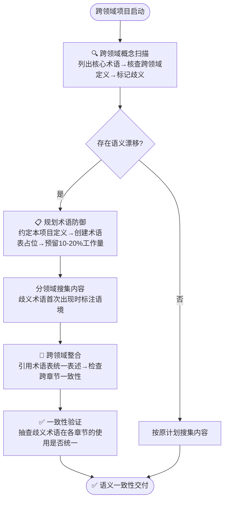

> **来源**: 从 `retrospective-first-principles-comprehensive-research-20260709` 项目提炼，基于第一性原理跨哲学/物理/商业三领域知识整合实践（术语表12个核心概念跨领域定义，占总工作量15%）

# 跨领域语义漂移防御（Cross-Domain Semantic Drift Guard）

## 模式类型

方法论模式（研究知识/跨领域整合/术语一致性）

## 成熟度

L1 实验性（1次完整跨领域项目验证，核心问题已识别，防御步骤已验证，需要更多跨领域场景验证）

## 适用场景

- 跨学科/跨领域的知识搜集与整合项目
- 涉及哲学、科学、工程、商业等不同话语体系交叉的研究
- 多源信息融合（学术论文+行业报告+媒体文章+自媒体）
- 需要建立统一术语体系的专题知识库建设

## 问题背景

### 语义漂移的隐性本质

跨领域知识整合中最大的隐性风险是**语义漂移（Semantic Drift）**：同一个术语在不同领域可能有完全不同的含义，而这种差异在你尝试整合之前是不可见的。

### 实证案例：第一性原理的三领域差异

| 领域 | 核心含义 | 典型表述 | 话语体系 |
|------|---------|---------|---------|
| 哲学 | 第一因、不证自明的公理 | "每一事物的第一原因"（亚里士多德） | 形而上学/本体论 |
| 物理学 | 不可再分的基本单元 | "基本粒子和基本相互作用"（费曼） | 还原论/实证科学 |
| 商业 | 回归基本事实，反类比 | "不做类比推理，从零开始计算"（马斯克） | 工程实践/创新方法论 |

如果在搜集阶段不察觉这种差异，到整合阶段才发现术语含义不一致，就需要：
1. 回头重新审查每个来源中术语的使用语境
2. 重新组织内容结构以区分不同含义
3. 建立术语表来统一跨领域表述
4. 修正因术语混淆导致的错误归纳

**实际成本**：在第一性原理项目中，术语表创建和语义一致性修复花费了约15%的总时间，且这项工作在初始任务分解中被完全低估。

### 为什么这是隐性问题

语义漂移具有以下特征，使其难以在早期被发现：

1. **看不见直到整合时**：当你按领域分头搜集内容时，每个领域内部的术语使用是一致的，只有当你试图跨领域连接时，矛盾才会暴露
2. **直觉假设"同一个词意思一样"**：大脑的系统1（直觉思维）会自动假设同一个词代表同一个概念，不会主动检查
3. **领域专家意识不到歧义**：在单一领域内工作久了，会觉得该术语的含义是"显然的"，不会想到其他领域有不同理解

## 核心防御机制

### 规则1：Spec阶段增加"跨领域概念扫描"步骤

在项目启动阶段（而非整合阶段），必须执行以下步骤：

```
1. 列出项目涉及的所有核心术语（通常5-15个）
2. 逐一核查每个术语在不同来源领域中的定义
3. 标记存在跨领域歧义的术语
4. 在Spec中明确约定本项目使用的是哪个领域的定义，或采用哪个综合性定义
5. 计划术语表创建任务（不要低估工作量：每个歧义术语约需30-60分钟核查）
```

### 规则2：知识架构中预留术语层

在知识档案的四层架构中，跨领域整合层（术语表）不应被视为"锦上添花"，而应视为**必要的基础设施**。在项目规划时就为术语对齐预留10-20%的工作量。

### 规则3：歧义术语显式标注

对存在跨领域歧义的术语，在首次出现时必须显式标注使用语境：

| 标注方式 | 示例 |
|---------|------|
| 领域限定 | "在物理学意义上的第一性原理"vs"在商业创新意义上的第一性原理" |
| 定义引述 | 首次使用时附上定义来源（如"亚里士多德将其定义为..."） |
| 区分表格 | 当同一术语在3+领域有不同含义时，用对比表格呈现 |

### 规则4：建立术语表作为单一事实源

术语表一旦建立，后续所有内容写作必须引用术语表中的定义，避免各章节自行解释导致新的不一致。

## 标准执行流程



## 关键量化指标

| 指标 | 本项目数据 | 建议阈值 |
|------|-----------|---------|
| 歧义术语占比 | 12个核心概念中约40%存在跨领域歧义 | 跨2+领域时预期20-50% |
| 术语对齐工作量占比 | 15% | 预留10-20% |
| 整合阶段返工率（无防御） | 高（术语问题在整合期集中暴露） | - |
| 整合阶段返工率（有防御） | 低（术语问题在Spec阶段已解决） | - |

## 反模式

| 反模式 | 后果 |
|--------|------|
| "同一个词肯定是同一个意思" | 整合阶段发现根本性矛盾，大规模返工 |
| "术语表最后再做" | 各章节使用不同定义，整合时无法统一 |
| "用上下文区分就够了" | 读者无法判断作者在哪个意义上使用术语，产生误解 |
| 只列出术语不解释差异 | 术语表形同虚设，无法指导实际写作 |

## 与其他模式的关系

- **knowledge-archive-four-layer.md**：本模式是四层架构中"跨领域整合层"的关键设计输入——语义漂移防御解释了为什么跨领域整合层必须存在且不能省略
- **adversarial-review-protocol.md**：对抗性审查中的"偏差识别"步骤应包含语义漂移检查——跨领域术语混淆是一种认知偏差（可得性启发：本领域含义最先被想到）
- **availability-heuristic-structural-guard.md**：语义漂移本质上是可得性启发的跨领域表现——大脑自动提取最熟悉的含义而忽略其他领域的不同定义
- **cross-vendor-knowledge-fusion.md**：跨Vendor知识融合是跨领域整合的特例，同样面临术语不一致问题

## 局限性与待验证

1. **仅验证1次**：目前只在第一性原理（哲学/物理/商业）项目中验证，需要在更多跨领域组合（如医学+AI、法律+技术）中验证
2. **术语扫描的完备性**：如何确保在Spec阶段不遗漏有歧义的术语？目前依赖人工判断，可能需要工具辅助
3. **领域数量影响**：跨3个领域时15%工作量，跨5+个领域时工作量如何增长？待验证
4. **与单领域项目的边界**：单领域项目是否也需要术语扫描？当单领域内存在学派分歧时（如经济学的凯恩斯vs奥地利学派），同样需要

---
*沉淀自第一性原理资料搜集项目（2026-07-09），跨哲学/物理学/商业三领域知识整合实践*
