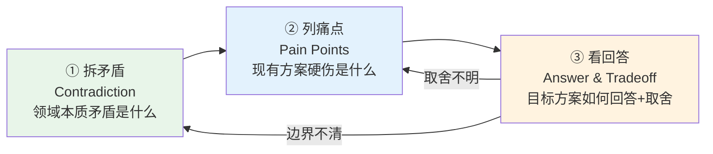

# 技术方案本质矛盾三步法（Essential Contradiction Three-Step Method）

## 模式类型
方法论模式（技术选型/方案评估/产品分析的第一性原理框架）

## 成熟度
L1 实验性（1次完整验证：WeasyPrint PDF生成方案分析）

## 问题场景

分析技术方案、做技术选型、评估开源项目、理解产品架构时，常见的认知陷阱：

1. **被宣传话术迷惑**：看官网介绍觉得"这个技术好厉害"，但不知道它真正解决什么问题、适合什么场景
2. **特性清单对比**：做技术选型时列了30个特性对比表，但看完还是不知道选哪个——特性有但做的烂等于没有
3. **从众选择**："大家都用XX所以我也用XX"，但XX是为解决别人的问题设计的，你的场景可能完全不同
4. **只见树木不见森林**：能说出这个技术有什么功能，但不知道它为什么存在、核心取舍是什么
5. **银弹思维**：觉得XX是最好的方案，看不到它的局限性和适用边界
6. **无法理解架构取舍**：觉得"这个技术为什么不支持YY功能？太蠢了"，看不到背后的权衡

这些问题的根源是：**从方案的特性出发分析而非从问题本质出发分析——你在看"它有什么"，而不是"它为什么存在、放弃了什么、解决了谁的什么痛"。**

## 核心定义

本质矛盾三步法是一套快速穿透技术宣传话术、抓住方案核心本质的第一性原理分析框架，核心隐喻是**"医生看病先看病因再看药方，而不是拿着药方对比药材清单"**——先找到这个领域的本质矛盾，再看每个方案如何回答这个矛盾、做了什么取舍。

| 对比维度 | 特性清单对比法 | 本质矛盾三步法 |
|---------|--------------|---------------|
| 分析起点 | 方案有什么特性/功能 | 领域的本质矛盾是什么 |
| 核心问题 | "谁的特性多？" | "这个矛盾现有方案怎么回答？各有什么硬伤？" |
| 评估重点 | 功能有无 | 取舍逻辑、适用场景、边界条件 |
| 产出 | 功能对比表（看完还是不知道选啥） | 本质理解+清晰选型决策 |
| 可迁移性 | 只能对比已知方案 | 能判断未来新方案的价值 |
| 对新方案的判断力 | 又出新框架了？再学一遍特性清单 | 三分钟看清楚它解决了谁的什么痛，做了什么取舍 |

## 解决方案

### 三步分析框架

### 第一步：拆矛盾——找到领域的根本矛盾

**目标**：回到问题原点，找到这个技术领域最根本的矛盾是什么——不是表面痛点，是本质层面的二元对立。

**操作清单**：
1. **清空已知方案**：暂时忘掉你知道的所有技术方案，回到这个需求最朴素的状态
2. **找二元对立**：这个领域的核心矛盾是什么？通常是两个都想要但天然冲突的目标：
   - PDF生成：HTML/CSS是屏幕连续媒体 vs PDF是分页打印媒体（语义鸿沟）
   - 前端框架：开发体验好/抽象程度高 vs 运行性能好/包体积小
   - 数据库：ACID强一致性 vs 高可用/分区容错（CAP定理本身就是矛盾）
   - 编程语言：表达力强/高级抽象 vs 执行速度快/底层控制
   - 编辑器：启动速度快/轻量 vs 功能丰富/IDE级能力
3. **验证矛盾根本性**：
   - 是不是所有方案都绕不开这个矛盾？（如果有方案完全避开了，说明你拆的不够根本）
   - 这个矛盾是不是从问题存在那天起就存在？
   - 矛盾的两端是不是确实都有价值、无法简单舍弃一端？
4. **多维度拆解**：大矛盾下可能有多个子矛盾，可以列一个矛盾矩阵（如语义鸿沟下有5个维度的差异：流模型/单位/页面元素/交互性/字体）

**关键提醒**：这一步是最难也最有价值的——找到本质矛盾就成功了一半。如果第一步错了，后面全错。

**关键产出**：1-3个最核心的本质矛盾，以及矛盾在各个维度的具体表现。

### 第二步：列痛点——现有方案各自的硬伤是什么

**目标**：列出所有主流现有方案，分析它们在解决这个本质矛盾时的硬伤和失败模式，不是"它有什么缺点"，而是"它根本上做不好什么"。

**操作清单**：
1. **列全主流方案**：不要漏掉主要玩家——商业的、开源的、老的、新的都要列
2. **分类硬伤而非列缺点**：缺点是"它做的不好"，硬伤是"它的底层架构决定了它永远做不好"：
   - 基于浏览器的PDF方案（Puppeteer）：永远需要启动几百MB的Chromium，因为它本质就是浏览器
   - 基于QtWebKit的方案（wkhtmltopdf）：CSS永远停留在2012年，因为项目停止维护了
   - 商业方案（PrinceXML）：永远要花钱，因为它是闭源商业软件
   - 纯代码方案（ReportLab）：永远无法复用HTML/CSS生态，因为它根本不解析HTML
3. **硬伤分类**：
   - 🚫 **架构级硬伤**：底层设计决定了无法解决（如Puppeteer的内存占用）
   - 💰 **商业模式硬伤**：许可证/价格限制（如PrinceXML）
   - ⚠️ **维护级硬伤**：项目停止维护/社区不活跃（如wkhtmltopdf）
   - 🧩 **生态硬伤**：无法复用现有生态/学习成本极高（如ReportLab）
4. **识别未被满足的需求**：所有现有方案都做不好的那个点，就是新方案的生存空间

**关键原则**：不要写"XX方案A特性支持不好、B特性有bug"这种可以修复的缺点，要找"它骨子里就不行"的硬伤。硬伤是架构/模式/基因决定的，不是版本更新能解决的。

**关键产出**：主流方案列表 + 每个方案的1-3个架构级硬伤。

### 第三步：看回答——目标方案如何回答矛盾、做了什么取舍

**目标**：分析目标方案对本质矛盾的回答是什么，它为了这个回答放弃了什么、接受了什么硬伤、为什么是这个答案而不是别的。

**操作清单**：
1. **看核心回答**：这个方案选择了矛盾的哪一端作为第一优先级？它如何回答这个矛盾？
   - WeasyPrint：不依赖浏览器，用Python自研面向打印的CSS引擎——选择了"部署轻量+分页控制精确"，接受了"CSS不完整+无JS"
   - Puppeteer：直接用Chromium——选择了"CSS完整+支持JS"，接受了"重+部署复杂"
   - Go语言：选择了"编译速度快+部署简单+并发好"，接受了"表达力弱+泛型支持晚"
2. **明确取舍**：它放弃了什么？哪些功能是它明确不打算支持的？为什么？
   - 不支持的功能不是"还没做"，而是"为了核心目标主动放弃的"——理解这一点你就理解了架构师的思考
3. **验证逻辑自洽**：它的取舍是否一致？
   - 如果它说自己是轻量方案但打包了Chromium，那就是自相矛盾的营销话术
   - 如果它放弃JS支持但目标是服务端PDF生成，那逻辑是自洽的（服务端PDF本来就不需要JS）
4. **判断适用边界**：
   - 什么场景下这个选择是对的？（WeasyPrint适合服务端批量生成报表/发票）
   - 什么场景下这个选择是错的？（WeasyPrint不适合需要JS渲染的SPA页面）
5. **反推核心价值**：当别人问"这个方案有什么优势？"，你能一句话说清楚它的核心价值是"在XX场景下，它因为选择了YY，所以比其他方案更好地解决了ZZ问题"。

**关键提醒**：没有银弹——所有方案都是取舍。**理解一个方案的边界（它不做什么）比理解它能做什么更重要。** 好的方案不是什么都能做，而是把它选择做的那件事做到极致。

**关键产出**：方案的核心选择、明确的取舍清单、适用场景和不适用场景。

### 辅助判断：方案成熟度快速识别

| 信号 | 说明 | 判断 |
|------|------|------|
| 它的首页第一句就说清楚了它解决什么问题、放弃什么 | 沟通清晰，知道自己是谁 | ✅ 大概率是思考清楚的方案 |
| 它说自己"高性能、易使用、功能全、轻量级"（所有好词都占了） | 典型的营销话术，没有明确取舍 | ❌ 大概率是没有想清楚本质的方案 |
| 它明确列了"不支持什么"、"适用场景"、"不适用场景" | 诚实，知道自己的边界 | ✅ 大概率是靠谱的方案 |
| 它说自己是"XX的替代品"、"比XX快10倍"但没说放弃了什么 | 只讲优势不讲代价 | ⚠️ 需要深入看它的硬伤 |
| 它已经存在5年以上，有稳定的维护者和清晰的定位 | 经过时间检验 | ✅ 风险低 |
| 它上个月刚发布，说要"颠覆XX" | 新方案，需要观察 | ⚠️ 别做第一批小白鼠 |

## 本案例验证（WeasyPrint PDF生成分析）

| 步骤 | 分析结果 |
|------|---------|
| **① 拆矛盾** | PDF生成本质矛盾：HTML/CSS是为**屏幕连续滚动媒体**设计的，PDF是为**分页打印媒体**设计的，两者存在5个维度的根本语义鸿沟（流模型/单位/页眉页脚/交互/字体） |
| **② 列痛点** | 5个主流方案各有硬伤： - wkhtmltopdf：CSS停留在2012年，停止维护🚫 - Puppeteer：需要300MB Chromium，内存200-500MB，部署复杂🚫 - ReportLab：纯代码绘制，无法复用HTML/CSS生态🧩 - xhtml2pdf：CSS支持极差，bug多🚫 - PrinceXML：数千美元/年许可证💰 |
| **③ 看回答** | WeasyPrint的回答：**不依赖浏览器，用Python自研面向打印的CSS布局引擎直接输出PDF** 取舍：放弃JS执行、放弃完整CSS支持，换取无浏览器依赖、分页媒体原生支持、Python原生、部署轻量 适用场景：服务端批量生成报表/发票/票据（内容在服务端渲染，无需JS，需要精确分页） 不适用场景：需要JS动态渲染的SPA页面、复杂CSS动画/交互页面 |
| **结论** | WeasyPrint不是"最好的PDF方案"，但它在"服务端静态HTML批量生成高质量PDF"这个场景下是最佳选择，因为它的取舍完美匹配这个场景的需求——你不需要JS（内容服务端生成好了），你需要精确分页控制（CSS Paged Media原生支持），你需要部署简单（pip install就行）。 |

## 反模式

| 反模式 | 表现 | 后果 | 规避方法 |
|--------|------|------|---------|
| **特性清单式对比** | 列30个特性打勾打叉，最后选勾多的 | 选了个特性全但核心场景做不好的方案 | 先找本质矛盾，特性只是回答矛盾的手段，不是目的 |
| **银弹思维** | "XX是最好的YY方案" | 在不适用的场景用错技术，踩大坑 | 永远问"它放弃了什么？不适合什么场景？"——没有不放弃东西的好方案 |
| **从自身经验出发** | "我一直用XX，所以XX最好" | 路径依赖，看不到更好的方案 | 清空已知方案再拆矛盾，先看问题再看方案 |
| **只看优点不看硬伤** | 官网说什么信什么，被营销话术打动 | 踩了架构级硬伤的坑，无法解决只能换技术栈 | 主动找"它做不好什么"、"为什么别人不这么做" |
| **把当务之急当成本质矛盾** | "我现在最痛的是配置麻烦"，以为这就是本质 | 找错了矛盾，分析了半天都是表面问题 | 问"十年后这个矛盾还存在吗？"——本质矛盾是长期存在的，配置麻烦是可以改进的 |
| **一刀切否定/肯定** | "Python写的性能肯定差"、"Google做的肯定好" | 刻板印象，不看具体取舍 | 每个方案单独分析它的回答和取舍，没有绝对的好坏只有适合不适合 |

## 实施检查清单

### 第一步：拆矛盾
- [ ] 是否暂时忘掉了所有已知方案回到问题原点？
- [ ] 是否找到了1-3个根本的二元对立矛盾？
- [ ] 是不是所有方案都绕不开这个矛盾？（验证根本性）
- [ ] 是否拆解了矛盾在多个维度的具体表现？

### 第二步：列痛点
- [ ] 是否列全了主流现有方案（开源/商业/老/新）？
- [ ] 是否区分了"可修复的缺点"和"架构级硬伤"？
- [ ] 每个硬伤是不是底层架构/模式/商业模式决定的，不是版本更新能解决的？
- [ ] 是否识别出了所有方案都做不好的那个空白点？

### 第三步：看回答
- [ ] 目标方案优先选择了矛盾的哪一端？
- [ ] 它明确放弃了什么？哪些功能是主动不支持的？
- [ ] 它的取舍在目标场景下是否逻辑自洽？
- [ ] 是否明确了适用场景和不适用场景？
- [ ] 能不能一句话说清它的核心价值和适用边界？

## 适用场景

- ✅ **技术选型**：多个技术方案选哪个？（PDF生成、前端框架、数据库、消息队列等）
- ✅ **开源项目评估**：这个开源项目值不值得引入？解决了什么问题？坑在哪？
- ✅ **理解复杂架构**：为什么这么设计？为什么不那么设计？背后的权衡是什么？
- ✅ **竞品分析**：竞品为什么这么做？它放弃了什么？我们的差异化机会在哪？
- ✅ **技术文章/教程写作**：给别人讲清楚一个技术"为什么是这样"
- ✅ **自己做架构决策**：设计一个新系统/框架时，想清楚核心取舍是什么

- ❌ 非常成熟、有明确标准答案的领域（如"JSON解析用什么库"这种不需要分析）
- ❌ 纯业务逻辑实现（业务逻辑的"矛盾"通常是需求问题，不是技术架构矛盾）
- ❌ 个人玩具项目/原型验证（快速用就行，不用过度分析）

## 与其他模式的关系

- [first-principles-feature-analysis.md](first-principles-feature-analysis.md)：同为第一性原理分析框架，本方法聚焦技术方案/选型，功能分析法聚焦产品功能定义；两者可以组合使用
- [first-principles-decision-quality-gate.md](../governance-strategy/first-principles-decision-quality-gate.md)：第一性原理决策质量门；本方法是技术决策阶段的具体分析工具
- [trilemma-architectural-resolution.md](../governance-strategy/trilemma-architectural-resolution.md)：三难困境架构解决模式；本质矛盾通常表现为三难选择（三个目标最多选两个），本方法可以用于识别和分析三难困境
- [external-article-deep-analysis-methodology.md](external-article-deep-analysis-methodology.md)：外部文章深度分析方法；分析技术类文章时，本方法提供了"穿透话术抓本质"的分析视角
