> **来源**：MaineCoon 实时音视频基础模型文章分析任务复盘（2026-07-06）——对微信公众号文章《MaineCoon:实时音视频基础模型》（介绍 catnip.ai 的 22B 实时音视频模型）执行深度分析，产出 14 章节 25KB 报告 + 8 项 Requirements + 8 Task（全部完成）
> **验证次数**：1 次（MaineCoon 文章分析任务实战验证，认知框架源自 4 次端到端工作流验证案例的认知提炼，但作为独立认知方法论首次系统化沉淀）

# 外部文章深度分析方法论（六步法）

## 模式类型

方法论模式（外部研究/认知分析/知识萃取）

## 成熟度

L1 实验性（1 次作为独立认知方法论的系统化沉淀，待第 2 次验证后升级 L2）

> **与端到端工作流模式的关系说明**：本模式的认知框架源自 [external-article-deep-analysis-workflow.md](external-article-deep-analysis-workflow.md) 中 4 次验证案例（mattpocock/agent-reach/codex/mainecoon）的 14 章节报告内容组织逻辑。工作流模式聚焦"如何编排执行"（4 阶段：defuddle→spec→子智能体→Grep 验证），本模式聚焦"如何思考分析"（6 步认知法：提取→观点→逻辑→知识→可靠性→批判），两者互补不重复。

## 适用场景

| 场景 | 是否适用 | 说明 |
|------|---------|------|
| 外部技术文章深度分析 | ✅ 核心场景 | MaineCoon 案例即属此类，22B 实时音视频模型技术文章 |
| 产品竞品文章研究 | ✅ 核心场景 | 需要提炼竞品定位、技术参数、市场策略 |
| 行业趋势文章洞察 | ✅ 核心场景 | 需要评估趋势可靠性、提炼可借鉴方向 |
| 创始人/团队访谈文章分析 | ✅ 核心场景 | 需要提取团队认知、产品哲学、决策逻辑 |
| 简单摘要/一句话总结 | ❌ 不适用 | 杀鸡用牛刀，直接读取即可 |
| 多源信息整合的竞品分析 | ⚠️ 部分适用 | 应结合 [external-website-analysis-fallback-strategy.md](external-website-analysis-fallback-strategy.md) 的多源兜底 |
| 纯代码/内部文档分析 | ❌ 不适用 | 无需可靠性评估与外部信息源验证 |

## 问题背景

外部文章深度分析任务中，常见的认知偏差与执行漏洞：

1. **摘要即分析**：只做内容摘要而不提炼主论点与论证逻辑，把"复述"当成"分析"
2. **全盘接受**：不评估信息来源可靠性、数据可信度、时效性，把文章所有内容当成既定事实
3. **批判缺失**：只复述优点而不识别局限性、不提改进建议，缺少批判性思考
4. **萃取断层**：提取了知识点但不与自有体系对照，知识无法迁移复用
5. **结构散乱**：六个分析维度（内容/观点/逻辑/知识/可靠性/批判）混在一起，读者无法按维度查阅

本模式通过定义六步认知分析法，确保每篇外部文章都能被深度消化为可复用的认知资产，且每个维度有明确的产出物和质量门。

## 核心规则

**外部文章深度分析必须按六步认知法顺序执行，每步有明确的输入、输出和质量门。六步之间是递进关系：前步是后步的基础，跳过任何一步都会导致分析断层。**

```
步骤 1: 内容提取 → 步骤 2: 观点提炼 → 步骤 3: 逻辑分析
                                              ↓
步骤 6: 批判性思考 ← 步骤 5: 可靠性评估 ← 步骤 4: 知识萃取
```

**关键约束**：
- 步骤 1 必须使用工具提取全文 Markdown，不能仅凭阅读记忆
- 步骤 2-3 必须区分"作者说的"（观点）和"作者怎么论证的"（逻辑），两者不能混为一谈
- 步骤 4 必须结构化提取知识点（场景/指标/框架/团队等），形成知识表格
- 步骤 5 必须评估信息来源可靠性、数据可信度、时效性、专业性四个维度
- 步骤 6 必须包含优点/局限性/改进建议各 ≥4 项，并与自有体系对照分析

## 六步认知法详解

### 步骤 1：内容提取

**输入**：外部文章 URL（微信/博客/教程）
**输出**：全文 Markdown 文件 + 章节结构识别 + 关键信息预提取

**执行要点**：
1. 使用 defuddle 等工具提取全文 Markdown，清理导航噪声、广告、推荐阅读等非核心内容
2. 识别文章章节结构（如 `#01`、`#02` 等标题层级），形成章节大纲
3. 预提取关键信息：团队信息、技术参数、引用链接、数据指标

**质量门**：
- [ ] 全文 Markdown 已提取且非空
- [ ] 章节结构已识别（章节标题清单）
- [ ] 关键信息（团队/参数/链接/数据）已预提取

**引用模式**：
- [defuddle-web-extraction-preferred.md](../tools-automation/defuddle-web-extraction-preferred.md)：defuddle 工具选择与四步预检查法
- [external-website-analysis-fallback-strategy.md](external-website-analysis-fallback-strategy.md)：当 defuddle 提取受阻时的四层信息源分层兜底

### 步骤 2：观点提炼

**输入**：全文 Markdown + 章节结构
**输出**：主论点（1 句话）+ 支撑论点（通常 3-7 个）

**执行要点**：
1. **识别主论点**：用一句话概括文章核心主张（"作者想让你记住的最重要的一件事"）
2. **提取支撑论点**：识别围绕主论点展开的支撑性论点，每个论点用 1-2 句话表述
3. **区分论点与论据**：论点是主张，论据是支撑主张的事实/数据/案例，本步只关注论点

**质量门**：
- [ ] 主论点已用一句话表述
- [ ] 支撑论点已列出（通常 ≥3 个）
- [ ] 论点与论据已区分

**MaineCoon 案例示例**：
- 主论点：MaineCoon 通过架构级重新设计，在实时音视频基础模型领域实现了成本/速度/时长的三角困境突破
- 支撑论点 1：训练框架从第一天就为实时音视频场景设计，而非通用模型改造
- 支撑论点 2：推理部署针对流式场景优化，47.5 FPS 满足实时交互
- 支撑论点 3：成本降至 Seedance 2.0 的 1/500，使大规模部署可行

### 步骤 3：逻辑分析

**输入**：主论点 + 支撑论点
**输出**：论证结构图 + 论证质量评估

**执行要点**：
1. **梳理论证结构**：识别文章的论证展开逻辑（常见模式：引入→场景→对比→技术→展望，或问题→方案→验证→展望）
2. **评估论据充分性**：每个支撑论点是否有充分的数据/案例/对比支撑？
3. **识别逻辑跳跃点**：哪些论点缺乏论据？哪些推理从 A 到 B 缺少中间步骤？
4. **检查反例考虑**：作者是否考虑了反例、边界情况、局限性？还是只呈现支持性证据？

**质量门**：
- [ ] 论证结构图已绘制（可用 Mermaid flowchart 表达）
- [ ] 每个支撑论点的论据充分性已评估
- [ ] 逻辑跳跃点已识别
- [ ] 反例考虑情况已评估

**MaineCoon 案例论证结构示例**：
```
引入：实时音视频基础模型的挑战（成本/速度/时长三角困境）
  ↓
场景：直播/语音通话/实时交互的应用需求
  ↓
对比：与 Seedance 2.0 等前代模型的成本/FPS/时长对比
  ↓
技术：训练框架/模型架构/推理部署的架构级重新设计
  ↓
展望：从实时音视频到社交世界模型的演进路径
```

### 步骤 4：知识萃取

**输入**：全文 Markdown + 主论点 + 支撑论点
**输出**：结构化知识表格（按维度组织）

**执行要点**：
按以下维度结构化提取关键知识点，形成知识表格：

| 知识维度 | 提取内容 | MaineCoon 案例示例 |
|---------|---------|-------------------|
| **场景** | 目标应用场景、用户痛点、市场需求 | 直播、语音通话、实时交互；延迟敏感场景 |
| **指标** | 核心技术指标、性能数据、对比基准 | 47.5 FPS、成本 1/500、30 分钟+稳定生成、22B 参数 |
| **框架** | 方法论框架、架构设计思路、决策模型 | "第一天就奔着目标场景设计"、训练-架构-部署三层协同 |
| **定位** | 产品定位、市场定位、竞争定位 | 实时音视频基础模型、社交世界模型、成本突破者 |
| **团队** | 团队背景、成员信息、公司信息 | catnip.ai、团队规模、融资阶段 |
| **引用** | 引用的论文、数据源、参考文献 | Seedance 2.0 对比数据来源、相关论文引用 |

**质量门**：
- [ ] 六个维度的知识表格已填写
- [ ] 每个知识点标注了来源（文章第几章节）
- [ ] 数据类知识点已 Grep 验证（与原文比对）

**引用模式**：
- [three-tier-knowledge-sedimentation.md](../retrospective-knowledge/three-tier-knowledge-sedimentation.md)：知识萃取后的三层沉淀（洞察原文→专题报告→README 条目）

### 步骤 5：可靠性评估

**输入**：知识表格 + 全文 Markdown
**输出**：可靠性评估报告（四维度评级）

**执行要点**：
从四个维度评估信息来源可靠性：

| 评估维度 | 评估问题 | 评级标准 |
|---------|---------|---------|
| **信息来源可靠性** | 数据来自一手还是二手？官方还是第三方？ | ★★★★★ 官方一手 / ★★★☆☆ 官方转载 / ★★☆☆☆ 第三方 |
| **数据可信度** | 数据是否有引用源？是否可验证？是否与已知数据一致？ | ★★★★★ 有引用+可验证 / ★★★☆☆ 有引用但不可验证 / ★☆☆☆☆ 无引用 |
| **时效性** | 数据是否最新？是否有过时风险？技术成熟度处于什么阶段？ | ★★★★★ 近期+成熟 / ★★★☆☆ 近期+早期 / ★★☆☆☆ 时间不明 |
| **专业性** | 术语使用是否准确？技术深度是否足够？对比是否公允？ | ★★★★★ 术语准确+深度足+对比公允 / ★★☆☆☆ 术语模糊或对比偏颇 |

**质量门**：
- [ ] 四维度评级已完成
- [ ] 待验证项已明确列出（如"成本 1/500 数据来源未在文中明确"）
- [ ] 局限性已识别（如"中文支持不足""暂不支持某功能"）

**引用模式**：
- [triangular-source-verification.md](../retrospective-knowledge/triangular-source-verification.md)：三角验证法确保关键数据准确性
- [small-sample-analysis-methodology.md](small-sample-analysis-methodology.md)：当样本量 <5 时执行降级策略

### 步骤 6：批判性思考

**输入**：前五步产出 + 自有知识体系
**输出**：批判性分析报告（优点/局限/改进/对照）

**执行要点**：
1. **识别优点**（≥4 项）：文章哪些方面做得好？哪些观点有价值？哪些数据有说服力？
2. **识别局限性**（≥4 项）：文章哪些方面不足？哪些论据薄弱？哪些视角缺失？
3. **提出改进建议**（≥4 项）：如果重写这篇文章，你会如何改进？补充什么数据？增加什么视角？
4. **与自有体系对照**：文章哪些方法论可借鉴到自己的项目/体系？哪些与现有认知冲突？哪些需要进一步验证？

**质量门**：
- [ ] 优点 ≥4 项
- [ ] 局限性 ≥4 项
- [ ] 改进建议 ≥4 项
- [ ] 与自有体系对照分析已完成（可借鉴方法论 ≥3 条）

**MaineCoon 案例批判性思考示例**：
- **优点**：架构级突破思路清晰、量化对比数据充分、诚实承认局限性（增强可信度）、应用场景具体
- **局限性**：中文支持不足、暂不支持实时双向语音、模型还在早期、成本数据来源未明
- **改进建议**：补充成本数据来源、增加与海外模型对比、补充失败案例、增加技术细节深度
- **可借鉴方法论**：三角困境→架构级解决框架（已萃取为独立模式）、诚实承认局限性信任构建策略（已萃取为独立模式）、场景驱动参数取舍

## 完整流程图

```mermaid
flowchart TD
    A["外部文章 URL"] --> B["步骤 1: 内容提取"]
    B --> B1["defuddle 提取全文 Markdown"]
    B1 --> B2["识别章节结构"]
    B2 --> B3["预提取关键信息"]
    B3 --> Q1{"质量门 1:<br/>全文+章节+关键信息?"}
    Q1 -->|"否"| B1
    Q1 -->|"是"| C["步骤 2: 观点提炼"]
    C --> C1["识别主论点（一句话）"]
    C1 --> C2["提取支撑论点（≥3 个）"]
    C2 --> C3["区分论点与论据"]
    C3 --> Q2{"质量门 2:<br/>主论点+支撑论点?"}
    Q2 -->|"否"| C1
    Q2 -->|"是"| D["步骤 3: 逻辑分析"]
    D --> D1["梳理论证结构"]
    D1 --> D2["评估论据充分性"]
    D2 --> D3["识别逻辑跳跃点"]
    D3 --> D4["检查反例考虑"]
    D4 --> Q3{"质量门 3:<br/>结构图+质量评估?"}
    Q3 -->|"否"| D1
    Q3 -->|"是"| E["步骤 4: 知识萃取"]
    E --> E1["按六维度提取知识"]
    E1 --> E2["形成结构化知识表格"]
    E2 --> E3["标注来源+Grep 验证"]
    E3 --> Q4{"质量门 4:<br/>六维度知识表格?"}
    Q4 -->|"否"| E1
    Q4 -->|"是"| F["步骤 5: 可靠性评估"]
    F --> F1["评估来源可靠性"]
    F1 --> F2["评估数据可信度"]
    F2 --> F3["评估时效性"]
    F3 --> F4["评估专业性"]
    F4 --> F5["列出待验证项+局限性"]
    F5 --> Q5{"质量门 5:<br/>四维度评级?"}
    Q5 -->|"否"| F1
    Q5 -->|"是"| G["步骤 6: 批判性思考"]
    G --> G1["识别优点（≥4）"]
    G1 --> G2["识别局限性（≥4）"]
    G2 --> G3["提出改进建议（≥4）"]
    G3 --> G4["与自有体系对照"]
    G4 --> Q6{"质量门 6:<br/>优点+局限+改进+对照?"}
    Q6 -->|"否"| G1
    Q6 -->|"是"| H["✅ 深度分析完成<br/>产出可复用认知资产"]
    style A fill:#ffcccc
    style H fill:#ccffcc
```



## 验证案例：MaineCoon 文章分析（2026-07-06）

### 任务背景
- **分析对象**：微信公众号文章《MaineCoon:实时音视频基础模型》（介绍 catnip.ai 的 22B 实时音视频模型）
- **执行方式**：通过 [external-article-deep-analysis-workflow.md](external-article-deep-analysis-workflow.md) 端到端工作流编排，委派单一子智能体执行
- **产出**：analysis-report.md（25KB，14 章节）、spec.md（8 项 Requirements）、tasks.md（8 Task / 44 SubTask）

### 六步法实际执行映射

| 步骤 | 对应报告章节 | 实际产出 |
|------|------------|---------|
| 步骤 1：内容提取 | 第 1 章 文章基本信息 | defuddle 提取全文，识别 14 个章节标题，提取团队/参数/链接 |
| 步骤 2：观点提炼 | 第 2 章 核心观点提炼 | 主论点 1 句 + 支撑论点 5 个 |
| 步骤 3：逻辑分析 | 第 3 章 论证逻辑分析 | 论证结构图（引入→场景→对比→技术→展望）+ 论证质量评估 |
| 步骤 4：知识萃取 | 第 6 章 关键知识点萃取 | 六维度知识表格（场景/指标/框架/定位/团队/引用） |
| 步骤 5：可靠性评估 | 第 10-12 章 可靠性/时效性/专业性 | 四维度评级 + 待验证项清单 |
| 步骤 6：批判性思考 | 第 13-14 章 批判性思考+与 SpecWeave 关联 | 优点 6 项 + 局限 7 项 + 改进 7 项 + 方法论 5 项 |

### 验证结果
- 8 Task / 44 SubTask 全部完成
- Grep 数据验证：104 处关键数据匹配，0 处 `file:///` 绝对路径
- 14 章节结构齐全（含总结与展望 + 附录）
- 批判性思考超额完成（spec 最低要求 ≥4，实际产出 6/7/7/5）
- 萃取 2 个独立模式：三角困境→架构级解决框架、诚实承认局限性信任构建策略

### 模式萃取副产品
本次六步法执行的第 6 步（批判性思考）直接产出 2 个可复用模式：
- [trilemma-architectural-resolution.md](../governance-strategy/trilemma-architectural-resolution.md)：三角困境→架构级解决框架
- [honest-limitation-acknowledgment.md](../ai-collaboration/honest-limitation-acknowledgment.md)：诚实承认局限性信任构建策略

## 反模式与注意事项

### 绝对禁止的反模式

| 反模式 | 为什么错误 | 正确做法 |
|--------|----------|---------|
| **只做摘要不做分析** | 摘要是复述，分析是提炼；摘要无法形成可复用认知 | 必须执行六步法，至少完成观点提炼+批判性思考 |
| **跳过可靠性评估** | 全盘接受文章内容会导致错误信息被沉淀为知识 | 步骤 5 必须评估四维度，列出待验证项 |
| **批判性思考只说优点** | 单向肯定无法识别文章局限性，也无法提炼改进方向 | 优点/局限/改进建议各 ≥4 项 |
| **不与自有体系对照** | 知识不对照就无法迁移复用，萃取变成信息堆砌 | 步骤 6 必须包含"与自有体系对照"小节 |
| **仅凭阅读记忆分析** | 记忆有遗漏和偏差，无法 Grep 验证 | 步骤 1 必须使用工具提取全文 Markdown |
| **六步混在一起写** | 读者无法按维度查阅，质量门无法分步检查 | 六步分别产出，每步有独立章节 |

### 注意事项

1. **六步法是认知框架，不是文档结构**：六步法的产出可以合并到一份报告中，但认知过程必须分步执行
2. **与端到端工作流的关系**：六步法是 [external-article-deep-analysis-workflow.md](external-article-deep-analysis-workflow.md) 阶段 3（子智能体执行）的认知框架，工作流模式负责编排执行，六步法负责指导思考
3. **批判性思考的超额完成策略**：在 spec 中设置最低要求（如"优点≥4项"），子智能体通常会超额完成（实测：优点 6/局限 7/改进 7/方法论 5）
4. **知识萃取的维度可扩展**：六维度（场景/指标/框架/定位/团队/引用）是默认集，特定文章可扩展（如"商业模式""技术栈""竞品"等维度）

## 与其他模式的关系

| 关联模式 | 关系类型 | 关系说明 |
|---------|---------|---------|
| [external-article-deep-analysis-workflow.md](external-article-deep-analysis-workflow.md) | **执行编排互补** | 工作流模式聚焦"如何编排执行"（4 阶段），本模式聚焦"如何思考分析"（6 步认知法），两者共同构成外部文章深度分析的完整方法论 |
| [external-website-analysis-fallback-strategy.md](external-website-analysis-fallback-strategy.md) | **步骤 1 实现支撑** | 当 defuddle 提取受阻时，提供四层信息源分层兜底策略 |
| [small-sample-analysis-methodology.md](small-sample-analysis-methodology.md) | **步骤 5 实现支撑** | 当样本量 <5 时，提供小样本分析降级策略 |
| [three-tier-knowledge-sedimentation.md](../retrospective-knowledge/three-tier-knowledge-sedimentation.md) | **步骤 4 下游沉淀** | 知识萃取后，通过三层沉淀体系（洞察原文→专题报告→README 条目）形成可复用知识资产 |
| [triangular-source-verification.md](../retrospective-knowledge/triangular-source-verification.md) | **步骤 5 实现支撑** | 提供三角验证法确保关键数据准确性 |
| [defuddle-web-extraction-preferred.md](../tools-automation/defuddle-web-extraction-preferred.md) | **步骤 1 工具选择** | defuddle 工具选择规则与四步预检查法 |
| [trilemma-architectural-resolution.md](../governance-strategy/trilemma-architectural-resolution.md) | **步骤 6 萃取产物** | MaineCoon 案例批判性思考环节萃取的独立模式 |
| [honest-limitation-acknowledgment.md](../ai-collaboration/honest-limitation-acknowledgment.md) | **步骤 6 萃取产物** | MaineCoon 案例批判性思考环节萃取的独立模式 |

## 模式演进方向

当前版本为 L1 实验性（1 次作为独立认知方法论的系统化沉淀），后续可在以下方向迭代：

1. **跨场景验证（L1→L2 路径）**：在更多类型的外部文章分析中验证六步法（如纯技术论文、产品发布文章、行业报告），积累至少 1 次复用案例以满足 L2 标准
2. **六步法与 14 章节报告结构的映射关系深化**：当前映射基于 MaineCoon 单一案例，需在更多案例中验证映射的普适性
3. **六步法工具化**：开发"六步法质量门检查脚本"，自动验证每步产出是否达标
4. **六步法与批判性思考超额完成策略的联动**：将"设置最低要求触发超额完成"的策略系统化，形成独立子模式
5. **知识萃取维度扩展**：在不同领域的文章中验证六维度的适用性，必要时扩展维度集

## Changelog

<!-- changelog -->
- 2026-07-06 | create | 初始 L1 版本，基于 MaineCoon 文章分析任务（2026-07-06）萃取六步认知分析法，与 [external-article-deep-analysis-workflow.md](external-article-deep-analysis-workflow.md) 端到端工作流互补
