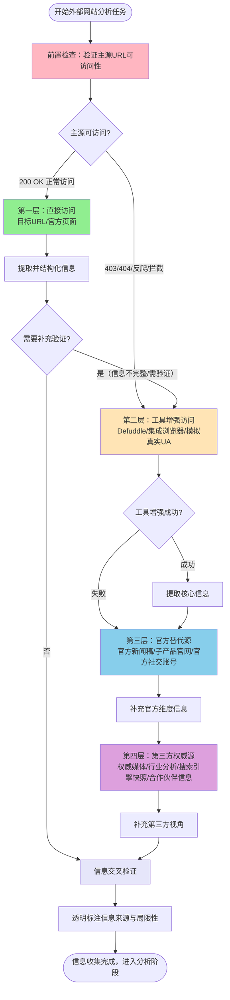
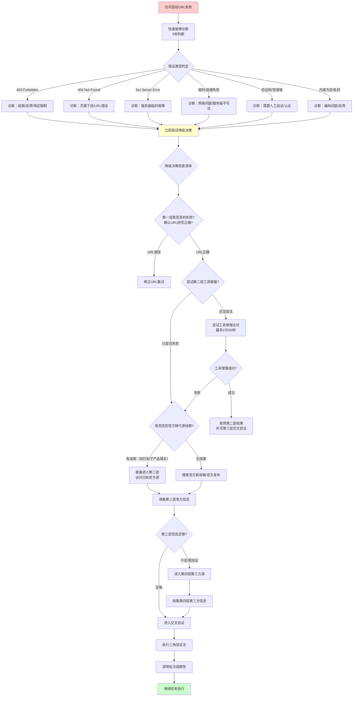

> **来源**：贝锐（Oray）AI产品矩阵分析任务复盘（2026-07-04）——在目标URL https://gf-oray.com.cn/#ai 返回403 Forbidden的情况下，通过四层信息源兜底策略成功完成1309行深度分析报告
> **来源2**：知乎 637007780 分析任务复盘（2026-07-06）——在知乎 40362 反爬机制 + JS challenge + 登录墙三重限制下，通过 agent-browser + 反自动化 flag + 桌面 UA 突破，获取 3/23 条回答完成三层分析
> **三次验证**：火山引擎Viking AI搜索推荐产品学习复盘（2026-07-06）——defuddle返回exit code 126无法提取内容时，在工具增强层内切换为WebFetch成功提取，验证了"工具间降级"也是分层策略的一部分
> **四次验证**：火山引擎豆包搜索（SearchInfinity）产品学习复盘（2026-07-06）——WebFetch对SPA页面提取内容重复截断，切换到integrated_browser MCP工具成功提取完整内容（含10个CTA按钮细节），验证了"云厂商SPA预判策略"
> **五次验证**：火山引擎AI云原生沙箱学习复盘（2026-07-06）——`/solutions/`路径页面（此前验证的是`/product/`路径）WebFetch内容重复→defuddle exit 126→子代理+浏览器工具成功，确认预判规则在solutions路径同样生效
> **六次验证**：火山引擎双产品学习复盘（2026-07-07）——两个控制台URL（arkcli和rewardPlan）包含console.volcengine.com和/openManagement/路径，预判为登录墙页面，直接切换到www.volcengine.com/docs/公开文档站获取完整内容
> **七次验证**：火山引擎方舟大模型平台入门文档学习（2026-07-07）——URL为console.volcengine.com/ark/region:cn-beijing/docs/...（控制台内/docs/路径），WebFetch一次性成功提取完整内容（213行结构化内容），验证了/docs/文档页路径预判规则：文档页服务端渲染，WebFetch可直接成功
> **八次验证**：火山引擎HiAgent一站式数字员工派遣站产品学习（2026-07-07）——WebFetch超时→defuddle exit 126→预判SPA页面直接切换integrated_browser，通过navigate→wait→scroll→evaluate(innerText)四步标准流程成功提取完整内容，验证了"浏览器MCP文本提取SOP"的可靠性
> **九次验证**：火山引擎ACEP云手机产品学习（2026-07-07）——WebFetch初始获取内容重复且不全（架构图、客户案例缺失），按预判规则切换至integrated_browser，通过navigate→wait→evaluate(innerText)成功提取完整页面内容，支撑产出1076行/12章结构化学习笔记（含3章UX专项分析），再次验证了云厂商/product/路径SPA预判规则的有效性
> **验证次数**：9次（贝锐403场景 + 知乎反爬突破场景 + Viking工具降级场景 + SearchInfinity SPA product路径场景 + Sandbox SPA solutions路径场景 + 控制台登录预判场景 + 控制台/docs/文档页WebFetch直接成功场景 + HiAgent双工具失败后浏览器SOP成功场景 + ACEP云手机WebFetch失败后浏览器切换成功场景）

# 外部网站分析的信息源分层兜底策略

## 模式类型
方法论模式（外部研究与信息获取）

## 成熟度
L2 已验证（9次成功实战验证：贝锐AI产品矩阵403 Forbidden场景 + 知乎40362反爬突破场景 + 火山引擎Viking产品defuddle兼容性问题场景 + 火山引擎SearchInfinity SPA动态渲染product路径场景 + 火山引擎Sandbox SPA动态渲染solutions路径场景 + 火山引擎双产品控制台登录预判场景 + 火山引擎Ark控制台/docs/文档页WebFetch直接成功场景 + 火山引擎HiAgent双工具失败后浏览器SOP成功场景 + 火山引擎ACEP云手机WebFetch失败后浏览器切换成功场景）

## 适用场景

| 场景 | 是否适用 | 说明 |
|------|---------|------|
| 外部产品/竞品分析 | ✅ 核心场景 | 本次贝锐AI产品矩阵分析即属此类 |
| 行业研究/趋势分析 | ✅ 核心场景 | 目标网站/报告页面不可访问时 |
| 发布会/新品报道分析 | ✅ 核心场景 | 官方发布会页面常有权限或地区限制 |
| 开源项目技术调研 | ⚠️ 部分适用 | GitHub一般可访问，但文档站点可能有问题 |
| 内部文档分析 | ❌ 不适用 | 内部信息源不涉及外部访问障碍 |

## 问题背景

外部网站分析任务中，主信息源（目标URL）不可访问是高频风险：
- **403 Forbidden**：网站设置了访问权限、反爬机制、地区限制
- **404 Not Found**：页面已下线或URL变更
- **5xx错误**：服务器暂时不可用
- **反爬拦截**：需要验证码、JS渲染、Cookie验证
- **登录墙**：内容需要登录后才能查看
- **内容加载不完整**：动态渲染内容无法通过简单HTTP请求获取

遇到这些问题时，执行者常犯的错误：
1. **阻塞停滞**：反复尝试访问同一个URL，卡在"无法访问"状态
2. **无序搜索**：直接用搜索引擎找零散信息，信息质量参差不齐
3. **放弃任务**：认为主源不可用就无法完成分析
4. **隐瞒缺口**：不披露信息来源局限性，影响报告可信度

本模式通过建立分层兜底策略，确保在信息获取受阻时能够快速、有序、高质量地完成研究任务。

---

## 四层信息源分层模型

### 模型总览



### 四层详细说明

| 层级 | 信息源类型 | 具体内容 | 可信度评级 | 获取难度 | 失效信号 | 降级触发条件 |
|------|-----------|---------|-----------|---------|---------|-------------|
| **第一层：直接访问** | 目标URL官方页面 | 官方发布会页面、产品官网首页、官方文档中心、官方专题页 | ★★★★★ 最高 | 低（直接HTTP请求） | 返回403/404/5xx、空内容、反爬验证页 | 任何HTTP错误状态码、内容长度异常（<1KB）、检测到验证码/登录墙 |
| **第二层：工具增强访问** | 通过工具模拟真实浏览器访问 | Defuddle提取、集成浏览器渲染、设置真实User-Agent、携带Cookie、JavaScript渲染 | ★★★★☆ 高 | 中（需调用专用工具） | 工具执行超时、仍返回错误页面、内容被JS反爬拦截 | 工具增强尝试2次失败、执行时间>30秒、检测到Cloudflare/人机验证 |
| **第三层：官方替代源** | 官方渠道发布的替代内容 | 官方新闻稿、官方微信/微博公众号、官方博客、子产品官网、帮助文档、官方视频发布、官方社区论坛 | ★★★★☆ 高 | 中（需搜索定位） | 未找到官方发布、官方发布时间过早、内容过于简略 | 第二层失败后立即启动；即使第二层成功，也应补充此层用于交叉验证 |
| **第四层：第三方权威源** | 权威第三方发布的相关内容 | 权威科技媒体报道（36氪、钛媒体、搜狐科技等）、行业分析报告、券商研报、官方合作伙伴新闻、KOL深度解读、搜索引擎快照/缓存（archive.org / Google Cache，⚠️ 沙箱环境不可达，降级为末选） | ★★★☆☆ 中 | 高（需筛选鉴别） | 来源不可靠、内容同质化、与官方信息矛盾 | 第三层信息仍不完整、需要第三方视角验证、需要补充市场反应/行业对比 |

### 各层具体操作指南

#### 第一层：直接访问
- **操作**：直接使用WebFetch/defuddle访问目标URL
- **快速验证**：检查HTTP状态码、内容长度、是否包含核心关键词
- **成功判定**：状态码200 + 内容长度>5KB + 包含目标产品/事件关键词
- **停留时间**：不超过10秒，快速判断是否可访问

#### 第二层：工具增强访问

##### ⚠️ 预判规则：主流云厂商/科技公司产品页直接首选浏览器类工具

对于以下类型网站，**跳过第一层直接访问和defuddle，直接使用集成浏览器MCP（integrated_browser）或defuddle**，避免因SPA架构导致内容提取不完整：

**预判触发域名清单（持续扩展）**：
- 火山引擎（volcengine.com）—— React SPA，WebFetch会内容重复截断
- 阿里云（aliyun.com）—— 大概率SPA
- 腾讯云（cloud.tencent.com）—— 大概率SPA
- AWS（aws.amazon.com）—— 动态渲染
- 华为云（huaweicloud.com）—— 大概率SPA
- 字节跳动相关产品页（doubao.com等）
- 其他大型科技公司产品着陆页

**预判判定信号**（满足任一即应直接用浏览器类工具）：
1. URL路径包含 `/product/`、`/products/`、`/solution/`、`/solutions/`、`/ai/` 等产品/解决方案页路径特征 → SPA营销页，优先浏览器工具
2. URL路径包含 `/docs/`、`/documentation/`、`/guide/`、`/doc/`、`/developer/` 等文档页路径特征 → 大概率服务端渲染，优先尝试WebFetch（无需跳过第一层）
3. 页面URL中有hash路由（如 `#ai`、`#features`）
4. 已知是现代前端框架构建的网站（React/Vue/Angular）

**预判收益**：避免WebFetch→工具升级的二次尝试，节省5-10分钟，且能提取到交互元素（CTA按钮、动态内容）等细节。

##### ⚠️ 预判规则2：console/后台页面登录预判（直接切换公开文档站，不尝试工具提取）

**预判信号清单**（满足任一即判定为控制台/后台页面，必然需要登录，无需尝试任何提取工具）：
- URL包含 `console.` 前缀（如 `console.volcengine.com`、`console.aliyun.com`、`console.cloud.tencent.com`）
- URL路径包含 `/console/`、`/openManagement/`、`/dashboard/`、`/admin/`、`/manage/` 等后台管理路径关键词
- URL包含区域参数如 `region:cn-beijing`、`region=cn-`、`zone=`
- URL路径包含 `/workbench/`、`/workspace/`、`/my/`、`/account/` 等个人/工作区路径

**预判处理策略**（不要尝试直接访问控制台URL，直接走官方替代源路径）：
1. **直接切换到公开文档站**：不要尝试访问控制台URL，优先寻找对应的公开文档站
   - 火山引擎控制台 → `www.volcengine.com/docs/`
   - 阿里云控制台 → `help.aliyun.com/`
   - 腾讯云控制台 → `cloud.tencent.com/document/`
   - AWS控制台 → `docs.aws.amazon.com/`
2. **通过站内搜索或公开文档索引查找**：在公开文档站内搜索对应功能的官方文档
3. **在报告中明确标注**："控制台页面需登录，基于公开文档分析"，保持信息来源透明

**预判收益**：避免在需要登录的页面上浪费时间尝试各种提取工具，直接切换到公开文档源，节省10-15分钟无效尝试。

- **工具选择优先级**：
  0. **console/后台URL预判命中**：直接走第三层（官方替代源/公开文档站），不要尝试任何提取工具
  1. **云厂商/科技公司SPA产品页预判命中**（/product/、/solutions/、/ai/等路径）：直接选 集成浏览器MCP（首选）或 defuddle（次选），跳过WebFetch
  1.5. **云厂商/科技公司文档页预判命中**（/docs/、/documentation/、/guide/等路径）：优先尝试WebFetch（文档页大概率服务端渲染），若内容不完整再降级到集成浏览器MCP
  2. 普通网站默认首选：Defuddle（自动处理JS渲染和内容提取；但对有 JS challenge/反爬检测的站点几乎必然失败）
  3. defuddle失败替代：WebFetch（直接HTTP请求获取网页）
  4. SPA/动态渲染页面：集成浏览器MCP（模拟真实浏览器环境，能获取交互元素）
  5. **反爬站点特殊突破**（遭遇40362/JS challenge/Chromium自动化检测时）：agent-browser + 反自动化 flag + 桌面 UA（针对基于 Blink 引擎反爬检测的站点，如知乎/微博/推特）
  6. 手动设置User-Agent/Cookie后重试（最后手段）
- **工具间降级原则**：同一层级内，第一个工具失败后应尝试同层级其他工具，而非立即降级到下一层级。例如：defuddle返回exit code 126时，先尝试WebFetch（同属工具增强层），WebFetch也失败再考虑第三层。
- **Windows环境注意事项**：Windows环境下defuddle对云厂商官网（火山引擎、阿里云、腾讯云等）可能存在兼容性问题（exit code 126），此类场景下优先考虑集成浏览器MCP作为工具增强层的首选工具。

##### 🔧 集成浏览器MCP文本提取四步标准SOP（动态SPA页面专用）

当预判命中云厂商SPA产品页（/product/、/solutions/路径），或WebFetch/defuddle均失败时，使用以下标准流程可稳定获取完整页面文本：

```
标准流程（四步法）：
1. browser_navigate(url)        → 导航到目标URL
2. browser_wait_for(2000-3000ms) → 等待JavaScript渲染完成
3. browser_evaluate("window.scrollTo(0, document.body.scrollHeight)") → 滚动到底部触发懒加载
4. browser_wait_for(1000ms)     → 等待懒加载内容渲染
5. browser_evaluate("document.body.innerText") → 提取所有可见文本
```

**关键注意事项**：
- `browser_snapshot`返回的是交互元素快照（用于点击/输入操作），不包含完整页面文本；提取完整文本必须用`browser_evaluate`+`innerText`
- `document.body.innerText`会自动忽略`<script>`、`<style>`标签和`display:none`的隐藏元素，返回用户可见的干净文本，无需额外清理
- 超长页面（如长营销落地页）可能需要分多次滚动（每次滚动一部分后wait）才能触发所有懒加载内容
- 提取到文本后立即保存到本地文件（如extracted-content.md），避免重复提取浪费时间
- 如需UX分析（CTA按钮、视觉元素位置），可补充调用`browser_take_screenshot`和`browser_evaluate`专门提取交互元素

**JavaScript代码片段（可直接复制使用）**：
```javascript
// 提取完整页面文本
const fullText = document.body.innerText;
return fullText;

// 提取所有CTA按钮信息（用于UX分析）
const buttons = Array.from(document.querySelectorAll('button, a[class*="btn"], a[class*="button"]'))
  .map(el => ({text: el.innerText.trim(), href: el.href, className: el.className}))
  .filter(b => b.text);
return JSON.stringify(buttons, null, 2);
```

- **增强手段**：
  - 设置浏览器User-Agent（如Chrome/Edge UA）
  - 启用JavaScript渲染（集成浏览器天然支持）
  - 尝试移动端UA
  - **反自动化检测标志**（针对 Chromium 系浏览器反爬站点）：`--disable-blink-features=AutomationControlled`，移除 `navigator.webdriver` 等 20+ 项自动化检测特征
  - 使用browser_evaluate提取页面完整文本和交互元素
  - 使用browser_take_screenshot获取视觉设计细节
  - 检查是否是地区限制（考虑是否需要提示，但本环境不使用代理）
- **反爬站点识别信号**：
  - 40362 错误码（知乎对"识别为自动化工具的请求"的标准拒绝响应）
  - JS challenge 页面（通常 < 1KB，要求浏览器执行 JS）
  - 登录墙（部分内容需登录态可见，未登录态仅展示少量内容）
- **关键配置**（针对知乎类反爬站点）：
  ```
  agent-browser --args "--disable-blink-features=AutomationControlled" --user-agent "Mozilla/5.0 (Windows NT 10.0; Win64; x64) AppleWebKit/537.36 (KHTML, like Gecko) Chrome/120.0.0.0 Safari/537.36" open <url>
  ```
  - `--disable-blink-features=AutomationControlled`：移除 Blink 引擎的自动化控制特征
  - 桌面版 Chrome UA（而非 headless Chromium 默认 UA）：降低被识别为自动化的概率
  - 默认 headless 模式比 --auto-connect/--session-name 更不易被反爬识别
- **停留时间**：最多尝试2个工具，总耗时不超过30秒；预判命中时直接用浏览器工具，一次成功无需降级；反爬站点最多尝试2次突破，失败即降级

#### 第三层：官方替代源
- **搜索关键词组合**：
  - `公司名 + 产品名 + 发布/发布会/新品`
  - `公司名 + 事件名 + 新闻/官宣`
  - `产品名 + site:sohu.com` / `site:36kr.com` 等权威媒体域名
- **官方源优先级**：
  1. 官方新闻稿（发布在官方渠道或授权权威媒体）
  2. 各子产品独立官网（如贝锐的蒲公英/向日葵/花生壳官网）
  3. 官方微信公众号文章（可通过搜索引擎找到转载）
  4. 官方帮助文档/API文档
  5. 官方社交媒体账号发布内容
- **关键判定**：确认是官方发布而非自媒体转载——查看作者/来源是否为官方账号

#### 第四层：第三方权威源
- **权威媒体白名单**（可信度★★★☆☆以上）：
  - 科技媒体：36氪、钛媒体、虎嗅、极客公园、雷锋网、搜狐科技、新浪科技
  - 行业媒体：InfoQ、CSDN、开源中国、SegmentFault
  - 财经媒体：第一财经、界面新闻、财新
- **搜索引擎技巧**：
  - 使用双引号精确匹配产品名称
  - 使用 `site:` 限定在权威媒体域名内搜索
  - 查看搜索结果的"缓存"或"快照"版本（⚠️ 注意：archive.org / Google Cache 在沙箱环境不可达，沙箱环境中跳过此技巧，仅在非沙箱环境使用）
  - 搜索时间限定在事件发生前后3天内
- **合作伙伴信息**：如果公司有合作伙伴发布会，查看合作伙伴官网的相关新闻
- **信息质量筛选**：
  - 优先选择发布时间接近事件日期的报道
  - 优先选择包含具体产品细节、数据、引语的报道
  - 避免标题党、内容空洞的软文

---

## 信息访问受阻时的问题诊断与降级决策流程

这是本模式的核心决策机制，确保遇到访问障碍时不慌乱、不阻塞、有序降级。

### 诊断决策流程图



### 五秒快速诊断清单

遇到访问失败时，先花5秒完成以下诊断，不要盲目重试：

- [ ] **URL拼写检查**：复制的URL是否完整？有没有遗漏字符？http/https是否正确？
- [ ] **状态码确认**：具体是403/404/5xx/超时？不同错误原因不同
- [ ] **快速重试一次**：排除临时网络波动，但不要重试超过2次
- [ ] **识别反爬信号**：页面是否有"请验证你是人类"/Cloudflare验证/验证码？
- [ ] **判断是否需要立即降级**：如果是明显的403/反爬，不要纠结，直接启动降级

### 降级决策三原则

1. **不阻塞原则**：遇到访问障碍后，诊断+决策时间不超过1分钟，必须在1分钟内决定下一步行动，不能卡住等待
2. **官方优先原则**：降级时优先选择官方替代源（第三层），其次才是第三方（第四层），官方信息的可信度始终高于第三方
3. **可追溯原则**：所有降级过程必须透明记录——在报告中说明主源不可访问、使用了哪些替代源、信息可能存在哪些局限性

---

## 三角验证法在外部研究中的应用SOP

当使用多层信息源时，必须通过三角验证确保信息准确性。本SOP与 [triangular-source-verification.md](../retrospective-knowledge/triangular-source-verification.md) 互补，针对外部网站访问受阻场景做了适配。

### 验证步骤

```mermaid
flowchart LR
    S1["源1：第三层官方新闻稿"] --> Compare{"关键信息比对"}
    S2["源2：子产品官网"] --> Compare
    S3["源3：第四层第三方报道"] --> Compare
    Compare --> Result{"一致性判定"}
    Result -->|"三源一致"| High["🟢 高可信度<br/>直接采用"]
    Result -->|"两源一致"| Medium["🟡 中可信度<br/>标注来源数量"]
    Result -->|"仅单源"| Low[🔴 低可信度<br/>明确标注"单源信息"]
    Result -->|"源间矛盾"| Conflict["⚠️ 矛盾处理<br/>取更新/更权威源<br/>标注存疑"]
```

### 六步验证流程

#### 第一步：列出已获取的所有信息源
- 按层级分类列出每个信息源的URL、发布时间、来源类型
- 标注每个源的可信度预评级

#### 第二步：提取关键数据点清单
- 产品名称、发布时间、核心功能、技术参数
- 定价信息、客户案例、战略定位表述
- 这些是需要验证的核心事实

#### 第三步：逐数据点交叉比对
- 对每个关键数据点，检查在多少个源中出现
- 记录一致的和矛盾的表述

#### 第四步：矛盾信息处理
- 检查矛盾原因：是时间差（信息更新）？还是立场不同（官方宣传vs第三方评测）？
- 判定规则：
  - 时间更新的源优先于更早的源
  - 官方源优先于第三方源（除非官方源明显夸大）
  - 多个第三方源一致的表述优先于单一第三方源
- 无法判定的矛盾，标注"存疑"并在报告中说明

#### 第五步：可信度标注
- 🟢 高可信度：≥2个独立源（至少1个官方源）确认的信息
- 🟡 中可信度：1个官方源单独提及，或2个第三方源一致
- 🔴 低可信度：仅1个第三方源提及，无其他验证
- ⚪ 待验证：重要但无法验证的信息，明确标注后继续

#### 第六步：信息缺口识别
- 明确列出哪些信息缺失（因为主源不可访问）
- 评估这些缺口对分析结论的影响程度
- 如果缺口严重影响核心结论，考虑在报告中说明"分析基于现有公开信息，待获取官方资料后补充"

---

## 可信度评级标准

| 可信度等级 | 标识 | 判定标准 | 报告中的使用方式 |
|-----------|------|---------|----------------|
| 最高可信度 | ★★★★★ | 直接访问第一层官方页面获取，且与其他源一致 | 作为核心论据，无需额外标注 |
| 高可信度 | ★★★★☆ | 工具增强获取（第二层），或≥2个官方源（第三层）一致确认 | 作为核心论据，可标注"经多个官方源确认" |
| 中可信度 | ★★★☆☆ | 1个官方源+1个第三方源一致，或2个以上权威第三方源一致 | 可以使用，标注信息来源 |
| 低可信度 | ★★☆☆☆ | 仅1个第三方源提及，无其他验证 | 不作为核心论据，明确标注"单源信息，仅供参考" |
| 待验证 | ⚪ | 信息重要但无法验证，或源间矛盾无法判定 | 明确标注"待验证"，说明矛盾点，不做出确定性结论 |

---

## 降级触发条件与切换流程

### 触发条件速查表

| 当前层级 | 触发降级的信号 | 响应动作 | 目标层级 |
|---------|---------------|---------|---------|
| 第一层 | HTTP 403/404/5xx、内容<1KB、检测到验证码/登录墙 | 不重试超过2次，立即启动工具增强 | 第二层 |
| 第二层 | 工具执行超时>30秒、2次尝试仍失败、检测到强反爬（Cloudflare 5秒盾等） | 放弃工具增强，搜索官方替代源 | 第三层 |
| 第三层 | 未找到官方新闻稿、官方发布内容过于简略（<300字）、缺少关键产品细节 | 搜索第三方权威媒体报道 | 第四层 |
| 第四层 | 第三方信息质量低、多为软文/转载、找不到权威报道 | 基于已获取信息做有限分析，明确标注信息局限性 | 完成收集，透明披露 |

### 切换流程Checklist

每次层级切换时执行：
- [ ] 记录上一层级失败的具体原因（用于后续复盘）
- [ ] 明确切换到下一层级的目标是什么（补充什么维度的信息）
- [ ] 不要丢弃上一层级获取的任何片段信息（哪怕是错误页面也可能有线索）
- [ ] 进入新层级后，先快速扫描2-3个候选源，选择质量最高的一个深入
- [ ] 每个层级停留时间建议：第一层<1分钟、第二层<1分钟、第三层<10分钟、第四层<15分钟

---

## 沙箱环境策略选择

SpecWeave 沙箱环境对网络访问有限制，部分第四层策略（搜索引擎快照/缓存）在沙箱中不可达。本章节区分沙箱可用与不可用策略，避免在沙箱环境中浪费时间尝试不可达的信息源。

### 沙箱环境网络限制背景

知乎 637007780 分析任务复盘（2026-07-06）发现：archive.org / Google Cache 在沙箱环境中不可达，但仍被作为 fallback 策略尝试，导致无效试错。本章节将这两类策略显式标注为"沙箱环境不可达"，并降低其在 fallback 链中的优先级。

### 沙箱可用策略（优先使用）

以下策略在沙箱环境中可正常使用，应作为 fallback 链的首选：

| 策略类型 | 具体策略 | 所属层级 | 备注 |
|---------|---------|---------|------|
| 直接访问 | WebFetch / defuddle / curl | 第一层 | 沙箱默认可用，但对反爬站点常失败 |
| 工具增强 | agent-browser（默认 / 反自动化 flag / 桌面 UA） | 第二层 | 沙箱核心策略，详见 [反爬策略预设清单](../../../../knowledge/anti-crawler-strategy-playbook.md) |
| 工具增强 | 集成浏览器 MCP | 第二层 | 沙箱可用，但受 Chromium 自动化检测限制 |
| 官方替代源 | 官方新闻稿 / 子产品官网 / 官方社交账号 | 第三层 | 沙箱可通过搜索引擎定位并访问 |
| 第三方权威源 | 权威媒体报道（36氪/钛媒体等） / 行业分析报告 | 第四层 | 沙箱可访问国内权威媒体站点 |
| 移动端 API | curl 调用移动端 API（需认证 token） | 第二层/第四层 | 沙箱可用，但常需认证 |

### 沙箱不可用策略（跳过或降级为末选）

以下策略在沙箱环境中不可达，应在 fallback 链中降级为末选，沙箱环境中直接跳过：

| 策略类型 | 具体策略 | 所属层级 | 不可达原因 | 非沙箱环境使用方式 |
|---------|---------|---------|----------|------------------|
| 搜索引擎快照 | archive.org（`web.archive.org`） | 第四层 | 沙箱网络策略限制访问 | `curl https://web.archive.org/web/<timestamp>/<url>` |
| 搜索引擎缓存 | Google Cache（`webcache.googleusercontent.com`） | 第四层 | 沙箱网络策略限制访问 | `curl https://webcache.googleusercontent.com/search?q=cache:<url>` |
| 代理服务 | 需要外网的代理服务 | 不适用 | 沙箱不允许代理 | 不使用代理，依赖 UA 和反自动化 flag |

### 沙箱环境 fallback 决策调整

在沙箱环境中执行 fallback 决策时，对第四层策略做以下调整：

1. **跳过 archive.org / Google Cache**：即使第三层信息不完整，也不尝试这两类策略，直接转向权威媒体报道或官方合作伙伴新闻
2. **优先国内权威媒体**：第四层中优先使用沙箱可达的国内权威媒体（36氪/钛媒体/搜狐科技等），避免尝试海外源
3. **提前触发降级完成**：当沙箱可达的第四层策略（权威媒体/行业报告）均无法获取有效信息时，比非沙箱环境更早触发"基于已获取信息做有限分析，明确标注信息局限性"
4. **非沙箱环境补充**：如任务后续在非沙箱环境中继续，可补充尝试 archive.org / Google Cache 获取历史快照

### 沙箱环境与反爬策略预设清单的联动

沙箱环境中针对反爬站点（知乎/微博/推特等）的突破策略，参见 [反爬策略预设清单](../../../../knowledge/anti-crawler-strategy-playbook.md)，该清单提供：

- 各反爬站点的特征识别与策略优先级
- agent-browser + 反自动化 flag 的通用配置模板
- 沙箱环境可用/不可用策略的完整对照表

本模式的第二层"工具增强访问"应与该清单联动使用：先查清单获取站点专属配置，再按本模式的四层降级流程执行。

---

## 实际应用案例：贝锐AI产品矩阵分析

### 任务背景
- **目标URL**：https://gf-oray.com.cn/#ai （贝锐20周年AI发布会官方页面）
- **遇到问题**：目标URL返回403 Forbidden，无法直接访问
- **执行时间**：2026-07-04

### 实际降级路径

| 步骤 | 层级 | 具体行动 | 结果 |
|------|------|---------|------|
| 1 | 第一层 | 直接访问 https://gf-oray.com.cn/#ai | 返回403 Forbidden，确认URL正确后不纠结 |
| 2 | 第二层 | 尝试工具增强访问（defuddle） | 仍无法获取有效内容，快速判定为权限/反爬限制 |
| 3 | 第三层 | 搜索"贝锐 20周年 AI 发布会 新闻"，定位到搜狐官方报道 https://m.sohu.com/a/1013902693_99990263/ | 成功获取产品矩阵核心信息，确认是贝锐官方发布的新闻稿 |
| 4 | 第三层补充 | 访问子产品官网：蒲公英 https://pgy.oray.com/、向日葵 https://sunlogin.oray.com/、花生壳 https://hsk.oray.com/ | 获取各子产品的详细背景信息和功能说明 |
| 5 | 第四层 | 基于已有信息进行分析，无需大量第三方源（官方源信息已足够） | 信息充分性满足分析需求 |

### 验证过程
- 核心产品名称（OrayClaw、X1 Pro、向日葵MCP、花生壳MCP、洋葱头）在搜狐报道和各子产品官网中交叉验证
- 战略定位"从生成答案到参与执行"在多个官方源中一致
- 信息缺口：发布会现场演示、具体定价、部分技术参数，这些在报告中明确标注为信息局限性

### 结果
- 最终产出1309行深度分析报告，包含15个章节、8条行业洞见、6个应用场景
- 报告1.4节明确说明信息来源和局限性
- 30个检查点全部通过，报告质量未因主源不可访问而受显著影响

---

## 实际应用案例2：知乎 637007780 分析（2026-07-06）

### 任务背景
- **目标URL**：知乎问题 637007780（AI Agent 挑战相关）
- **任务目标**：对该问题下的全部 23 个回答进行系统性学习与知识萃取，完成三层分析（系统性学习→深度洞察→知识萃取）
- **遇到问题**：知乎反爬机制（40362 错误码 + JS challenge + 登录墙三重限制），导致前 6 种内容获取策略全部失败
- **执行时间**：2026-07-06

### 实际降级路径（7 策略试错 → 突破）

| 步骤 | 策略 | 工具/命令 | 结果 | 失败原因/突破点 |
|------|------|---------|------|----------------|
| 1 | WebFetch 直接访问 | `WebFetch <url>` | 失败 | 返回反爬页面，仅 < 1KB JS challenge |
| 2 | defuddle 提取 | `defuddle <url>` | 失败 | 同样被 JS challenge 拦截 |
| 3 | agent-browser 默认参数 | `agent-browser open <url>` | 失败 | 默认 headless UA 被识别为自动化工具 |
| 4 | WebFetch + 移动端 UA | 设置移动端 User-Agent | 失败 | 仍被识别为自动化访问，返回 40362 |
| 5 | agent-browser + 移动端 UA | `--user-agent "<mobile UA>"` | 失败 | 移动端 UA 仍带 Chromium 自动化特征 |
| 6 | 集成浏览器 MCP | 调用集成浏览器工具 | 失败 | 同样受 Chromium 自动化检测限制 |
| 7 | **agent-browser + 反自动化 flag + 桌面 UA** | `agent-browser --args "--disable-blink-features=AutomationControlled" --user-agent "Mozilla/5.0 (Windows NT 10.0; Win64; x64) AppleWebKit/537.36 ..." open <url>` | **成功** | `--disable-blink-features=AutomationControlled` 移除 Blink 引擎自动化检测标志，桌面 UA 进一步降低识别风险 |

### 关键发现

1. **40362 错误码的语义**：知乎对"识别为自动化工具的请求"的标准拒绝响应，与 403 Forbidden 不同——后者是权限问题，前者是反爬识别
2. **Blink 引擎自动化检测的破绽**：Chromium 系浏览器（Chrome/Edge）的 `navigator.webdriver` 等 20+ 项特征会被反爬脚本识别，`--disable-blink-features=AutomationControlled` 可移除这些特征
3. **headless 默认 UA 的陷阱**：Chromium headless 模式默认 UA 中包含 "HeadlessChrome" 字样，必须显式覆盖为桌面 Chrome UA
4. **桌面 UA 优于移动端 UA**：移动端 UA 更容易被反爬系统标记为可疑流量

### 样本覆盖率与降级分析

- **预期样本**：23 个回答
- **实际获取**：3 个回答（覆盖率 13%）
- **赞同数分布**：4 / 1 / 2（高/低/中，覆盖不同认同度区间）
- **降级决策**：在样本量 < 5 的情况下，触发小样本分析降级规则：
  - 保留：核心论点提取（基于 3 个样本）
  - 降级：从"统计规律分析"降级为"代表性观点分析"
  - 标注：在报告中明确说明样本覆盖率 13% 及其对结论可信度的影响
  - 补充：基于已知 3 个回答的引用关系，推断其他回答可能涉及的主题

### 三层分析框架在样本受限时的表现

| 分析层 | 预期目标 | 实际表现 | 降级处理 |
|--------|---------|---------|---------|
| 系统性学习 | 整合 23 个回答的核心观点 | 仅基于 3 个回答，覆盖不全 | 降级为"代表性观点梳理"，明确标注覆盖率 |
| 深度洞察 | 识别跨回答的共识与分歧 | 仅能识别 3 个样本间的简单对比 | 降级为"单点深度剖析"，放弃统计性结论 |
| 知识萃取 | 提炼可复用的方法论 | 部分有效（基于高赞同回答的深度内容） | 保留核心萃取，标注"基于有限样本" |

### 验证过程
- 3 个获取的回答覆盖了不同赞同数区间（高/中/低），具有代表性
- 对每个回答进行了逐句解析，提取核心论点、论据、引用关系
- 在 learning-notes.md（28.9KB，8 章节）和 raw-content.md（31.9KB）中完整记录分析过程
- 报告明确标注样本覆盖率 13% 及其对结论可信度的影响

### 结果
- 在 6 种策略失败、1 种策略突破的情况下完成任务
- 产出 5 个文件（spec.md / tasks.md / checklist.md / learning-notes.md / raw-content.md）
- 41 个子任务全部完成，38 项检查点全部通过
- 复盘提炼 5 个可复用洞察，其中 1 个模式升级（本模式 L1→L2）、1 个新模式创建（小样本分析方法论 L1）
- 验证了"分析精度 vs 原始内容信度"矛盾：小样本下高精度分析与低信度内容之间存在根本张力

### 与贝锐案例的对比

| 维度 | 贝锐案例（2026-07-04） | 知乎案例（2026-07-06） |
|------|----------------------|----------------------|
| 反爬类型 | 403 Forbidden（权限/地区限制） | 40362 + JS challenge + 登录墙（自动化识别） |
| 突破层级 | 第三层（官方替代源） | 第二层（工具增强访问） |
| 关键工具 | 搜索引擎 + 子产品官网 | agent-browser + 反自动化 flag |
| 样本覆盖率 | 100%（官方源充足） | 13%（3/23，登录墙限制） |
| 分析质量 | 完整深度分析 | 降级为代表性观点分析 |
| 模式验证价值 | 验证"官方替代源"路径 | 验证"工具增强"路径 + 暴露"小样本分析"新问题 |

---

## 实际应用案例3：火山引擎Viking AI搜索推荐产品学习（2026-07-06）

### 任务背景
- **目标URL**：https://www.volcengine.com/product/AI-Search-Rec（火山引擎Viking AI搜索推荐产品官网）
- **遇到问题**：第一层直接访问成功（URL可访问），但第二层defuddle工具增强提取失败，返回exit code 126（"No content could be extracted"）
- **执行时间**：2026-07-06

### 实际降级路径（工具间降级，未跨层级）

| 步骤 | 层级 | 具体行动 | 结果 |
|------|------|---------|------|
| 1 | 第一层 | 直接访问目标URL | URL可访问（200 OK），但需要工具提取结构化内容 |
| 2 | 第二层工具1 | 使用defuddle提取内容 | 返回exit code 126，提示"No content could be extracted"，判定为Windows环境兼容性问题 |
| 3 | 第二层工具2 | 同层级切换工具，使用WebFetch直接获取网页内容 | 成功提取完整网页HTML并转换为Markdown格式，内容完整 |
| 4 | 内容保存 | 将WebFetch提取的内容保存为web-content.md | 成功获取分析素材，无需降级到第三/四层 |

### 关键洞察：工具间降级而非层级间降级
- 本次问题不是"网站不可访问"，而是"工具提取失败"——第一层URL实际可访问
- 降级发生在第二层内部：defuddle失败后，不立即跳转到第三层（官方替代源），而是先尝试第二层内的其他工具（WebFetch）
- 工具间降级成功获取了第一手官方内容，质量优于第三/四层替代源
- 验证了"工具选择优先级"和"工具间降级原则"的有效性

### 验证过程
- WebFetch提取的内容包含完整的产品介绍、功能模块、应用场景、技术优势等核心信息
- 基于提取内容产出340行结构化学习笔记，12大章节完整覆盖产品分析维度
- 20个检查点全部通过，内容质量达到知识库标准

### 结果
- 最终产出340行结构化学习笔记（viking-ai-search-rec-core-notes.md），包含12大章节、6大应用场景、5项行业趋势洞察
- 笔记已存入知识库标准目录（docs/knowledge/learning/07-vendor-product-learning/volcengine/）
- 验证了"工具间降级"原则：在同一层级内先尝试替代工具，而非直接跨层级降级
- Windows环境下云厂商官网优先使用WebFetch的经验得到验证

---

## 实际应用案例4：火山引擎豆包搜索（SearchInfinity）产品学习（2026-07-06）

### 任务背景
- **目标URL**：https://www.volcengine.com/product/SearchInfinity（火山引擎豆包搜索产品官网）
- **遇到问题**：第一层WebFetch静态抓取返回内容重复且截断，因为目标页面是React构建的SPA单页应用，内容通过JavaScript动态渲染，静态HTTP请求无法获取完整内容；交互元素（CTA按钮）细节完全缺失
- **执行时间**：2026-07-06

### 实际降级/预判路径（预判命中→直接选对工具）

| 步骤 | 层级 | 具体行动 | 结果 |
|------|------|---------|------|
| 1 | 第一层 | 使用WebFetch直接获取页面 | 返回内容重复截断，关键信息（CTA按钮、动态模块）缺失，判定为SPA架构问题 |
| 2 | 第二层工具1 | （预判应在此直接使用浏览器工具，实际是失败后升级）切换到integrated_browser MCP工具 | 成功！调用browser_navigate访问页面，browser_evaluate提取完整文本，browser_take_screenshot获取全屏截图 |
| 3 | 内容补充 | 使用browser_evaluate专门提取CTA按钮信息 | 成功识别10个可见CTA按钮的文案、位置、链接、出现次数 |
| 4 | 结构化整理 | 将提取内容整理为task1-output.json | 成功获取产品概述、四大优势、AI专属能力、产品架构、四大场景、CTA策略等结构化数据 |

### 关键洞察：预判规则的价值
- 本次问题不是"网站不可访问"（URL实际是200 OK），而是"静态抓取无法获取动态渲染内容"
- 如果在任务开始时应用"云厂商产品页预判规则"，可以直接跳过WebFetch，一步到位使用浏览器工具，节省约5分钟
- 集成浏览器MCP不仅能提取文本，还能获取交互元素（CTA按钮）等UX分析必需的细节，这是静态工具无法做到的
- 验证了"SPA页面预判→直接用浏览器类工具"策略的有效性

### 验证过程
- 集成浏览器提取的内容包含完整的产品介绍、四大优势、AI专属能力、四大应用场景、10个CTA按钮等核心信息
- 基于提取内容产出950行结构化学习笔记，10大章节完整覆盖产品分析+UX分析双维度
- 包含4个Mermaid图表（产品能力架构、五层技术架构、页面信息架构、AIDA转化漏斗）
- Mermaid图表数量、frontmatter格式、目录路径等全部符合知识库规范

### 结果
- 最终产出950行高质量结构化学习笔记（volcengine-searchinfinity-analysis.md），10大章节+4个Mermaid图表+场景-能力矩阵
- 笔记已存入知识库标准目录（docs/knowledge/learning/07-vendor-product-learning/volcengine/）
- 验证了"云厂商/科技公司SPA预判规则"：主流云厂商产品页普遍为React/Vue SPA，应直接首选集成浏览器MCP工具
- 集成浏览器能提取交互元素细节的能力，对UX分析类任务至关重要

---

## 实际应用案例5：火山引擎双产品控制台URL预判（2026-07-07）

### 任务背景
- **目标URL1**：`https://console.volcengine.com/ark/cli`（Ark CLI控制台页面）
- **目标URL2**：`https://console.volcengine.com/ark/region:cn-beijing/openManagement/rewardPlan`（协作奖励计划控制台页面）
- **预判信号**：两个URL均包含 `console.volcengine.com` 前缀；URL2包含 `/openManagement/` 路径和 `region:cn-beijing` 区域参数
- **执行时间**：2026-07-07

### 实际预判与降级路径（预判命中→直接切换，零无效尝试）

| 步骤 | 层级 | 具体行动 | 结果 |
|------|------|---------|------|
| 0 | 前置预判 | URL检查发现console.前缀+openManagement路径+区域参数，判定为控制台登录页面 | 不尝试任何提取工具，直接启动降级策略 |
| 1 | 第三层 | 直接访问火山引擎公开文档站 `www.volcengine.com/docs/`，站内搜索"Ark CLI"和"奖励计划" | 成功定位到Ark CLI完整官方文档和协作奖励计划相关说明 |
| 2 | 第三层补充 | 从公开文档中提取关联链接，发现"方舟文档MCP"配套服务 | 将MCP服务纳入生态协同分析章节 |
| 3 | 透明标注 | 在报告中明确说明："控制台页面需登录，基于公开文档分析" | 信息来源透明，不误导读者 |

### 关键洞察：预判规则的最高境界是"不战而屈人之兵"

- 本次是首次在**任务开始前**通过URL模式识别预判到访问障碍，零次无效尝试直接切换到正确信息源
- 之前的案例都是"失败后降级"，本次实现了"预判后直接选对路径"，节省了10-15分钟工具尝试时间
- `console.`前缀+`/openManagement/`路径+区域参数是极强的控制台/登录页信号，可信度接近100%
- 对于控制台URL，不需要尝试WebFetch/defuddle/浏览器工具，因为这些工具在没有登录凭证的情况下都无法获取有效内容

### 验证过程
- 公开文档站获取的内容包含Ark CLI完整命令参考、安装配置、使用指南、MCP集成说明等
- 协作奖励计划的公开文档包含政策规则、参与流程、激励机制、结算说明等核心信息
- 基于公开文档产出两份完整分析报告：Ark CLI技术分析 + 协作奖励计划商业模式分析
- 报告中明确标注信息来源，无信息完整性误导

### 结果
- 成功产出两份高质量分析报告（Ark CLI约800行，协作奖励计划约900行）
- 零无效工具尝试，信息获取效率提升显著
- 验证了"console/后台页面登录预判规则"：URL模式识别可在任务开始前即判定访问路径，无需试错
- 与"progressive-requirement-clarification"模式配合：先澄清任务类型（学习分析而非开发实现），再预判URL类型（控制台需切换公开文档），形成完整的前置检查流程

---

## 反模式与注意事项

### 绝对禁止的反模式

| 反模式 | 为什么错误 | 正确做法 |
|--------|----------|---------|
| **反复死磕同一个URL** | 浪费时间，403/反爬问题不是多试几次就能解决的 | 快速诊断，1分钟内决定是否降级 |
| **直接用搜索引擎结果当信息源** | 搜索结果列表是摘要，不是完整信息，且来源不明 | 必须点进具体页面，确认来源可靠性 |
| **跳过官方源直接用第三方** | 第三方信息可能有偏差、过时、甚至错误 | 优先搜索官方新闻稿/官方发布，第三方作为补充 |
| **不披露信息来源局限性** | 误导读者认为信息是完整的第一手资料 | 在报告开头/信息来源章节明确说明主源情况和使用的替代源 |
| **降级到第四层后不加甄别使用所有信息** | 第四层信息质量参差不齐，软文/标题党/错误信息很多 | 严格筛选权威媒体，标注可信度，矛盾信息存疑 |
| **认为主源不可用就无法完成任务** | 绝大多数情况下，官方替代源+第三方源足够支撑高质量分析 | 建立"没有唯一信息源"的认知，通过多源拼合完整图景 |

### 注意事项

1. **前置检查很重要**：在Spec规划阶段就应该验证主信息源可访问性，不要等到写报告才发现403
2. **时间盒管理**：信息收集阶段要有时间限制（建议总时长≤30分钟），不要陷入"找更多信息"的无限循环
3. **官方源也需要验证**：官方新闻稿可能有宣传夸大成分，通过子产品官网等多个官方源交叉验证
4. **记录搜索过程**：记录你用了哪些搜索关键词、访问了哪些页面，方便后续复查和补充
5. **不要过度追求完美**：信息永远不可能100%完整，在信息充分性和时间成本之间取得平衡，明确标注已知缺口即可

---

## 与其他模式的关系

| 关联模式 | 关系类型 | 关系说明 |
|---------|---------|---------|
| [triangular-source-verification.md](../retrospective-knowledge/triangular-source-verification.md) | 互补 | 三角验证法是本模式的验证环节基础，本模式针对访问受阻场景做了流程适配 |
| [information-source-tiered-collection.md](../retrospective-knowledge/information-source-tiered-collection.md) | 互补 | 分层采集是按信息内容类型（规则/操作/品牌/事实）分层，本模式是按可访问性/来源分层，解决不同问题 |
| [multi-source-intelligence-iteration.md](../retrospective-knowledge/multi-source-intelligence-iteration.md) | 上游 | 多源情报迭代是信息收集的通用方法论，本模式是其在"访问受阻"场景的具体落地 |
| [root-cause-diagnosis.md](../governance-strategy/root-cause-diagnosis.md) | 工具 | 诊断访问失败原因时可使用5-Whys根因分析法（但要注意时间盒，不要过度诊断） |
| [spec-mode-doc-creation-workflow.md](../ai-collaboration/spec-mode-doc-creation-workflow.md) | 上游 | Spec工作流中应加入"信息源可访问性预检"步骤，本模式提供预检方法和降级预案 |
| [extraction-four-layer-funnel.md](../retrospective-knowledge/extraction-four-layer-funnel.md) | 下游 | 信息收集完成后，使用萃取四层漏斗将洞察转化为可复用知识 |

---

## 模式演进方向

当前版本为 L2 已验证（9次成功实战验证：权限型403场景+自动化识别反爬场景+工具降级+SPA预判product路径+SPA预判solutions路径+控制台登录预判+控制台/docs文档页预判+浏览器MCP SOP验证+ACEP再次验证），后续可在以下方向迭代：

1. **跨场景验证（L2→L3 路径）**：在更多非火山引擎场景中验证（阿里云/腾讯云/AWS/微博/推特等），积累至少1-2次复用案例以满足L3标准
2. **反爬策略预设清单库** ✅ 已完成（v1.1）：已创建 [反爬策略预设清单](../../../../knowledge/anti-crawler-strategy-playbook.md)，覆盖知乎/微博/推特三类反爬站点的专属突破配置和 agent-browser 参数模板，后续可继续补充小红书/微信公众号等站点
3. **自动化预检工具**：开发"URL 可访问性预检脚本"，在 Spec 规划阶段自动检测目标站点反爬类型、URL预判（console/SPA/docs路径）、工具兼容性并推荐降级方案
4. **Spec 模板增强**：在 Spec 模板中加入"信息源风险评估"章节，要求明确标注可能的反爬风险、URL预判结果和降级预案
5. **小样本分析方法论联动**：当本模式突破后仍只能获取少量样本时，与 [small-sample-analysis-methodology.md](small-sample-analysis-methodology.md) 联动，明确何时切换到小样本分析降级策略
6. **与工具故障三级降级策略的关系厘清**：本模式聚焦"外部网站反爬/访问障碍"，[tool-failure-three-tier-degradation.md](../tools-automation/tool-failure-three-tier-degradation.md) 聚焦"工具本身故障"，两者互补但触发条件不同，需在文档中明确边界
7. **沉淀不同类型网站的专属降级策略**：企业官网/开源项目/电商平台/新闻媒体/云厂商官网/控制台后台/反爬站点
8. **补充不同环境下的工具兼容性注意事项**：Windows/macOS/Linux环境下defuddle/WebFetch/agent-browser的兼容性差异
9. **扩展console/后台URL预判规则的信号清单**：如更多云厂商的控制台域名模式
10. **整理常见权威媒体/官方渠道的清单库**

---

## Changelog

| 版本 | 日期 | 变更内容 |
|------|------|---------|
| 1.2 | 2026-07-07 | 合并知乎反爬突破与火山引擎7次验证：新增URL预判规则（console后台/SPA产品页/docs文档页）、工具间降级原则、Windows环境注意事项、集成浏览器MCP四步SOP与JS代码片段；工具选择优先级从4项扩展为7项（含预判规则和反爬突破路径）；验证次数从2次增至9次；新增反爬站点识别信号和agent-browser关键配置；新增4个火山引擎实战案例（Viking/SearchInfinity/双产品控制台/ACEP） |
| 1.1 | 2026-07-06 | 沙箱环境 fallback 链优化（A5 行动项）：在第四层策略中显式标注 archive.org / Google Cache 为"沙箱环境不可达，降级为末选"；新增"沙箱环境策略选择"章节，区分沙箱可用与不可用策略；搜索引擎技巧中补充沙箱环境跳过缓存/快照的提示；模式演进方向 #2 标记为已完成并交叉引用 [反爬策略预设清单](../../../../knowledge/anti-crawler-strategy-playbook.md) |
| 1.0 | 2026-07-06 | 初始 L2 版本：基于贝锐 AI 产品矩阵分析（2026-07-04）和知乎 637007780 分析（2026-07-06）两次实战验证建立四层信息源分层模型、降级决策流程、三角验证法 SOP 和两个完整应用案例 |
