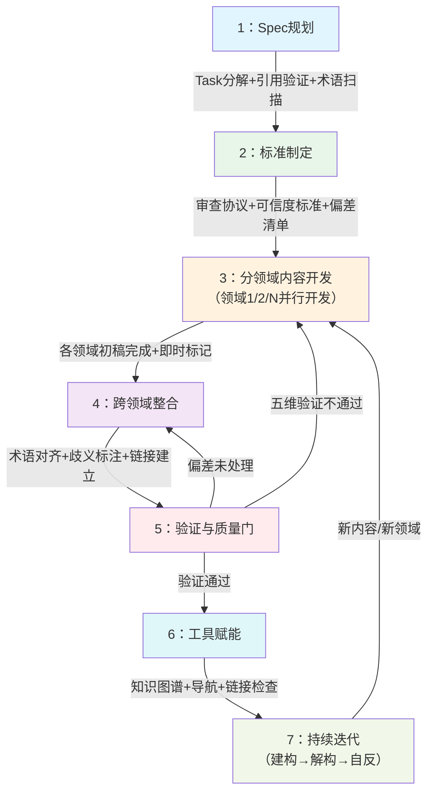

> **来源**: 从第一性原理知识体系项目（v1.0-v1.7，22个核心文件+10个练习文件+5个跨领域案例，累计100+来源引用）完整复盘提炼，经过7个版本迭代验证。

# 知识体系构建SOP模板

## 模式类型

方法论模式（研究知识/知识工程/内容架构）

## 成熟度

L2 已验证（1次完整端到端项目验证：第一性原理知识体系项目，从v1.0到v1.7经历7个版本迭代，覆盖7大知识领域，一级来源占比79.3%，A级可信度约79%）

> ⚠️ **L2成熟度提示**：本模板基于单个项目（第一性原理知识体系）提炼，虽然经过7个版本迭代验证，但仍可能存在"过度拟合"风险——把该项目的特定选择误认为通用最佳实践。使用时请务必根据项目规模、领域特点、团队情况进行裁剪，不要不加思考地全套照搬。L3成熟度需要≥3个不同类型项目验证。

| 验证指标 | 数值 | 说明 |
|---|---|---|
| 核心文件数 | 22个 | 不含练习和子目录案例 |
| 练习文件数 | 10个 | exercises/子目录原子化拆分 |
| 跨领域案例 | 5个 | 生物/数学/计算机/社会科学 |
| 一级来源占比 | 79.3% | 同行评审期刊/权威专著 |
| A级可信度占比 | ~79% | 多源交叉验证通过 |
| 关键事实交叉验证 | 100% | 13/13关键事实完成验证 |
| 认知偏差识别 | 10类 | 主动防御并修正 |
| 版本迭代 | 7个大版本 | v1.0→v1.7持续演进 |

---

## 第1章：标准化结构框架

### 1.1 标准目录结构

#### 1.1.1 最小可行知识体系（MVP，5-8个文件）

适合：个人学习笔记、小型主题研究、时间紧张的快速原型

```
your-topic/
├── README.md                    # 入口：项目简介+阅读指南+文件导航
├── 00-quality-standards.md      # 质量标准（对抗性审查协议简化版）
├── 01-core-concepts.md          # 核心概念与定义
├── 02-main-content.md           # 主体内容（理论/方法/案例）
├── 03-practice-guide.md         # 实践指南/操作框架
├── 04-glossary.md               # 术语表（可选但推荐）
└── 05-references.md             # 参考文献与来源记录
```

**MVP验收标准**：
- [ ] 有明确入口README说明定位和阅读路径
- [ ] 有质量标准说明（哪怕是简化版）
- [ ] 核心概念有明确定义
- [ ] 参考文献可追溯

#### 1.1.2 完整知识体系（推荐结构，参考第一性原理项目）

适合：系统性研究档案、课程体系、团队知识库、需要长期维护的知识资产

```
your-topic/
├── README.md                           # 【必选】项目入口：简介、统计、可信度说明、阅读路径、文件导航表
├── 00-adversarial-review-protocol.md   # 【必选】质量控制标准：来源分级、可信度评级、五维验证、偏差清单
│
├── 01-philosophy-origins.md            # 【分领域内容】历史/起源/理论基础（编号从01开始）
├── 02-domain-applications.md           # 【分领域内容】主要领域应用（如物理/技术/商业等）
├── 03-case-studies.md                  # 【分领域内容】案例分析（批判性，含偏差提示）
├── 04-key-thinkers-quotes.md           # 【分领域内容】关键人物与原始论述
│
├── 05-academic-resources.md            # 【参考资源】学术资源与推荐阅读
├── 06-concepts-glossary.md             # 【参考资源】核心概念术语表（跨领域歧义标注）
├── 07-timeline.md                      # 【参考资源】发展时间线
│
├── 08-methodology-framework.md         # 【方法论】实践框架与操作指南
├── 09-further-reading.md               # 【方法论】延伸阅读路径
│
├── 10-source-validation-log.md         # 【质量追溯】来源验证档案（五维验证执行记录）
├── 11-external-review.md               # 【质量追溯】外部评审记录（机制+状态+意见追踪）
│
├── 12-exercises.md                     # 【实践应用】练习题库（索引页）
├── exercises/                          # 【实践应用】练习原子化子目录
│   ├── README.md                       # 练习使用指南
│   ├── 01-step1-xxx.md                 # 步骤1专项练习
│   ├── 02-step2-xxx.md                 # 步骤2专项练习
│   ├── ...
│   └── 09-practice-guide.md            # 综合实践指南
│
├── 13-cognitive-science-foundations.md # 【深化内容】认知科学基础（为什么难）
├── 14-xxx-in-new-era.md                # 【深化内容】新环境/新时代应用
│
├── 15-cross-domain-cases/              # 【跨领域案例】跨学科案例库子目录
│   ├── README.md                       # 案例库导航
│   ├── biology.md                      # 生物学案例
│   ├── mathematics.md                  # 数学案例
│   ├── computer-science.md             # 计算机科学案例
│   └── social-sciences.md              # 社会科学案例
│
├── 16-boundary-conditions.md           # 【自反性成熟】适用边界研究（什么时候不用）
│
├── 12-knowledge-graph.html             # 【可选工具】交互式知识图谱
├── knowledge-graph-config.toml         # 【可选工具】知识图谱配置
│
└── assets/                             # 【资源目录】图片、附件等静态资源
    └── images/
```

### 1.2 文件命名规范

#### 1.2.1 kebab-case命名规则

**强制规则**：
- 所有文件名使用小写字母、数字、连字符（`-`）
- 禁止使用空格、下划线（`_`）、大写字母、中文文件名
- 编号使用两位数字（`01-`, `02-`），预留扩展空间
- 后缀使用`.md`（Markdown）

**正确示例**：
- `01-philosophy-origins.md` ✓
- `08-methodology-framework.md` ✓
- `15-cross-domain-cases/` ✓

**错误示例**：
- `PhilosophyOrigins.md` ✗（大写）
- `philosophy_origins.md` ✗（下划线）
- `哲学起源.md` ✗（中文）
- `1-philosophy.md` ✗（单位数编号）

#### 1.2.2 编号规则

| 编号段 | 文件类型 | 说明 |
|---|---|---|
| `00-xx` | 质量/标准类 | 审查协议、规范标准（最先读） |
| `01-04` | 核心分领域内容 | 按领域划分的主体内容 |
| `05-07` | 参考资源类 | 资源、术语表、时间线 |
| `08-09` | 方法论类 | 实践框架、延伸阅读 |
| `10-11` | 质量追溯类 | 验证日志、评审记录 |
| `12-14` | 深化/实践类 | 练习、认知基础、新时代应用 |
| `15-xx` | 跨领域扩展 | 子目录案例库 |
| `16+` | 自反性/边界 | 边界条件、批评视角 |

**编号原则**：
- 阅读顺序大致对应编号顺序，但允许跳跃
- 预留编号空间：不要把01-16全部用完，为未来扩展留余地
- 子目录内文件重新编号（如exercises/下00-09）

#### 1.2.3 文件职责划分（单一职责原则）

每个文件应该只有一个变更原因，对应一个明确的职责：

| 文件 | 单一职责 | 变更触发场景 |
|---|---|---|
| README.md | 入口导航和统计 | 文件增减、统计更新、阅读路径调整 |
| 00-adversarial-review-protocol.md | 质量标准定义 | 审查流程升级、评级标准调整 |
| 01-04分领域文件 | 特定领域内容 | 该领域新研究/新案例出现 |
| 06-concepts-glossary.md | 术语定义 | 新术语加入、定义修正、歧义标注 |
| 08-methodology-framework.md | 实践操作指南 | 方法论步骤调整、误区更新 |
| 10-source-validation-log.md | 验证过程记录 | 新来源验证、可信度调整 |
| 16-boundary-conditions.md | 适用边界研究 | 新反例发现、边界条件细化 |

**反模式**：一个文件包含多个独立主题（如第一性原理项目v1.3的练习题库2108行单文件，违反单一职责，后原子化拆分）。

---

## 第2章：Frontmatter元数据标准

### 2.1 标准YAML Frontmatter字段

所有`.md`文件必须在文件头部包含YAML frontmatter，用`---`分隔：

```yaml
---
id: "unique-file-id"                    # 【必选】唯一标识，kebab-case，与文件名对应
title: "文件中文标题"                    # 【必选】人类可读的中文标题
source: "project-name Task N"           # 【必选】来源：哪个项目/任务创建
created_at: "YYYY-MM-DD"                # 【必选】创建日期
status: "draft" | "in-progress" | "completed"  # 【必选】状态
version: "1.0.0"                        # 【推荐】语义化版本号
last_updated: "YYYY-MM-DD"              # 【推荐】最后更新日期
x-pattern-ref: "../../path/to/pattern.md"  # 【可选】关联的模式文件路径
tags: ["tag1", "tag2"]                  # 【可选】标签，用于检索
---
```

### 2.2 字段详细说明

| 字段 | 必填 | 说明 | 示例 |
|---|---|---|---|
| `id` | ✅ | 全局唯一标识符，kebab-case，不带编号前缀 | `philosophy-origins`（不是`01-philosophy-origins`） |
| `title` | ✅ | 中文标题，准确描述文件内容 | "第一性原理的哲学起源与发展历程" |
| `source` | ✅ | 溯源：创建该文件的项目和任务 | "first-principles-comprehensive-research Task 1" |
| `created_at` | ✅ | 创建日期，ISO格式字符串 | "2026-07-09" |
| `status` | ✅ | 生命周期状态 | `draft`（草稿）/ `in-progress`（写作中）/ `completed`（完成） |
| `version` | ⭐ | 语义化版本 | "1.0.0"（初版）、"1.1.0"（新增内容）、"2.0.0"（重大重构） |
| `last_updated` | ⭐ | 最后更新日期 | "2026-07-10" |
| `x-pattern-ref` | 可选 | 关联的方法论模式相对路径 | 用于从内容文件反向链接到模式文件 |
| `tags` | 可选 | 标签数组，用于分类检索 | ["philosophy", "history", "aristotle"] |

### 2.3 README.md专用增强字段

项目入口README需要额外的统计和概览字段：

```yaml
---
id: "project-readme"
title: "XXX系统化资料档案"
source: "project-name Task 9 + future tasks"
created_at: "YYYY-MM-DD"
last_updated: "YYYY-MM-DD"
status: "in-progress"
version: "1.0"
---
```

README正文必须包含：
1. 项目简介（定位、特色、与其他资料的区别）
2. 资料概览统计（文件数、来源占比、可信度分布）
3. 可信度评级说明（A/B/C/D四级+异常标记）
4. 质量控制机制简介
5. 多受众阅读路径（初学者/研究者/实践者等）
6. 文件导航表（序号、文件名、标题、简介、难度、建议顺序）
7. 快速链接索引
8. 使用建议与注意事项（局限性、引用须知）

---

## 第3章：内容组织方法论

### 3.1 从需求到产出的完整内容开发流程

```
需求定义 → Spec规划 → 标准制定 → 分领域开发 → 跨领域整合 → 验证质量门 → 工具赋能 → 持续迭代
   ↓          ↓          ↓           ↓            ↓            ↓          ↓          ↓
  明确      三层       质量前置     并行写作     术语对齐     五维验证    知识图谱   三阶段演化
  边界      规划       审查协议     独立开发     概念串联     偏差识别    可视化    建构→解构→自反
```

#### 阶段1：需求定义阶段（回答"为什么做、给谁看、覆盖什么"）

**关键活动**：
1. 明确知识体系的目标读者（初学者/研究者/实践者？）
2. 划定知识边界（包含什么、不包含什么）
3. 确定领域覆盖范围（单领域vs跨领域）
4. 评估项目规模和时间资源

**输出**：1页项目定位说明

**验收标准**：能用3句话说清楚"这是什么、给谁用、解决什么问题"

#### 阶段2：Spec规划阶段（SpecWeave三层规划）

**关键活动**：
1. 写Spec文档：目标→范围→任务分解→验收标准
2. 任务分解为可执行的Task列表
3. 每个Task附带checklist验收标准
4. **跨领域项目必须执行**：阶段0跨领域概念扫描（列出5-15个核心术语，核查歧义）
5. 区分"可自动化检查项"和"必须人工审查项"

**输出**：
- Spec文档（含目录结构规划）
- Task清单（带checklist）
- 跨领域项目：术语歧义清单和术语表规划

**验收标准**：所有文件路径规划完成；引用路径已验证存在；人工审查项已转化为yes/no问题

#### 阶段3：标准制定阶段（质量内建前置）

**关键活动**：
1. 采用（或裁剪）对抗性审查协议
2. 定义来源分级标准（L1/L2/L3）
3. 定义可信度评级标准（A/B/C/D）
4. 制定认知偏差检查清单
5. 设计验证日志模板

**输出**：`00-adversarial-review-protocol.md`

**验收标准**：标准在内容搜集开始前完成；不是"写完再审查"而是"边搜集边标记"

#### 阶段4-5：分领域开发vs跨领域整合

**分领域内容开发原则**：
- 每个领域独立开发，领域内自洽
- 搜集时即时标记来源级别和初步可信度
- 不要急于跨领域整合，先把每个领域做扎实
- 遇到歧义术语记录下来，不要强行统一

**跨领域整合时机**：
- 所有分领域内容初稿完成后再整合
- 整合阶段第一任务：术语对齐（对照Spec阶段的歧义清单）
- 建立术语表作为单一事实源
- 歧义术语首次出现时标注领域限定
- 串联不同领域的概念关系

### 3.2 跨领域整合方法论

#### 3.2.1 术语对齐六步法（跨领域项目必做）

1. **列术语**：列出所有核心术语（5-15个）
2. **查定义**：逐一核查每个术语在不同领域的定义
3. **标歧义**：标记存在语义漂移的术语
4. **定约定**：约定本项目使用哪个定义或综合性定义
5. **建词表**：创建`06-concepts-glossary.md`作为单一事实源
6. **标注规范**：歧义术语首次出现时标注领域（如"在物理学意义上"）

**第一性原理项目实际案例**："第一性原理"在三个领域含义不同：
- 哲学（亚里士多德）：不证自明的公理、终极真理
- 物理（DFT/费曼）：从头计算、不引入经验参数
- 商业（马斯克）：反类比、从基本事实出发重新推导

如果不前置对齐，整合时需要返工——v1.0经历了这个教训，v1.7前置后未再出现术语返工。

#### 3.2.2 概念漂移防御机制

- 所有术语定义引用术语表，不要在各文件重复定义
- 术语使用与约定定义不一致时必须显式标注
- 跨领域引用时注明"参见XX领域的YYY概念"
- 建立术语交叉引用链接网络

#### 3.2.3 歧义标注规范

使用标准化标记：
- `[歧义]`：该术语存在跨领域定义差异
- `[哲学]`/`[物理]`/`[商业]`：明确标注使用的是哪个领域的定义
- `[争议]`：该概念存在学派争议
- 标记应在术语首次出现时添加，不需要每次都标

### 3.3 阅读路径设计

不同受众需要不同的导航方案，README中必须提供至少3条阅读路径：

#### 3.3.1 初学者入门路径

特点：建立全局认知→基础概念→简单实践→不一开始就上难度

```
🕸️ 知识图谱（先浏览建立全局认知）
→ README（概览）
→ 时间线（建立历史脉络）
→ 核心概念入门章节
→ 关键人物言论选编
→ 方法论框架（可尝试应用）
→ 基础练习题
```

#### 3.3.2 专业研究者路径

特点：直接上深度→审查标准→原始文献→批评视角→验证记录

```
00-审查协议（了解质量标准）
→ 核心理论章节全文
→ 关键人物原始论述
→ 概念术语表
→ 学术资源（重点批评性视角）
→ 来源验证日志（偏差识别与争议）
```

#### 3.3.3 实践应用者路径

特点：案例→方法→练习→偏差警示→不追求学术深度

```
README（了解定位与偏差警示）
→ 案例分析（⚠️必须看偏差提示！）
→ 方法论框架（操作流程+误区清单）
→ 练习题（案例分析）
→ 来源验证日志（重点：偏差类型）
→ 适用边界章节（避免教条化）
```

---

## 第4章：质量控制标准

### 4.1 分级质量门（每个阶段的准入准出标准）

| 阶段 | 准入标准 | 准出标准 | 质量要求 |
|---|---|---|---|
| Spec规划 | 需求定义完成 | 目录结构确定、Task分解完成、所有引用路径验证存在 | Spec中引用的文件必须真实存在 |
| 标准制定 | Spec通过评审 | 审查协议完成、可信度标准定义、偏差清单准备 | 质量标准先于内容，不是写完再补 |
| 分领域开发 | 标准就绪 | 领域内容初稿完成、即时标记来源级别、初步可信度评级 | L1+L2来源≥90% |
| 跨领域整合 | 各领域初稿完成 | 术语对齐完成、歧义标注完成、跨文件链接添加 | 术语使用与词表约定一致 |
| 验证与质量门 | 内容整合完成 | 五维验证执行、偏差识别处理、可信度最终评级、验证日志归档 | A+B级≥95%、D级0%、关键事实100%交叉验证 |
| 工具赋能 | 内容质量门通过 | 知识图谱生成、导航更新、链接检查通过 | 无断链、无目录链接、格式统一 |
| 持续迭代 | 首版发布 | 按三阶段演化模型持续完善 | 记录技术债和权宜之计 |

### 4.2 对抗性审查流程（整合现有模式）

详细流程参见 [adversarial-review-protocol.md](adversarial-review-protocol.md)，核心要点：

**五维验证流程**：
1. **来源资质核查**：作者/机构资质、发布渠道、利益冲突
2. **交叉验证**：关键事实需要≥2个独立来源印证
3. **时效性评估**：区分经典理论/实证研究/前沿领域，时间敏感内容≤5年
4. **逻辑一致性审查**：内部论证自洽、反例处理、结论与证据连贯
5. **偏差识别**：10类认知偏差+跨领域语义漂移检查

**质量内建原则**：标准前置、即时标记，不是"搜集完再审查"。

### 4.3 可信度评级体系（A/B/C/D四级+异常标记）

#### 4.3.1 四级可信度评级

| 标记 | 等级 | 判定标准 | 使用建议 |
|---|---|---|---|
| 🟢 | A级 | ≥2个独立L1/L2来源交叉验证；无利益冲突；可追溯原始出处 | 核心论据，可直接引用，作为推理基石 |
| 🔵 | B级 | 单一权威L1来源；逻辑自洽；无明显偏差；领域共识度高 | 辅助论据，标注来源，鼓励交叉验证 |
| 🟡 | C级 | L2/L3来源；需进一步验证；存在潜在偏差；非普遍共识 | 仅作参考，必须标注"待验证"，不得独立作为论据 |
| 🔴 | D级 | 存疑；无法验证；明显矛盾或利益冲突；来源不可追溯 | 不纳入核心档案；仅作反面案例或问题线索 |

#### 4.3.2 四类异常标记

| 标记 | 类型 | 含义 |
|---|---|---|
| ⚠️ | 待验证 | 尚未完成多来源交叉验证 |
| ❓ | 存疑 | 与其他权威来源存在矛盾 |
| ⚖️ | 争议 | 学术领域内存在明确学派争议 |
| 🔍 | 利益冲突 | 来源与结论存在利益关联 |

**使用方式**：标记直接放在段落末尾，如：
> 马斯克声称SpaceX通过第一性原理将火箭成本降低了90%。🔵⚠️（事后归因偏差可能）

### 4.4 认知偏差防御机制（10类高频偏差+检查项）

意志力是最不可靠的防线——必须依赖流程和工具。所有偏差防御必须转化为可执行的yes/no检查项。

| 偏差类型 | 识别信号 | 检查项 |
|---|---|---|
| **确认偏误** | 只有支持性案例，没有反例 | [ ] 是否主动搜索了"反方观点""批评""失败案例"？ |
| **幸存者偏差** | 只有成功案例，没有失败数据 | [ ] 是否查找了失败率、失败案例、未成功的尝试？ |
| **权威偏误** | "XX说的所以对"，没有证据检查 | [ ] 权威的论证逻辑和原始数据是否检查过？ |
| **事后归因谬误** | B发生在A之后就说A导致B | [ ] 是否寻找了因果机制证据，而非仅时间先后？ |
| **锚定效应** | 过度依赖第一个接触到的信息 | [ ] 是否从多渠道获取信息，避免第一印象主导？ |
| **可得性启发** | 容易找到的资料占比过高 | [ ] 案例选择是否按采样框架而非资料可得性？ |
| **过度自信** | "这很明显""不用查了" | [ ] 越是觉得"这还用查？"的时候，越必须查 |
| **跨领域语义漂移**⭐ | 同一术语不同领域含义不同 | [ ] 跨领域项目是否执行了术语对齐六步法？ |
| **方法论万能论** | 声称这个方法能解决所有问题 | [ ] 是否研究了适用边界和不适用场景？ |
| **自动化万能论** | 想靠自动化/AI解决所有质量问题 | [ ] 是否区分了可自动化检查项和必须人工审查项？ |

### 4.5 可操作检查清单（内容质量人工审查）

将模糊的"注意质量""保持审慎"转化为具体的yes/no问题：

**内容创作通用审查清单**：
- [ ] 是否包含"方法不是万能的"类边界说明？
- [ ] 是否包含失败案例/反例，而非只有成功叙事？
- [ ] 是否标注了"非唯一正确解"？
- [ ] 案例是否有偏差提示（特别是商业/成功案例）？
- [ ] 是否区分了"能做到什么"和"不能做到什么"？
- [ ] 引用是否标注了可信度级别？
- [ ] 关键数据是否有来源标注？
- [ ] 是否处理了反方观点和批评意见？
- [ ] 术语使用是否与术语表约定一致？
- [ ] 跨领域术语是否标注了领域限定？

**简单任务专项检查清单**（路径/格式/链接修改等"看起来不用想"的任务）：
- [ ] 是否查了权威文档/规范？
- [ ] 是否查了现有同类实例（而非凭直觉数层数/套格式）？
- [ ] 是否回到本质目标验证合理性？
- [ ] 是否运行了自动化检查工具（如链接检查）？

### 4.6 复盘/洞察质量三层模型与自检清单

知识生产和项目复盘都遵循"质量三层分工"：框架保证下限，批判性思维决定上限。

| 质量层级 | 保证手段 | 能保证什么 | 不能保证什么 |
|---|---|---|---|
| **层1：框架/自动化** | Spec模板、checklist、工具验证 | 覆盖完整性、格式规范、数据可验证、无低级错误 | 洞察深度、论证质量、本质发现 |
| **层2：流程/结构** | 5-Whys根因分析、四层问题分析、证据要求 | 分析结构一致性、追问深度下限、证据支撑 | 反直觉洞察、跨领域关联、第一性原理发现 |
| **层3：批判性思维** | 执行者能力、第一性原理训练、外部评审 | 洞察质量上限、本质发现、可迁移性 | 无法通过模板/流程保证 |

**洞察/复盘质量自检清单**（判断洞察是否真正有价值）：
- [ ] 这个洞察是反直觉的吗？还是"我们做对了XX"这种显而易见的总结？
- [ ] 追问到不可再分的基本原理了吗？还是停留在"流程问题""沟通问题"这种表层？
- [ ] 有具体的、可引用的证据支撑吗？还是泛泛而谈？
- [ ] 能迁移到其他项目/领域吗？还是只适用于本项目？
- [ ] 能指导未来行动吗？还是只是"回顾过去"？
- [ ] 是否包含"什么时候不适用"的边界说明？

---

## 第5章：可复用实施流程

### 5.1 七个标准阶段总览

| 阶段 | 名称 | 时间占比建议 | 核心目标 |
|---|---|---|---|
| 1 | Spec规划 | 10-15% | 想清楚再动手，避免方向性返工 |
| 2 | 标准制定 | 5-10% | 质量内建，标准前置而非事后补 |
| 3 | 分领域内容开发 | 30-40% | 并行开发各领域内容，即时标记 |
| 4 | 跨领域整合 | 10-15% | 术语对齐、概念串联、链接建立 |
| 5 | 验证与质量门 | 15-20% | 五维验证、偏差处理、可信度评级 |
| 6 | 工具赋能 | 5-10% | 知识图谱、导航、自动化检查 |
| 7 | 持续迭代 | 持续进行 | 三阶段演化，建构→解构→自反 |

### 5.2 Mermaid流程图



### 5.3 各阶段详细定义

#### 阶段1：Spec规划

| 项 | 内容 |
|---|---|
| **输入** | 需求定位说明 |
| **输出** | Spec文档、Task清单（带checklist）、跨领域术语歧义清单（如需要） |
| **关键活动** | 三层规划（spec→tasks→checklist）；目录结构规划；所有引用路径Glob验证存在；跨领域项目执行概念扫描；区分自动化检查项和人工审查项 |
| **验收标准** | 每个Task有明确的yes/no验收标准；Spec中引用的文件全部真实存在；跨领域项目术语表有规划；人工审查项已转化为具体问题 |
| **常见陷阱** | 1. 跳过Spec直接写（"先做起来再说"）；2. Spec太粗无法执行；3. 引用路径凭记忆写不验证；4. 不区分自动化和人工审查项 |
| **时间分配** | 10-15% |

#### 阶段2：标准制定

| 项 | 内容 |
|---|---|
| **输入** | 通过评审的Spec |
| **输出** | 00-adversarial-review-protocol.md（质量标准） |
| **关键活动** | 定义来源三级分类；定义可信度四级评级；制定五维验证流程；准备认知偏差检查清单；设计验证日志模板 |
| **验收标准** | 标准在任何内容搜集前完成；评级标准有明确判定条件；检查清单是具体yes/no问题而非空泛原则 |
| **常见陷阱** | 1. 写完内容再补审查标准；2. 标准太模糊无法执行；3. 追求100%完美而迟迟不开始 |
| **时间分配** | 5-10% |

#### 阶段3：分领域内容开发

| 项 | 内容 |
|---|---|
| **输入** | 质量标准就绪 |
| **输出** | 各领域内容初稿（带即时可信度标记） |
| **关键活动** | 按领域并行/串行开发；搜集资料时即时标记来源级别（L1/L2/L3）；即时标记初步可信度（A/B/C/D）；发现歧义术语记录下来不强行统一；记录权宜之计和技术债 |
| **验收标准** | 每条关键信息标注了来源和可信度；L1+L2来源占比≥90%；没有D级内容混入核心档案；权宜之计有记录 |
| **常见陷阱** | 1. 搜集时不标记，事后回忆标记；2. 急于跨领域整合导致领域内容不扎实；3. 混入未验证的网络流言；4. 不记录权宜之计 |
| **时间分配** | 30-40% |

#### 阶段4：跨领域整合

| 项 | 内容 |
|---|---|
| **输入** | 各领域初稿完成 |
| **输出** | 整合后的完整初稿、06-concepts-glossary.md（术语表） |
| **关键活动** | 执行术语对齐六步法；歧义术语标注领域限定；建立跨文件交叉引用；串联不同领域的概念关系；术语表作为单一事实源 |
| **验收标准** | 所有核心术语有统一定义；歧义术语标注完整；跨文件链接已添加；术语使用与词表一致 |
| **常见陷阱** | 1. 不做术语对齐强行整合导致矛盾；2. 在各文件重复定义术语而非引用词表；3. 遗漏跨领域概念联系 |
| **时间分配** | 10-15% |

#### 阶段5：验证与质量门

| 项 | 内容 |
|---|---|
| **输入** | 整合后的完整初稿 |
| **输出** | 最终评级内容、10-source-validation-log.md（验证日志） |
| **关键活动** | 执行五维验证；处理验证中发现的问题；最终可信度评级；偏差识别与修正；验证日志完整记录；人工审查checklist逐项打勾 |
| **验收标准** | A+B级可信度≥95%；D级内容0%；关键事实100%交叉验证；认知偏差检查清单全部过一遍；验证日志记录完整；人工审查项全部完成 |
| **常见陷阱** | 1. 验证走过场；2. 发现问题不修正只标记；3. 只验证形式不验证语义；4. 忽略认知偏差检查；5. 人工审查项凭感觉不逐项打勾 |
| **时间分配** | 15-20% |

#### 阶段6：工具赋能

| 项 | 内容 |
|---|---|
| **输入** | 通过质量门的内容 |
| **输出** | 知识图谱、更新的导航、链接检查通过的文件 |
| **关键活动** | 生成交互式知识图谱；运行链接检查并修复断链；更新README文件导航表；格式统一化检查；执行一键收尾（断链修复→导航更新→索引重建） |
| **验收标准** | 无断链；无目录链接（应指向具体README.md）；知识图谱可正常访问；导航表与实际文件一致 |
| **常见陷阱** | 1. 忘记运行链接检查；2. 新增文件不更新导航；3. 工具验证只看"存在"不看"可用"（语义缺口） |
| **时间分配** | 5-10% |

#### 阶段7：持续迭代（知识体系三阶段演化）

知识体系不是一次性交付，而是按照三阶段模型持续演化：

| 演化阶段 | 核心问题 | 核心产出物 | 成熟度标志 |
|---|---|---|---|
| **阶段1：正向建构** | "是什么、怎么用" | 核心概念、方法框架、成功案例 | 最容易也最常见的阶段 |
| **阶段2：解构与补全** | "为什么难、什么情况下失效" | 认知科学基础、失败案例、反例、边界初讨 | 开始有批判性视角 |
| **阶段3：自反性成熟** | "我自己的边界在哪里" | 适用边界研究、与竞争方法的关系、主动展示局限性 | 区分"方法论"与"宗教"的标志 |

**持续迭代关键活动**：
- 记录用户反馈和问题
- 补充新的案例和研究
- 收紧验证标准（从用户场景倒推）
- 偿还技术债（权宜之计的系统性解决）
- 主动寻找方法论自身的局限性

**验收标准**：明确标注当前处于哪个演化阶段；不假装"已经完美"；记录待完成事项和技术债。

### 5.4 权宜之计技术债追踪

在资源约束下采用权宜之计是合理的，但必须记录三要素：
1. **是什么**：这是什么权宜之计？
2. **为什么**：为什么现在用这个方案（约束是什么）？
3. **何时还**：后续什么时候、用什么根本方案解决？

**第一性原理项目案例**：
- 权宜之计：v1.2补充3个B级传统行业案例
- 为什么：时间约束，v1.0有交付压力
- 何时还：v1.7系统性扩展跨学科案例库（15-cross-domain-cases/）
- 风险预警：B级案例可能强化"科技行业更适合"的偏见→临时方案附带了偏差提示

### 5.5 项目复盘两阶段架构

项目完成后应进行系统性复盘，采用"分维度深度分析→整合输出报告"的两阶段架构：

**阶段1：分维度独立分析（发散）**
- 事实收集：所有数据必须可验证（Git log、工具统计、可追溯文档），禁止凭记忆估算
- 决策分析：≥10个核心决策，每个必须做5-Whys根因+备选方案+效果评估
- 问题分析：≥8个问题/挑战，每个必须做表象→根因→解决→事后复盘四层分析
- 方法论分析：≥5个使用的方法论，每个必须评估普适性+迁移条件+边界
- 洞察萃取：≥8条洞察，每条必须有证据支撑+普适性评估+模式沉淀建议

> **关键原则**：中间分析产物（每个维度独立文档）不是浪费，而是深度分析的必要载体。中间产物信息量建议是最终报告的2-3倍（压缩率30-50%）。

**阶段2：整合输出报告（收敛）**
- 执行摘要：核心发现、关键数据、主要洞察、改进建议
- 执行复盘：时间线、过程分析、决策回顾、目标达成评估
- 洞察萃取：分类呈现洞察，标注证据来源
- 中间产物溯源：明确链接到5个分析文档，方便读者追溯完整推导链

**元复盘机制（方法论自反性测试）**：
- 方法论必须能应用于自身——用本SOP指导复盘项目，再用复盘方法审视复盘过程本身
- 每完成1-2个项目复盘后，选择典型项目进行元复盘
- 元复盘核心问题：复盘方法本身哪些地方做对了/做错了？哪些环节可以改进？
- 元复盘洞察必须反馈到SOP迭代，形成"做事→复盘→元复盘→方法论迭代"闭环
- 警惕无限递归：不需要"元元复盘"，元复盘的价值是改进方法论，不是无限反思

---

## 第6章：工具链配置

### 6.1 必要工具/脚本清单

| 工具 | 用途 | 必要性 | 自动化程度 |
|---|---|---|---|
| **链接检查工具** | 检查Markdown文件间链接有效性 | 必选 | 100%自动化 |
| **文档索引生成器** | 自动生成README导航表 | 推荐 | 80%自动化，人工微调 |
| **知识图谱生成器** | 从Markdown提取节点关系生成可视化 | 推荐 | 70%自动提取+30%手工补充语义关系 |
| **Git版本控制** | 追踪变更历史、回滚错误 | 必选 | - |
| **文本编辑器** | 支持Markdown预览、路径补全 | 必选 | - |

### 6.2 链接检查工具三层验证模型

自动化验证不是"检查存在就行"，必须从用户场景出发设计三层验证：

| 验证层级 | 检查内容 | 失败处理 |
|---|---|---|
| **层1：文件系统层** | 路径指向的对象存在 | 报错：文件不存在 |
| **层2：应用层** | 对象是可打开的文件（不是目录） | 目录链接警告，可自动修复为`dir/README.md` |
| **层3：约定层** | 符合项目约定（指向具体.md文件） | 不符合约定的链接提示修正 |

**关键洞察**（来自第一性原理项目P10问题）：技术上"存在"≠语义上"可用"。链接到目录在文件系统上"存在"，但用户点击无法打开预期内容。

### 6.3 自动化检查项 vs 人工审查项

遵循70/30人机分工定律：机器做它擅长的（约70%），人做机器不擅长的（约30%）。

#### 100%自动化检查项（必须工具化）

- [ ] 内部链接有效性（三层验证）
- [ ] 文件名规范（kebab-case、编号规则）
- [ ] Frontmatter字段完整性检查
- [ ] 文件大小阈值（接近500行预警）
- [ ] 死链/目录链接自动检测
- [ ] 导航表与实际文件一致性
- [ ] 格式一致性（标题层级、列表格式）

#### 必须人工审查项（无法自动化）

- [ ] 论证强度是否足够
- [ ] 证据是否支持结论
- [ ] 是否存在认知偏差
- [ ] 术语使用是否准确（语义层面）
- [ ] 批判性视角是否充分
- [ ] 反例和边界是否包含
- [ ] 阅读体验是否流畅
- [ ] 可信度评级是否恰当

### 6.4 工具配置示例（知识图谱）

知识图谱采用"配置与代码分离"架构（70/30定律应用）：
- **不变项**（机器/复用）：通用数据提取逻辑、HTML渲染框架→固化在代码中
- **可变项**（人/定制）：节点类型、关系类型、构建规则→暴露为TOML配置

```toml
# knowledge-graph-config.toml 示例
[graph]
title = "第一性原理知识图谱"
root_dir = "."

[node_types]
concept = { color = "#4299e1", label = "概念" }
person = { color = "#48bb78", label = "人物" }
event = { color = "#ed8936", label = "事件" }
document = { color = "#9f7aea", label = "文档" }

[relation_types]
related_to = { label = "相关", color = "#718096" }
influenced = { label = "影响", color = "#e53e3e", directed = true }
contributed = { label = "贡献", color = "#38a169", directed = true }
defined_in = { label = "定义于", color = "#805ad5", directed = true }
```

---

## 第7章：反模式与陷阱清单（12个）

> 以下陷阱均来自第一性原理项目v1.0-v1.7的真实踩坑经验，每个都包含：识别信号、后果、预防措施、本项目实际案例。

### 陷阱1：先做起来再说——跳过Spec直接写内容

| 项 | 内容 |
|---|---|
| **识别信号** | "不用想那么多，先写了再说"；目录结构没规划就开始写；引用路径凭记忆写 |
| **后果** | 结构性返工（如术语歧义到整合时才发现）；引用不存在的文件需要回溯；文件命名混乱后期大量重命名 |
| **预防措施** | 非微型任务（>30分钟）必须先写Spec；Spec中所有引用路径必须Glob验证存在；跨领域项目必须前置术语扫描 |
| **本项目案例** | P03术语漂移问题：v1.0没有前置术语扫描，整合阶段才发现"第一性原理"在三个领域含义不同，导致返工。v1.7前置后未再出现。 |

### 陷阱2：质量事后补——写完内容再做审查

| 项 | 内容 |
|---|---|
| **识别信号** | "先写完最后统一检查"；搜集资料时不标记来源和可信度 |
| **后果** | 基础层错误（术语歧义、来源不可靠）被所有上层内容继承放大，发现越晚返工成本指数增长 |
| **预防措施** | 质量标准在内容搜集前完成；搜集时即时标记来源级别和可信度；遵循质量内建/质量左移原则 |
| **本项目案例** | 对抗性审查前置后，v1.0初版一级来源占比就达77.3%，而非写完后再修补。 |

### 陷阱3：简单任务高风险——越"不用想"的任务越容易出错

| 项 | 内容 |
|---|---|
| **识别信号** | "这个简单，不用查了"；路径计算凭直觉数层级；格式套用时看一眼就批量改 |
| **后果** | 低级错误（断链、路径错误、格式错误）潜伏很久才发现；5次践行鸿沟错误全部发生在简单任务上 |
| **预防措施** | 建立"简单任务慢做"原则；简单操作前强制执行三查法（查规范、查实例、查目标）；高频易错点100%工具化检查 |
| **本项目案例** | P02践行鸿沟：5次在格式修改、路径计算等"看起来简单"的任务上犯类比错误，复杂任务（知识图谱TDD、新章节创作+对抗性审查）反而没出低级错误。 |

### 陷阱4：意志力防御——"我知道偏差，下次注意就好"

| 项 | 内容 |
|---|---|
| **识别信号** | "我会注意的"；"这个错误不会再犯了"；靠自觉、认真、细心来保证质量 |
| **后果** | 同样的错误反复发生（包括在改进防错机制的时候）；意志力是最不可靠的防线 |
| **预防措施** | 三层防御架构：层1流程防御（checklist强制检查点）、层2工具防御（自动化验证）、层3文化防御（承认人一定会犯错） |
| **本项目案例** | P02第5次递归践行错误：正在写"不要凭直觉数路径层级"的洞察时，自己在同一个任务中又凭直觉写错了路径——知道错误≠能避免错误。直到工具+流程防御建立后才避免第6次错误。 |

### 陷阱5：权宜之计不记录——临时方案变永久负债

| 项 | 内容 |
|---|---|
| **识别信号** | "先这样吧，以后再说"；临时补丁不标注；"解决了"但没记录是临时方案 |
| **后果** | 权宜之计被误认为"已经解决"，人们在它基础上继续构建；新问题爆发时需要偿还连本带利的技术债；未记录的权宜之计是双重负债 |
| **预防措施** | 所有权宜之计必须记录三要素：是什么、为什么用、何时还；预判权宜之计可能带来的新问题；临时方案附带风险说明 |
| **本项目案例** | P04补充B级案例：初衷是减少科技行业偏向，但B级案例质量不对等可能反强化偏见——直到v1.7系统性扩展跨学科案例库才真正解决，中间隔了一个大版本。 |

### 陷阱6：自动化万能论——想靠工具解决所有质量问题

| 项 | 内容 |
|---|---|
| **识别信号** | "这个可以用AI检查"；"自动化测试通过就没问题了"；想100%自动化内容审查 |
| **后果** | 形式合规但语义有问题；自动化覆盖了"能检查的"，但真正重要的内容质量（论证强度、批判性视角）无人审查；虚假的质量安全感 |
| **预防措施** | 质量三层分工：层1自动化（形式合规）、层2checklist（结构化检查）、层3批判性思维（语义/价值判断）；明确区分可自动化项和必须人工审查项 |
| **本项目案例** | P07人工审查项缺失：练习题库任务数量指标全部自动通过，但"审慎态度"的质量依赖执行者自觉——直到转化为5个yes/no检查清单后质量才可控。 |

### 陷阱7：自动化语义缺口——技术上正确≠语义上可用

| 项 | 内容 |
|---|---|
| **识别信号** | "工具验证通过了啊"；只从技术实现视角定义验证标准，不从用户场景倒推 |
| **后果** | 验证通过但用户实际不可用（如目录链接"存在"但无法打开）；用户踩坑后才发现验证标准有问题 |
| **预防措施** | 三层验证模型（技术层→应用层→约定层）；从用户使用场景倒推验证标准；持续从用户反馈收紧验证标准；验证工具自身也需要被验证 |
| **本项目案例** | P10验证语义缺口：check-links.py v1验证"路径存在"，但目录链接导致IDE无法打开，用户实际点击达不到预期。重构为三层模型后立即发现1个漏掉的问题。 |

### 陷阱8：跨领域默认共通——以为大家说的是同一个东西

| 项 | 内容 |
|---|---|
| **识别信号** | "这个术语大家都懂"；跨领域项目不做术语扫描；默认不同领域同一词含义相同 |
| **后果** | 术语歧义在分领域阶段不可见，整合时才暴露矛盾；基础层术语错误被所有上层内容继承；大规模返工 |
| **预防措施** | 跨2个及以上领域的项目，Spec阶段必须执行术语对齐六步法；歧义术语首次出现标注领域限定；建立术语表作为单一事实源 |
| **本项目案例** | P03术语语义漂移："第一性原理"在哲学（公理/真理）、物理（从头计算）、商业（反类比）三个领域含义差异巨大，v1.0整合时才发现。 |

### 陷阱9：单文件过大——一个文件塞下所有内容

| 项 | 内容 |
|---|---|
| **识别信号** | 单文件超过500行；一个文件包含多个独立主题；Git diff显示整文件变更 |
| **后果** | 认知负荷超过工作记忆容量；导航困难；Git diff不友好；修改时容易意外影响其他部分；维护成本高 |
| **预防措施** | 遵循单一职责原则：一个文件应该只有一个变更原因；500行是预警阈值，接近时提前规划拆分；按主题/概念/步骤拆分，而非按行数拆分；拆分后必须执行一键收尾（断链修复+导航更新） |
| **本项目案例** | P05练习题库：v1.3是2108行单文件，包含使用指南、6步练习、误区、案例、实践指南等多个独立主题。v1.6原子化拆分为exercises/下10个独立文件，每个职责清晰。 |

### 陷阱10：采样偏差——容易找到的资料占比过高

| 项 | 内容 |
|---|---|
| **识别信号** | 案例高度集中于某个行业/地区/人群；成功案例远多于失败案例；资料来源偏向容易获取的渠道 |
| **后果** | 形成隐性偏见（如"只有科技行业适用第一性原理"）；读者根据可见案例错误推断适用范围；补充几个"反例"补丁反而可能强化偏见 |
| **预防措施** | 案例库建设前先建立采样框架（按领域多样性而非资料可得性）；主动查找失败案例和沉默证据；质量不对等的补充必须附带元说明；系统性扩展而非零散补丁 |
| **本项目案例** | P04案例偏向：v1.0商业案例全是硅谷科技公司（SpaceX/Tesla/Amazon），因为这些资料最容易找到。v1.2补充3个B级传统行业案例是权宜之计，直到v1.7系统性扩展4个非商业领域12个案例才真正解决。 |

### 陷阱11：空转机制——建立框架但不执行，造成虚假安全感

| 项 | 内容 |
|---|---|
| **识别信号** | 机制/章节已建立，但从未实际执行；不标注机制的当前状态；让读者误以为"已经过XX审查" |
| **后果** | 未执行的机制比没有机制更危险——它给人虚假的质量保证；作者自己也可能放松自审要求 |
| **预防措施** | 机制建立时必须明确标注当前状态（已执行/部分执行/框架待落地）；状态透明原则：不假装已经执行；轻量级评审永远比没有评审好（假想评审、跨项目互评、社区评审）；"自我批判"是单人项目最可执行的外部视角替代 |
| **本项目案例** | P09外部评审：v1.2建立了外部评审机制框架，但直到v1.7仍未邀请专家执行。通过明确标注"评审机制已建立，待邀请专家"避免了虚假安全感，并用"假想评审"和"自我批判"（边界条件章节）部分弥补。 |

### 陷阱12：方法论万能论——只讲成功不讲边界

| 项 | 内容 |
|---|---|
| **识别信号** | "XX方法能解决所有问题"；没有边界条件章节；没有反例和失败案例；批评声音被排除 |
| **后果** | 方法论原教旨主义；什么问题都套这个方法反而违背方法精神；读者教条化应用；知识体系停留在"正向建构"阶段无法成熟 |
| **预防措施** | 方法论自反性测试：用方法论审视方法论自身；主动研究"什么时候不用这个方法"；纳入批评视角和反例；明确适用边界是成熟的标志而非弱点；遵循三阶段演化模型，最终达到"自反性成熟" |
| **本项目案例**：v1.7新增16-boundary-conditions.md，系统研究"什么时候不用第一性原理、类比推理更高效"，提出5维度场景判断框架，主动纳入More is Different对还原论的批评——这是知识体系从阶段2（解构）跃迁到阶段3（自反）的标志。

---

## 第8章：适配指南

### 8.1 不同规模项目的调整方案

| 规模 | 项目特征 | 调整方案 | 必备文件 | 可裁剪 | 时间预估 |
|---|---|---|---|---|---|
| **微型**（个人笔记） | <5个文件，个人使用，不公开 | 裁剪为MVP结构；对抗性审查简化为"来源标记+偏差提示"两维；不需要外部评审；不需要知识图谱 | README、核心概念、主体内容、参考文献 | 五维验证简化、术语表可选、练习可选 | 几天 |
| **小型**（主题研究） | 5-10个文件，小范围分享 | 采用MVP+部分完整结构；保留四级可信度评级；偏差检查清单精简到5项；可用假想评审替代外部评审 | README、质量标准、核心内容、术语表、参考文献 | 跨领域案例可选、知识图谱可选、原子化练习可选 | 1-2周 |
| **中型**（课程/研究档案） | 10-20个文件，公开分享，长期维护 | 采用完整目录结构；执行完整对抗性审查；至少轻量级外部评审（互评/社区）；考虑知识图谱；原子化拆分大文件 | 完整必备文件+练习+跨领域案例 | 认知科学基础、AI时代应用等深化内容可选 | 1-2个月 |
| **大型**（领域知识库） | >20个文件，团队协作，持续迭代 | 完整结构+所有增强项；正式外部专家评审；完整工具链；三阶段演化规划；技术债追踪机制；贡献指南 | 全部文件+工具+流程规范 | 无可裁剪项，按阶段推进 | 3-6个月+持续迭代 |

### 8.2 不同类型知识的调整方案

| 知识类型 | 特征 | 调整重点 | 质量侧重 |
|---|---|---|---|
| **单领域理论型** | 单一学科、理论性强、学派争议可能多 | 不需要跨领域术语扫描；重点处理学派内部分歧；增加学术资源深度；原始文献引用比例要高 | 逻辑一致性、原始出处追溯、学派争议标注 |
| **跨领域理论型** | 涉及多个学科、概念迁移、整合难度大 | **必须执行**术语对齐六步法；增加跨领域概念辨析章节；重点防御语义漂移；术语表是核心文件 | 术语一致性、跨领域证据、概念关系准确性 |
| **单领域实践型** | 操作导向、案例为主、方法论框架 | 重点在实践框架和练习题库；增加误区和反例；案例要有偏差提示；操作checklist要具体可执行 | 可操作性、案例真实性、误区识别、练习设计 |
| **跨领域实践型** | 多领域应用、方法迁移、场景多样 | 既需要术语对齐，也需要不同领域的应用场景差异分析；增加适配指南（不同领域如何调整）；边界条件章节尤其重要 | 场景适配说明、反模式清单、边界条件清晰 |

### 8.3 不同资源约束下的裁剪方案（优先级排序）

**时间极度紧张时（只有平时30%时间），按以下优先级保留，从高到低：**

| 优先级 | 保留项 | 原因 | 裁剪项 |
|---|---|---|---|
| P0（必留） | README入口、质量标准简化版、核心概念定义、来源标记 | 没有这些就没有可信度基础 | 五维验证简化为来源标记+偏差提示即可 |
| P1（高优） | 主体内容、参考文献可追溯 | 核心价值所在 | 可信度评级可简化（只分可靠/待验证）；知识图谱裁剪 |
| P2（建议保留） | 术语表、阅读路径、文件导航 | 可用性和可维护性基础 | 外部评审裁剪（用假想评审替代）；练习题库裁剪 |
| P3（可延后） | 跨领域案例深化、认知科学基础、知识图谱 | 锦上添花，首版可以没有 | 三阶段演化先做到阶段1（建构），阶段2/3后续迭代补充 |
| P4（最后做） | 工具完善、视觉美化、高级交互 | 不影响核心内容质量 | 非首版必要 |

**时间紧张时的核心原则**：
1. 质量标准可以简化但不能没有——哪怕只是"来源分两级+偏差提示"
2. 权宜之计可以用但必须记录——明确标注"这是临时方案，后续补充"
3. 先完成核心骨架（P0-P1），再逐步填充血肉（P2-P4）
4. "完美的方案以后做"永远比"不完美的方案现在不做"好，但必须记住债是要还的

### 8.4 从0到1启动Checklist（拿到这个模板第一天做什么）

按顺序执行，一天内可以完成阶段1-2：

- [ ] **Step 1：创建目录结构**：按MVP或完整结构创建空文件和目录
- [ ] **Step 2：写README草稿**：用3句话说清楚定位、目标读者、覆盖范围
- [ ] **Step 3：写Spec**：分解为5-10个Task，每个Task带checklist验收标准
- [ ] **Step 4：引用验证**：Spec中提到的所有文件路径，用Glob验证存在
- [ ] **Step 5：跨领域判断**：如果涉及≥2个领域，列出核心术语清单（5-15个）
- [ ] **Step 6：术语初查**（跨领域项目）：快速核查核心术语是否有明显歧义，标记下来
- [ ] **Step 7：定义质量标准**：根据项目规模裁剪对抗性审查协议，至少定义来源分级和可信度标记
- [ ] **Step 8：准备偏差清单**：从10类高频偏差中选择适合本项目的，转化为检查项
- [ ] **Step 9：规划首个Task**：从最核心的分领域内容开始，不要同时铺开所有文件
- [ ] **Step 10：配置工具**：准备好链接检查工具，设置编辑器

**首日验收标准**：目录结构有了、README有了、Spec有了、质量标准有了、第一个内容Task可以开始了。

---

## 关键洞察总结

1. **质量是流程的产物，不是检查的产物**：标准前置看似"慢一步"，实际避免数十倍返工成本
2. **简单任务是高风险任务**：复杂任务有流程保护，简单任务因为"简单"被跳过所有验证
3. **意志力是最不可靠的防线**：防御必须是流程化、工具化的，不能依赖"我会注意"
4. **技术上正确≠语义上可用**：验证标准要从用户场景倒推，而非从技术实现正推
5. **方法论必须通过自反性测试**：一个不能解释自身边界、不能说明何时失效的方法论是不自洽的
6. **知识体系是演化出来的，不是一次设计出来的**：遵循建构→解构→自反三阶段模型，持续迭代
7. **70/30人机分工**：不要追求100%全自动（意识形态偏见），也不要放弃70%的效率提升
8. **权宜之计不是问题，不记录才是问题**：技术债三要素记录：是什么、为什么、何时还

---

## Changelog

- **v1.0.0** (2026-07-10): 初始版本，基于第一性原理知识体系项目v1.0-v1.7完整复盘提炼，包含8大章节、12个反模式陷阱、7阶段实施流程
