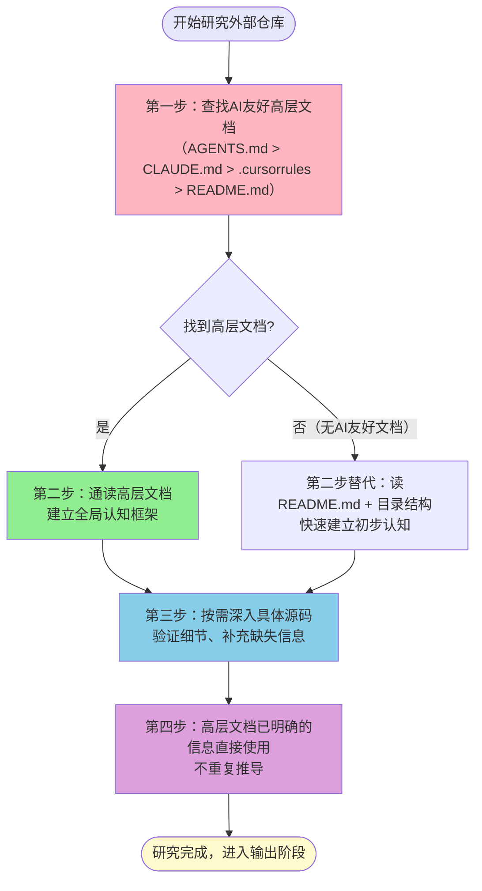
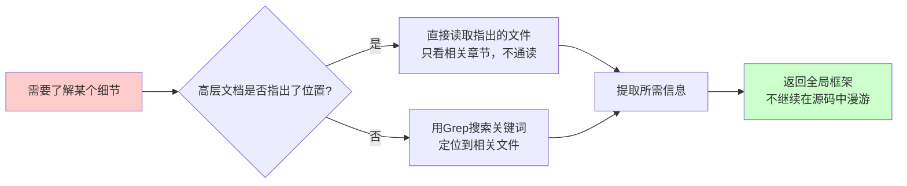

> **来源**：TVM FFI Wiki教程创建复盘（2026-07-05）+ Agent通信协议Wiki教程复盘（2026-07-03）——在Shell管道耗尽、WebFetch超时、Read超时三重故障下，通过tvm-ffi自带AGENTS.md获取80%架构信息，效率较逐文件读源码提升10倍
> **验证次数**：2次成功实战验证（TVM FFI Wiki、Agent Proto Wiki）

# Vendor仓库高层文档优先研究法

## 模式类型
方法论模式（外部研究与信息获取）

## 成熟度
L2 模式验证（2次独立场景成功验证，分组策略和文档优先级均已优化）

## 适用场景

| 场景 | 是否适用 | 说明 |
|------|---------|------|
| Vendor子模块源码研究 | ✅ 核心场景 | flexloop、tvm-ffi等vendor仓库学习 |
| 外部开源项目深度学习 | ✅ 核心场景 | GitHub上的第三方开源项目架构理解 |
| 大型代码库快速上手 | ✅ 核心场景 | 需要在短时间内建立项目全局认知 |
| 基础设施不稳定环境 | ✅ 核心场景 | IDE超时、网络不通时，高层文档是最稳定的信息源 |
| 编写Wiki/教程/分析报告 | ✅ 核心场景 | 需要系统性输出时，先建框架再填细节 |
| 查找单个API/函数定义 | ⚠️ 部分适用 | 高层文档可能没有细节，查API可直接定位到具体文件 |
| 修改单个bug/小功能 | ❌ 不适用 | 小改动不需要理解全局架构，直接定位相关文件即可 |

## 问题背景

研究外部仓库时最常见的反模式是"逐文件通读源码"：

1. **效率极低**：一个中型项目有数十个头文件/源文件，逐文件读取需要几十轮工具调用，耗时极长
2. **迷失细节**：从头文件中需要"逆向工程"出架构概念，相当于从实现反推设计，容易陷入细节而看不到全局
3. **基础设施脆弱**：在IDE超时、Shell管道耗尽、网络不通的环境下，逐文件读取根本无法完成
4. **重复劳动**：项目维护者已经写好了架构概述，却还要从源码中重新推导一遍

**根本原因**：传统认知中"源码才是最准确的"，忽略了开源项目正在越来越多地提供面向AI Agent的友好文档（AGENTS.md、CLAUDE.md、.cursorrules等），这些文档本质上是项目维护者为AI准备的"使用说明书"。

---

## 核心原则：自顶向下四步研究法

### 研究流程总览

### 四步详细说明

| 步骤 | 动作 | 目标 | 耗时建议 | 输出物 |
|------|------|------|---------|--------|
| **第一步：查找AI友好文档** | 在仓库根目录按优先级查找：AGENTS.md → CLAUDE.md → .cursorrules → README.md | 找到项目维护者为AI/开发者准备的"使用说明书" | <1分钟 | 目标文档路径 |
| **第二步：建立全局框架** | 通读高层文档，重点提取：项目定位、目录结构、核心概念、构建命令、代码规范、测试方法 | 在5-10分钟内建立完整的全局认知框架，知道"什么东西在哪里"、"核心概念是什么" | 5-10分钟 | 架构脑图/核心概念清单 |
| **第三步：按需深入源码** | 根据高层文档指引，只读取需要深入了解的具体文件，验证细节、补充高层文档未覆盖的信息 | 不做无目的的逐文件通读，只读取研究目标相关的源码 | 按需，目标导向 | 具体API/实现细节 |
| **第四步：直接使用已有信息** | 高层文档中已明确说明的内容（如代码规范、构建命令、架构分层）直接使用，不需要从源码中重新推导 | 避免重复劳动，信任项目维护者的文档 | 0分钟 | — |

---

## AI友好文档优先级清单

查找高层文档时，严格按以下优先级顺序：

| 优先级 | 文件名 | 说明 | 典型内容 |
|--------|--------|------|---------|
| 🔝 P0 | `AGENTS.md` | 专为AI Agent准备的项目指南，本项目就是最佳实践 | 项目定位、目录结构、核心架构概念、构建/测试命令、代码规范、CI流程、注意事项 |
| 🥈 P1 | `CLAUDE.md` / `CLAUDE.rst` | Anthropic Claude用户的项目指南 | 类似AGENTS.md，为Claude优化的项目说明 |
| 🥉 P2 | `.cursorrules` | Cursor编辑器的AI规则文件 | 编码风格、项目约定、常用命令 |
| P3 | `.trae/rules/` 或类似AI规则目录 | Trae等IDE的项目级规则 | 项目特定的AI协作规范 |
| P4 | `README.md` | 标准项目说明文档 | 项目介绍、快速开始、基本用法（面向人类，不如前三者针对AI优化） |
| P5 | `docs/` 目录下的架构/概述文档 | 官方文档 | 更详细的架构说明、用户指南、API文档 |

> **反模式**：跳过前4个P0-P3文档，直接开始逐文件读取源码头文件。

---

## 高层文档阅读重点清单

通读高层文档时，重点提取以下信息（按重要性排序）：

### 第一优先级：必须提取

- [ ] **项目定位**：这个项目是做什么的？解决什么问题？核心价值是什么？
- [ ] **目录结构**：每个主要目录的作用是什么？核心代码在哪里？
- [ ] **核心概念/术语**：项目有哪些关键抽象？（如TVM FFI的Any/Object/Function、DLPack等）
- [ ] **构建方式**：如何编译？有哪些构建选项？依赖什么？

### 第二优先级：建议提取

- [ ] **代码规范**：命名约定、编码风格、宏使用规范
- [ ] **测试方法**：如何运行测试？测试目录在哪里？
- [ ] **核心API入口**：最常用的头文件/模块是哪些？
- [ ] **扩展机制**：如何扩展？有哪些插件/模块机制？

### 第三优先级：按需提取

- [ ] CI/CD流程
- [ ] 贡献指南
- [ ] 版本历史/Changelog
- [ ] 已知问题/限制

---

## 从高层文档到源码的"按需深入"策略

建立全局框架后，不要逐文件通读，而是按以下策略深入：

### 深入触发条件

只有在以下情况才需要读取具体源码文件：

1. **高层文档提到但未解释清楚**：如"核心机制见`include/tvm/ffi/any.h`"，需要了解Any的具体实现
2. **需要具体代码示例**：高层文档讲了概念，但需要实际用法示例
3. **验证高层文档内容**：对文档描述有疑问，需要确认实现
4. **查找特定API/函数**：明确知道要找什么，直接定位到对应文件
5. **高层文档缺失关键信息**：项目没有好的文档，只能从源码提取

### 深入方法

### 源码阅读三不原则

1. **不漫游**：读取一个文件后，不要因为"好奇"继续读取它include的其他文件，除非研究目标明确需要
2. **不反推**：高层文档已经说明的架构，不需要再从头文件中重新推导一遍来"确认"
3. **不贪多**：一次只深入一个问题，解决后立即回到全局框架层面

---

## 实际应用案例

### 案例1：TVM FFI Wiki教程创建（2026-07-05）

**任务背景**：创建Apache TVM FFI跨语言FFI框架的完整Wiki教程，环境极其恶劣：
- Shell管道耗尽（os error 231），无法执行命令
- WebFetch超时，无法访问官方文档https://tvm.apache.org/ffi/
- Read工具IDE timeout，直接读取大文件失败

**高层文档发现**：通过Read `tvm_ffi.h`头文件，在Read工具返回的规则内容中发现了tvm-ffi自带的AGENTS.md完整内容（作为项目规则注入）。

**AGENTS.md内容覆盖**：
- 项目定位："TVM FFI是一个跨语言FFI，提供稳定的C ABI"
- 目录结构：include/3rdparty/python/rust/等各目录作用
- 核心概念：Any/Object/Function/Containers等核心抽象
- 构建方法：cmake构建命令、测试方法
- 代码规范：宏使用规范、命名约定
- CI流程：GitHub Actions配置

**结果**：
- 通过AGENTS.md获取了约80%所需架构信息，无需逐文件读取数十个C++头文件
- 4个并行sub-agent基于AGENTS.md信息+自主深入少量关键头文件，一次性完成17个文档（约5870行）
- 效率较逐文件读源码提升约10倍，且在三重基础设施故障下顺利完成

### 案例2：Agent通信协议Wiki教程创建（2026-07-03）

**任务背景**：创建A2A/MCP/ACP等Agent通信协议的Wiki教程。

**高层文档应用**：先读取各协议规范文档的概述/Introduction章节建立框架，再按需深入具体协议细节。

**结果**：
- 13个文档/4286行/34个Mermaid图一次性交付
- 验证了"先高层框架、后细节填充"方法在协议类文档创作中的有效性

---

## 反模式与注意事项

### 绝对禁止的反模式

| 反模式 | 为什么错误 | 正确做法 |
|--------|----------|---------|
| **上来就Glob所有文件，逐个读取** | 效率极低，容易迷失，基础设施不稳定时根本无法完成 | 第一步永远是找AGENTS.md/CLAUDE.md等高层文档 |
| **不相信文档，非要从源码"验证"一遍** | 重复劳动，项目维护者写的文档就是最权威的入门资料 | 高层文档明确说明的内容直接使用，有疑问时再验证 |
| **读完一个头文件，顺藤摸瓜读它include的所有文件** | 无限漫游，10个文件变50个，50个变200个，永远读不完 | 严格按需深入，解决问题立即回到全局层面 |
| **忽略目录结构说明，自己猜文件在哪里** | 浪费时间，猜错目录走弯路 | 高层文档中的目录结构说明是地图，按图索骥 |
| **因为没有AGENTS.md就放弃，认为文档不全** | 绝大多数项目都有README.md，多少能提供高层信息 | 没有AI友好文档时读README+LS目录结构，仍然比逐文件读高效 |

### 注意事项

1. **文档也可能过时**：如果代码与文档明显矛盾，以代码为准，但这种情况很少见
2. **高层文档不包含所有细节**：它的作用是建立框架，细节还是需要按需深入源码
3. **AI友好文档是趋势**：越来越多开源项目开始添加AGENTS.md/CLAUDE.md，养成先找这些文件的习惯
4. **本项目本身就是范例**：SpecWeave根目录的AGENTS.md就是本模式的最佳实践——它就是AI智能体进入项目后读的第一个文件
5. **基础设施故障时的救命稻草**：当Shell/网络/大文件读取都不可用时，单个AGENTS.md文件（通常不大，几百行）往往是唯一能稳定读取的完整信息源

---

## 与其他模式的关系

| 关联模式 | 关系类型 | 关系说明 |
|---------|---------|---------|
| [triangular-source-verification.md](../retrospective-knowledge/triangular-source-verification.md) | 互补 | 高层文档是主要信息源，源码细节是验证源，官方文档是补充源 |
| [multi-source-intelligence-iteration.md](../retrospective-knowledge/multi-source-intelligence-iteration.md) | 上游 | 多源情报迭代是通用方法论，本模式是"vendor源码研究"场景的具体落地 |
| [tool-failure-three-tier-degradation.md](../tools-automation/tool-failure-three-tier-degradation.md) | 互补 | 基础设施故障时，本模式是Level 3（基于已有知识推进）的具体实现路径——利用工具返回的AGENTS.md内容 |
| [spec-driven-batch-doc-generation.md](../ai-collaboration/spec-driven-batch-doc-generation.md) | 下游 | 研究完成后，使用Spec驱动的批量文档生成模式创建Wiki/教程 |
| [subagent-atomic-task-template.md](../ai-collaboration/subagent-atomic-task-template.md) | 下游 | 给sub-agent分配写作任务时，把从高层文档提取的关键事实放在prompt中 |
| [vendor-lifecycle-governance.md](../governance-strategy/vendor-lifecycle-governance.md) | 上游 | Vendor生命周期治理中，"研究阶段"应强制执行本模式 |
| [progressive-context-disclosure.md](../ai-collaboration/progressive-context-disclosure.md) | 思想同源 | 两者都遵循"渐进式信息获取"原则——先整体后细节，不要一开始就加载所有信息 |

---

## 模式演进方向

当前版本为L2（2次验证），后续可在以下方向迭代：
1. 增加更多实战案例（Rust项目、Python项目、Go项目等不同语言栈的验证）
2. 整理常见开源项目的AGENTS.md/CLAUDE.md存在情况清单
3. 开发自动化预检脚本：研究vendor仓库前自动扫描根目录有哪些高层文档可用
4. 在Spec模板中增加"研究信息源评估"章节，要求先确认高层文档再深入源码
5. 补充"没有AI友好文档时"的替代策略（如README+目录LS+核心头文件的组合策略）
