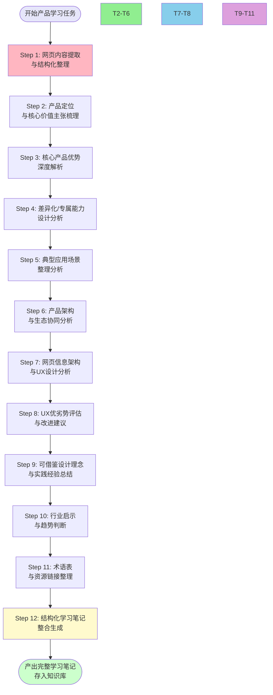

> **来源**：火山引擎豆包搜索（SearchInfinity）产品学习分析复盘（2026-07-06）——在Spec Mode下将产品学习任务分解为12个标准步骤，产出~950行结构化学习笔记，包含10大章节、4个Mermaid图表、场景-能力矩阵、UX深度分析
> **二次验证**：火山引擎AI云原生沙箱学习复盘（2026-07-06）——按11项任务（核心覆盖十二步）拆解，子代理一次性产出967行结构化分析报告，11个章节完整覆盖产品定位、技术架构、四大核心优势、五大应用场景、竞争分析等维度，验证模板在云原生/安全/基础设施类产品同样适用
> **三次验证**：火山引擎双产品学习复盘（2026-07-06-07）——Ark CLI（技术工具类）+ 协作奖励计划（商业模式类）双产品连续学习，验证模板可适配技术工具和商业模式两类不同产品，新增关联链接扫描、增量信息整合、用户重点响应等机制
> **四次验证**：火山引擎方舟大模型平台入门文档学习（2026-07-07）——验证模板在"产品入门文档/快速开始页"（非营销产品页、非完整文档中心）这类特殊页面同样适用；本次从单一入门文档页面提炼出7条战略级洞察（OpenAI兼容战略、默认深度思考价值观、API演进方向、三旗舰模型布局、功能分层成熟度、成本优化内置、AI OS愿景），催生"入门文档镜像分析法"和"默认配置价值观探针法"两个新分析维度
> **验证次数**：4次（火山引擎SearchInfinity搜索产品 + 火山引擎Sandbox云原生基础设施产品 + 火山引擎Ark CLI/协作奖励计划双产品 + 火山引擎方舟入门文档）；部分步骤在之前的Viking AI、贝锐AI等产品学习中也有验证

# 外部产品系统性学习分析十二步任务模板

## 模式类型
方法论模式（外部研究与产品学习任务模板）

## 成熟度
L2 已验证（4次完整实战验证：火山引擎SearchInfinity搜索产品 + 火山引擎Sandbox云原生基础设施产品 + 火山引擎Ark CLI/协作奖励计划双产品 + 火山引擎方舟入门文档；部分步骤有多次历史验证）

## 适用场景

| 场景 | 是否适用 | 说明 |
|------|---------|------|
| 云服务/AI API产品学习 | ✅ 核心场景 | 大模型API、搜索API、Agent平台等 |
| ToB/SaaS产品深度分析 | ✅ 核心场景 | 企业软件、开发者工具、技术产品 |
| 竞品产品系统性研究 | ✅ 核心场景 | 需要全面了解竞争对手产品 |
| 供应商方案评估 | ✅ 核心场景 | 技术选型前的供应商能力调研 |
| 建立知识库产品笔记 | ✅ 核心场景 | 向知识库沉淀结构化产品学习成果 |
| ToC消费产品体验分析 | ⚠️ 部分适用 | ToC更侧重用户体验和视觉，UX分析维度需调整 |
| 开源项目深度研究 | ⚠️ 部分适用 | 开源项目需补充源码/架构分析，本模板侧重产品营销页分析 |
| 简单新闻/文章阅读 | ❌ 不适用 | 不需要12步这么重的流程，简单阅读摘要即可 |

## 问题背景

外部产品学习分析任务常见问题：

1. **维度遗漏**：只分析产品功能，完全不分析页面UX设计、行业趋势、可复用模式
2. **结构不一致**：每次分析的章节结构不同，无法横向对比不同产品
3. **深度不够**：停留在"产品有什么功能"的罗列，没有深入分析"为什么这么设计"
4. **缺乏可视化**：纯文字描述，没有Mermaid图表帮助建立结构化认知
5. **没有沉淀价值**：学完就忘，没有提炼可复用的设计模式和行业洞察
6. **任务分解混乱**：用Spec Mode时任务拆解粒度不一致，要么太粗要么太细

**根本原因**：缺乏标准化的产品学习任务分解模板，每次都要重新思考"该分析哪些维度"，导致遗漏和不一致。

---

## 核心：十二步任务分解模板

### 任务总览流程图

### 任务依赖关系

- T1（内容提取）是所有后续任务的前置依赖
- T2-T6是产品本身分析（顺序执行，逻辑递进）
- T7-T8是UX设计分析（可与T2-T6并行，但建议先完成产品理解再做UX分析）
- T9-T11是洞察和补充材料（依赖前面所有分析）
- T12（整合输出）是最后一步，依赖T1-T11全部完成

---

## 各步骤详细说明

### Step 1：网页内容提取与结构化整理

**优先级**：🔴 高  
**目标**：获取完整、准确、结构化的原始素材，为后续分析提供基础

**具体操作**：
1. 使用 [external-website-analysis-fallback-strategy.md](./external-website-analysis-fallback-strategy.md) 模式获取网页内容
   - 云厂商/科技公司产品页直接首选浏览器类工具（预判SPA）
   - 控制台URL（含console./openManagement等）先预判，优先切换到公开文档站
2. **关联链接快速扫描**（新增子步骤）：
   - 获取目标文档后，快速扫描页面内的相关链接（如"相关文档"、"配套工具"、"了解更多"、"开发者资源"等）
   - 输出相关链接清单，判断是否有重要配套能力需要纳入分析
   - 特别关注：MCP服务、CLI工具、SDK、API参考、插件市场等配套工具链接
   - 案例：Ark CLI文档页内有"方舟文档MCP"链接，属于重要配套能力，应纳入Agent集成章节分析
3. 提取并结构化以下信息：
   - 产品名称、一句话定位、Slogan
   - 核心优势/功能点列表（原文提取，不做解读）
   - 应用场景列表
   - 技术架构描述
   - CTA按钮信息（文案、位置、数量、链接目标）
   - 客户案例/合作伙伴/信任背书元素
   - 配套工具/相关链接清单（从关联扫描中获取）
4. 输出为结构化JSON格式，字段分类清晰
5. 建议：如果需要分析UX，一定要用集成浏览器MCP提取CTA按钮等交互元素细节

**验收标准**：
- [ ] 所有产品核心信息已提取，无关键遗漏
- [ ] CTA按钮信息完整（数量、文案、位置）
- [ ] 结构化JSON字段分类清晰
- [ ] 内容无重复、无截断
- [ ] 已完成关联链接快速扫描，配套工具/相关文档无遗漏
- [ ] 重要配套能力（MCP/CLI/SDK等）已标记纳入后续分析

---

### Step 2：产品定位与核心价值主张梳理

**优先级**：🔴 高  
**目标**：明确"这个产品是什么、为谁服务、解决什么核心问题、差异化在哪里"

**具体操作**：
1. 分析Hero区的一句话定位
2. 梳理目标用户画像（谁会用这个产品？开发者？产品经理？企业决策者？）
3. 提炼核心价值主张（用户为什么要用它？替代了什么现有方案？）
4. 判断产品定位的清晰度：是一句话能讲清，还是看完Hero区仍不知道产品是做什么的？
5. 对比同类产品，找出定位差异化点
6. **入门文档镜像分析（文档页/快速开始页必做）**：
   - 入门文档不是简单的操作指南，而是产品战略的"压缩镜像"
   - 从8个维度提取战略信号：
     a) 第一屏内容（第一眼看到的是什么？slogan/代码示例/模型列表？）
     b) SDK展示顺序和兼容层支持（如OpenAI兼容是否与原生SDK并列展示？）
     c) 5行快速开始示例展示了什么功能？
     d) 默认参数设置（什么默认开启/关闭？反映什么价值观？如深度思考默认开启=质量优先）
     e) 功能排列顺序（按什么逻辑？核心推理→多模态→工具增强？）
     f) 功能分组方式（是否有基础/进阶分层？分组边界反映什么优先级？）
     g) 前沿功能露出位置（MCP/Agent等前沿功能在第一屏还是"更多"里？）
     h) 成本相关功能提及位置（缓存/批处理/折扣在什么位置？）
   - 对每个维度问：为什么产品团队做了这个选择而不是其他选择？

**验收标准**：
- [ ] 能用一句话复述产品定位
- [ ] 目标用户明确（至少1-2类核心用户）
- [ ] 核心价值主张清晰，不是空洞形容词
- [ ] 差异化点有明确依据
- [ ] 已完成入门文档8维度镜像分析（文档页/快速开始页场景下）
- [ ] 默认配置价值观探针已分析（什么默认开/关、默认推荐什么模型）

---

### Step 3：核心产品优势深度解析

**优先级**：🔴 高  
**目标**：深度理解产品宣传的3-5个核心优势，不仅知道"说什么"，还要理解"为什么重要"

**具体操作**：
1. 提取页面宣传的3-5个核心优势（不要自己编，以页面内容为准）
2. 对每个优势进行深度解析：
   - 这个优势具体指什么？（用自己的话解释，避免照搬原文）
   - 它解决了用户的什么痛点？
   - 它的技术/实现支撑是什么？
   - 这个优势在同类产品中是普遍具备还是独有？
3. 分析优势的排列顺序：最重要的优势放在哪里？为什么？
4. 评估优势是否"量化"：是用具体参数/数字支撑，还是空洞形容词？
5. **SDK双轨策略识别（AI/API类产品必做）**：
   - 观察SDK展示方式：是否同时提供原生SDK和OpenAI兼容层？
   - 判断双轨策略成熟度：
     - L1（入门级）：提供兼容端点但风格差异大，文档不突出
     - L2（进阶级）：兼容层文档完善但位置靠后
     - L3（战略级）：兼容层前置到快速开始，与原生SDK并列展示，API风格高度一致（如火山引擎方舟）
     - L4（生态级）：不仅API兼容，还兼容工具链生态
   - 分析"生态借船+差异化留客"战略：兼容层降低迁移门槛（借船），原生能力建立粘性（留客）

**验收标准**：
- [ ] 每个优势都有深度解析，不是简单复制粘贴
- [ ] 每个优势都关联到具体用户痛点
- [ ] 优势之间的逻辑关系清晰（是互补关系还是递进关系？）
- [ ] 有对价值传达方式的评估（量化vs空洞）
- [ ] SDK生态策略已识别（AI/API类产品）：是否提供OpenAI兼容层？双轨策略成熟度如何？

---

### Step 4：差异化/专属能力设计分析

**优先级**：🔴 高  
**目标**：找出产品独有的、差异化的能力设计，这些是产品真正的竞争力

**具体操作**：
1. 对比Step3的核心优势，区分：
   - **通用能力**：同类产品普遍具备的（如"支持API调用"不算优势）
   - **差异化能力**：只有这个产品有、或者做得明显更好的
2. 重点分析产品针对目标用户群体的专属设计：
   - 例如：AI搜索产品是否专门针对大模型做了优化（结构化返回、权威评级等）？
   - 开发者工具是否有开发者体验（DX）专属设计？
3. 分析差异化能力的壁垒：
   - 是技术壁垒？数据壁垒？生态壁垒？还是仅仅是营销话术？
4. 如果有产品架构图，分析架构层面的差异化设计

**验收标准**：
- [ ] 能明确区分通用能力和差异化能力
- [ ] 差异化能力有具体证据支撑（不是自说自话）
- [ ] 分析了差异化壁垒的可持续性
- [ ] 目标用户专属设计已识别

---

### Step 5：典型应用场景整理分析

**优先级**：🔴 高  
**目标**：理解产品在哪些真实场景下使用，建立"用户-痛点-能力-价值"的映射关系

**具体操作**：
1. 提取页面展示的3-5个典型应用场景
2. 对每个场景按统一结构分析：
   - **用户类型**：这个场景的用户是谁？（如：智能客服开发者、内容创作者）
   - **痛点**：不用这个产品时，他们面临什么问题？
   - **使用能力**：这个场景下，产品的哪些能力被用到？
   - **获得价值**：用了之后带来什么具体价值？（效率提升/成本降低/体验变好）
3. 制作**场景-能力映射矩阵表格**：行是场景，列是能力，标记哪些场景用哪些能力
4. 评估场景质量：
   - 场景是否具象（有具体角色和故事），还是抽象（"适用于各种企业场景"）？
   - 场景是否覆盖了核心目标用户群体？
   - 有没有遗漏重要场景？

**验收标准**：
- [ ] 每个场景都按"用户-痛点-能力-价值"四要素分析
- [ ] 生成场景-能力映射矩阵表格
- [ ] 对场景具象化程度有评估
- [ ] 场景覆盖度分析

---

### Step 6：产品架构与生态协同分析

**优先级**：🔴 高  
**目标**：理解产品的技术架构分层，以及它在更大生态中的位置

**具体操作**：
1. 如果页面有架构图，解读架构图的分层逻辑
2. 如果没有架构图，根据功能描述梳理分层架构（推荐用Mermaid画出）：
   - 接入层（API/SDK/控制台）
   - 配置/管理层
   - 核心引擎层
   - AI/处理层
   - 输出层
3. 分析生态协同：
   - 这个产品是否与同公司其他产品深度整合？（如豆包搜索+豆包大模型）
   - 是否支持与第三方系统集成？
   - 在完整解决方案中，它处于什么位置？
4. 分析开放程度：API文档是否容易找到？是否支持自定义配置？

**验收标准**：
- [ ] 产品架构已梳理，建议用Mermaid画出
- [ ] 架构分层逻辑清晰（每层的职责明确）
- [ ] 生态协同关系已分析
- [ ] 产品在技术栈中的定位明确

---

### Step 7：网页信息架构与UX设计分析

**优先级**：🔴 高  
**目标**：分析页面的设计逻辑，理解"为什么这么组织内容"，学习优秀设计模式

**具体操作**：
1. 使用 [b2b-product-page-ux-five-dimensions.md](./b2b-product-page-ux-five-dimensions.md) 五维框架进行分析：
   - **维度1：信息架构**：内容组织逻辑（Hero→优势→架构→场景→CTA）
   - **维度2：价值传达**：定位是否清晰、价值是否量化、场景是否具象
   - **维度3：CTA策略**：CTA数量/位置/文案/层级（重点统计分析）
   - **维度4：视觉呈现**：配图质量、视觉层级、多模态展示
   - **维度5：信任背书**：客户案例、数据支撑、生态协同
2. 用Mermaid画出页面信息架构图（从上到下的内容组织）
3. 如果适用，用AIDA模型分析用户决策路径设计
4. 统计CTA按钮：数量、文案、位置、层级，制作CTA策略分析表
5. 分析内容重复策略：哪些核心信息在多个位置重复？是简单复制还是换框架阐述？
6. **功能分层成熟度判断**：
   - 观察功能导航是否分层（如"基础使用"/"进阶使用"）
   - 使用功能分层成熟度矩阵判断产品阶段：
     - L1-原型期：无分组，简单罗列（<6个功能）
     - L2-成长期：按类型分组但粒度不均
     - L3-成熟期：明确"基础/进阶"两级分层，每组7±2项，边界清晰（如方舟8+8对称结构）
     - L4-生态期：功能分层之上有解决方案/行业场景等高阶导航
   - 分析分层边界反映的战略优先级（什么进基础/什么进进阶，为什么）

**验收标准**：
- [ ] 五维框架至少覆盖4个维度
- [ ] CTA按钮完整统计和分析
- [ ] 页面信息架构用Mermaid可视化
- [ ] 识别出3个以上具体的设计模式/策略
- [ ] 功能分层成熟度已评估，产品阶段判断明确

---

### Step 8：UX优劣势评估与改进建议

**优先级**：🟡 中  
**目标**：客观评估页面设计的优缺点，提出具体可操作的改进建议

**具体操作**：
1. 先总结设计优势：列出3-6个做得好的设计点，每个配具体证据
2. 再识别待优化点：
   - 按优先级排序（高/中/低）
   - 每个问题说明：问题是什么→为什么这是问题→建议怎么改→预期效果
3. 改进建议要具体可操作，不要说"提升用户体验"这种空话
   - ✅ 好例子："在四大场景卡片的'申请测试'按钮旁增加一句说明'无需注册，1分钟开通'，降低用户心理门槛"
   - ❌ 坏例子："优化CTA按钮设计提升转化率"
4. 平衡：不要只挑毛病，也要肯定做得好的地方

**验收标准**：
- [ ] 设计优势总结（3个以上）
- [ ] 待优化点按优先级排序（至少4-6个）
- [ ] 每个改进建议具体可操作，有预期效果说明
- [ ] 评价客观，不是为了挑错而挑错

---

### Step 9：可借鉴设计理念与实践经验总结

**优先级**：🔴 高  
**目标**：从本次学习中提炼可复用的设计模式，应用到未来的工作中

**具体操作**：
1. 回顾整个分析过程，找出值得借鉴的设计理念：
   - 产品功能设计层面的优秀实践
   - 产品营销/价值传达层面的优秀实践
   - UX/交互设计层面的优秀模式
2. 对每个可借鉴点，说明：
   - 这个设计是什么（具体描述）
   - 为什么有效（背后的用户心理/设计原则）
   - 可以应用在什么场景下
3. 重点关注：
   - 分层CTA转化设计
   - 价值量化传达
   - 场景具象化方法
   - 有策略的内容重复
   - 降低决策焦虑的设计

**验收标准**：
- [ ] 至少提炼3-5个可借鉴的设计理念
- [ ] 每个理念都有"是什么-为什么-怎么用"的分析
- [ ] 这些模式具有普适性，不是只适用于这一个产品
- [ ] 区分"可直接复用"和"需要适配后使用"

---

### Step 10：行业启示与趋势判断

**优先级**：🟡 中  
**目标**：从单个产品看到行业趋势，提升洞察深度

**具体操作**：
1. 结合产品分析，判断行业发展趋势：
   - 这个产品反映了什么行业变化？
   - 同类产品是否都在往这个方向走？
   - 这个领域的竞争格局是什么样的？
2. 分析范式转移：
   - 这个产品是否代表了一种新范式？（如AI搜索从"人读"到"AI读"）
   - 旧范式是什么？新范式新在哪里？
3. 生态格局判断：
   - 云厂商、创业公司、开源方案各自的优劣势是什么？
   - 未来谁更可能胜出？为什么？
4. 给出3-5条明确的行业趋势判断，每条有分析依据

**验收标准**：
- [ ] 3-5条行业趋势判断
- [ ] 每条判断有产品分析作为依据，不是凭空猜测
- [ ] 有范式转移层面的洞察（如果适用）
- [ ] 不只是复述产品功能，有升华到行业层面

---

### Step 11：术语表与资源链接整理

**优先级**：🟡 中  
**目标**：整理专业术语和参考链接，方便后续查阅

**具体操作**：
1. 整理文档中出现的专业术语/产品名/缩写：
   - 术语名称
   - 一句话解释
2. 收集相关资源链接：
   - 产品页URL
   - API文档链接
   - 相关产品/技术链接
   - 控制台/试用入口链接
3. 如果有参考的行业报告/相关文章，也一并列出

**验收标准**：
- [ ] 所有关键术语有清晰解释
- [ ] 重要链接已收集整理
- [ ] 术语解释准确，不是复制粘贴宣传语

---

### Step 12：结构化学习笔记整合生成

**优先级**：🔴 高  
**目标**：将前面11步的分析成果整合为一篇结构完整、格式规范的学习笔记，存入知识库

**具体操作**：
1. **文件格式要求**：
   - 使用YAML frontmatter，包含id/title/source/date/tags等字段
   - 文件命名使用kebab-case
   - 存入正确的知识库目录（如docs/knowledge/learning/...）
2. **文档结构建议**（10大章节）：
   1. 产品定位与核心价值主张
   2. 四大核心产品优势深度解析
   3. 差异化/专属能力设计分析
   4. 典型应用场景（含场景-能力矩阵）
   5. 产品架构与生态协同
   6. 网页信息架构与UX设计分析
   7. UX设计优劣势评估与改进建议
   8. 可借鉴的设计理念与实践经验
   9. 行业启示与趋势判断
   10. 术语表与资源链接
3. **Mermaid图表要求**：至少包含以下4类可视化：
   - 产品能力/优势架构图
   - 产品技术分层架构图
   - 页面信息架构图
   - AIDA转化漏斗图（或用户决策路径图）
4. 格式规范：
   - 表格用于矩阵、对比、清单类信息
   - 代码块用于Mermaid图表
   - 适当使用加粗、列表增强可读性
5. 完成后验证：
   - Mermaid语法正确（至少4个图表）
   - 所有链接格式正确
   - frontmatter字段完整
   - 没有空洞内容，每个章节有实质分析

**验收标准**：
- [ ] YAML frontmatter格式正确，字段完整
- [ ] 文档结构完整（至少覆盖上述10大章节）
- [ ] Mermaid图表≥4个，语法正确
- [ ] 文件命名和目录路径符合知识库规范
- [ ] 内容有深度，不是材料堆砌
- [ ] 没有复制粘贴原文大段内容，有自己的分析和解读

---

## 用户重点响应提示机制

当用户在任务描述中明确提到某个功能/操作/主题需要特别关注时（如"特别注意包含取消链接相关操作"），必须启动用户重点响应机制：

### 响应SOP

1. **识别信号**：在任务描述中标记用户显式提及的重点内容
2. **独立章节**：将该内容设为独立重点章节，而非嵌入其他章节简单带过
3. **深度展开**：从多个维度深度解析：
   - 触发方式/入口位置
   - 完整操作流程（每一步的交互细节）
   - 即时效果（操作后立即可见的变化）
   - 后续影响（长期、系统性的影响）
   - 对称性分析（是否有对应的"恢复/链接"操作？设计是否对称？）
   - 交互设计考量（为什么这么设计？用户体验权衡）
   - 业务逻辑/设计理念
4. **突出显示**：在报告摘要/前言中明确提及该重点章节
5. **充分覆盖**：章节长度应与内容重要性匹配（重点章节可占总报告15-25%篇幅）

### 案例：协作奖励计划"取消链接"操作

- 用户信号："特别注意包含取消链接相关的操作选项及对应的功能实现"
- 响应方式：设置独立第5章"撤回授权/取消链接操作详解"（8个子节约180行）
- 展开维度：触发入口→确认流程→即时效果→后续影响→对称性分析→交互设计考量→平台治理逻辑→开发者建议
- 结果：该章节成为报告核心亮点，用户关注点得到充分响应

---

## 增量信息整合三原则

在连续任务或用户补充文档场景下，当已有分析报告后又获得新信息时，遵循以下三原则：

### 原则1：不返工（No Rework）

- 新内容补充到现有报告的合适位置，不重新生成整个报告
- 不推翻已有章节结构，只做增量补充
- 避免"既然有新内容不如重写一遍"的完美主义陷阱

### 原则2：找挂载点（Find Anchor）

- 寻找新内容与现有章节的逻辑关联点
- MCP服务 → Agent集成/生态协同章节
- CLI工具 → 开发者体验/接入方式章节
- 商业模式补充 → 生态/激励机制章节
- 如果没有直接对应章节，在合适位置新增子章节

### 原则3：催生新洞察（Generate New Insights）

- 新内容不只是补充，可能带来超越原文档的新洞察
- 案例：Ark CLI + 方舟文档MCP = 双层Agent架构洞察（CLI做本地执行层，MCP做知识访问层）
- 新增内容放入后，重新审视全局，提炼跨模块的组合洞察

---

## 任务委派与执行建议

### Spec Mode任务分解

使用Spec Mode时，tasks.md中的任务可以按以下方式组织：
- Task 1：内容提取（高优，独立任务）
- Task 2-6：产品维度分析（可委派给一个Sub-Agent，因为是连贯的产品理解过程）
- Task 7-8：UX分析（可委派给一个Sub-Agent，专注设计分析）
- Task 9-11：洞察与补充（可委派给一个Sub-Agent，基于前面的分析提炼洞察）
- Task 12：整合输出（高优，最终整合）

**关键经验**：给Sub-Agent委派任务时，务必提供Step 1产出的结构化JSON作为输入，结构化输入能显著提升Sub-Agent输出质量，减少返工。

### 任务时间估算（参考）

| 步骤 | 预计耗时 | 说明 |
|------|---------|------|
| Step 1 | 10-15分钟 | 含工具选择、内容提取、JSON整理 |
| Step 2-6 | 20-30分钟 | 产品维度深度分析 |
| Step 7-8 | 15-20分钟 | UX分析（用框架较快） |
| Step 9-11 | 15-20分钟 | 洞察提炼、术语整理 |
| Step 12 | 10-15分钟 | 整合、格式化、图表、验证 |
| **总计** | **70-100分钟** | 约1.5小时可完成一篇高质量深度分析 |

---

## 实际应用案例

### 案例1：火山引擎豆包搜索（SearchInfinity）产品学习（2026-07-06）

**执行情况**：
- 严格按12步模板执行
- Step 1：WebFetch失败后切换到集成浏览器MCP，提取完整内容并结构化JSON
- Step 2-6：分析产品定位（AI Agent专属信息获取引擎）、四大优势、AI专属能力、四大场景、五层架构
- Step 7-8：用五维框架做UX分析，识别6个优势+6个改进建议
- Step 9-11：提炼9条核心洞察、3个可复用模式、行业趋势判断、术语表
- Step 12：整合为950行学习笔记，4个Mermaid图表，场景-能力矩阵

**结果**：
- 产出950行高质量结构化学习笔记
- 10大章节完整覆盖所有维度
- 4个Mermaid图表（产品能力架构、五层技术架构、页面信息架构、AIDA漏斗）
- CTA策略分析等内容具有超越产品本身的方法论价值
- 成功沉淀出2个L1新模式+升级1个L2模式

### 案例2：火山引擎AI云原生沙箱（2026-07-06）

**执行情况**：
- 按11项任务拆解（核心覆盖十二步）
- 子代理一次性产出967行结构化分析报告
- 11个章节完整覆盖产品定位、技术架构、四大核心优势、五大应用场景、竞争分析等维度

**结果**：
- 验证模板在云原生/安全/基础设施类产品同样适用
- 子代理委派模式有效，结构化输入保证输出质量

### 案例3：火山引擎双产品连续学习（Ark CLI + 协作奖励计划，2026-07-06-07）

**执行情况**：
- 产品1：Ark CLI（技术工具类）—— 开发者命令行工具
- 产品2：协作奖励计划（商业模式类）—— 平台激励机制
- 连续任务复用前执行4项适配性检查，发现任务类型差异
- Step1关联链接扫描发现"方舟文档MCP"配套能力，纳入Agent集成分析
- 用户明确要求重点关注"取消链接"操作，启动用户重点响应机制
- 控制台URL触发降级策略，切换到公开文档站获取完整内容

**关键适配调整**：
- 技术工具类（Ark CLI）：侧重开发者体验、命令设计、架构分层、生态协同（CLI+MCP双层架构）
- 商业模式类（协作奖励计划）：侧重激励机制设计、平台治理逻辑、多方博弈、用户生命周期
- 用户重点内容：独立第5章深度展开（8子节约180行），成为报告核心亮点

**结果**：
- 验证模板可适配技术工具和商业模式两类不同产品
- 新增关联链接扫描、用户重点响应、增量整合三原则等机制有效
- 产生"CLI+MCP双层Agent架构"等跨模块组合洞察
- 连续任务模板复用效率提升约40%（基于前序任务模板调整而非从零开始）

### 案例4：火山引擎方舟大模型平台入门文档（2026-07-07）

**执行情况**：
- 学习对象为产品入门文档页（非营销产品页、非完整文档中心），属于新页面类型验证
- 入门文档仅单页内容（非多页文档中心），但通过"入门文档镜像分析法"提炼7条战略级洞察
- 重点分析维度：SDK双轨策略（5种接入方式含OpenAI兼容）、默认配置（深度思考默认开启）、功能分层（8基础+8进阶对称结构）、模型矩阵（三旗舰Seed布局）、API演进（/v3/responses统一接口）、成本优化内置、AI OS愿景（MCP+GUI Agent）

**关键发现**：
- 验证模板在"入门文档/快速开始页"场景完全适用，且入门文档是战略洞察的高密度信息源
- 催生3个新分析维度：入门文档镜像分析法（8维度）、默认配置价值观探针（3层次）、双轨SDK策略识别框架（4级成熟度）
- 催生1个新判断工具：功能分层成熟度判断矩阵（L1-L4四阶段）
- 1038行深度分析报告，25个专业术语，7条核心洞察

**结果**：
- 模板validation_count从3增至4，正式迈入L2稳定期
- 新页面类型（入门文档/快速开始页）验证通过，扩展了模板适用边界
- 4个新分析框架/工具待后续案例验证后沉淀为独立模式

---

## 反模式与注意事项

### 绝对禁止的执行反模式

| 反模式 | 为什么错误 | 正确做法 |
|--------|----------|---------|
| **跳过Step1直接分析** | 没有结构化素材，分析容易遗漏关键信息，CTA按钮等交互细节会丢失 | 先完整提取和结构化整理，再开始分析 |
| **只分析产品不分析UX** | 页面本身的设计逻辑也是重要学习对象，好的UX设计值得借鉴 | 永远包含Step7-8的UX分析，这是高价值维度 |
| **大段复制粘贴原文** | 这是材料收集不是学习分析，没有自己的理解和洞察 | 用自己的话解读，原文只作为引用证据 |
| **不做Mermaid图表** | 纯文字难以建立结构化认知，可视化帮助理解也帮助读者 | 至少4个Mermaid图表，这是硬性要求 |
| **只说优点不说问题** | 不客观，无法全面理解产品设计的权衡 | 优劣势都要分析，改进建议要具体 |
| **跳过Step9-10直接输出** | 这是最有价值的洞察部分，跳过则学习笔记价值大幅降低 | 一定要提炼可复用模式和行业趋势 |
| **任务分解太细（如每步一个任务）** | Sub-Agent切换成本高，上下文不连贯 | Step2-6/7-8/9-11分别合并委派 |

### 注意事项

1. **模板灵活调整**：这是通用模板，具体产品可根据特点增减步骤（如开源项目要加源码分析）
2. **产品阶段适配**：早期产品可能没有客户案例，这不是页面设计问题
3. **多产品对比**：如果是竞品对比分析，每个产品都按这个模板分析，最后加横向对比章节
4. **Mermaid先构思再画**：画图的过程也是梳理思路的过程，不要等最后才画
5. **Sub-Agent输入质量决定输出质量**：给Sub-Agent的任务描述要详细，最好附带结构化JSON和每个步骤的具体要求
6. **场景-能力矩阵必做**：这个表格是建立"场景-能力"映射的关键，不要省略
7. **CTA统计必做**：CTA是转化核心，统计CTA是理解页面设计意图的钥匙

---

## 与其他模式的关系

| 关联模式 | 关系类型 | 关系说明 |
|---------|---------|---------|
| [external-website-analysis-fallback-strategy.md](./external-website-analysis-fallback-strategy.md) | 前置依赖 | Step1使用该模式获取网页内容 |
| [b2b-product-page-ux-five-dimensions.md](./b2b-product-page-ux-five-dimensions.md) | 包含 | Step7使用该五维框架进行UX分析 |
| [cross-vendor-knowledge-fusion.md](./cross-vendor-knowledge-fusion.md) | 上游 | 多产品对比分析时，使用本模板逐个分析后再用融合模式整合 |
| [vendor-high-level-doc-first-research.md](./vendor-high-level-doc-first-research.md) | 互补 | 开源/有文档的产品先读高层文档，再用本模板补充产品页分析 |
| [extraction-four-layer-funnel.md](../retrospective-knowledge/extraction-four-layer-funnel.md) | 思想同源 | Step9提炼可复用模式是信息萃取的具体应用 |
| [spec-mode-doc-creation-workflow.md](../ai-collaboration/spec-mode-doc-creation-workflow.md) | 包含 | 本模板是Spec Mode在"产品学习"场景的具体任务分解 |

---

## 模式演进方向

当前版本为L2（4次完整验证：搜索产品+沙箱+双产品连续学习+方舟入门文档），后续可在以下方向迭代：
1. 增加更多实战案例（5-8个不同类型产品验证，向L3演进）
2. 针对不同产品类型（API产品/CLI工具/无代码/开源商业/SaaS/商业模式激励）制作差异化子模板
3. 补充Mermaid图表模板片段（产品架构/场景矩阵/生态关系等），直接复用减少绘图时间
4. 增加竞品横向对比分析的附加章节模板
5. 制作Spec Mode的tasks.md模板片段，直接复制使用
6. 补充学习笔记质量评分标准
7. 完善增量信息整合流程的checklist
8. 增加用户重点内容识别的信号清单
9. 增加"入门文档页"子类型的任务分解调整指南（文档页vs营销页的分析差异）
10. 整合"入门文档镜像8维度分析法"和"默认配置价值观探针"为标准分析步骤
