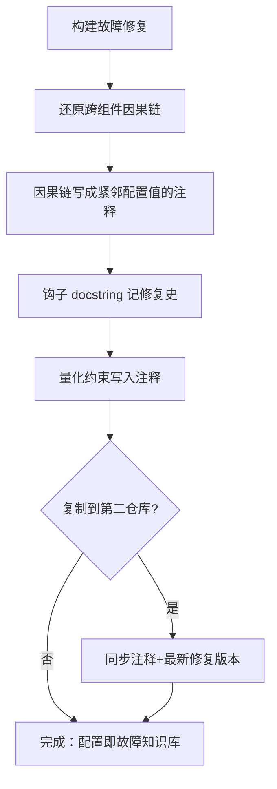

# 故障注释固化（Failure-Annotation Config）

## 模式类型

复盘知识模式（复盘产物的就地固化与知识传承）

## 成熟度

L2-validated（双案例支撑：正例 + 反例互证，见「正例与反例」）

> **成熟度注**：正反两案例同谱系（子模块与主仓库的复制关系），反例验证了"违反模式必现活跃缺口"。升级 L3 需独立第三方仓库的正向应用验证。

## 模式概述

构建/工具链配置因**外部组件组合行为**反复出错时，修复产生的知识（因果链、边界条件、量化依据）必须**就地固化在最接近故障点的配置文件里**——紧邻防御性配置值的注释与钩子 docstring——而不是提交信息或外部文档。后两者都会被遗忘、都会在代码复制时丢失。

核心思想：**配置文件不只是"声明期望状态"，还是"曾经如何失败"的知识库**。把每次试错的因果链写回配置源码，让任何修改者改配置前必然先读到历史教训，一次性试错成本即转化为永久知识资产。

> **为什么注释必须紧邻配置值？** 提交信息随时间沉没、外部文档与代码演化脱节、代码复制时只搬代码不搬文档——唯有写在配置值旁边的注释，与受保护的值同文件、同 diff、同复制单元，修改者无法绕过。

> **角色演化特征（认知基础，源自洞察 1）**：配置文件反复防御故障后，其角色会悄然从"声明期望状态"演化为**"故障案例库的压缩形态"**——注释+钩子的行量占比可达约 40%，注释密度甚至超过配置本身。这不是过度注释，而是复盘产物就地固化的必然形态；识别出这一特征，是自觉应用本模式的起点。

## 适用场景

**适用于**：
- 文档构建（Sphinx/MyST 等）、CI 流水线、打包工具等"多组件组合涌现行为"导致的配置故障
- 修复依赖对第三方内部行为的逆向理解（单一组件文档中不存在该组合行为）
- 同一钩子/配置片段会被复制到多个仓库的场景
- **识别信号**：某配置文件的注释+钩子行量占比已高（约 30-40% 以上）且注释多对应历史故障——该配置已承担"故障知识库"角色，应按本模式自觉维护（新增防御项禁止裸值）

**不适用于**：
- 自身代码逻辑错误——应写测试而非注释（注释不能替代断言）
- 一次性环境问题——应修环境而非固化环境知识
- 平凡到语义自明的配置值——裸值即可，强加注释是噪音

## 问题背景

构建与工具链配置的正确性往往只能靠"症状驱动"发现：故障来自多个外部组件的组合涌现行为，任何单一组件的官方文档都不描述该行为，静态审查无法预见。修复后，因果链知识只存在于修复者脑中，而三个默认存放点都不可靠：

| 存放点 | 失效方式 |
|---|---|
| 提交信息 | 随历史沉没，三个月后无人翻查 |
| 外部文档 | 与代码演化脱节，维护成本高，终被遗忘 |
| 代码复制 | 只搬代码不搬知识，加固逻辑在副本中丢失 |

结果：同一故障在人员更替或仓库分叉后重新发生，每次都要重新付出逆向理解第三方行为的成本。

案例事实：`awesome-okf-xs/doc/conf.py`（256 行）在 9 天内 14 次提交、9 次 fix（64%），全部关键防御（日期引号钩子、重复 H1 去重、tippy 离线关卡、sitemap 方案、导航深度上限）都诞生于真实构建失败之后，无一预先设计。

## 核心规则（5 步）

1. **还原因果链**：修复构建故障后，先完整还原跨组件因果链——哪个组件的哪个行为 × 哪个配置值 = 什么症状
2. **紧邻固化**：把因果链写成**紧邻防御性配置值**的注释；禁止裸值——每个抑制/锁定/禁用项必须附"为什么"
3. **docstring 记修复史**：钩子/补丁的 docstring 记录"初版如何错、加固版改了什么、误伤的具体样例"
4. **量化约束入注释**：把数字依据写进注释（如"5640 页 × ~1MB ≈ 5-6GB > GitHub Pages 1GB 限制"），让未来修改者能判断前提是否仍成立
5. **复制必带注释**：同一钩子/配置被复制到第二仓库时，同步注释与最新修复版本，禁止只搬代码

## 反例警示（反模式：不要这么做）

三个反模式均来自实际案例教训：

### 反模式1：裸抑制
- **来源**：对照案例中 `suppress_warnings` 9 项逐项附抑制理由的正例
- **表现**：`suppress_warnings` 只列条目不写理由
- **后果**：三个月后无人敢删也无人敢留，条目是否仍必要无法判断
- **正确做法**：每条抑制/锁定/禁用附"为什么"注释（属噪音而非内容错误？绕过哪个组件的什么行为？）

### 反模式2：修复只留在提交信息里
- **来源**：主仓库 `docs/conf.py` 实锤——复制钩子时漏掉 d3db4a5f 加固逻辑，因修复理由只存在于子模块提交历史
- **表现**：修复理由写在 commit message，代码里只有无注释的加固逻辑
- **后果**：代码复制时加固逻辑必然丢失，旧副本成为活跃定时缺陷
- **正确做法**：因果链写进代码注释与 docstring，提交信息只做索引

### 反模式3：无条件文本变换
- **来源**：第一代日期引号钩子对"日期开头的长纯量"误伤，在中文值中间插入孤立引号导致 Malformed YAML
- **表现**：用无条件正则替换修复文本解析类问题，不带边界条件
- **后果**：修复本身制造新故障，且误伤样例不被记录则下轮修复重蹈覆辙
- **正确做法**：文本变换类修复必须带边界条件（值完整性、位置起始性），并把误伤样例写进 docstring

## 检验标准

- 随机抽取任一防御性配置值，能在 **10 秒内**从相邻注释回答"删掉它构建会坏在哪里"
- 钩子/补丁的 docstring 含完整修复史：初版错误、加固改动、误伤样例
- 量化约束带数字，未来修改者可重算前提是否仍成立
- 跨仓库副本与源实现逐行一致（含注释），`diff` 为空
- 新增抑制/禁用项若为裸值，在评审中被拦截

## 实施检查清单

- [ ] 故障因果链已完整还原（组件行为 × 配置值 = 症状）
- [ ] 因果链注释紧邻防御性配置值，而非提交信息或外部文档
- [ ] 钩子/补丁 docstring 记录修复史与误伤样例
- [ ] 量化约束（数字依据）已写入注释
- [ ] 跨仓库复制时注释与最新修复版本已同步
- [ ] 10 秒检验通过：任取一防御性配置值可答"删掉会坏在哪"

## 跨场景应用示例

- **CI 工作流**：某 `if:` 条件是为绕开特定 runner 的缓存损坏——把该事故写进条件旁注释，而非 PR 描述
- **Dockerfile**：`--mount` 参数是为规避某基础镜像的依赖解析缺陷——参数旁注明缺陷与复现方式
- **nginx location 规则**：某条 rewrite 是防御第三方回调的畸形请求——注明请求形态与故障现象
- **非软件领域**：设备巡检卡上"阀门 X 必须先关再开，2024-03 因反序操作导致 Y 故障"——把"为什么"固化在操作点旁，与操作动作同载体

## 正例与反例：案例支撑

| 案例 | 角色 | 事实 | 结果 |
|---|---|---|---|
| awesome-okf-xs/doc/conf.py | 正例 | 14 次提交 9 次 fix（64%）；9 项告警抑制逐项附理由；mermaid 版本锁定、社交卡片禁用均附因果注释；两钩子 docstring 带两代修复史 | 256 行配置承载 9 天故障知识，修改者改配置前必然先读到教训 |
| 主仓库 docs/conf.py | 反例 | 复制 `_quote_frontmatter_dates` 时未带 d3db4a5f 加固（无起始检查、无完整值检查）与注释；主仓库现存 5 处"日期开头长纯量"frontmatter | 旧版钩子具备触发条件，属活跃滞后缺口（A-1 待回同步） |

## 与现有模式的关系

- [不可变约束清单模式](../governance-strategy/immutable-constraint-documentation.md)：集中式约束文档（外部清单）与本模式（就地注释）互补——清单适合跨文件的全局约束，就地注释适合与单一配置值强绑定的因果链；两者都遵循"没有原因的约束是教条"
- [Bug即资产转化机制](bug-as-asset.md)：bug-as-asset 判断"修复是否值得萃取"（三条件），本模式回答"萃取出的故障知识固化在哪里"——上下游互补
- [即时复盘沉淀模式](immediate-retrospective-sedimentation.md)：即时复盘解决"何时沉淀"（修复后立即），本模式解决"沉淀在哪个载体"（故障点就地）

## 溯源与配套资产

- 复盘报告：[retrospective-okf-conf-py-build-config-20260902.md](../../../reports/project-governance/documentation-governance/retrospective-okf-conf-py-build-config-20260902.md)（模式E-1 + 洞察1/2/3 + 事实 F-007~F-028 + V阶段 5 意见 4 采纳）
- 分析对象：`projects/awesome-okf-xs/doc/conf.py`（子模块只读引用）
- 关联行动项：A-1 主仓库钩子回同步（待执行）、A-2 `myst_title_to_header` 启用前同步去重钩子（观察）、A-3 myst-parser 升级时重验两钩子必要性（观察）

## 对抗审查记录

内容级 V 审查已在源复盘会话完成（4 视角 5 意见采纳 4 条，见复盘报告第 5 节）。入库会话（sc-20260902-sediment-failure-annotation）针对沉淀决策执行增量审查：

| # | 视角 | 攻击点 | 处置 |
|---|------|--------|------|
| V-1 | 🔴 魔鬼代言人 | 正反两案例同谱系（复制关系），是否够格 L2？ | 采纳：保留 L2（反例独立验证了"违反必现缺口"），但补成熟度注说明升级 L3 需独立第三方仓库正向验证 |
| V-2 | 🟢 新人 | 与「不可变约束清单」边界不清，不知何时用哪个 | 采纳：「与现有模式的关系」明确分工——清单管跨文件全局约束，就地注释管单一配置值强绑定因果链 |
| V-3 | 🟠 老板 | 模式库已 400+ 条，新增一条的边际价值？ | 未采纳为修改：本模式填补"故障知识固化载体"空白（现有模式回答"是否萃取/何时复盘"，无一回答"固化在哪"），且带实锤反例 |
| V-4 | 🔵 未来 | 若工具链进化到自动记录配置变更理由（如 AI 辅助配置管理），就地注释会过时 | 采纳：核心规则 4 已含"量化前提可重算"要求；模式本质是"知识与受保护对象同载体"，载体形式可随工具演进 |

**合并记录**（sc-20260902-sediment-insight1）：源报告洞察 1「配置文件演化为构建故障知识库」经三维重叠度判定（场景/机制/建议均值 >70%，见 pattern-merge-boundary）与本模式高度重叠，未新建模式，其增量「角色演化识别特征」已合并至模式概述与适用场景。

**合并记录**（sc-20260902-sediment-insight2）：源报告洞察 2「正确性只能靠症状驱动发现，无法靠静态审查预见」经三维重叠度判定（场景~95%/机制~90%/建议~95%，均值 >70%）与本模式高度重叠（问题背景已含其陈述），未新建模式，其增量「配置即实验的认知重构」已合并至问题背景。

**合并记录**（sc-20260902-sediment-insight3）：源报告洞察 3「跨仓库同步滞后缺口/旧副本活跃定时缺陷」经三维重叠度判定（场景~85%/机制~85%/建议~95%，均值 ~88% >70%）与本模式高度重叠（核心规则 5 + 反模式 2 + 反例已覆盖），未新建模式——coverage 脚本因索引粒度粗建议"新建"，经人工语义比对不采信；其增量「触发面随时间扩大的定时机制」已合并至反模式 2。
