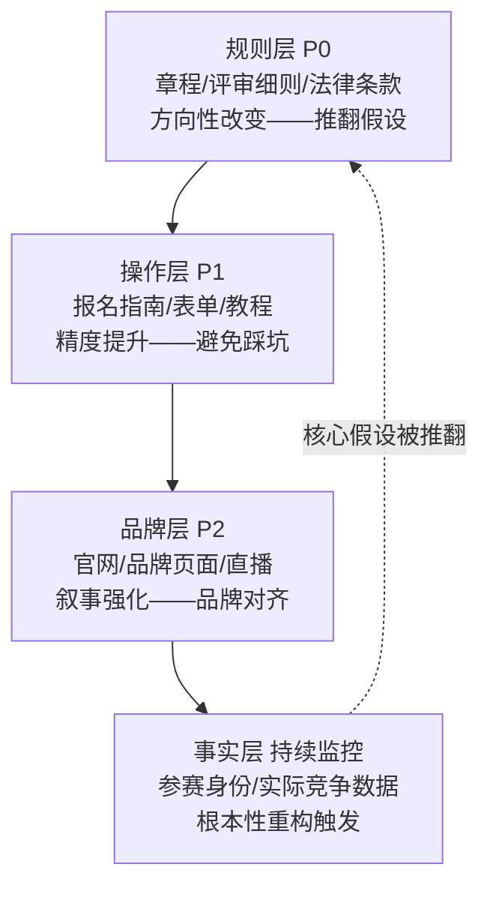

+++
id = "information-source-tiered-collection"
domain = "methodology"
layer = "methodology"
maturity = "L2"
validation_count = 2
reuse_count = 0
documentation_level = "basic"
source = "docs/retrospective/reports/competitive-analysis/retrospective-specweave-contest-advantage-analysis-20260624/retrospective-meta-20260625/insights/information-source-layered-collection.md"

[bindings]
rules = []
references = ["multi-source-intelligence-iteration.md"]
skills = []
+++

# 信息源分层采集策略

## 核心原则

竞品分析/情报研判的信息采集不应"碰到什么读什么"——应严格按「规则层优先→操作层次之→品牌层佐证→事实层验证」的顺序分层采集。规则层信息决定策略方向（方向错了全盘重来），操作层信息提升执行精度（可后置补），品牌层信息提供叙事素材（无策略影响），事实层信息触发根本性重构（当核心假设被推翻时）。

## 成熟度评估

| 维度 | 评估 | 依据 |
|------|------|------|
| 实践验证 | 中 | 2次验证（11轮竞品分析的13来源分层采集+v12二手源可信度校验） |
| 可复用性 | 高 | 适用于任何需要多源信息采集的分析场景 |
| 通用性 | 高 | 赛事分析/竞品调研/政策研判/招投标情报 |

## 四层采集模型



| 层级 | 典型来源 | 对策略的影响 | 采集优先级 | 示例 |
|------|---------|------------|-----------|------|
| 规则层 | 赛事章程、评审细则、法律条款、晋级规则 | 方向性改变——推翻假设或建立新约束 | P0（先读） | 评审四维度权重、单作品Best Shot规则 |
| 操作层 | 报名指南、提交表单、教程、FAQ | 精度提升——优化执行路径、避免踩坑 | P1（次读） | 话题精确格式、HTML文件大小限制 |
| 品牌层 | 官网、品牌页面、官方直播、灵感示例 | 叙事强化——提供叙事素材、品牌对齐 | P2（后读） | 30+灵感示例矩阵、品牌关键词、产品线定位 |
| 事实层 | 参赛身份、已通过审核状态、竞争对手实际作品 | 根本性重构——当核心假设被推翻时触发重写 | 持续监控 | 竹简悟道报名帖揭示真实参赛身份、12,000+竞争规模数据 |

## v12补充：二手源可信度标注

v12迭代发现，除了四层内容分层，还需增加**来源转述层级**标注：

| 来源层级 | 可信度 | 处理策略 |
|---------|--------|---------|
| 一手源（官方章程/规则文档/产品经理直播） | 最高 | 作为决策依据 |
| 二手源（个人汇总/社区教程/第三方解读） | 中高 | 作为线索来源，关键决策点必须回溯一手源验证 |
| 三手源（基于二手源的再加工） | 低 | 仅作参考，不直接用于策略决策 |

关键认知：**二手源的价值不在于"提供正确答案"，而在于"提供线索"**——它可能揭示一手源中你尚未注意到的关键信息（如社会公益奖），但具体规则细节必须回溯到一手源验证。

## 反例：层级错位

- 先花3小时分析官网品牌叙事，再发现评审规则中有一条"单作品Best Shot"推翻全部方案 → 3小时白费
- 在"评审维度权重未知"的缺口下完成完整策略，拿到权重后发现30%体验维度是最大短板 → 策略需要重写
- 直接采用二手源的评审维度名称，与官方章程不一致 → Demo帖结构错位
- 跳过奖项表逐行扫描，只看主赛道奖项 → 遗漏竞争者少一个数量级的隐性奖项通道

## 操作检查清单

```
□ 是否先读完所有规则层文档再开始策略制定？
□ 操作层信息是否在策略确定后再补充？
□ 品牌层信息是否仅用于叙事强化而非策略决策？
□ 是否持续监控事实层变化（如真实参赛身份确认）？
□ 二手源信息是否标注"待验证"标签？
□ 关键决策点是否回溯一手源确认？
□ 奖项列表是否逐行扫描（而非只看主赛道）？
```

## 与其他方法论的关系

| 方法论 | 关系 |
|--------|------|
| `multi-source-intelligence-iteration.md` | 互补——本模式讲"怎么有序采集"，multi-source讲"怎么增量分析"。本模式是multi-source五子系统中"可信度加权源分层"子模式的扩展，新增了二手源可信度标注和隐性奖项识别检查清单 |
| `zero-sum-rule-inversion.md` | 上游——规则层信息是zero-sum规则反利用的输入 |

## 适用条件

- 涉及多个权威数据源、信息逐步释放的竞争分析场景
- 数据源存在一手/二手/三手的转述层级差异
- 分析结果需要持续演进而非一次性定稿

## 不适用场景

- 信息一次性完整交付、无后续数据源补充的分析任务
- 单数据源即可完成的分析

> 来源：TRAE大赛13个信息源的11轮迭代+v12二手源矛盾校验实践
> 关联模块：`multi-source-intelligence-iteration.md`、`zero-sum-rule-inversion.md`
