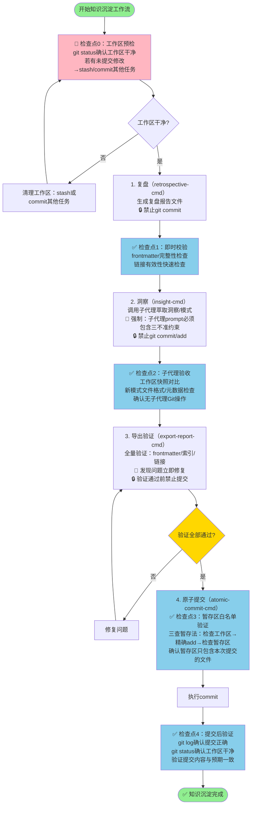

# 增强版知识沉淀工作流SOP（Enhanced Knowledge Sedimentation Workflow SOP）

## 模式概述

知识沉淀工作流标准执行流程，原"复盘→洞察→萃取→导出→提交"5步线性流程的增强版本，新增**工作区预检、每环节即时校验、白名单验证、提交后验证**4个关键检查点，解决原流程中子代理越权提交、暂存区污染、质量问题集中暴露在最后环节等问题。本SOP定义了每个阶段的输入/输出/质量门禁，提供Mermaid流程图和常见陷阱规避方法。

## 问题背景

### 原5步流程的缺陷

原始的"复盘→洞察→萃取→导出→提交"线性流程在2026-07-04知识沉淀任务中暴露了以下问题：

1. **无工作区预检**：工作流开始时工作区已有其他任务未提交修改，导致后续暂存区污染
2. **无即时校验**：所有质量问题（frontmatter错误、索引缺失、断链）全部集中在导出环节才发现，共9个问题
3. **子代理无Git约束**：子代理在萃取环节完成后自动提交，绕过导出验证，造成提交粒度失控
4. **提交前无白名单验证**：git add时无关文件反复进入暂存区，需2轮reset清理
5. **无提交后验证**：提交后未验证提交结果是否正确

### 问题导致的后果

- 总耗时50分钟，其中提交阶段问题处理占8分钟（16%）
- 子代理擅自提交造成提交历史碎片化
- 9个格式问题在最后环节集中修复
- 暂存区反复清理增加操作复杂度和误提交风险

## 增强版工作流总览

### 流程图

### 六大执行原则

| 原则 | 具体要求 | 违反后果 |
|------|---------|---------|
| **工作区干净原则** | 工作流开始前必须确认git status干净，其他任务修改必须先stash或提交 | 暂存区污染、无关文件混入提交 |
| **子代理三不准原则** | 所有子代理严格禁止执行git commit/add/push等写操作，只负责文件生成 | 提交粒度失控、未验证文件入库 |
| **质量左移原则** | 每个文件生成后立即执行轻量级格式校验，不把问题留到最后 | 问题累积到导出环节集中处理，修复成本高 |
| **精确add原则** | 永远使用`git add <精确文件路径>`，禁止`git add .`或`git add -A` | 误添加无关文件 |
| **暂存区白名单原则** | commit前必须验证暂存区只包含本次提交计划内的文件，有额外文件立即清理 | 脏提交、无关变更入库 |
| **验证不通过不提交原则** | 导出验证发现的问题必须100%修复后才能执行提交 | 错误格式文件进入仓库 |

## 各阶段详细规范

### 检查点0：工作区预检（必须执行）

**执行时机**：启动任何知识沉淀步骤前

**操作步骤**：
1. 执行`git status`查看工作区状态
2. 如果有未提交的修改，区分：
   - 属于其他任务的修改 → 执行`git stash`暂存，或先commit其他任务
   - 属于本次任务但已完成的修改 → 先通过atomic-commit-cmd提交
3. 确认`git status`显示"nothing to commit, working tree clean"（或只有本次预期的未跟踪文件）
4. 记录预检通过时间

**质量门禁**：工作区干净才能进入下一步

**输出**：工作区干净状态确认

---

### 阶段1：复盘（retrospective-cmd）

**输入**：主任务完成、需要沉淀的经验或项目

**操作**：
1. 调用retrospective-cmd技能生成复盘报告
2. 严格遵循retrospective-cmd的标准结构（概述→时间线→关键节点→数据统计→成功经验→存在问题→洞察→改进建议）
3. 报告包含必要要素：Mermaid流程图、数据表格、5-Whys根因分析、可落地改进建议

**输出**：
- 复盘报告文件：`docs/retrospective/reports/task-reports/YYYY-MM-DD-{task-name}-retrospective.md`

**禁止**：本阶段禁止执行git commit

---

### 检查点1：即时校验（复盘后立即执行）

**执行时机**：复盘报告生成后，立即执行

**校验项**：
- [ ] frontmatter完整性：id、title、date、type、tags、source字段齐全且格式正确
- [ ] 基础格式：标题层级正确、列表格式规范
- [ ] 链接快速检查：Markdown链接指向的文件存在（抽查关键链接）

**修复**：发现问题立即在当前环节修复，不流转到下一阶段

**输出**：校验通过的复盘报告

---

### 阶段2：洞察萃取（insight-cmd）

**输入**：通过校验的复盘报告

**操作**：
1. 调用insight-cmd技能启动洞察萃取
2. **关键**：如果使用子代理生成模式文件，子代理prompt**必须**追加`subagent-git-three-prohibitions.md`定义的标准约束段
3. 子代理负责：
   - 分析复盘报告中的洞察和经验
   - 创建/更新模式文件
   - 必要时更新分类索引
4. 子代理**不准**：commit、add、修改无关文件

**输出**：
- 新模式文件（如需要）
- 更新的模式索引文件（如需要）

**禁止**：本阶段禁止执行git commit、git add

---

### 检查点2：子代理验收（子代理返回后立即执行）

**执行时机**：子代理返回后，立即执行

**验收检查清单**：
- [ ] **工作区快照对比**：执行`git status`确认子代理只修改了预期文件
- [ ] **无Git操作验证**：执行`git log --oneline -n 5`确认没有非预期的新commit
- [ ] **暂存区检查**：执行`git status`确认暂存区干净（如有非预期文件执行`git reset HEAD`清理）
- [ ] **文件内容验证**：读取子代理创建/修改的文件，确认frontmatter完整、内容符合要求
- [ ] **即时校验**：对新创建的模式文件执行frontmatter检查和链接检查
- [ ] **索引更新检查**：如创建了新模式，确认分类索引已更新

**修复**：
- 如子代理擅自执行了commit → 评估影响，记录问题，继续流程（已push的commit无法撤回）
- 如暂存区被污染 → 执行`git reset HEAD`清理
- 如文件内容有问题 → 要求子代理修正或主代理自行修正

**输出**：经验证的模式文件和索引更新

---

### 阶段3：导出验证（export-report-cmd）

**输入**：所有生成/修改的文件（复盘报告+模式文件+索引更新）

**操作**：
1. 调用export-report-cmd技能执行全量导出验证
2. 验证项包括：
   - frontmatter schema验证：所有必填字段存在、格式正确
   - 分类索引完整性：新文件已加入对应分类的README索引
   - 链接有效性：所有Markdown链接指向存在的文件
   - 引用一致性：模式间的相互引用正确
3. 发现问题立即修复
4. 修复后重新验证，直到全部通过

**质量门禁**：验证100%通过才能进入提交阶段

**输出**：验证通过的完整文件集

**禁止**：验证通过前禁止执行git commit

---

### 检查点3：暂存区白名单验证（提交前执行）

**执行时机**：git add之后、git commit之前

**操作步骤**：
1. **明确白名单**：列出本次提交计划包含的所有文件路径（精确到文件名）
2. **精确add**：使用`git add <file1> <file2> ...`逐个文件精确添加，**禁止**`git add .`或`git add -A`
3. **白名单对比**：执行`git status`查看暂存区文件列表，与白名单逐一对比
4. **清理额外文件**：如果暂存区出现白名单外的文件，执行`git reset HEAD <extra-file>`清理
5. **二次确认**：再次执行`git status`确认暂存区只包含白名单文件

**参考**：`commit-quality-gate-staging-inspection.md`（三查暂存法）

**质量门禁**：暂存区文件与白名单完全一致才能执行commit

---

### 阶段4：原子提交（atomic-commit-cmd）

**输入**：通过白名单验证的暂存区

**操作**：
1. 调用atomic-commit-cmd技能执行提交
2. 遵循Conventional Commits规范编写提交信息
3. commit message应准确反映本次知识沉淀的内容，引用相关复盘报告

**输出**：新的commit

---

### 检查点4：提交后验证（提交后立即执行）

**执行时机**：git commit完成后，立即执行

**验证项**：
- [ ] **提交记录验证**：执行`git log --oneline -n 3`确认新提交存在、提交信息正确
- [ ] **提交内容验证**：执行`git show --stat HEAD`确认提交包含的文件与白名单一致
- [ ] **工作区验证**：执行`git status`确认工作区干净（没有遗留的未提交修改）
- [ ] **完整性验证**：快速浏览关键文件确认内容完整

**输出**：提交成功确认

## 各阶段输入输出与质量门禁对照表

| 阶段/检查点 | 输入 | 操作 | 输出 | 质量门禁 | 禁止项 |
|------------|------|------|------|---------|--------|
| 检查点0：工作区预检 | 启动工作流 | git status检查 | 干净工作区 | 工作区必须干净 | 工作区不干净时禁止启动后续步骤 |
| 阶段1：复盘 | 待复盘任务 | retrospective-cmd | 复盘报告文件 | 报告结构完整 | 禁止git commit |
| 检查点1：即时校验 | 复盘报告 | frontmatter/链接检查 | 通过校验的报告 | 校验不通过立即修复 | 禁止带问题流转 |
| 阶段2：洞察萃取 | 复盘报告 | insight-cmd+子代理 | 模式文件+索引更新 | 子代理prompt必须含三不准约束 | 禁止git commit/add |
| 检查点2：子代理验收 | 子代理输出 | 工作区对比+内容验证 | 验证通过的模式 | 确认无子代理Git操作 | 发现越权操作必须记录 |
| 阶段3：导出验证 | 全部文件 | export-report-cmd | 验证通过的文件集 | 验证100%通过才能提交 | 验证不通过禁止提交 |
| 检查点3：白名单验证 | 白名单文件 | 精确add+对比+清理 | 干净暂存区 | 暂存区只含白名单文件 | 禁止git add . |
| 阶段4：原子提交 | 干净暂存区 | atomic-commit-cmd | 新commit | 提交信息符合规范 | - |
| 检查点4：提交后验证 | 新commit | git log/show/status | 提交成功确认 | 提交内容符合预期 | - |

## 常见陷阱和规避方法

### 陷阱1：跳过工作区预检直接开始

**现象**：觉得"应该没什么未提交的东西"，不执行git status就直接开始复盘。
**后果**：其他任务的修改在工作区中，后续git add时混入暂存区。
**规避**：养成习惯——**任何知识沉淀任务开始前，第一件事就是git status**。

### 陷阱2：子代理prompt忘记加三不准约束

**现象**：赶时间或觉得"这个子代理应该不会提交"，省略Git约束段。
**后果**：子代理可能自动提交，重蹈74130f30事件覆辙。
**规避**：将三不准约束段保存为snippet，调用子代理时作为最后一段自动追加，形成肌肉记忆。

### 陷阱3："等最后一起验证"

**现象**：文件生成时不校验，觉得"等导出环节一起检查"。
**后果**：9个问题集中在导出环节，修复时需要来回切换文件，容易遗漏。
**规避**：质量左移——**每个文件生成后立即花30秒做快速校验**，问题在当前环节解决。

### 陷阱4：使用git add .图省事

**现象**：觉得"反正我就改了这几个文件，git add .方便"。
**后果**：之前stash pop或其他操作产生的无关文件被一起add。
**规避**：永远使用精确路径add，或者使用atomic-commit-cmd的白名单机制。

### 陷阱5：提交后不验证

**现象**：commit执行完就认为结束了，不检查提交结果。
**后果**：如果commit因编码问题或其他原因失败、或提交了错误文件，不会立即发现。
**规避**：commit后花10秒执行`git log --oneline -n 1 && git status`确认结果。

### 陷阱6：子代理返回后不检查工作区

**现象**：看到子代理说"任务完成"就直接继续，不验证实际文件状态。
**后果**：子代理可能修改了非预期文件、或执行了git操作，直到提交时才发现。
**规避**：子代理返回后第一件事就是`git status`和`git log`对比。

## 异常处理手册

### 异常1：工作区预检发现其他任务未提交修改

**处理步骤**：
1. 如果其他任务已完成 → 先通过atomic-commit-cmd提交其他任务
2. 如果其他任务进行中 → 执行`git stash`暂存修改
3. 知识沉淀完成后，执行`git stash pop`恢复其他任务修改

### 异常2：子代理擅自执行了git commit

**处理步骤**：
1. 不要惊慌——如果提交内容本身质量没问题，只是流程越权
2. 记录事件（在复盘报告或提交信息中注明）
3. 评估该commit是否需要revert：
   - 如果commit内容正确且不影响后续工作 → 接受，继续流程，后续加强约束
   - 如果commit内容有问题或包含无关文件 → 执行`git revert <commit-id>`（不要reset，除非还没push）
4. 在后续子代理调用中**严格**追加三不准约束

### 异常3：暂存区发现无关文件

**处理步骤**：
1. 执行`git status`查看完整暂存区列表
2. 对每个非白名单文件执行`git reset HEAD <file>`
3. 如果不确定文件是否应该提交 → 先reset，再检查文件内容和来源
4. 清理完毕后再次`git status`确认
5. **不要**带着疑问继续commit——"这个文件好像是需要的？"不确定就先reset，想清楚再加

### 异常4：导出验证发现大量问题

**处理步骤**：
1. 不要试图一次性修复所有问题——按问题类型分类处理
2. 优先修复frontmatter错误（影响索引）
3. 然后修复索引缺失（影响导航）
4. 最后修复断链（影响阅读体验）
5. 修复一批后重新运行export-report-cmd验证，直到全部通过
6. **吸取教训**：下次在文件生成时执行即时校验，不要把问题堆到导出环节

## 与其他模式的关系

| 关系模式 | 关系类型 | 说明 |
|---------|---------|------|
| [review-insight-export-loop.md](review-insight-export-loop.md) | 升级 | 本SOP是原有"复盘→洞察→导出"三环节闭环的增强版本，扩展为5步+4检查点 |
| [retrospective-four-step-method.md](retrospective-four-step-method.md) | 基础 | 复盘四步法是本SOP阶段1（复盘）的操作方法 |
| [subagent-git-three-prohibitions.md](../ai-collaboration/subagent-git-three-prohibitions.md) | 核心依赖 | 子代理三不准规范是阶段2（洞察萃取）必须遵守的协作规则 |
| [commit-quality-gate-staging-inspection.md](../governance-strategy/commit-quality-gate-staging-inspection.md) | 核心依赖 | 三查暂存法是检查点3（白名单验证）和阶段4（原子提交）的操作方法 |
| [three-tier-knowledge-sedimentation.md](three-tier-knowledge-sedimentation.md) | 补充 | 三层知识沉淀体系定义了萃取后模式文件的结构化方式，与本SOP配合使用 |
| [meta-retrospective-two-round-method.md](meta-retrospective-two-round-method.md) | 相关 | 二元复盘法可用于对本SOP的执行过程本身进行复盘优化 |

## 适用场景

- ✅ 项目/任务完成后的复盘+知识沉淀
- ✅ 从复盘中萃取方法论模式
- ✅ 生成复盘报告+更新模式库
- ✅ 任何需要"生成文档→验证→提交"的知识工作流
- ❌ 简单的单文件修改（不需要完整工作流，直接提交即可）
- ❌ 紧急bug修复（时间不允许完整流程时，事后补做复盘即可）

## 验证案例

本SOP基于2026-07-04"贝锐AI产品矩阵分析"知识沉淀工作流的元复盘提炼。原始工作流因缺少检查点导致：
- 子代理擅自提交（74130f30）
- 暂存区2轮清理
- 9个问题在导出环节集中发现
- 提交阶段耗时占比16%

按照本增强版SOP执行，预期可以避免上述问题，提交阶段耗时从8分钟降至1分钟内。
