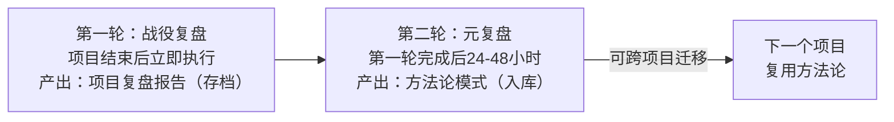

# 元复盘双轮法

## 核心原则

重大项目/迭代结束后不应只做一次复盘——应执行两层复盘以最大化知识转化率。第一轮复盘回答"我们做了什么/做对了什么"（战役级——产出存档），第二轮复盘回答"这个项目揭示的通用方法论规律是什么"（方法级——产出入库）。

## 成熟度评估

| 维度 | 评估 | 依据 |
|------|------|------|
| 实践验证 | 中 | 2次验证（v11元复盘+v12迭答复盘后的模式萃取） |
| 可复用性 | 高 | 适用于所有需要做复盘的项目 |
| 通用性 | 高 | 不限领域——软件开发/赛事策略/项目管理均可复用 |

## 双轮结构

| 轮次 | 复盘对象 | 核心问题 | 产物性质 | 时间间隔 |
|------|---------|---------|---------|---------|
| 第一轮（战役复盘） | 当前项目的执行过程 | 做了什么？决策对不对？产出是否有价值？哪里出了问题？ | 项目复盘报告（存档，高度绑定项目上下文） | 项目结束后立即执行 |
| 第二轮（元复盘） | 第一轮复盘的结论与过程 | 这个项目揭示了什么可跨项目迁移的规律？哪些错误是系统性的而非偶发的？哪些做法形成了可复用模式？ | 方法论模式（入库，脱离项目特定上下文） | 第一轮完成后的24-48小时内执行 |

## 为什么需要第二层

第一轮复盘受"项目具体性"限制——复盘者沉浸在项目细节中，产出的结论高度绑定项目上下文（如"在TRAE大赛中我们应该做双作品交叉叙事"）。这些结论对下一个同类项目有参考价值，但无法直接迁移到不同类型的项目中。

第二轮复盘要求复盘者从项目中抽离，将"这个项目中发生了什么"翻译为"这类项目的通用规律是什么"（如"在单作品Best Shot规则的竞赛中，第二作品应作为主作品关键维度的证据放大器"）。只有第二轮的产物（方法论模式）能被下一个不同类型的项目直接复用。

时间间隔（24-48小时）的作用：让复盘者从项目细节的情绪和认知中抽离出来，获得"远距离视角"。间隔太短→仍被细节淹没；间隔太长→关键细节遗忘。

## 两轮复盘的产出差异示例

| 维度 | 第一轮（战役复盘）产出 | 第二轮（元复盘）产出 |
|------|---------------------|-------------------|
| 发现 | "v10→v11中SearchReplace导致文件断裂" | "当修改量>50行时，全量重写优于增量编辑"（search-replace-fragility模式） |
| 发现 | "竹简悟道真实参赛身份暴露后，需要从SpecWeave单作品转为双作品策略" | "事实层信息可触发根本性重构——信息采集需持续监控"（information-source-tiered-collection模式） |
| 发现 | "社会公益奖是被忽略的第二通道" | "隐性奖项通道识别方法——奖项表逐行扫描+竞争者规模估算"（后续待萃取） |
| 建议 | "下次先确认报名状态再做策略" | "信息源分层采集——事实层持续监控" |

## 操作流程

### 第一轮：战役复盘执行步骤

1. **收集事实**：整理执行时间线、关键决策点、问题与异常事件、产出物清单
2. **分析过程**：按"事实→分析→洞察→建议"结构梳理，识别成功因素与失败原因
3. **撰写报告**：包含执行摘要、时间线、关键决策、问题分析、改进建议
4. **归档**：存入`docs/retrospective/reports/`对应主题目录

### 第二轮：元复盘执行步骤

1. **抽离视角**：阅读第一轮复盘报告，假设这是别人做的项目，你能从中提炼什么通用规律？
2. **模式识别**：寻找"如果换一个项目/场景，这个做法/教训是否仍然成立？"的知识点
3. **分类整理**：将可迁移知识点分类为方法论模式、操作checklist、反模式警示
4. **模式文档化**：按模式文档格式（核心原则+操作步骤+适用条件+成熟度评估）撰写
5. **入库更新**：将模式写入`docs/retrospective/patterns/`对应目录，更新索引和关联关系

## v12验证：第二轮复盘的价值倍增效应

v11元复盘（第二轮）萃取了5+4=9个方法论模式。在v12迭答复盘中，这些模式直接指导了v12的分析：
- information-source-tiered-collection指导了第13源（二手源）的可信度分层处理
- zero-sum-rule-inversion指导了社会公益奖作为"规则约束中的隐藏机会"的识别
- template-homogenization-escape指导了公益叙事的差异化构建（不只是打标签，而是构建完整故事线）

这验证了元复盘的核心价值：**第二轮的产出不仅是"总结"，更是下一轮分析的"输入"**——它让复盘从"向后看"变成"向前赋能"。

## 与其他方法论的关系

| 方法论 | 关系 |
|--------|------|
| `retrospective-acceleration-effect.md` | 互补——本模式讲复盘的"层数"（双轮），acceleration-effect讲复盘的"频率"（高频迭代）。双轮是单次复盘的深度优化，加速效应是多次复盘的效率优化 |
| `review-insight-export-loop.md` | 上游——复盘→洞察→导出的闭环在双轮法中被执行两次：第一轮闭环产出存档，第二轮闭环产出方法论 |
| `three-part-retrospective.md` | 本模式是三部分复盘结构（事实/分析/规律）在元层级别的特化应用 |

## 适用条件

- 项目持续时间超过1天或涉及多轮迭代
- 项目产出具有知识沉淀价值（不仅仅是一次性任务）
- 团队有复用经验到未来项目的需求

## 不适用场景

- 一次性简单任务（如修复一个小bug）——单轮复盘即可
- 完全创新型项目无任何可迁移经验——元复盘产出为空
- 时间极度紧张无法等待24-48小时间隔——可缩短间隔但必须做视角抽离

> 来源：TRAE大赛竞品分析v3→v11全生命周期元复盘+v12迭答复盘验证
> 关联模块：`retrospective-acceleration-effect.md`、`review-insight-export-loop.md`、`three-part-retrospective.md`
