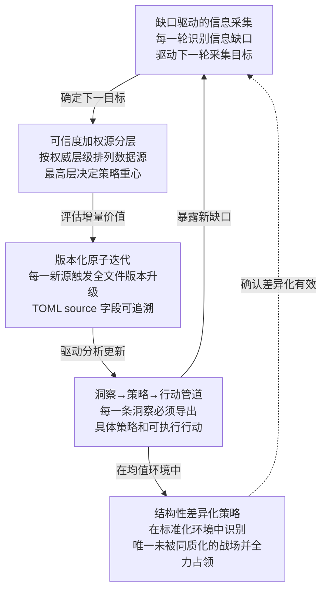

# 多源增量情报迭代法

## 核心原则

在信息不对称的竞争场景中（如赛事准备、竞品分析、市场研判），**不要在收集完所有信息后再开始分析**——而是在每一轮信息获取后立即更新全部分析文件，使分析网络的精度随信息密度线性增长而非跳跃式增长。十一轮竞品分析实战验证了该方法的有效性：从最初的 FAQ 单源出发，每轮增加一个权威数据源，最终覆盖 11 个来源（FAQ→官网→报名指南→抖音表单→赛事细则→教程→初赛指南→创意文档→晋级公示→Live#13→竹简悟道报名帖）、产出 14 条洞察、14 项优势识别。v10→v11 的重大策略转向（从 SpecWeave 单作品到竹简悟道+SpecWeave 双作品交叉叙事）进一步验证了该方法的鲁棒性——当"真实参赛身份"这一第十二个关键信息注入后，分析网络能够快速重构策略框架而无需推翻前期资产。

## 成熟度评估

| 维度 | 评估 | 依据 |
|------|------|------|
| 实践验证 | 高 | 2 次完整实践（11 轮迭代 + v10→v11 策略转向） |
| 可复用性 | 高 | 适用于任何多源信息竞争分析场景 |
| 通用性 | 高 | 不限于特定领域——赛事分析/竞品调研/政策研判均可复用 |

## 五子系统架构

本方法论由五个相互咬合的子模式组成：



### 子模式 1：缺口驱动的信息采集

**原则**：每一轮更新后，显式列出"当前已知"和"当前未知"的对照表。未知项即为下一轮的信息采集目标。采集顺序按"最高可信度优先"排列。

**执行步骤**：

| 步骤 | 动作 | 产出 |
|------|------|------|
| 1. 缺口识别 | 更新完成后，显式标注"尚未获取的文档/数据" | 缺口清单（按可信度排序） |
| 2. 优先级排序 | 按"对策略影响程度"排定采集优先级 | 排序后的缺口队列 |
| 3. 目标采集 | 获取队首目标，进入下一轮迭代 | 新的数据源 |
| 4. 缺口更新 | 新信息可能填补旧缺口，也可能暴露新缺口 | 更新后的缺口清单 |

**实践案例**：竞品分析 v3→v4→v5→v6→v7→v8→v9 的每一轮，均在执行复盘文件末尾显式列出仍缺失的文档和下一轮采集目标。

### 子模式 2：可信度加权源分层

**原则**：将全部数据源按权威层级排列为一张表格，最高层来源（官方章程/赛段规则）的决定权重大于低层来源（品牌页面/教程帖）。当不同来源的信息冲突时，以高层为准。

**分层标准**：

| 层级 | 可信度 | 典型来源 | 在策略中的权重 |
|------|--------|---------|-------------|
| 章程级 | 最高 | 赛事细则、赛段参赛指南 | 决定策略边界（不能做什么） |
| 操作级 | 高 | 报名指南、抖音表单、晋级公示 | 决定操作流程（怎么做） |
| 指南级 | 中 | 保姆级教程、创意文档学习资料 | 揭示竞争环境（别人怎么做） |
| 品牌级 | 参考 | 大赛官网 | 提供叙事框架（怎么说） |

**实践案例**：竞品分析在 v1→v9 的演进中，始终维护一张"信息来源与可信度分层表"，并在每轮新增数据源后重排层级。

### 子模式 3：版本化原子迭代

**原则**：每获取一个新数据源，触发一次全文件版本升级。四份原子文件（README / 执行复盘 / 洞察萃取 / 导出建议）在同一轮中同步更新，TOML frontmatter 的 `source` 字段记录该版本的全部数据来源。

**版本规则**：

```
版本号 = 累计数据源数 - 1
v1 = 1 个数据源（FAQ 分析报告）
v2 = 2 个数据源（+ 官网）
...
v9 = 9 个数据源
```

**单轮更新清单**（每轮必须覆盖全部四文件）：

| 文件 | 本轮必更新内容 |
|------|-------------|
| README.md | 版本号 + 数据来源列表 + 核心指标 + 关键信号 |
| execution-retrospective.md | 源分层表 + 关键增量对照表 + 新增章节 |
| insight-extraction.md | 至少 1 条新洞察（如无法提取有效增量，需显式说明"本轮无新增洞察"） |
| export-suggestions.md | 策略校正（如新信息导致先前策略失效）+ 新行动项 |

**实践案例**：11 轮迭代中，v4→v5（抖音表单 → 赛事细则）、v7→v8（初赛指南 → 创意文档资料）均为增量更新；v10→v11（真实参赛身份揭示）为重大策略转向。洞察数从 5 条线性增长至 14 条，优势数从 5 项增长至 14 项。

### 子模式 4：洞察 → 策略 → 行动管道

**原则**：每一条洞察必须包含三层递进关系：**现象层**（观察到的信息）→ **规律层**（提炼出的模式）→ **行动层**（具体可执行的建议）。不允许出现"只有现象描述而无对策"的洞察。

**管道结构**：

```
洞察标题（一句话核心发现 + 重要性评级 ⭐）

现象层：从数据源中提取的原始信息（"赛事细则 §3.1 明确……"）
  ↓
规律层：该现象背后的结构性规律（"这个规则本质上是一个强制聚焦机制……"）
  ↓
行动层：由此衍生的具体对策（"结论：100% 资源灌注核心体系"）

一句话总结（便于检索和传播）
```

**质量检验**：每条洞察必须通过"三有测试"——有来源引用（phenomenon）、有规律抽象（pattern）、有行动出口（action）。缺任何一项的洞察退回重写。

**实践案例**：洞察 7（单作品 Best Shot——赛事规则消除 FOMO）完整展示了三层递进：赛事细则的规则原文 → "Best Shot 机制的本质是强制聚焦"的规律 → "100% 资源灌注一个作品"的行动。

### 子模式 5：结构性差异化策略

**原则**：当环境被标准化工具（如官方 Prompt 模板）高度同质化时，差异化的主战场从"做得更好"转移到"做得不同"——识别唯一尚未被同质化的维度，并在该维度上建立压倒性优势。

**识别流程**：

```
Step 1: 盘点标准化要素   →  哪些维度已被官方模板锁定？
Step 2: 评估同质化程度   →  每个维度的差异化空间有多大？
Step 3: 定位差异战场     →  哪个维度的差异化空间最大？
Step 4: 全力占领         →  在该维度上建立品类级优势
```

**实践案例**：竞品分析 v8 识别出创意文档学习资料提供的 3 套标准化 Prompt 模板将导致报名帖文字高度同质化（Step 1-2），但 HTML 文件生成方式仍存在差异空间（Step 3），因此制定"手动构建四层架构可视化 HTML，脱离 TRAE Work 自动生成路径"的策略（Step 4）。

## 与其他方法论的关系

| 方法论 | 关系 |
|--------|------|
| `review-insight-export-loop.md` | 本方法论的「复盘→洞察→萃取→导出」环节是该闭环在竞争分析场景的特化应用 |
| `insight-iceberg-model.md` | 子模式 4 的三层管道结构与该模型的现象→模式→原理三层递进高度对应 |
| `three-tier-knowledge-sedimentation.md` | 本方法论产出的洞察原文（第三层）→ 洞察萃取文件（第二层）→ README 条目（第一层）完整覆盖三层 |
| `convention-driven-creation.md` | 九轮迭代中，每轮原子文件的修改遵循"范例即模板"原则——读取旧版本、提取格式、填充新内容 |

## 适用条件

- 涉及多个权威数据源、信息逐步释放的竞争分析场景
- 分析结果需要持续演进而非一次性定稿
- 团队成员需要在一轮分析完成后立即获得可执行的策略更新
- 至少 3 个以上的数据源（否则无需分层和版本化）

## 不适用场景

- 信息一次性完整交付、无后续数据源补充的分析任务
- 策略结论确定后无更新需求的一次性报告
- 单数据源即可完成的分析（如仅分析一份文档）

## 成熟度度量

```
方法论的成熟度 = 子模式中经过独立验证的数量 / 5
```

当前状态：5/5 子模式均已在 11 轮迭代 + 1 次策略转向中经两轮完整验证。v10→v11 的策略转向额外验证了子模式 4（洞察→策略→行动管道）在信息发生根本性变化时的弹性——前期资产（13 条洞察）被重新分类为"证据弹药库"而非作废。

## 元级观察

本方法论本身即体现了「自指涉」（self-referential）特征——它是在执行竞品分析过程中被系统化提取的分析方法论。十一轮迭代（含 v10→v11 策略转向）中的每一轮都在同时执行两个任务：(1) 分析 TRAE 大赛规则；(2) 在分析过程中隐式地形成了一套分析模式。本文件是任务 (2) 的显式化产出。

> 来源：来自 `retrospective-specweave-contest-advantage-analysis-20260624/` 九轮迭代的全量分析过程
> 关联模块：`review-insight-export-loop.md`、`insight-iceberg-model.md`、`extraction-four-layer-funnel.md`、`export-four-channel-progressive.md`
