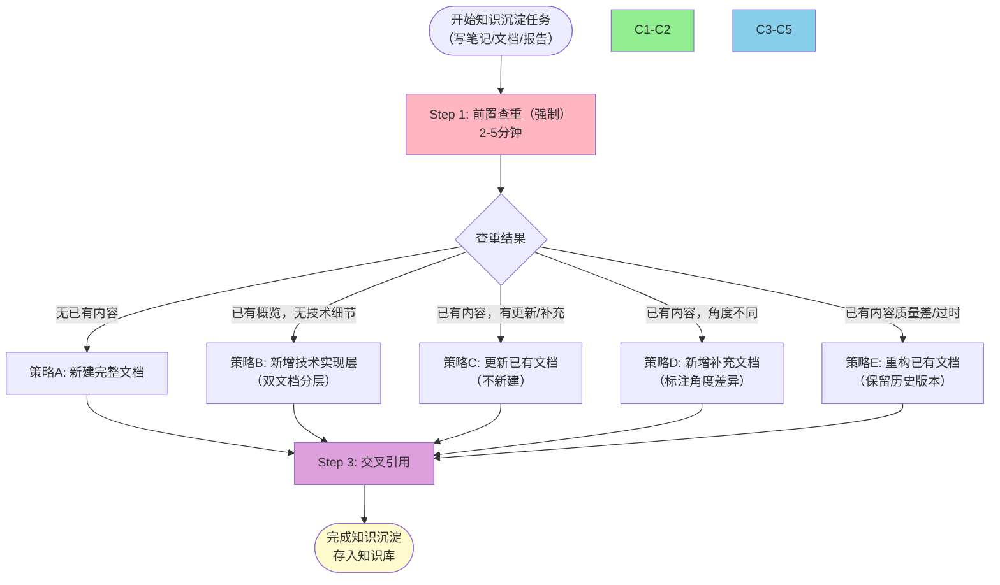
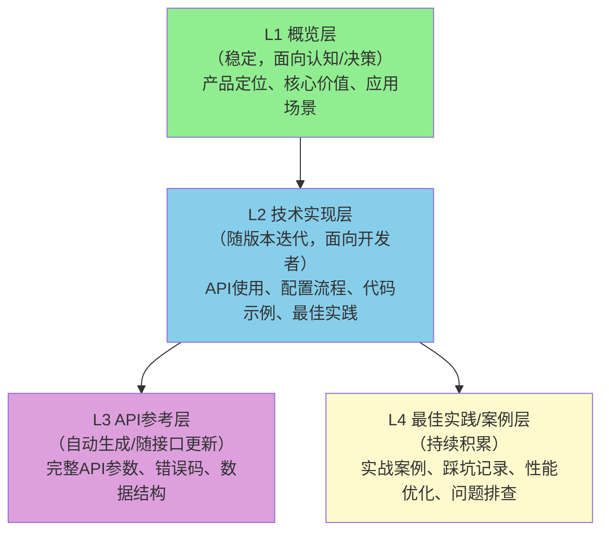

> **来源**：火山引擎MobileUseAgent移动端智能体系统学习复盘（2026-07-07）——前置查重发现已有MUA产品概览笔记，采用"产品概览+技术实现"双文档分层结构，避免约200-300行重复内容，查重仅耗时约2分钟，ROI极高
> **验证次数**：1次（火山引擎MUA）；待在更多厂商产品学习、技术文档撰写任务中验证

# 知识沉淀前置查重与分层沉淀工作流

## 模式类型
方法论模式（知识管理与文档治理工作流）

## 成熟度
L1 实验性（1次实战验证，待更多案例验证后升级L2）

## 适用场景

| 场景 | 是否适用 | 说明 |
|------|---------|------|
| 厂商产品学习笔记 | ✅ 核心场景 | 产品学习最容易重复建设 |
| 技术文档撰写 | ✅ 核心场景 | 同一技术可能已有不同角度文档 |
| 分析报告沉淀 | ✅ 核心场景 | 同一主题可能已有前期分析 |
| 任何向知识库新增内容 | ✅ 适用 | 所有写新文档的任务 |
| 个人笔记（不入库） | ⚠️ 可选 | 个人笔记可灵活处理，但仍建议查重避免重复 |
| 完全全新的主题 | ❌ 无需 | 知识库确认无任何相关内容时跳过 |

## 问题背景

知识沉淀常见问题：

1. **重复建设**：同一产品/主题在知识库中存在多份内容重叠的笔记，新笔记从零开始写，重复率高达30-50%
2. **心理偏差**："写新东西"比"找已有东西"更有成就感，心理上倾向于直接开始写
3. **维护噩梦**：同一信息在多处存在，产品更新时需多处同步，遗漏导致信息不一致
4. **检索困难**：内容冗余导致检索结果重复，用户不知道看哪个版本
5. **缺乏分层**：试图用一份文档覆盖所有读者需求（决策者/开发者/运维），结果每个读者都觉得不好用

**根本原因**：将"知识沉淀"等同于"写新文档"，没有"先查后写"的强制机制，缺乏基于查重结果的分层策略决策。

---

## 核心：三步工作流

### Step 1：前置查重（强制，2-5分钟）

这是整个工作流中成本最低、ROI最高的步骤，必须强制执行。

**查重方法**：
- 使用知识库搜索功能（Grep/SearchCodebase）
- 搜索关键词组合：产品名、技术名、核心概念、别名/缩写
- 检查相邻分类目录（如同类厂商学习笔记目录）
- 查看最近7-30天的相关产出

**查重检查清单**：
- [ ] 知识库中是否有完全相同主题的文档？
- [ ] 是否有同一产品但不同角度的文档（如概览vs技术细节）？
- [ ] 是否有部分覆盖本主题的文档（如某章节提到相关内容）？
- [ ] 已有文档的质量和时效性如何（是否过时、是否完整）？

**输出**：已有内容清单 + 覆盖范围评估（哪些已有、哪些缺失、哪些需要更新）。

### Step 2：策略选择（5种处置策略）

根据查重结果选择对应的策略，不要默认"新建文档"：

| 策略 | 适用条件 | 操作方式 | 示例 |
|------|---------|---------|------|
| **A. 新建完整文档** | 确认无任何已有内容 | 按标准模板新建完整文档 | 全新产品/技术首次学习 |
| **B. 新增技术实现层** | 已有概览/高层文档，但缺少技术细节 | 不修改概览文档，新建技术实现层文档，双文档交叉引用 | MUA已有产品概览，新增API/Skill技术指南 |
| **C. 更新已有文档** | 已有文档内容需要更新/补充 | 直接编辑已有文档，在changelog中记录更新内容 | 产品新版本发布，补充新功能说明 |
| **D. 新增补充文档** | 已有文档但角度完全不同 | 新建文档，在开头明确标注"本文档从XX角度分析，与YY文档互补" | 已有产品功能分析，新增竞品对比分析 |
| **E. 重构已有文档** | 已有文档质量差/结构混乱/严重过时 | 重构已有文档，将旧版本移至archive或在changelog中记录重构 | 文档结构混乱，无法通过增量更新修复 |

#### 知识四层分层模型

对于产品/技术类知识，推荐按以下四层进行分层沉淀：

- **L1概览层**：内容稳定，产品大版本更新时才需要修改，面向决策者和初学者
- **L2技术实现层**：随产品版本迭代更新，面向实际使用该技术的开发者
- **L3 API参考层**：理想情况下自动生成，或随API版本同步更新
- **L4 案例层**：持续积累，每次实战后补充新案例和经验

前置查重时，如果发现已有内容属于L1层，本次应沉淀L2/L3/L4层内容，而非重复编写L1。

### Step 3：交叉引用（必须）

无论选择哪种策略，都必须在相关文档间添加双向交叉引用链接：

- 新建文档时：链接到已有相关文档，标注"相关阅读"
- 更新文档时：如果文档结构有变化，更新其他文档中指向本文档的链接
- 分层文档时：L1文档末尾添加"L2技术实现指南：[链接]"，L2文档开头添加"产品概览参见：[链接]"
- 补充文档时：在开头明确说明本文档与已有文档的关系和差异

---

## 为什么这个工作流有效

### 经济学视角：2分钟 vs 数小时

前置查重耗时约2分钟，但能避免：
- 数小时的重复内容编写（200-300行内容）
- 后续维护中多处同步更新的隐性成本
- 知识库冗余导致的检索效率下降

ROI极高，应该成为肌肉记忆。

### 代码库类比

知识库建设应该像代码库一样：
- 写新功能前先看是否已有类似组件 → 写新文档前先查知识库
- 修改已有代码而非复制粘贴 → 更新已有文档而非新建重复文档
- Git Pull在写代码前 → 查重在写文档前
- 代码分层（Controller/Service/DAO） → 知识分层（概览/技术/API/案例）

### 认知规律视角

不同读者有不同的信息需求：
- **决策者/架构师**：需要L1概览层快速了解"这是什么、适合什么场景"
- **开发者**：需要L2技术实现层了解"怎么用、怎么集成"
- **集成阶段**：需要L3 API参考层查参数
- **遇到问题时**：需要L4案例层找解决方案

一份文档试图满足所有读者，结果是每个读者都要在大量无关内容中找自己需要的信息。分层后各取所需，效率更高。

---

## 实施检查清单

写新文档前，逐项确认：

- [ ] 已搜索知识库（产品名+技术名+核心概念关键词）
- [ ] 已检查相邻分类目录
- [ ] 已明确已有内容的覆盖范围和质量
- [ ] 已选择正确的处置策略（A/B/C/D/E）
- [ ] 如新建文档，已确认知识库中无重复或互补文档
- [ ] 已规划交叉引用链接
- [ ] 完成后，已在相关文档间添加双向链接

---

## 反模式（不要这样做）

1. ❌ **上来就写**：不查知识库，直接开新文档从零开始
2. ❌ **重复造轮子**：已有概览又写一遍概览，已有安装指南又写一遍安装指南
3. ❌ **一文档包打天下**：试图在一份文档中覆盖所有层次，结果又臭又长
4. ❌ **只建不链**：新建文档后不添加交叉引用，造成信息孤岛
5. ❌ **只靠记忆**：认为"我记得知识库没有这个"，不实际搜索验证
6. ❌ **过度查重**：为了查重而查重，花30分钟以上搜索一个明显是新主题的内容

---

## 关联模式

- [knowledge-sedimentation-workflow-sop.md](knowledge-sedimentation-workflow-sop.md)：知识沉淀SOP，本模式是其"前置检查"环节的具体展开
- [wiki-pre-creation-three-checks.md](../governance-strategy/wiki-pre-creation-three-checks.md)：Wiki创建前三查，本模式可作为其查重环节的补充
- [knowledge-base-three-stage.md](../document-architecture/knowledge-base-three-stage.md)：知识库三阶段演进模型，本模式支持第二阶段（结构化积累）
- [vendor-product-learning-twelve-step-template.md](../research-knowledge/vendor-product-learning-twelve-step-template.md)：十二步产品学习模板，Step 0（前置查重）可嵌入本工作流
