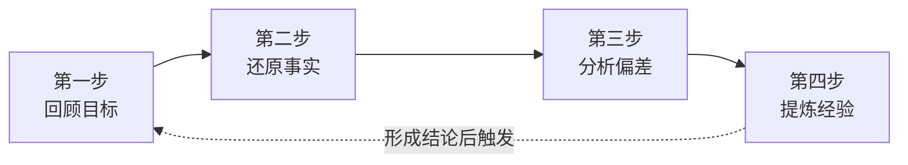

+++
id = "retrospective-four-step-method"
domain = "methodology"
layer = "methodology"
maturity = "L1"
validation_count = 1
reuse_count = 0
documentation_level = "standard"
source = "docs/methodology-analysis-report.md#3.1"

[bindings]
rules = []
references = ["review-insight-export-loop.md", "auto-generate-threshold.md"]
skills = []
+++

> **来源**：从 `docs/methodology-analysis-report.md` 第 3.1 节「复盘的四步操作法」拆分

# 复盘四步法模型（Retrospective Four-Step Method）

## 模式类型
方法论模式

## 成熟度
L1 实验性（1 次成功案例：methodology-analysis-report.md 综合方法论分析）

## 适用场景
项目结项、阶段里程碑、关键事件后的标准化复盘操作。

## 问题背景

复盘是知识闭环的起点，但其操作的"非结构化"是常见陷阱——很多团队的复盘停留在"总结一下"层面，缺乏明确的步骤、产出物和误区识别。AAR（After Action Review）框架虽然经典，但缺少具体到每一步的"输入-操作-输出-误区"拆解。

复盘四步法是 AAR 的精化版本，每一步都有明确的输入、产出、推荐工具和常见误区，便于在团队中复制推广。

## 核心流程

## 四步详解

### 第一步：回顾目标

**操作要点**：回顾并明确本轮行动的原始目标，关键问题包括：
- 当时设定的目标是什么？
- 成功的标准是什么？
- 有哪些关键假设？

**产出物**：目标描述（含量化指标和定性标准）
**推荐工具**：SMART 目标清单
**常见误区**：以当前认知重新定义过去目标——复盘应忠实还原当时的意图，而非事后合理化。

### 第二步：还原事实

**操作要点**：基于数据而非主观印象，客观还原实际发生的过程：
- 实际发生了什么（按时间线）？
- 关键数据和指标是多少？
- 与目标相比有哪些偏差？

**产出物**：事实描述文档（时间线 + 关键事件 + 数据对比）
**推荐工具**：时间线工具、数据仪表盘
**常见误区**：混淆"事实"与"判断"。"部署耗时 45 分钟"是事实，"部署太慢了"是判断——复盘在此阶段只记录事实。

### 第三步：分析偏差

**操作要点**：对事实与目标之间的差距进行归因分析：
- 偏差的直接原因是什么？
- 根本原因是什么（建议追问"五个为什么"）？
- 哪些是可控因素，哪些是不可控因素？

**产出物**：偏差分析报告（根因树 + 贡献度评估 + 改进方向）
**推荐工具**：五个为什么、鱼骨图
**常见误区**：过度外归因——将偏差过多归因于不可控的外部因素而忽视可控的内部因素。

### 第四步：提炼经验

**操作要点**：从分析结果中提炼可迁移的经验教训：
- 我们学到了什么？
- 如果重来一次，哪些做法会保留、哪些会改变？
- 这些经验是否适用于其他类似情境？

**产出物**：经验总结（可复用的经验条目 + 改进建议 + 行动计划）
**推荐工具**：经验卡片、改进建议表
**常见误区**：停留在具体操作层面，无法迁移到其他情境。

## 四步产出物对照表

| 步骤 | 核心问题 | 关键产出物 | 推荐工具/模板 | 常见误区 |
|---|---|---|---|---|
| 回顾目标 | 当初要达成什么？ | 目标描述 | SMART 目标清单 | 事后合理化目标 |
| 还原事实 | 实际发生了什么？ | 事实文档 | 时间线工具、数据仪表盘 | 混淆事实与判断 |
| 分析偏差 | 为什么产生差异？ | 偏差分析报告 | 五个为什么、鱼骨图 | 归因偏差（过度外归因） |
| 提炼经验 | 我们学到了什么？ | 经验总结 | 经验卡片、改进建议表 | 停留在具体操作、无法迁移 |

## 与现有模式的关系

- `review-insight-export-loop.md`：本模式是其"复盘"环节的精化——将复盘操作从抽象描述落实为可复制的四步流程
- `auto-generate-threshold.md`：本模式可作为"复盘任务"是否进入自动化的判定输入（高频复盘→模板固化）

> **关联模块**：
> - `review-insight-export-loop.md` — 复盘→洞察→导出知识闭环
> - `insight-iceberg-model.md` — 洞察冰山模型（本模式的下游）
