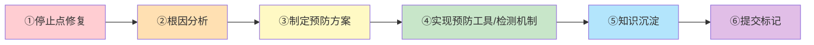

# 二次暴露触发治理闭环

## 模式概述

第一次修复通常只解决表面症状（"换行符不对"），同一领域/文件第二次出现bug/问题时，必须停止点修复，启动治理闭环。二次问题暴露后才会意识到是系统性问题（"缺乏安全约束机制"），此时推动治理闭环的阻力最小、动力最强。

## 触发条件

满足以下任一条件即触发治理闭环：
1. **同一文件**：在同一个代码/文档文件中发现第二个独立问题（非回归）
2. **同一领域**：在同一个功能模块/规范领域内发现第二个同类问题
3. **同类问题**：不同位置但根因相同的问题第二次出现
4. **修复后回归**：修复过的问题以变体形式再次出现

## 治理闭环六步流程



| 步骤 | 动作 | 交付物 | 验收标准 |
|------|------|--------|---------|
| ①停止点修复 | 暂停当前的bug修复工作，不做"改完这个就好"的点修复 | 决策记录：明确"这是第二次暴露，需要治理" | 明确标注问题领域/文件和首次出现记录 |
| ②根因分析 | 运用5-Why分析法追溯问题根本原因，不满足于表面原因 | 根因分析文档：至少追问5层Why，找到系统性原因 | 根因不是"代码写错了"，而是"为什么会写错"的机制性原因 |
| ③制定预防方案 | 基于根因设计预防机制，优先参考"治理四层递进模型" | 预防方案：明确采用B1/B2/C1/C2哪几层 | 方案至少包含一项自动化检测或模板化预防 |
| ④实现预防工具 | 按四层递进模型实现：规范(B1)→检测(B2)→拦截(C1)→可视化(C2) | 规则文档、检查脚本、运行时拦截、仪表盘等 | 预防工具能自动识别同类问题，不依赖人工记忆 |
| ⑤知识沉淀 | 将问题模式和预防方法写入知识库/模式库 | 知识库条目、可复用模式 | 其他开发者遇到同类问题时能查到预防方案 |
| ⑥提交标记 | 在提交信息中使用`governance-loop`标识治理闭环 | Git commit message包含`governance-loop`标签 | 提交历史可追溯治理闭环的完整过程 |

## 提交信息规范

治理闭环相关提交必须在commit message中标记：

```
type(scope): <描述> [governance-loop]

- 根因: <根本原因描述>
- 预防: <采取的预防措施>
- 影响: <影响范围>
```

示例：
```
fix(mermaid): 修复列表解析换行问题 [governance-loop]

- 根因: Mermaid代码块缺少统一的安全模板，导致不同场景下换行符处理不一致
- 预防: 新增Mermaid安全模板+B2离线检测脚本check-mermaid.py
- 影响: 所有包含Mermaid图表的文档
```

## 角色职责

| 角色 | 职责 |
|------|------|
| **developer** | 识别二次暴露信号，主动停止点修复并启动治理闭环；实现预防工具 |
| **reviewer** | 代码审查时检查：同一领域第二次问题是否触发了治理闭环；预防工具是否有效；提交信息是否包含`governance-loop`标记 |
| **architect** | 审批预防方案，确认符合四层递进模型；指导根因分析方向 |
| **orchestrator** | 跟踪治理闭环执行进度，确保不半途而废 |

## Why 有效

第一次修复是解决症状，第二次暴露是系统在提醒你：这不是偶然问题，而是系统性缺陷。此时：
- 问题刚发生，上下文清晰，根因分析成本低
- 团队刚被问题"咬"过一次，推动治理的共识最强
- 预防工具的需求最明确，不会为了"治理而治理"
- 投入产出比最高：一次治理解决一类问题，而非反复点修复

## 反模式：点修复循环

**典型反模式**：
1. 第一次出现问题：改代码，快速修复
2. 第二次出现问题："怎么又出问题了？"再改一次代码
3. 第三次出现问题："这个地方怎么老是出问题？"继续改代码
4. 结果：问题反复出现，团队形成"这里有坑，小心点"的隐性知识，新人不断踩坑

**为什么反模式有害**：
- 浪费多次修复机会
- 隐性知识无法传承
- 问题从"bug"变成"已知问题"被接受
- 技术债务持续累积

## 验证案例

**案例1：Mermaid渲染bug治理（本次验证）**
1. 第一次问题：换行符导致渲染失败 → 点修复换行符
2. 第二次问题：列表解析仍有问题 → **触发治理闭环**
3. 根因分析：缺乏Mermaid安全模板约束，开发者随意书写
4. 预防方案：B1安全模板 + B2检测脚本
5. 实现：新增Mermaid编写安全模板 + check-mermaid.py离线检测
6. 知识沉淀：写入论坛自动化知识库 + 操作指南

**案例2：Windows GBK编码问题**
1. 第一次问题：PowerShell中文乱码 → 点修复设置编码
2. 第二次问题：CI脚本在不同环境编码不一致 → 触发治理闭环
3. 根因分析：缺乏跨平台编码安全设置标准
4. 预防方案：B1规范 + B2编码检查 + 双平台CI脚本增强

## 适用场景

- Bug修复过程中发现同类问题第二次出现
- 代码审查发现同一领域反复出现同类问题
- 新员工入职后频繁踩同一个"已知坑"
- 修复后问题以变体形式回归

## 实施检查清单

- [ ] 识别触发信号：是否是同一文件/领域/根因的第二次问题？
- [ ] 停止点修复：明确记录"二次暴露，启动治理闭环"
- [ ] 根因分析：至少5层Why追问，找到机制性原因
- [ ] 预防方案：参考四层递进模型，至少有B1+B2
- [ ] 工具实现：自动化检测/预防工具，不依赖人工记忆
- [ ] 知识沉淀：写入模式库/知识库，可被他人检索
- [ ] 提交标记：commit message包含`[governance-loop]`标签
- [ ] 审查确认：reviewer检查治理闭环完整性

> 来源：来自 retrospective-daily-20260629 洞察2
> 关联模式：[governance-four-layer-progressive.md](../governance-strategy/governance-four-layer-progressive.md)（治理四层递进模型）、[root-cause-diagnosis.md](../governance-strategy/root-cause-diagnosis.md)（根因诊断模式）、[bug-as-asset.md](../retrospective-knowledge/bug-as-asset.md)（Bug即资产模式）
