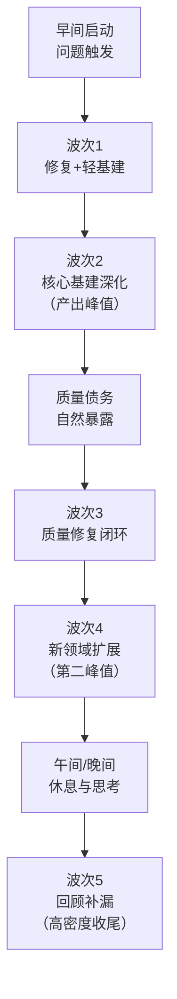

+++
id = "wave-workday-rhythm"
domain = "methodology"
layer = "methodology"
maturity = "L1"
validation_count = 1
reuse_count = 0
documentation_level = "basic"
source = "docs/retrospective/reports/project-governance/retrospective-daily-20260629-full-day/insight-extraction.md#洞察3高密度工作日的五波次能量曲线"

[bindings]
rules = []
references = []
skills = []
+++

# 波次式工作日节奏

## 模式概述

高密度工作日的产出不是均匀分布的，而是呈现明显的波次节奏。不必追求均匀产出，识别和利用波次峰值期做核心基建，波谷期做质量修复和文档同步，顺应认知节奏而非对抗它。

## 五波次能量曲线

## 各波次特征

| 波次 | 典型时间段 | 持续 | 核心特征 | 建议工作类型 | 产出占比参考 |
|---|---|---|---|---|---|
| 波次1 | 早间启动后 | 1-2h | 问题触发+双轨（修复+轻基建） | 处理遗留问题、小规模基建启动 | ~15% |
| 波次2 | 上午中段 | 2-3h | 治理体系深化（连锁反应） | **核心架构/基建工作（深度工作）** | ~40% |
| 波次3 | 午间前后 | 1-1.5h | 质量修复与生态补齐 | 修复波次2暴露的问题、文档同步、测试补齐 | ~10% |
| 波次4 | 下午 | 2h | 多线并行能力扩展 | **新领域扩展（第二深度工作峰值）** | ~30% |
| 波次5 | 晚间短时段 | 4-10min | 回顾补漏（极高密度） | 背景加工后的快速输出、收尾补漏、次日规划 | ~5% |

## Why 有效

1. **波次2和波次4是两个产出峰值**：符合"深度工作→修复→新深度工作"的认知节奏
2. **波次3的修复是自然节奏**：大规模基建后质量债务必然暴露，主动修复优于被动积累
3. **波次5的高密度收尾体现"背景加工"效应**：白天的问题在潜意识中继续处理，晚间形成清晰的解决方案后快速输出

## 波次规划策略

### 峰值期（波次2、波次4）
- ✅ 安排需要深度思考的核心架构设计
- ✅ 安排复杂的治理机制建设
- ✅ 安排需要高度专注的编码工作
- ❌ 不安排琐碎的行政事务、会议、回复消息
- ❌ 不安排需要上下文切换的多任务并行

### 修复期（波次3）
- ✅ 主动审查波次2产出的质量问题
- ✅ 补齐测试、文档、链接校验
- ✅ 处理技术债务和小bug
- ✅ 做简单的重构和代码清理

### 收尾期（波次5）
- ✅ 回顾当日工作，快速补漏
- ✅ 记录次日待办
- ✅ 输出轻量级文档和小结
- ❌ 不开始需要深度思考的新任务（容易烂尾）
- ❌ 不做大规模重构（晚间判断力下降易出错）

## 背景加工效应

波次5的4分钟3个大模块交付不是"神速"，而是**背景加工（background processing）**的结果：
- 白天遇到的问题在休息时潜意识继续处理
- 散步、吃饭、休息时大脑在后台"离线计算"
- 晚间重启工作时，解决方案已经"准备好了"
- 此时输出速度极快，因为不是"当场思考"而是"记录已经想好的方案"

**启示**：在规划中预留晚间时段用于"思维沉淀后的快速输出"，而非安排需要深度思考的新任务。

## 反模式

**反模式1：追求均匀产出**
- 强制每小时产出相同数量的代码/文档
- 结果：峰值期被打断，深度工作无法完成；谷期无事可做浪费时间

**反模式2：峰值期被琐事打断**
- 深度工作时回复消息、处理邮件、参加会议
- 结果：上下文切换成本极高，深度工作被碎片化，核心产出大幅下降

**反模式3：忽视修复期**
- 一个劲儿往前冲，不修复波次2暴露的问题
- 结果：质量债务累积到波次4时集中爆发，拖垮整个进度

**反模式4：晚间安排新任务**
- 晚上8点后开始新的复杂功能开发
- 结果：思考不周全留下隐患，或者做一半必须中断，次日重新进入成本高

## 验证案例

**案例：2026-06-29 SpecWeave治理基建日**
- 波次1（08:14-10:00）：Mermaid问题触发，启动双轨修复+轻基建
- 波次2（10:00-12:00）：阶段守卫四层体系建设（产出峰值，40%产出）
- 波次3（12:00-13:30）：质量修复、vendor调整、生态补齐
- 波次4（13:30-15:20）：数据安全治理、RACI、论坛自动化多线扩展（第二峰值）
- 波次5（20:23-20:27）：4分钟内交付3个大模块（背景加工效应）

## 适用场景

- 高密度开发日规划
- Sprint迭代中期的核心建设日
- 个人工作日程安排
- 团队协作节奏规划

## 实施检查清单

- [ ] 识别自己的能量峰值时段（通常是上午中段和下午中段）
- [ ] 峰值期保护：屏蔽干扰，预留2-3小时不被打断的深度工作时间
- [ ] 主动规划波次3的修复工作，不把质量债务留到最后
- [ ] 利用晚间短时段做收尾补漏，不启动新的深度任务
- [ ] 记录自己的波次规律，持续优化日程安排
- [ ] 接受产出不均匀是正常的，不要强行"匀速前进"

> 来源：来自 retrospective-daily-20260629 洞察3
> 关联模式：[insight-iceberg-model.md](insight-iceberg-model.md)（洞察冰山模型）、[retrospective-acceleration-effect.md](retrospective-acceleration-effect.md)（复盘加速效应）
