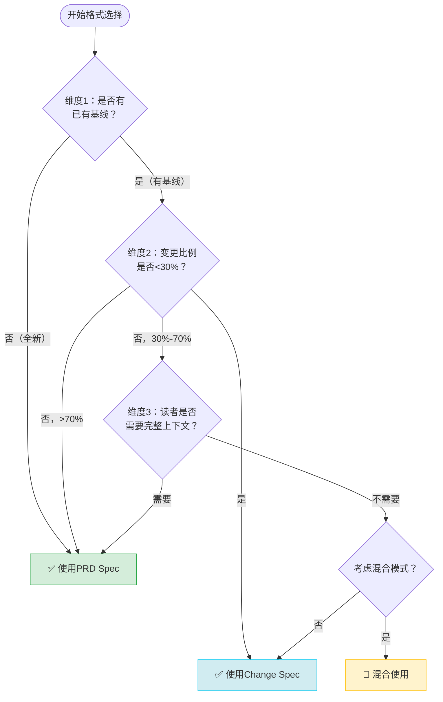

# Spec格式选择指南：PRD Spec vs Change Spec

## 概述

本指南明确PRD Spec（十节产品需求规格）与Change Spec（六节变更规格）的适用场景边界，提供三维度决策树帮助快速判断格式选择，通过5个测试场景验证决策逻辑，并说明混合使用的典型场景。

---

## 两种Spec格式对比

### PRD Spec（十节结构）

基于[prd-structure-guide.md](./prd-structure-guide.md)定义的完整产品需求规格，包含：

```
YAML Frontmatter → Overview → Goals → Non-Goals → Background
→ FR → NFR → Constraints → Assumptions → AC → Open Questions
```

**核心特征**：从零定义完整产品/功能，强调范围边界、可衡量目标、完整追溯链。

---

### Change Spec（六节结构）

基于`.agents/rules/spec-writing-guide/`定义的变更规格，包含：

```
YAML Frontmatter → Why → What Changes → Impact
→ ADDED Requirements → MODIFIED Requirements → REMOVED Requirements
```

**核心特征**：基于已有系统/产品的增量变更，强调变更动机、影响范围、新增/修改/移除三类变更。

---

## 格式差异核心维度

| 维度 | PRD Spec | Change Spec |
|------|----------|-------------|
| **出发点** | 从零开始定义 | 基于已有基线变更 |
| **范围描述** | Goals + Non-Goals明确边界 | What Changes列出变更点 |
| **需求组织** | FR/NFR完整分解 | ADDED/MODIFIED/REMOVED分类 |
| **背景深度** | Background完整前因后果 | Why简洁说明动机 |
| **验收标准** | AC全量Given/When/Then | Scenario基于WHEN/THEN |
| **追溯关系** | G→FR→AC完整追溯链 | 引用原有Requirement编号 |
| **典型篇幅** | 200-500行 | 50-200行 |
| **适用阶段** | 新项目/新模块立项 | 迭代/优化/重构 |

---

## 三维度决策树

### 判断维度定义

#### 维度1：基线存在性

> **问题**：是否已有可工作的系统/功能作为变更基线？

- **是**：存在已上线/已合并的功能代码、已有完整Spec定义的模块 → 倾向Change Spec
- **否**：全新项目、从无到有的功能、独立的新模块 → 倾向PRD Spec

#### 维度2：变更比例

> **问题**：本次变更涉及的需求占原有基线的比例？

- **<30%**：增量优化、小功能添加、Bug修复、局部重构 → 强烈倾向Change Spec
- **30%-70%**：中等规模重构、重大功能升级 → 需要进一步判断
- **>70%**：几乎重写、架构级变更、原有需求大部分不适用 → 强烈倾向PRD Spec

#### 维度3：受众范围

> **问题**：Spec的主要读者是否需要了解完整上下文？

- **需要**：新人入职、跨团队协作、需要长期维护归档、涉及重大业务决策 → 倾向PRD Spec
- **不需要**：团队内部迭代、开发者已知上下文、快速修复、小步优化 → 倾向Change Spec

---

### 决策流程图



---

### 快速决策表

| 基线存在 | 变更比例 | 需要完整上下文 | 推荐格式 |
|----------|----------|----------------|----------|
| ❌ 无 | - | - | **PRD Spec** |
| ✅ 有 | <30% | ❌ 否 | **Change Spec** |
| ✅ 有 | <30% | ✅ 是 | **Change Spec**（补充Background） |
| ✅ 有 | 30%-70% | ❌ 否 | **Change Spec**（或混合） |
| ✅ 有 | 30%-70% | ✅ 是 | **混合模式** |
| ✅ 有 | >70% | - | **PRD Spec** |

---

## 测试场景验证

### 场景1：全新知识库引用验证系统

**背景**：从零开始构建一个跨知识库的引用自动验证机制，无任何现有代码或Spec。

- **维度1（基线）**：❌ 无现有基线，全新项目
- **维度2（比例）**：不适用（100%新增）
- **维度3（上下文）**：✅ 需要，长期维护归档

**决策结果**：✅ **PRD Spec**

**验证理由**：需要完整定义Goals/Non-Goals/FR/NFR/AC，确保范围清晰、可验收。对应[first-principles-comprehensive-research]类项目。

---

### 场景2：修复链接检查脚本的超时Bug

**背景**：`check-links.py`脚本在检查某些慢网站时会超时崩溃，需要增加重试机制和超时配置。

- **维度1（基线）**：✅ 已有成熟脚本
- **维度2（比例）**：<10%（仅增加错误处理逻辑）
- **维度3（上下文）**：❌ 团队已知脚本功能

**决策结果**：✅ **Change Spec**

**验证理由**：典型增量修复，Why说明超时问题，What Changes列出重试/超时配置，MODIFIED描述原有检测逻辑的变更。

---

### 场景3：将CLI工具扩展为Web服务

**背景**：原有的引用验证CLI工具使用良好，现在需要提供Web UI和REST API，支持多用户并发使用。变更涉及：新增Web层、用户认证、任务队列、数据库存储；CLI核心逻辑保留复用。

- **维度1（基线）**：✅ 有CLI核心逻辑
- **维度2（比例）**：约60%（CLI复用40%，新增60%）
- **维度3（上下文）**：✅ 需要，涉及架构变更，需完整说明

**决策结果**：🔀 **混合模式**（见下文混合场景说明）

**验证理由**：既有可复用的核心逻辑（用MODIFIED说明调整），又有大量新增功能（需要FR/AC完整定义），且架构变更需要完整上下文。

---

### 场景4：v1.0正式版发布后的第一个补丁版本

**背景**：v1.0已上线运行2周，收集到12个用户反馈，需要做3个小优化、修复5个Bug、调整2个UI文案。

- **维度1（基线）**：✅ v1.0已上线
- **维度2（比例）**：<20%（局部调整）
- **维度3（上下文）**：❌ 团队已熟悉v1.0

**决策结果**：✅ **Change Spec**

**验证理由**：典型迭代补丁，What Changes分类列出优化/Bug/文案调整，ADDED/MODIFIED/REMOVED清晰分类即可。

---

### 场景5：废弃旧架构，完全重构核心模块

**背景**：原有的订单处理模块是3年前的技术栈，耦合严重、无法扩展，决定完全用新架构重写，业务逻辑保持兼容但内部100%重写。

- **维度1（基线）**：✅ 有旧模块（但要废弃）
- **维度2（比例）**：>90%（几乎全部重写）
- **维度3（上下文）**：✅ 需要，说明重构原因、兼容策略、迁移方案

**决策结果**：✅ **PRD Spec**

**验证理由**：虽然是"重构"，但本质是用新架构重新实现，旧代码仅作业务逻辑参考。需要完整的Goals/NFR/AC定义新模块的质量标准，而非在旧Spec上打补丁。

---

## 混合使用场景

当决策树指向"混合模式"时，推荐采用以下组合策略：

### 混合模式A：PRD外壳 + Change内核

**适用**：大版本升级、架构演进但保留大量业务逻辑

**结构**：
```
## Overview（PRD风格）
## Goals（重新定义可衡量目标）
## Non-Goals（明确不做什么）
## Background（说明历史和演进原因）
---
## Why（Change风格：为什么要做这次升级）
## What Changes（变更摘要）
## Impact（影响范围）
---
## ADDED Requirements
## MODIFIED Requirements（引用原PRD的FR编号）
## REMOVED Requirements
---
## AC（完整Given/When/Then验收）
## Open Questions
```

**典型案例**：场景3（CLI→Web服务）、v2.0大版本升级。

---

### 混合模式B：Change Spec + PRD参考链接

**适用**：中等规模变更，但读者可能不熟悉原有系统

**结构**：
```
## Why
## What Changes
## Impact
## 参考文档
- [原有PRD Spec链接]（完整背景）
- [架构设计文档链接]
---
## ADDED
## MODIFIED
## REMOVED
```

**关键**：在Impact章节明确标注需参考的原有Spec，不重复已有内容。

---

### 混合模式C：PRD Spec + Change历史附录

**适用**：完全重构但需要保留变更追溯

**结构**：
```
## （完整PRD十节结构）
---
## 附录：从v1.0变更映射
| v1.0 FR编号 | v2.0处理方式 | 说明 |
|-------------|-------------|------|
| FR-1 | MODIFIED → FR-01 | 参数校验逻辑增强 |
| FR-2 | REMOVED | 功能合并到FR-03 |
| FR-3 | ADDED | 新增批量处理能力 |
```

---

## 格式选择反模式

### ❌ 反模式1：小变更用PRD Spec

**表现**：修改一个按钮文案、增加一个配置项，却写完整的Overview/Goals/Non-Goals/Background...

**后果**：Spec篇幅是实际代码的10倍，阅读成本远大于收益，团队会抵触写Spec。

**修正**：用Change Spec，Why+What Changes+MODIFIED三章即可，50行以内搞定。

---

### ❌ 反模式2：大重构用Change Spec

**表现**：核心模块重写、架构级变更，却只列ADDED/MODIFIED/REMOVED，不重新定义Goals和NFR。

**后果**：新系统质量标准缺失，Non-Goals不明确导致范围蔓延，验收无依据。

**修正**：用PRD Spec完整定义，或混合模式A。

---

### ❌ 反模式3：格式混用无规律

**表现**：同一团队有的用PRD有的用Change，全凭个人喜好，没有判断标准。

**后果**：Spec质量参差不齐，新人不知道该用什么格式，评审标准不统一。

**修正**：采用本指南的决策树，团队达成共识。

---

## 选择Checklist

在开始写Spec前，问自己三个问题：

- [ ] **问题1**：这是从零开始的新东西吗？→ 是 → PRD Spec
- [ ] **问题2**：变更范围是否超过原有功能的70%？→ 是 → PRD Spec
- [ ] **问题3**：读者是否需要完整的历史背景才能理解？→ 是 + 中等变更 → 考虑混合
- [ ] **问题4**：是否只是小修复/小优化/小增量？→ 是 → Change Spec
- [ ] **问题5**：是否已有成熟Spec作为基线，本次只是增量？→ 是 → Change Spec

---

## 版本历史

| 版本 | 日期 | 变更说明 |
|------|------|----------|
| 1.0 | 2026-07-09 | 初始版本，定义三维度决策树、5个测试场景、混合模式 |
