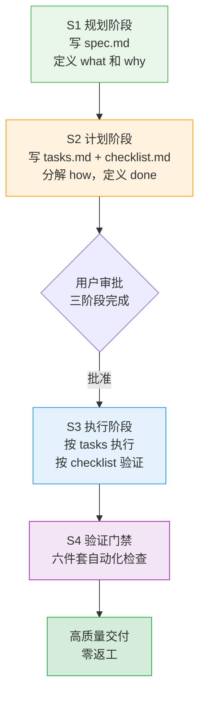

# Spec Mode+验证门禁双保险工作流

## 模式类型
Spec工作流模式 → 结构化工作流方法论

## 成熟度
**L2 已验证**（3次完整端到端项目验证，核心机制稳定，补充了适用边界量化判断标准）

| 验证指标 | best-practices断链修复（首次） | 第一性原理知识库（无Spec→7次迭代） | 对抗性审查知识库（有Spec→单次达标） | 说明 |
|---|---|---|---|---|
| Spec三件套使用 | ✅ 完整使用 | ❌ 未使用（探索阶段） | ✅ 完整使用 | 对比验证Spec效果 |
| 版本迭代次数 | 1次完成 | v1.0→v1.7（7次迭代） | 1个主提交达标 | Spec前置规划显著减少返工 |
| 后续修正提交 | 0 | 多个内容修正提交 | 0（仅机械性错误修正） | 方向错误是最大返工来源 |
| 规划/产出比 | - | - | 约1:8.6（401行Spec→3456行产出） | 规划投入ROI显著 |
| 返工原因 | - | 方向性问题+遗漏 | 仅机械性错误（路径/frontmatter/commit） | Spec消除方向性返工 |

## 问题背景

中大型任务（文档维护、重构、链接修复等）存在"直接开始执行"的反模式，导致：

- **遗漏问题**：没有 checklist 指导时容易只关注显性问题，忽略隐性问题
- **超出范围**：没有 spec 明确边界，容易做超出需求的工作
- **依赖主观判断**："我觉得没问题"不能替代客观验证

根因：人的工作记忆有限，没有外部化 checklist 和验收标准时容易遗漏。结构化工作流通过外部化认知负担弥补这一局限。

## 核心原则

**Spec Mode+验证门禁双保险**：通过"规划→计划→执行→验证"的完整流程，将工作记忆外部化为 checklist 和验收标准，确保交付完整性。

| 阶段 | 产出物 | 价值 |
|------|--------|------|
| S1 规划 | spec.md（PRD） | 明确需求边界和验收标准，避免遗漏和超范围 |
| S2 计划 | tasks.md（任务分解） checklist.md（验证标准） | 工作分解避免遗漏步骤；验证标准客观化 |
| S3 执行 | 按 tasks 顺序执行 | 有序推进，不跳步 |
| S4 验证 | 自动化检查（六件套） | 客观验证，不依赖"我觉得没问题" |

## 验证门禁六件套（文档类任务）

| # | 检查项 | 工具 | 作用 |
|---|--------|------|------|
| 1 | 链接有效性检查 | check-links.py | 验证所有正文链接和 frontmatter 路径有效 |
| 2 | 索引完整性验证 | docgen.py / generate-readme.py | 验证衍生索引与源文件同步 |
| 3 | CHANGELOG 更新检查 | 人工 + 自动化 | 验证变更记录完整 |
| 4 | frontmatter 格式验证 | check-links.py --check-frontmatter-paths | 验证 source/x-toml-ref 字段格式规范 |
| 5 | 元数据 TOML 文件同步 | check-source-traceability.py | 验证派生产物溯源完整 |
| 6 | 整体 CI 检查通过 | ci-check.ps1 / ci-check.sh | 综合质量门禁 |

## 本次任务的 Spec Mode 流程验证

| 阶段 | 产出物 | 价值 |
|------|--------|------|
| 规划阶段 | spec.md(PRD) | 明确4项需求边界和验收标准 |
| 规划阶段 | tasks.md(7个任务) | 工作分解，避免遗漏步骤 |
| 规划阶段 | checklist.md(7个检查点) | 验证标准客观化 |
| 执行阶段 | 按 tasks 顺序执行 | 有序推进，不跳步 |
| 验证阶段 | 6项自动化检查 | 客观验证，不依赖"我觉得没问题" |

## "修复一个，发现一片"的连锁效应

在执行过程中保持开放，对发现的范围外问题主动记录和修复，不局限于用户明确提出的要求：

- **本次案例**：用户要求修复断链，执行中发现 frontmatter 问题和索引遗漏，主动扩展修复范围
- **关键**：不局限于"用户明确提出的要求"，而是关注"问题本质需要修复的范围"
- **保障**：spec.md 定义核心边界，但允许在执行中扩展（需更新 tasks.md 记录）

## 适用场景与边界判断

### ✅ 高ROI场景（强烈推荐使用）

| 场景 | 判断标准 |
|------|---------|
| **目标边界清晰的构建任务** | 如"构建X知识库"、"实现X功能"，有明确交付物 |
| **有明确验收标准的交付任务** | 如"修复所有断链"、"重构Y模块"，完成标准可客观判断 |
| **中大型文档维护任务** | ≥3个文件变更、涉及目录结构调整 |
| **重构任务** | 结构变更、目录迁移、大规模格式统一 |
| **新功能/新模块开发** | 有明确需求、有验收标准 |
| **批量链接/格式修复** | 需要系统性检查而非单点修复 |
| **任何需要"零返工"的高质量交付场景** | 对交付质量要求高、返工成本大 |

### ⚠️ 需调整场景（弹性使用，避免刚性约束）

| 场景 | 正确做法 |
|------|---------|
| **探索性研究任务**（"研究一下X看看有什么"） | 不要一开始就写完整Spec——先做探索性研究（时间盒1-2小时），获得足够信息后再进入Spec模式；或用极简Spec（仅目标+时间盒，不分解tasks） |
| **需求模糊的创意工作** | 两阶段开发：先做原型/MVP验证方向（phase 1，无Spec），方向验证后再用Spec模式规划正式交付（phase 2） |
| **紧急Hotfix** | 快速修复优先，事后补Spec记录变更原因和范围 |

### ❌ 不适用场景（不要用）

- 单行修复（typo、明显bug、1个文件的小改动）
- 纯探索性学习（无明确交付目标，学习本身就是目的）
- 临时性实验（无复用价值、失败了直接丢弃）

### 量化决策标准（关键判断工具）

> **80%验收标准测试**：在开始执行前，你能写出80%明确的验收标准吗？
>
> - ✅ **能写出** → 使用完整SpecWeave三件套（spec/tasks/checklist），ROI最高
> - ⚠️ **只能写出模糊方向** → 先做探索性研究/原型验证（时间盒），获得足够信息后再进Spec模式
> - ❌ **完全写不出** → 不要强行写Spec，先探索，搞清楚要做什么再说

**对比实证**：
- 第一性原理知识库构建初期（v1.0）：属于探索性任务，强行写完整Spec会限制探索空间，导致7次迭代（这是合理的探索成本）
- 对抗性审查知识库构建（v1.0）：目标边界清晰、验收标准明确（参考第一性原理成熟结构），Spec前置规划将多版本迭代压缩为单次执行达标，ROI极高

## 与其他模式的关系

| 模式 | 关系 |
|------|------|
| [spec-as-code-automated-gates.md](../tools-automation/spec-as-code-automated-gates.md) | Spec即代码门禁是验证门禁的技术实现，本模式是工作流方法论 |
| [three-tier-governance.md](../governance-strategy/three-tier-governance.md) | 三层治理模型（原子化→自动化→验证）的"验证层"由本模式的六件套具体落地 |
| [two-phase-development.md](../governance-strategy/two-phase-development.md) | 两阶段开发关注"规划-执行"两阶段，本模式扩展为四阶段并强化验证门禁 |
| [nonlinear-correction-cost.md](../governance-strategy/nonlinear-correction-cost.md) | 非线性返工成本——本模式通过 spec 阶段前置避免返工成本指数增长 |
| [format-evidence-over-memory-pattern.md](../governance-strategy/format-evidence-over-memory-pattern.md) | 格式证据优先于记忆——本模式将"依赖记忆"替换为"依赖 checklist" |
| [rolling-retro-eight-steps.md](../retrospective-knowledge/rolling-retro-eight-steps.md) | 滚动复盘八步法——本模式是任务执行阶段的工作流，复盘是任务完成后的总结 |

## 验证状态

- ✅ best-practices断链修复验证（首次）：全流程遵循Spec Mode，零返工，验证全部通过
- ✅ 第一性原理知识库对比验证（无Spec对照组）：未使用Spec→经历v1.0→v1.7共7次迭代，主要返工为方向性问题
- ✅ 对抗性审查知识库验证（有Spec实验组）：使用Spec→1个主提交达标，仅机械性错误修正，无方向性返工
- ✅ 已有流程基础：.trae/specs/体系已建立此工作流

## Changelog

- **v1.1.0** (2026-07-10): 基于对抗性审查知识库项目和第一性原理项目的对比验证，升级至L2。新增：(1) 适用边界量化判断标准（80%验收标准测试）；(2) 高ROI/需调整/不适用三类场景的明确划分；(3) 三次验证对比表；(4) 探索性任务的弹性使用指导（先探索再Spec）；(5) 补充标准frontmatter字段
- **v1.0.0** (2026-07-09): 初始版本，基于best-practices目录断链修复任务首次验证，成熟度L1

## 关联资源

- 来源复盘：[best-practices目录断链修复复盘](../../../reports/task-reports/retrospective-best-practices-readme-link-fix-20260709/README.md)
- 洞察萃取：[insight-extraction.md 洞察5](../../../reports/task-reports/retrospective-best-practices-readme-link-fix-20260709/insight-extraction.md)
- 工作流基础设施：[.trae/specs/](../../../../../.trae/specs/README.md)
- 验证工具：[ci-check-cmd](../../../../../.agents/skills/ci-check-cmd/)、[link-check-cmd](../../../../../.agents/skills/link-check-cmd/)
