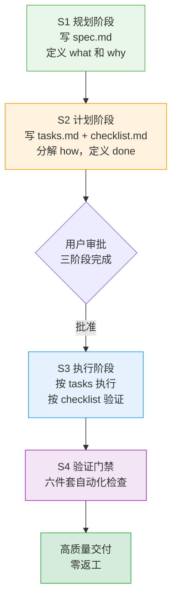

# Spec Mode+验证门禁双保险工作流

## 模式类型
Spec工作流模式 → 结构化工作流方法论

## 成熟度
**L1 实验性**（基于 2026-07-09 best-practices 目录断链修复任务单次验证；.trae/specs/ 体系已建立此工作流基础）

## 问题背景

中大型任务（文档维护、重构、链接修复等）存在"直接开始执行"的反模式，导致：

- **遗漏问题**：没有 checklist 指导时容易只关注显性问题，忽略隐性问题
- **超出范围**：没有 spec 明确边界，容易做超出需求的工作
- **依赖主观判断**："我觉得没问题"不能替代客观验证

根因：人的工作记忆有限，没有外部化 checklist 和验收标准时容易遗漏。结构化工作流通过外部化认知负担弥补这一局限。

## 核心原则

**Spec Mode+验证门禁双保险**：通过"规划→计划→执行→验证"的完整流程，将工作记忆外部化为 checklist 和验收标准，确保交付完整性。

| 阶段 | 产出物 | 价值 |
|------|--------|------|
| S1 规划 | spec.md（PRD） | 明确需求边界和验收标准，避免遗漏和超范围 |
| S2 计划 | tasks.md（任务分解） checklist.md（验证标准） | 工作分解避免遗漏步骤；验证标准客观化 |
| S3 执行 | 按 tasks 顺序执行 | 有序推进，不跳步 |
| S4 验证 | 自动化检查（六件套） | 客观验证，不依赖"我觉得没问题" |

## 验证门禁六件套（文档类任务）

| # | 检查项 | 工具 | 作用 |
|---|--------|------|------|
| 1 | 链接有效性检查 | check-links.py | 验证所有正文链接和 frontmatter 路径有效 |
| 2 | 索引完整性验证 | docgen.py / generate-readme.py | 验证衍生索引与源文件同步 |
| 3 | CHANGELOG 更新检查 | 人工 + 自动化 | 验证变更记录完整 |
| 4 | frontmatter 格式验证 | check-links.py --check-frontmatter-paths | 验证 source/x-toml-ref 字段格式规范 |
| 5 | 元数据 TOML 文件同步 | check-source-traceability.py | 验证派生产物溯源完整 |
| 6 | 整体 CI 检查通过 | ci-check.ps1 / ci-check.sh | 综合质量门禁 |

## 本次任务的 Spec Mode 流程验证

| 阶段 | 产出物 | 价值 |
|------|--------|------|
| 规划阶段 | spec.md(PRD) | 明确4项需求边界和验收标准 |
| 规划阶段 | tasks.md(7个任务) | 工作分解，避免遗漏步骤 |
| 规划阶段 | checklist.md(7个检查点) | 验证标准客观化 |
| 执行阶段 | 按 tasks 顺序执行 | 有序推进，不跳步 |
| 验证阶段 | 6项自动化检查 | 客观验证，不依赖"我觉得没问题" |

## "修复一个，发现一片"的连锁效应

在执行过程中保持开放，对发现的范围外问题主动记录和修复，不局限于用户明确提出的要求：

- **本次案例**：用户要求修复断链，执行中发现 frontmatter 问题和索引遗漏，主动扩展修复范围
- **关键**：不局限于"用户明确提出的要求"，而是关注"问题本质需要修复的范围"
- **保障**：spec.md 定义核心边界，但允许在执行中扩展（需更新 tasks.md 记录）

## 适用场景

- ✅ 中大型文档维护任务（≥3个文件变更）
- ✅ 重构任务（结构变更、目录迁移）
- ✅ 链接修复任务（批量断链修复）
- ✅ 新功能/新模块开发
- ✅ 任何需要"零返工"的高质量交付场景

## 不适用场景

- 单行修复（typo、明显bug）
- 探索性研究任务（无明确交付目标）
- 临时性实验（无复用价值）

## 与其他模式的关系

| 模式 | 关系 |
|------|------|
| [spec-as-code-automated-gates.md](../tools-automation/spec-as-code-automated-gates.md) | Spec即代码门禁是验证门禁的技术实现，本模式是工作流方法论 |
| [three-tier-governance.md](../governance-strategy/three-tier-governance.md) | 三层治理模型（原子化→自动化→验证）的"验证层"由本模式的六件套具体落地 |
| [two-phase-development.md](../governance-strategy/two-phase-development.md) | 两阶段开发关注"规划-执行"两阶段，本模式扩展为四阶段并强化验证门禁 |
| [nonlinear-correction-cost.md](../governance-strategy/nonlinear-correction-cost.md) | 非线性返工成本——本模式通过 spec 阶段前置避免返工成本指数增长 |
| [format-evidence-over-memory-pattern.md](../governance-strategy/format-evidence-over-memory-pattern.md) | 格式证据优先于记忆——本模式将"依赖记忆"替换为"依赖 checklist" |
| [rolling-retro-eight-steps.md](../retrospective-knowledge/rolling-retro-eight-steps.md) | 滚动复盘八步法——本模式是任务执行阶段的工作流，复盘是任务完成后的总结 |

## 验证状态

- ✅ 本次任务验证：全流程遵循 Spec Mode，零返工，验证全部通过
- ✅ 已有流程基础：.trae/specs/ 体系已建立此工作流

## 关联资源

- 来源复盘：[best-practices目录断链修复复盘](../../../reports/task-reports/retrospective-best-practices-readme-link-fix-20260709/README.md)
- 洞察萃取：[insight-extraction.md 洞察5](../../../reports/task-reports/retrospective-best-practices-readme-link-fix-20260709/insight-extraction.md)
- 工作流基础设施：[.trae/specs/](../../../../../.trae/specs/)
- 验证工具：[ci-check-cmd](../../../../../.agents/skills/ci-check-cmd/)、[link-check-cmd](../../../../../.agents/skills/link-check-cmd/)
