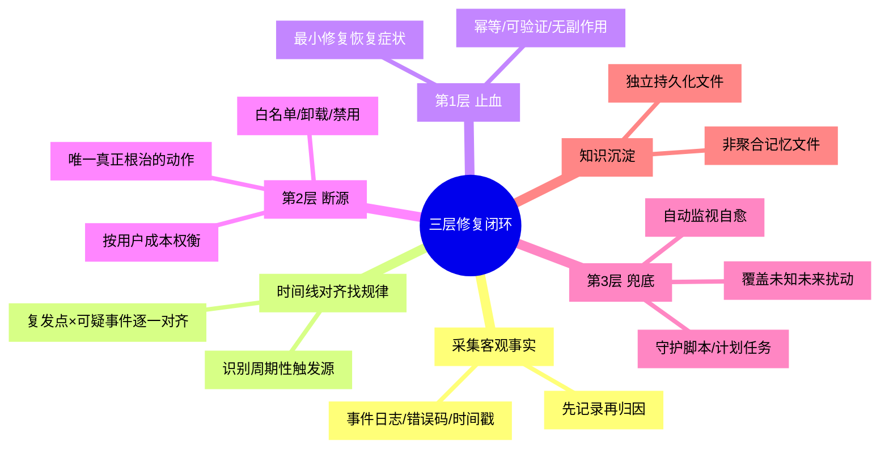

# 三层修复闭环

## 模式概述

针对**反复复发型故障**（同类问题修复后短期再次出现），以「治标 → 断源 → 兜底」三层闭环处置，并沉淀预防知识，从根本上打破「清理→破坏→修复→再破坏」的死循环。

核心思想：**任何反复复发都不是"症状随机损坏"，而是存在周期性破坏源**。单次修复（治标）只是重建被破坏的状态；必须识别并隔离破坏源（断源），再建立自动化自愈（兜底）覆盖未知未来扰动，最后把知识沉淀到独立文件防止遗忘。

该模式由 Windows 截图工具 10 天 3 次故障案例萃取：前两次仅重注册（治标）均复发，第三次按三层闭环处置（重注册 + 白名单断源 + 守护自愈 + 知识沉淀）后闭环。

## 触发场景

**适用于**：
- 同类故障修复后短期再次复发（"又坏了""为什么总是这样"）
- 存在可疑周期性破坏源（清理软件、杀毒、自动更新、定时任务）的系统环境
- 手动修复有效但需要免人工兜底的运维场景
- 故障知识容易丢失、需要沉淀复用的团队

**不适用于**：
- 一次性故障（无复发史，直接修复即可，三层是过度工程）
- 纯只读问题（无破坏源、无需修复动作）
- 需要人工决策的复杂根因（三层只能定位，决策仍须人工）

## 核心做法（5 步）

1. **复现并采集客观事实**：收集事件日志、错误码、时间戳、版本、进程、白名单配置等可验证事实（无因果推断词）。**排查首要原则：先记录，再归因。**

2. **时间线对齐找复发规律**：把所有复发时间点与可疑事件（软件安装、系统更新、清理运行、进程启动）逐一对齐，识别**周期性触发源**。本案例即靠"优化大师 8:45 活跃 → 8:50 故障"的 5 分钟对齐锁定元凶。

3. **第 1 层 · 止血**：执行最小修复恢复当前症状（重注册/重启服务/恢复配置）。要求幂等、可验证、无副作用。

4. **第 2 层 · 断源**：识别并隔离破坏源——白名单排除、卸载、配置禁用，三选一按用户成本权衡。断源是三层中唯一真正"根治"的动作，不做则必然复发。

5. **第 3 层 · 兜底**：建立自动化监视自愈（守护脚本/计划任务监视故障信号 → 自动执行止血），覆盖未来未知扰动（新更新、新软件）。最后把根因+处置方案沉淀到**独立持久化文件**（非聚合记忆文件）。

### 核心做法思维导图

## 反模式（5 个）

### 反模式1：只治标不找破坏源

- **来源**：本案例前两次修复（仅重注册 Appx 包）
- **表现**：每次故障重跑一遍修复命令，从不追问"什么东西在反复破坏"
- **后果**：破坏源常驻，修复后短期必然复发，投入产出比极低
- **正确做法**：时间线对齐定位周期触发源，执行第 2 层断源

### 反模式2：知识只写聚合记忆文件不独立备份

- **来源**：本案例 08-10 沉淀的方案写入 `project_memory.md` 后被后续更新整体覆盖丢失
- **表现**：排查方案存在单一聚合文件，无章节级保护
- **后果**：同类问题需重新排查，重蹈覆辙
- **正确做法**：重要排查方案用独立文件持久化（`docs/` 或 `playground/reports/`），记忆文件仅放指针

### 反模式3：修复后不建立自动化自愈

- **来源**：本案例前两次修复后无守护机制
- **表现**：修复完成后靠人工发现复发，复发后重新手动处理
- **后果**：未来任意未知扰动（新更新/新软件）都会再次造成长时间不可用
- **正确做法**：建立日志监视 + 自动止血的守护模式，覆盖未来扰动

### 反模式4：归因前不验证破坏源假设

- **来源**：对抗审查修正——8:45 data 更新可能只是使用统计/弹窗，非清理动作（证据为间接）
- **表现**：时间对齐后发现唯一嫌疑就认定是元凶，未做排除验证
- **后果**：错杀无辜工具或漏掉真正根因，复发后归因推翻
- **正确做法**：用白名单机制证据、复发统计相关性等多信号交叉验证；断源对策选择对任意路径都成立的方案（白名单/守护双保险）

### 反模式5：断源动作不备份不回滚

- **来源**：修改第三方软件白名单配置时的风险意识（配置升级可能覆盖）
- **表现**：直接改写用户软件配置，无备份，无法回滚
- **后果**：配置丢失或软件升级覆盖，白名单失效，复发无防护
- **正确做法**：改配置前备份（如 `xxx.ini.bak-<date>`），保留恢复路径（参考幂等四要素 E3）

## 检验标准

- [ ] 复发现象消失：修复后保持若干周期（≥2 个原复发周期）无复发
- [ ] 破坏源被隔离：周期性触发源已被白名单/卸载/禁用覆盖
- [ ] 自愈机制可触发：故障信号出现时守护模式能自动止血并留下日志
- [ ] 知识已沉淀：根因+处置方案在独立文件中可被再次检索到
- [ ] 断源可回滚：白名单/配置修改有备份，可一键还原

## 跨场景迁移示例

### 迁移示例1：杀毒软件误杀业务程序

- 场景：杀毒软件周期性隔离某个 DLL，业务程序每次重启后故障
- 三层应用：止血=恢复 DLL 并重启服务；断源=杀毒白名单加入该程序路径；兜底=监视"文件缺失"日志自动触发恢复；沉淀=写入运维知识库
- 迁移可行性：结构与截图工具案例完全同构（工具清理 UWP 缓存 vs 杀毒隔离 DLL）

### 迁移示例2：数据库连接池周期性耗尽

- 场景：连接数每两周到顶一次，重启应用恢复
- 三层应用：止血=清理空闲连接重启；断源=定位泄漏 SQL/连接未释放的代码（周期性触发源）；兜底=监控连接数阈值自动清理；沉淀=代码审查清单
- 迁移可行性：触发源从"外部工具"变为"内部代码"，三层结构不变

### 迁移示例3：家庭宽带周期性掉线

- 场景：路由器每周末掉线，重启光猫恢复
- 三层应用：止血=重启光猫；断源=排查周末大流量设备（NAS/下载机）过热/占满并发；兜底=设置定时重启+流量告警；沉淀=家庭网络备忘
- 迁移可行性：跨领域验证（非软件），证明模式抽象层成立

## 案例来源

| 案例 | 来源 | 触发源 | 结果 |
|------|------|--------|------|
| Windows 截图工具三次复发 | 七概念问题解决（sc-20260815-screenshot-tool-relapse） | 双源头：Windows 更新 + Windows优化大师清理 | 三层闭环处置完成，白名单+守护自愈+知识沉淀 |

## 配套资产

- 通用自动化脚本模板：[three-layer-repair-closure-template](../../../../.agents/templates/three-layer-repair-closure-template/README.md)
- 参考实现：[fix-screenshot-tool.ps1](../../../../.agents/scripts/fix-screenshot-tool.ps1)（`-Watch` 守护模式即第 3 层兜底实现）
- 私域根因报告：[screenshot-tool-dual-source-rootcause-20260815.md](../../../playground/reports/screenshot-tool-dual-source-rootcause-20260815/screenshot-tool-dual-source-rootcause-20260815.md)（不入 git）

## 对抗审查记录

本模式经过 4 视角对抗审查，采纳 4 条修正：
1. **魔鬼代言人**：08-06 首次故障早于优化大师安装 → 根因修正为**双源头**（Windows 更新低频 + 优化软件高频），模式强调"周期性触发源可多个"
2. **魔鬼代言人**：8:45 data 更新证据为间接 → 反模式4"归因前不验证破坏源假设"，要求多信号交叉验证
3. **新人视角**：修复动作需免人工兜底 → 核心做法第 5 步强化"自动化自愈"为第 3 层
4. **老板视角**：断源成本权衡（卸载 vs 白名单）→ 核心做法第 4 步"按用户成本权衡，三选一"
5. **未来视角**：未来新更新/新软件仍可能破坏 → 第 3 层兜底覆盖未知扰动，反模式3支撑

完整对抗审查与事实链见私域根因报告 V 阶段。
