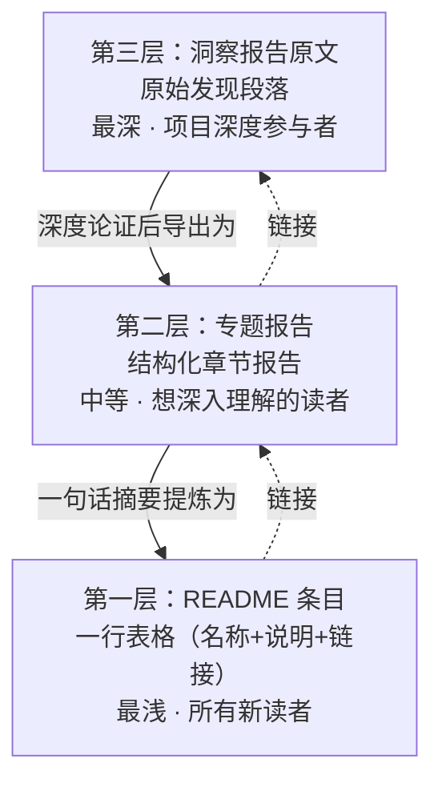

+++
id = "three-tier-knowledge-sedimentation"
domain = "methodology"
layer = "methodology"
maturity = "L1"
validation_count = 1
reuse_count = 0
documentation_level = "standard"
source = "docs/retrospective/reports/retrospective-session-insight-extraction-readme-evolution-20260624.md#三、洞察-发现二"

[bindings]
rules = []
references = ["meta-document-leverage.md", "review-insight-export-loop.md", "progressive-readme-growth.md"]
skills = []
+++

> **来源**：从 `docs/retrospective/reports/retrospective-session-insight-extraction-readme-evolution-20260624.md` 三、洞察 — 发现二 拆分

# 三层知识沉淀体系（Three-Tier Knowledge Sedimentation）

## 模式类型
方法论模式

## 成熟度
L1 实验性（基于 2026-06-24 会话中"工具熵减非线性优化曲线"从洞察到 README 的完整沉淀过程单次验证）

## 适用场景
完成某个技术概念的深度分析后，需要将认知沉淀为可被不同受众、不同深度需求访问的知识资产。

## 问题背景

知识产出的常见误区是将所有内容堆在一个报告中，导致两个问题：
- **新读者无入口**：面对深度报告不知从何开始
- **深度读者难溯源**：精简后的摘要丢失了分析细节

本模式定义了一种"从深到浅、从索引到正文"的递进式三层结构，使同一知识可以同时服务三种深度的阅读需求。

## 核心机制

## 三层详解

| 层次 | 形式 | 深度 | 受众 | 阅读耗时 | 创建成本 |
|------|------|------|------|---------|---------|
| 第三层：洞察原文 | 原始发现段落（在复盘/分析报告中） | 最深 | 项目深度参与者 | 5-10 分钟 | 0（原始产出） |
| 第二层：专题报告 | 6 章结构化报告（背景→分析→洞察→萃取→导出→建议） | 中等 | 想深入理解该概念的读者 | 3-5 分钟 | 中等（30 分钟） |
| 第一层：README 条目 | 一行表格（创新名 + 一句话说明 + 来源链接） | 最浅 | 所有新读者 | 3-30 秒 | 极低（< 1 分钟） |

## 操作流程

1. **深度分析**：在复盘/分析过程中产出原始洞察（第三层自然生成）
2. **专题导出**：将洞察结构化为专题报告，补充背景、量化数据、关联模式（第二层按需生成）
3. **摘要注册**：将最核心的认知浓缩为一句话，注册到 README 技术创新点表格（第一层每次必做）

**关键规则**：第一层（README 条目）是必选项——任何被认定为有价值的概念都必须在 README 中有一个可索引的入口。第二层（专题报告）是可选扩展——仅在概念足够复杂或需要独立引用时才创建。

## 价值量化

| 指标 | 无分层（仅报告） | 有三层沉淀 |
|------|---------------|-----------|
| 新读者发现概念的时间 | 需通读报告全文（10 分钟+） | 扫 README 表格即可（3 秒） |
| 深度读者追溯原始分析 | 报告即为最终产出，无法溯源 | 通过链接链直达原始发现 |
| 知识复利 | 每次分析独立存在 | 新概念自动纳入 README 网络，价值密度递增 |

## 本案例验证

以"工具熵减非线性优化曲线"为例，完整经历了三层沉淀：

| 层次 | 实际产出 | 路径 |
|------|---------|------|
| 第三层 | insight-extraction.md 中的原始发现段落（L29 行） | `retrospective-comprehensive-20260623/insight-extraction.md` |
| 第二层 | 6 章结构化专题报告 | `retrospective-report-tool-entropy-nonlinear-optimization.md` |
| 第一层 | README 技术创新点表格中的一行 | `README.md#技术创新点` |

三层之间通过链接双向连通：README 条目链接到专题报告，专题报告引用原始发现。

## 与现有模式的关系

- `meta-document-leverage.md`：本模式的第一层（README 条目）是元文档杠杆效应的具体实施手段——将高价值概念以最低门槛注册到元文档
- `review-insight-export-loop.md`：本模式是"洞察→导出"环节的精化——将"导出"分解为三层，明确了每层的受众、深度和创建条件
- `progressive-readme-growth.md`：本模式提供了 README 条目（第一层）的内容来源，两者配合形成"分析产出概念 → README 条目注册"的完整链路

> **关联模块**：
> - `meta-document-leverage.md`
> - `review-insight-export-loop.md`
> - `progressive-readme-growth.md`
> - `docs/retrospective/reports/retrospective-session-insight-extraction-readme-evolution-20260624.md`
