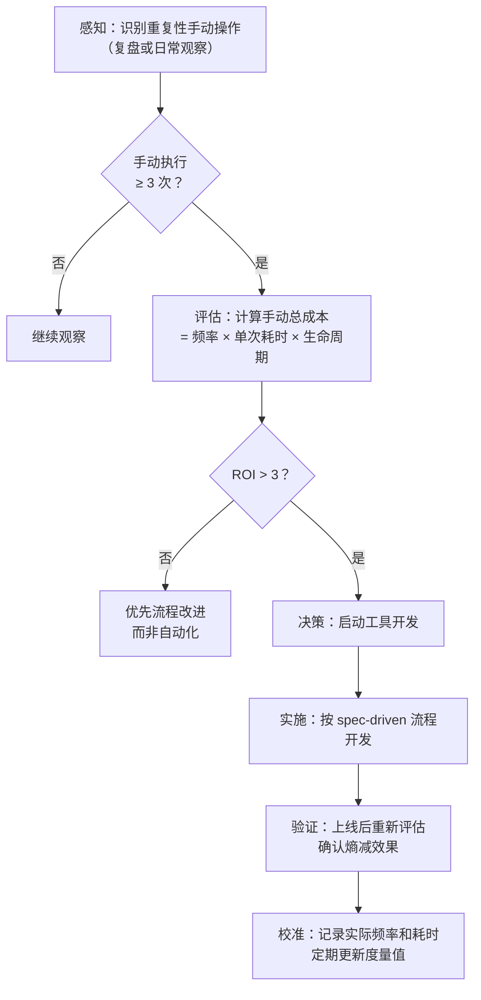

+++
id = "tool-automation-decision-model"
domain = "methodology"
layer = "methodology"
maturity = "L2"
validation_count = 2
reuse_count = 0
documentation_level = "basic"
source = "docs/retrospective/knowledge-extraction.md"

[bindings]
rules = []
references = []
skills = []
+++

# 工具自动化决策模型（Tool Automation Decision Model）

> **来源**：由 `tool-trigger-mechanism.md`（洞察 1）与 `tool-entropy-metrics.md`（洞察 5）合并而成，两者共享「手动总成本 = 频率 × 单次耗时 × 生命周期」核心公式。

## 一、核心公式

本模型统一了"何时开发工具"和"如何度量工具价值"两个决策维度，底层共用同一成本公式：

```
手动总成本 = 操作频率 × 单次耗时 × 预期生命周期
熵减收益   = 手动总成本 - 工具开发成本
工具 ROI   = 熵减收益 / 工具开发成本
```

| 指标 | 含义 | 用途 |
|------|------|------|
| 手动总成本 | 不做自动化时，生命周期内的人力总投入 | 触发决策的基准线 |
| 工具开发成本 | 一次性的开发 + 调试 + 文档成本 | 投入门槛 |
| ROI | 单位开发成本的熵减回报 | 排序与优先级判断 |

## 二、触发机制：何时应开发工具

### 触发条件

| 条件 | 阈值 | 说明 |
|------|------|------|
| 手动执行次数 | ≥ 3 次 | 通过复盘或日常观察感知 |
| 收益比 | > 3 | 手动总成本 / 工具开发成本 > 3 |
| 适用边界 | 满足 | 非一次性任务、非创意性工作、非需人工判断的决策 |

### 触发流程



### 评估矩阵（示例）

| 操作 | 频率 | 单次耗时 | 生命周期 | 手动总成本 | 工具开发成本 | ROI | 决策 |
|------|------|---------|---------|-----------|-------------|-----|------|
| 检查断链 | 每周 5 次 | 10 分钟 | 2 年 | 5200 分钟 | 120 分钟 | 43x | 必须开发 |
| 临时验证 | 每月 1 次 | 2 分钟 | 6 个月 | 12 分钟 | 60 分钟 | 0.2x | 不开发 |

## 三、度量体系：如何量化工具价值

### 熵分类体系

"熵"指系统的手动维护成本。每个工具的目标是定向削减一类特定的熵：

| 熵类型 | 描述 | 典型工具 |
|--------|------|---------|
| 链接断裂熵 | 文件引用失效导致的错误 | check-links.py |
| 导航维护熵 | 手动更新导航表的成本 | generate-nav.py |
| 路径迁移熵 | 文件移动时调整链接的成本 | check-move.py |
| 依赖泄漏熵 | 临时文件被误提交的风险 | check-gitignore.py |
| 检查遗漏熵 | 忘记运行某个检查的风险 | ci-check.ps1 |

### 已实施工具的熵减分析

| 工具 | 削减的熵类型 | 频率 | 单次耗时 | 生命周期 | 手动总成本 | 开发成本 | ROI |
|------|------------|------|---------|---------|-----------|---------|-----|
| check-links.py | 链接断裂熵 | 每日 3 次 | 15 分钟 | 2 年 | 21900 分钟 | 90 分钟 | 243x |
| generate-nav.py | 导航维护熵 | 每周 5 次 | 5 分钟 | 2 年 | 2600 分钟 | 60 分钟 | 43x |
| check-move.py | 路径迁移熵 | 每月 2 次 | 10 分钟 | 2 年 | 480 分钟 | 80 分钟 | 6x |
| check-gitignore.py | 依赖泄漏熵 | 每日 1 次 | 3 分钟 | 2 年 | 2190 分钟 | 40 分钟 | 55x |
| ci-check.ps1 | 检查遗漏熵 | 每日 3 次 | 5 分钟 | 2 年 | 10950 分钟 | 30 分钟 | 365x |

## 四、关联工具

| 工具 | 触发方式 |
|------|---------|
| `check-links.py` | 手动检查断链 × 3 |
| `generate-nav.py` | 手动更新导航表 × 5 |
| `check-move.py` | 手动调整路径 × 3 |

## 五、使用指南

1. **开发前评估**：在开发新工具前，先套用「手动总成本」公式估算投入产出
2. **ROI 门槛**：ROI < 3 的工具优先考虑流程改进而非自动化
3. **上线后校准**：工具上线后记录实际频率和耗时，定期校准度量值
4. **熵类型登记**：新工具上线后，在熵分类体系中登记其削减的熵类型

## 六、适用边界

- **适用于**：文档维护、代码检查、部署流程等重复性工程操作
- **不适用于**：一次性任务、创意性工作、需要人工判断的决策

> **关联模块**：`.agents/scripts/`、`spec-driven-development.md`
