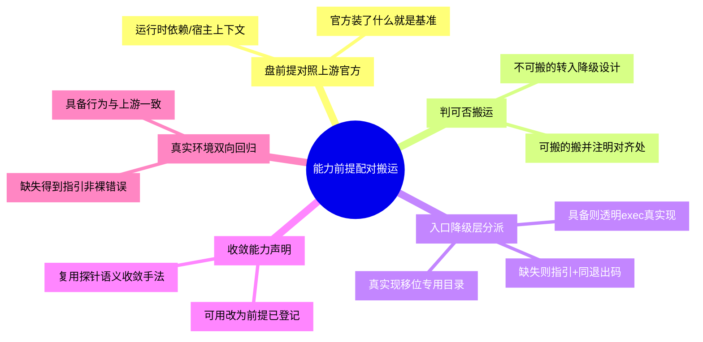

# 能力前提配对搬运

## 模式概述

把一个"能力"搬到新环境时，被搬运的从来不是单一物件，而是一对关系：**能力资产**（二进制、库、配置、SDK、脚本）与**该能力得以发挥作用的运行前提**（宿主启动器、守护进程 socket、设备节点、凭据、网络出口、许可服务）。资产可以 `COPY` 进去，前提往往不能——前提的成立条件是"目标环境之外还有谁在配合"。

只搬资产、不盘前提，会连续产生三类缺陷：

1. **前提静默缺失**：资产就位（文件在、可执行位有），但它依赖的宿主上下文不在搬运范围内，能力在目标环境**必然**不可用。缺陷在搬运完成的那一刻已经存在，只是尚未被触发。
2. **裸错误无指引**：用户首次调用时才撞上失败，且工具只抛出底层断言——`Error: TOOLBOX_PATH not set`（退出码 1）。用户看到的是内部变量名，既不知道缺失的原因域（宿主上下文），也不知道替代路径，定位成本被完整外推给用户。
3. **声明越界**：文档、清单、AGENTS 把"资产就位"写成"能力可用"，把一次未完成的前提搬运掩盖成一次交付完成。

核心思想：**搬运的验收单位是"资产 + 前提"的配对，而不是资产本身；当某条前提在目标环境中确实不可搬运时，交付的责任并没有消失——它从"补齐前提"转移为"在入口处给出可执行的降级反馈"。**

该模式由 jupyter-podman-rootless 镜像搬运 toolbox 案例萃取：镜像经 `COPY --from=toolbox-builder /out/toolbox` 内嵌上游 toolbox 二进制，容器内裸跑输出 `Error: TOOLBOX_PATH not set`（退出码 1）。上游依据（`vendor/toolbox/src/cmd/root.go:160-169`）：`TOOLBOX_PATH` 为空**且** `utils.IsInsideContainer()`（判定 `/run/.containerenv` 存在）为真 → `return errors.New("TOOLBOX_PATH not set")`；该变量由**宿主侧 Toolbx 启动器**注入，容器内不存在启动器。次要前提同样缺席：宿主回调 `ForwardToHost()` 经 `flatpak-spawn` 执行（`vendor/toolbox/src/pkg/utils/utils.go:269-289`），而官方镜像在 `images/ubuntu/26.04/Containerfile:25` 安装 `flatpak-xdg-utils` 并于 `:37` 建立 `flatpak-spawn` 符号链接——本镜像两项皆无。修复分两路：**可搬的前提就搬**（补装 `flatpak-xdg-utils` + symlink，对齐官方）；**不可搬的前提就在入口降级**（真二进制移位至 `/usr/local/libexec/toolbox`，`/usr/local/bin/toolbox` 让给 wrapper：前提具备则透明 `exec` 真实现，缺失则输出可执行指引且保持上游退出码 1）。

## 触发场景

**适用于**：
- 把上游或其他环境的工具/二进制/库/SDK 搬运到新边界（容器镜像、离线安装包、嵌入式系统、WSL 发行版、跨平台安装器）
- 被搬运对象的能力依赖目标环境之外的上下文（宿主启动器、守护进程 socket、设备节点、凭据、网络出口、许可服务）
- 上游存在官方参考发行物（官方镜像的 Containerfile、官方安装包依赖清单），可作为"前提清单"的核对基准
- 该能力会被写进文档/清单/AGENTS/规则，对用户形成可用性承诺
- 已出现"工具在、一用就报底层错误"的现象，且错误信息是内部变量名或断言

## 反目标用户/不适用场景（≥3类）

本模式只在"跨边界搬运"这一条件下成立，以下 4 类场景**不适用**本模式，强行套用只会引入无收益的包装层：

1. **同构环境直跑（不适用）**：目标环境与源环境同构，同一宿主直接运行、未跨任何边界 → 前提天然满足，既无配对验收需求，也无降级入口价值。误用代价：为一个不可能出现的缺失态维护分派层。
2. **自包含资产（不适用）**：被搬运对象静态链接、无外部依赖（纯计算工具、单体二进制）→ "资产到即能力到"，前提清单为空。误用代价：把"盘前提"退化成走过场的形式动作。
3. **一次性脚本与手敲排障命令（不适用）**：无对外声明、无复用价值 → 裸错误可接受。误用代价：wrapper 与文档的长期维护成本远高于一次性用途的收益。
4. **能力在目标环境确无用途（不适用，且应反向处理）**：前提缺失且该能力在目标环境没有任何真实使用上下文 → 应当**删除资产**而非包装（参见[反模式4](#反模式4因前提不可搬而删掉能力过度纠正)）。误用代价：为死代码长期维持入口层与声明。
5. **反目标用户：只以"文件是否 COPY 成功"验收交付的搬运方**。若验收标准止于"资产到位"，则本模式的配对验收要求会与其验收口径直接冲突；出现这种冲突本身就是缺陷信号（见[早期预警信号](#早期预警信号)第 1 条），应先修正验收标准，而不是裁剪模式。

## 适用前提与边界条件

- 存在**可识别的边界**（容器镜像、离线包、嵌入式系统、WSL 发行版、跨平台安装器）——无边界则无"前提是否随行"问题
- 被搬运能力**在目标环境存在真实使用上下文**——否则应删除资产而非包装（反模式4）
- 上游存在**官方参考发行物**（官方镜像 Containerfile、官方包依赖清单）作为"前提清单"的核对基准；若无官方基准，本模式第 1 步退化为人工推断，结论可信度下降，须在文档中标注不确定性
- 该能力会**形成对外可用性声明**（写入文档/清单/AGENTS/规则）——无声明则用户期望本身不会越界

## 核心做法（5 步）

1. **盘前提（对照上游官方发行物）**：对每个拟搬运的资产，列出让它"真正能用"的全部前提，并按来源分类——运行时依赖（共享库、解释器）／宿主上下文（启动器、daemon、socket、设备节点）／授权与凭据／网络与出口。核对基准是**上游官方发行物**：官方镜像装了什么、官方包声明了什么依赖，就是前提清单的来源。本案例即在此步暴露——官方装了 `flatpak-xdg-utils` 并 symlink `flatpak-spawn`，本镜像没有。

2. **判可否搬运**：对每条前提问"它能否随资产一起进入目标环境"。可搬（库、同层工具、配置、环境变量默认值）→ 直接搬并注明对齐了上游哪一处；不可搬（宿主 daemon、宿主启动器、宿主设备、外部凭据）→ 进入第 3 步，转入降级设计。

3. **对不可搬前提设入口降级层**：在目标环境的**入口位置**（PATH 上的同名命令、entrypoint、CLI wrapper）放一层显式分派，按"前提是否具备"分流：
   - **具备** → 透明 `exec` 真实现，行为与上游完全一致（含退出码与 stdout/stderr）；
   - **不具备** → 输出**可执行指引**：说明原因域（哪类前提缺失）、给出 2-3 条可照抄的替代命令、指向落点文档；**退出码与上游保持一致**（不改成 0，也不新造码），并保留一条稳定标记行供探针与日志识别。
   - 落地约束：真实现必须移到**非 PATH 的专用目录**（`/usr/local/libexec/`、`/usr/libexec/`），PATH 位置只留 wrapper——否则 wrapper 与真实现互相遮蔽。

4. **收敛能力声明**：把文档、清单、AGENTS、规则文件中的"可用 / available / 可直接使用"改写为与事实匹配的措辞，并就地登记前提依赖（"完整能力由宿主侧启动器提供；容器内裸跑按上游设计降级并给出指引"）。本步手法直接复用姊妹模式[验证探针语义收敛](../tools-automation/validation-probe-semantics-convergence.md)：先改声明，再评估是否需要改能力。

5. **双向回归（在真实目标环境）**：跑通两条路径——前提缺失时用户拿到的是**可执行指引而非裸错误**；前提具备时行为**与上游一致**。构建通过、语法检查通过都**不算**本步验证。

### 核心做法思维导图

## 反模式（4 个）

### 反模式1：只搬资产，不盘前提

- **来源**：本案例——镜像 `COPY` 了 toolbox 二进制，但未搬运官方镜像中作为宿主回调前提的 `flatpak-spawn`，也未登记"`TOOLBOX_PATH` 由宿主启动器注入"这一前提
- **表现**：搬运清单的验收项只有"文件是否到位"；能力在目标环境必然不可用，且失败点在用户首次调用时才暴露，搬运完成与交付完成被混为一谈
- **正确做法**：搬运以"资产 + 前提"配对为单位验收，前提清单对照上游官方发行物逐条核对，不可搬的前提显式登记

### 反模式2：把底层断言直接抛给用户（裸错误）

- **来源**：本案例——`TOOLBOX_PATH` 为空时上游 `return errors.New("TOOLBOX_PATH not set")`，退出码 1
- **表现**：错误信息是内部变量名，用户既不知道原因域（宿主上下文缺失），也不知道替代路径；同一条信息对"工具坏了"和"用法不对"两种情形不做区分
- **正确做法**：入口层识别该状态并替换为"原因域 + 可执行替代命令 + 文档落点"，**同时保留底层标记行**供自动化识别，退出码与上游一致

### 反模式3：入口层遮蔽真实现

- **来源**：本案例方案设计——wrapper 若与真二进制同名且同装于 `/usr/local/bin`，二者必有一方不可达
- **表现**：wrapper 递归调用自身，或真实现被挤出 PATH；故障形态比裸错误更隐蔽，排查成本更高
- **正确做法**：真实现移位至非 PATH 专用目录（`/usr/local/libexec/toolbox`），PATH 位置只留 wrapper，二者路径互斥

### 反模式4：因前提不可搬而删掉能力（过度纠正）

- **来源**：本案例对抗审查——曾提出"既然容器内跑不起来，就把 toolbox 从镜像移除"
- **表现**：为消除一个**前提/声明缺陷**，破坏一个在**正确上下文**（宿主 Toolbx 会话）中真实可用的能力；且宿主侧 Toolbx 集成依赖镜像内的二进制与 marker，移除后连正路也一并失效
- **正确做法**：先判断缺陷在"前提搬运/声明"还是在"能力本身"；只要能力存在真实的使用上下文，就保留资产，只补前提、加降级、收敛声明

## 失败案例

**失败案例1：入口分派条件靠 CLI 惯例推断——`-v` 白名单误判（本案例真实失败，已在交付前拦截）**

- 失败根因：初版 wrapper 把 `-v` 与 `-h`/`--version` 并列写入"短路透传白名单"，依据是 **CLI 惯例**（多数工具的 `-v` 是 version 简写）。
- 该做法本会造成的后果：容器内执行 `toolbox -v` 会被判为"命中白名单"→ 直通真二进制 → 进入 `PersistentPreRunE` → 再次撞上裸错误 `TOOLBOX_PATH is not set`（退出码 1）。即**降级层在用户最常用的探测命令上失效**，且失效形态与未加 wrapper 时完全相同，属于"加了防护但防护有洞"的隐蔽缺陷。
- 拦截方式：回读上游源码 `vendor/toolbox/src/cmd/root.go:120`，证实 `-v` 由 `CountVarP` 定义为 **verbose 计数标志**，不是 version 简写 → 白名单收窄为 `-h | --help | --version`。
- 失败教训：**入口层的分派条件语义只能由被包装程序的源码定义，不能由 CLI 惯例推断**。凡是"按经验列举例外"的分派条件，都必须回到被包装程序的定义处逐条核对。

**失败案例2：搬运完成即视为交付完成——修复前的真实故障态**

- 失败根因：镜像构建阶段只验收"二进制是否就位"，未验收"前提是否随行"，也未设置负向断言。
- 真实故障态（修复前）：容器内裸跑 `toolbox` 输出 `Error: TOOLBOX_PATH not set`（退出码 1）——错误信息是内部变量名，用户既不知道缺失的前提属于宿主上下文，也不知道替代路径。
- 失败教训：构建期验证若只断言"资产存在"，则**缺陷会在搬运完成的那一刻就存在，却延迟到用户首次调用才暴露**。必须补"裸跑须失败且给出指引"的负向断言，把失败点在构建期提前引爆。

## 早期预警信号

出现以下**预警信号**时，应暂停推进并回到"盘前提"步骤复查，而不是继续写包装器或直接发布：

| 预警信号 | 说明 | 出现时的处置 |
|---------|------|-------------|
| 验收清单只有"文件是否到位" | 无任何"调用一次看结果"的动作 | 立即补一条端到端调用断言，把交付验收从"产物存在"改为"行为正确" |
| 只能说出 2 项以下前提 | 前提清单明显短于资产的依赖面 | 对照上游官方发行物逐条重盘，不得以"应该够用"结案 |
| 错误信息是内部变量名/断言原文 | 用户无法从错误中推断原因域 | 该状态即为需加降级入口的信号，不是"用户不会用" |
| 降级路径的退出码被改成 0 | 为"显得干净"而偏离上游 | 恢复为与上游一致的退出码，否则调用方与 CI 的既有依赖被静默破坏 |
| wrapper 与真实现同名同目录 | 二者必有一方不可达 | 真实现移位专用目录，PATH 位置只留 wrapper |
| 分派条件靠"惯例/经验"列举 | 未回到被包装程序源码核对 | 视为未验证状态，逐条回读源码确认语义（见失败案例1） |

## 检验标准

- [ ] 每个搬运资产都有配对的"运行前提清单"，且对照过上游官方发行物（官方镜像/官方包）
- [ ] 可搬的前提已搬并注明对齐了上游哪一处；不可搬的前提已在文档与入口层显式登记
- [ ] 目标环境中前提缺失时，用户得到的是可执行指引（含替代命令与文档落点），不是裸断言
- [ ] 降级路径的**退出码与上游一致**，且有稳定标记行可被探针/日志识别
- [ ] PATH 上的入口不遮蔽真实现（真实现位于专用目录，二者路径互斥）
- [ ] 文档/清单/规则中不存在"未登记前提即宣称可用"的声明
- [ ] 已在**真实目标环境**完成双向回归：前提缺失→可执行指引；前提具备→与上游行为一致

## 跨场景迁移示例

### 迁移示例1：Docker CLI 搬进容器（同领域，另一种前提类型）

- 场景：镜像内装了 `docker` 客户端，但未挂载 `/var/run/docker.sock`，用户执行 `docker ps` 得到 `Cannot connect to the Docker daemon at unix:///var/run/docker.sock`
- 迁移应用：socket 属"宿主前提"，不可搬 → 入口层检测 socket 是否存在与可写，缺失时提示挂载方式并给出可照抄的 `-v` 运行命令；具备时直连宿主 daemon
- 迁移可行性：与案例同构（资产已搬、宿主前提未随行、底层错误无指引），且前提类型从"启动器注入的环境变量"换成"跨边界的 unix socket"，可检验前提分类表是否够用

### 迁移示例2：GPU 工具搬进容器（前提类型：设备节点）

- 场景：镜像装了 `nvidia-smi` 与 CUDA 运行时，但未通过 `--gpus` / `--device` 透传 `/dev/nvidia*`，运行即报设备打开失败
- 迁移应用：设备节点属"宿主前提"→ 启动自检时检测 `/dev/nvidia*` 存在性，缺失时输出"如何以 `--gpus all` 重启容器"的指引，而非把驱动层的 errno 直接抛给用户
- 迁移可行性：同族问题的另一前提类别，验证"盘前提"步骤的分类维度是否覆盖设备类

### 迁移示例3：连锁餐饮扩张（非软件领域）

- 场景：品牌把厨房设备、标准化菜谱、员工培训教材复制到新城市门店（L1-L3 类资产全部到位），但冷链供应商网络与品控习惯未随之落地，出品稳定性显著低于本部
- 迁移应用：把"菜谱 + 冷链 + 品控"写成配对清单，逐条标注哪些可采购、哪些必须本地生长；对不可搬运的前提（本地供应商成熟度），**在门店开张前**就给出可执行的降级选项（限定菜单、缩短配送半径、派驻品控），而不是等客诉暴露
- 迁移可行性：跨领域验证——"资产可采购、前提需生长"是搬运类问题的共性结构；本示例的增量在于把"配对清单 + 不可搬前提的可执行降级"这套动作搬到组织复制场景

## 与现有模式的关系

本模式经与库内相邻模式逐一比对后新建，边界如下（避免重复萃取）：

| 相邻模式 | 关注点 | 与本模式的分工 |
|---------|-------|--------------|
| [宿主通道透传模式 host-channel-pass-through](../../code-patterns/host-channel-pass-through.md) | **如何主动搭建**宿主通道（socket 挂载、UID 适配、`CONTAINER_HOST` 契约） | 该模式是"设计一条透传通道"的正面工程做法；本模式处理**搬运已完成但前提未随行**的反向情形，并把"前提缺失时如何不让用户撞裸错误"作为核心交付物。两者互补：先有通道设计，仍需本模式的配对验收与降级入口 |
| [验证探针语义收敛 validation-probe-semantics-convergence](../tools-automation/validation-probe-semantics-convergence.md) | 探针的**证据**与**声明**是否收敛（同源同会话产出，姊妹模式） | 本模式第 4 步复用其收敛手法，但对象不同：该模式管"单条验证语句是否诚实"，本模式管"搬运是否完整、失败时是否可执行"。同一案例的两条独立教训线 |
| [能力复制边界判断法 capability-replication-boundary](../governance-strategy/capability-replication-boundary.md) | 能力分层（L1-L5）与**复制难度**，用于**决策要不要复制** | 该模式在决策期回答"这能力能不能复制、要多久"；本模式在执行期回答"搬运时怎么验收、前提缺了怎么办"。粒度不同（组织级 vs 单资产级），且本模式不做层级判断 |
| [工具故障三级降级策略 tool-failure-three-tier-degradation](../tools-automation/tool-failure-three-tier-degradation.md) | **调用方**遇到工具故障时切换方案（应急策略） | 该模式面向执行者的应急行为；本模式是**工具作者的设计职责**——在前提缺失时由入口层给出可执行指引。视角互补：一个防"卡死"，一个防"看不懂错误" |
| [隐式契约陷阱 implicit-contract-pitfalls](../tools-automation/implicit-contract-pitfalls.md) | 语言/标准库层的隐式契约（如 `bool` 是 `int` 子类） | 该模式的契约在**语言内部**；本模式的契约在**系统边界之间**（能力 ↔ 宿主上下文）。二者都是"没写下来的约定"，但发现手段不同：前者靠类型意识，后者靠对照上游发行物 |
| [能力清单/功能矩阵 capability-matrix](../tools-automation/capability-matrix.md) | 为工具声明"能做什么/不能做什么"的文档矩阵 | 该模式产出的是面向用户的**能力边界文档**；本模式的第 1/4 步与之相邻（都要把边界显式化），增量在"资产↔前提的配对验收"与"不可搬前提的入口降级层" |

## 案例来源

| 案例 | 来源 | 搬运对象 | 缺失前提 | 结果 |
|------|------|---------|---------|------|
| jupyter-podman-rootless 镜像 toolbox | 七概念问题解决（sc-20260910-toolbox-runtime-fix） | 上游 toolbox 真二进制（`COPY --from=toolbox-builder`） | ① 宿主侧 Toolbx 启动器注入的 `TOOLBOX_PATH`；② 宿主回调所需的 `flatpak-spawn` | 裸错误 `Error: TOOLBOX_PATH not set`（退出码 1）→ 补装 `flatpak-xdg-utils` + symlink 对齐官方；真二进制移位 `/usr/local/libexec/toolbox`；`/usr/local/bin/toolbox` 改为入口降级 wrapper（可执行指引 + 退出码一致）；文档/规则声明同步收敛 |
| 产业转移（跨领域类比候选） | [能力复制边界判断法](../governance-strategy/capability-replication-boundary.md) 案例 | 厂房、设备、SOP（L1-L3） | 供应商网络、信任关系、品控文化（L4-L5） | 良品率与保密能力不达预期；本模式提供"配对清单 + 不可搬前提的可执行降级"视角。**未作为独立案例计入验证次数**，升级 L2 仍需第二个同域实例 |

## 配套资产

- 修复落点：[Containerfile](../../../../../apps/containers/jupyter-podman-rootless/Containerfile)（Layer 1/5 装 `flatpak-xdg-utils` + symlink；Layer 2/5 `COPY --from` 至 `/usr/local/libexec/toolbox`；Layer 4/5 安装 wrapper；Layer 5/5 双向探针）
- 降级入口层：[toolbox-wrapper.sh](../../../../../apps/containers/jupyter-podman-rootless/scripts/toolbox-wrapper.sh)
- 声明收敛文档：[17-upstream-tools.md](../../../../../apps/containers/jupyter-podman-rootless/docs/17-upstream-tools.md)、[07-toolbx-passthrough.md](../../../../../apps/containers/jupyter-podman-rootless/docs/07-toolbx-passthrough.md)、[04-image-architecture.md](../../../../../apps/containers/jupyter-podman-rootless/docs/04-image-architecture.md)、[AGENTS.md](../../../../../apps/containers/jupyter-podman-rootless/AGENTS.md)
- 规范同步：[containerfile.md](../../../../../apps/containers/jupyter-podman-rootless/.agents/rules/containerfile.md)、[build-test.md](../../../../../apps/containers/jupyter-podman-rootless/.agents/rules/build-test.md)
- 变更记录：[CHANGELOG.md](../../../../../apps/containers/jupyter-podman-rootless/.agents/CHANGELOG.md#2026-09-10)
- 上游依据（只读）：`vendor/toolbox/src/cmd/root.go`（`TOOLBOX_PATH` 分支）、`vendor/toolbox/src/pkg/utils/utils.go`（`IsInsideContainer`/`ForwardToHost`）、`vendor/toolbox/images/ubuntu/26.04/Containerfile`（官方前提清单）
- 关联模式：[宿主通道透传模式](../../code-patterns/host-channel-pass-through.md)、[验证探针语义收敛](../tools-automation/validation-probe-semantics-convergence.md)、[能力复制边界判断法](../governance-strategy/capability-replication-boundary.md)、[工具故障三级降级策略](../tools-automation/tool-failure-three-tier-degradation.md)

## 对抗审查记录

本模式经七概念问题解决链路 V 阶段 4 视角对抗审查（≥5 条意见，采纳 ≥2 条），以下结论已并入上述章节：

1. **边界/反例视角（采纳）**：原方案曾把 `-v` 与 `-h`/`--version` 一并列为"短路 flag 透传白名单" → 回读上游 `vendor/toolbox/src/cmd/root.go:120` 证实 `-v` 由 `CountVarP` 定义为 **verbose 计数标志**而非 version 简写，仍会进入 `PersistentPreRunE` 而撞上裸错误 → 透传白名单收窄为 `-h | --help | --version`。该结论升级为一条通用约束：**入口层的分派条件语义只能由被包装程序的源码定义，不能由 CLI 惯例推断**（已写入核心做法第 3 步的落地约束与 wrapper 注释）
2. **边界/反例视角（驳回并提炼）**：曾提议"删除镜像内 toolbox 以根除该错误" → 驳回为过度纠正，能力在宿主 Toolbx 会话中真实可用且宿主侧集成依赖镜像内制品 → 提炼为反模式4
3. **执行/可验证视角（采纳）**：降级路径的退出码一度倾向改为 0 以"显得干净" → 修正为**与上游保持一致（1）**，并保留稳定英文标记行，使探针与日志既能识别降级状态，又不破坏调用方对退出码的既有依赖
4. **事实/证据视角（采纳）**：模式初稿把根因表述为"toolbox 在容器内不可用"这一结论式断言 → 收敛为可溯源的机制描述（`TOOLBOX_PATH` 为空 + `IsInsideContainer()` 为真 → 返回该错误），并显式区分"能力不可用"与"前提未随行"两件事
