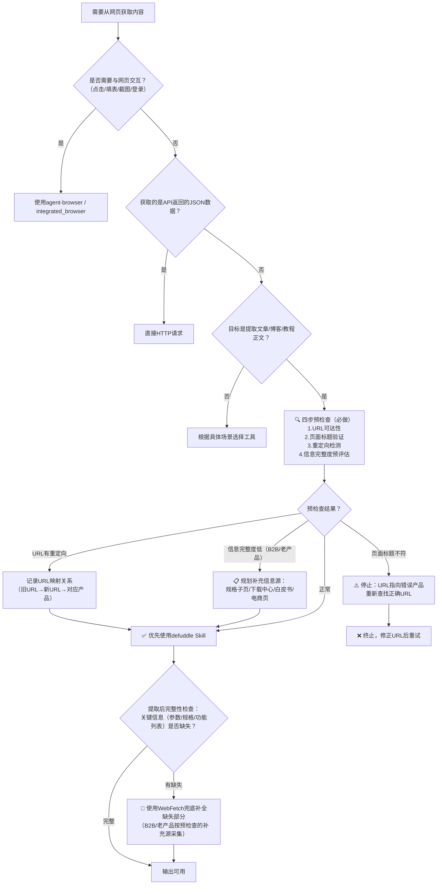

> **来源**：从 `docs/retrospective/reports/competitive-analysis/retrospective-text-to-cad-learning-20260704/insight-extraction.md` 洞察6 提炼，基于5次验证案例（tech-interface-wiki首次使用，text-to-cad-wiki第二次验证，agnes-free-api-learning第三次验证，sunlogin-mouse-bm110-mm110第四次验证双工具兜底机制，sunlogin-offline-hardware第五次验证四步预检查法）

# defuddle网页内容提取首选模式（Defuddle Preferred for Web Content Extraction）

## 模式类型
方法论模式（工具工程与自动化）

## 成熟度
L2 已验证（5次成功案例：tech-interface-wiki、text-to-cad-wiki、agnes-free-api-learning、sunlogin-mouse-bm110-mm110、sunlogin-offline-hardware）

## 适用场景
需要提取微信公众号文章、技术博客、新闻网页等外部网页内容用于：
- 内部知识库/wiki教程制作
- 文章学习笔记整理
- 开源项目文档内化
- 多源信息整合为教程
- 任何需要获取网页正文内容（非交互）的场景

## 问题背景

直接用WebFetch获取HTML包含大量噪音：
- 导航栏、菜单、页脚
- 广告、推广内容
- 推荐阅读、相关文章
- 评论区、分享按钮
- 微信公众号头部账号信息、底部关注引导

手动清理这些噪音效率低且容易遗漏重要内容，清理质量不稳定。defuddle Skill专门设计用于从网页中提取干净的主要内容，自动过滤噪音元素。

## 核心规则

**网页内容提取任务优先使用defuddle Skill，而非WebFetch+手动清理。**

**双工具兜底机制**：defuddle作为主提取工具，WebFetch作为兜底补全工具。提取完成后必须进行完整性检查；若发现关键信息（技术参数、功能列表、规格表等）缺失，立即切换WebFetch补全缺失部分，而非认定信息不存在或用猜测填充。

**四步预检查法**（提取前必须执行）：在调用defuddle之前，先对目标URL执行四步预检查，避免提取到错误页面或信息不全的页面：
1. **URL可达性检查**：确认URL可正常访问，返回200状态码而非404/403
2. **页面标题验证**：确认页面标题与预期产品/内容一致，避免提取到错误页面
3. **重定向检测**：检测是否存在3xx重定向；若有，在文档开头记录URL映射关系（旧URL→新URL→对应产品）
4. **信息完整度预评估**：快速浏览页面，判断主内容区是否包含所需关键信息（技术参数、功能列表、规格表等）；若主内容区信息密度低（如B2B产品页），提前规划补充信息源（下载中心、技术白皮书、京东详情页等）

## defuddle优势

| 优势项 | 说明 |
|-------|------|
| 自动去噪 | 自动去除导航、广告、推荐、评论、分享按钮等噪音 |
| 结构保留 | 保留原文标题层级、代码块、图片引用、列表等Markdown结构 |
| 输出干净 | 输出干净Markdown，质量稳定，无需大量手动清理 |
| 平台适配 | 对微信公众号等主流平台适配良好，处理效果稳定 |
| 效率提升 | 省去手动清理HTML噪音的时间，聚焦于内容加工 |
| WebFetch兜底 | 对defuddle提取不完整的页面，WebFetch作为通用提取器覆盖兜底 |

## 工具选择决策



### 完整标准操作流程（含预检查）

**阶段一：预检查（提取前）**
1. URL可达性检查：确认URL可正常访问
2. 页面标题验证：确认页面内容对应当前产品
3. 重定向检测：发现3xx时记录URL映射关系
4. 信息完整度预评估：B2B/老产品页提前规划补充信息源

**阶段二：主提取**
5. 使用defuddle提取目标网页内容

**阶段三：完整性检查（提取后）**
6. 对照预期内容清单检查提取结果
   - 技术规格表是否完整？
   - 核心功能列表是否齐全？
   - 价格/型号等关键数据是否存在？
7. 兜底补全：若发现缺失，用WebFetch获取原始HTML，定位并补全缺失部分；B2B产品按预检查规划的补充信息源采集
8. 合并输出：将defuddle的干净输出作为主体，WebFetch补全的缺失信息作为补充

### 决策速查表

| 场景 | 推荐工具 |
|-----|---------|
| ✅ 提取文章正文内容 | defuddle（优先）+ 四步预检查 |
| ✅ 获取博客/教程/文档页面内容 | defuddle（优先）+ 四步预检查 |
| ✅ 微信公众号文章内容提取 | defuddle（优先）+ 四步预检查 |
| 🔄 defuddle提取不完整/缺失关键参数 | defuddle → WebFetch补全 |
| 🔄 电商产品页/规格表提取 | defuddle → WebFetch补全（规格表常被defuddle过滤） |
| 🔄 B2B/老产品/企业级产品页面 | 预检查→评估信息密度→defuddle+多源补全（下载中心/白皮书/电商页） |
| ⚠️ URL发生3xx重定向 | 预检查阶段记录映射关系→确认页面内容正确→再提取 |
| ❌ 需要与网页交互（点击/填表/截图） | agent-browser / integrated_browser |
| ❌ 获取API返回的JSON数据 | 直接HTTP请求 |
| ❌ 需要登录后才能访问的内容 | agent-browser（处理登录）+ defuddle（提取内容） |

## 验证案例

### 案例1：tech-interface-wiki
- 来源：微信公众号技术接口文章
- defuddle效果：成功提取干净Markdown，去除公众号头部账号信息、底部推荐阅读、评论区
- 输出质量：保留完整标题层级、代码块格式、图片引用

### 案例2：text-to-cad-wiki
- 来源：微信公众号text-to-cad教程文章
- defuddle效果：成功去除顶部公众号信息、底部相关推荐、评论区、广告等噪音元素
- 输出质量：输出的Markdown干净且保留了原文的标题层级、代码块、图片引用等结构，可直接用于wiki加工

### 案例3：agnes-free-api-learning
- 来源：微信公众号 Agnes AI 免费模型实操指南文章
- defuddle效果：第一次因 URL 中 `&` 字符在 PowerShell 中被截断而失败，第二次使用单引号包裹 URL 成功
- 输出质量：成功提取完整文章内容，保留代码块、提示词、链接等关键信息
- 特殊发现：PowerShell URL 引号处理是 Windows 环境的关键注意事项（详见下方"PowerShell URL 处理注意事项"章节）

前三次案例均验证：defuddle大幅提升了内容提取效率，省去了手动清理HTML噪音的时间，输出质量稳定可预测。

### 案例4：sunlogin-mouse-bm110-mm110（双工具兜底验证）
- 来源：向日葵BM110鼠标官网产品页
- defuddle效果：对BM110产品页提取不完整，关键技术参数（待机电流、续航、蓝牙版本等规格表数据）被过滤缺失
- 兜底处理：使用WebFetch获取原始HTML，定位并补全缺失的规格参数
- 输出质量：合并后内容完整，defuddle提供干净的正文描述，WebFetch补全结构化的规格参数
- 关键发现：电商产品页/硬件规格页的参数表格区域，defuddle的去噪算法可能将其误判为噪音而过滤；这类页面必须执行完整性检查，发现缺失立即用WebFetch兜底

### 案例5：sunlogin-offline-hardware（四步预检查法验证）
- 来源：向日葵无网远控硬件5款产品（控控2/Q1/Q2Pro/Q0.5/Q5Pro）官网页面
- 预检查发现问题：
  1. Q2Pro-BLE产品URL发生3xx重定向，自动跳转到Q2Pro工业4G版本页面，存在产品混淆风险
  2. 控控2（B2B老产品）主页面信息密度低，核心参数标注"官方未公开"
- 预检查处理：
  1. 记录URL映射关系（Q2Pro-BLE → Q2Pro工业4G版本），在文档中明确标注
  2. 提前规划补充信息源：下载中心产品手册、京东详情页、技术规格子页面
  3. 缺失参数明确标注"官方未公开"，禁止猜测填充
- 关键发现：B2B产品和老产品页面主内容区信息密度远低于消费级产品，预检查环节能提前发现问题、规划应对策略，避免提取后才发现信息不全导致返工

五次案例验证了"预检查+主提取+兜底补全"三段式流程的必要性：预检查防范"提取错误页面"风险，defuddle作为首选工具覆盖80%+的常规网页，WebFetch作为兜底覆盖defuddle失效的特殊页面结构和B2B产品页。

## PowerShell URL 处理注意事项

在 Windows PowerShell 环境中使用 defuddle 时，URL 中的 `&` 字符会被解释为命令分隔符，导致 URL 被截断，必须使用单引号包裹 URL 才能正确传递。

**核心规则**：
- 在 Windows PowerShell 中使用 defuddle 时，URL 中的 `&` 字符会被解释为命令分隔符，导致 URL 被截断
- 必须使用单引号包裹 URL：`defuddle parse 'https://example.com/path' --md`
- 建议去掉不必要的查询参数（如 `from`、`color_scheme`、`#rd` 等），只保留核心路径
- 微信公众号文章 URL 通常带有多个查询参数，需要特别处理

**错误示例**（会失败）：
```powershell
defuddle parse "https://mp.weixin.qq.com/s/xxx?from=industrynews&color_scheme=light#rd" --md
```
上述命令中双引号无法阻止 `&` 被解析为命令分隔符，URL 会在 `&` 处被截断，导致 defuddle 接收到不完整的 URL。

**正确示例**（成功）：
```powershell
defuddle parse 'https://mp.weixin.qq.com/s/xxx' --md
```
使用单引号包裹 URL，PowerShell 不会解析单引号内的特殊字符；同时去掉了不必要的查询参数，只保留核心路径，降低出错风险。

## 与其他模式关系

- `document-content-funnel.md`：defuddle是L1（原始网页层）→L2（干净文本层）的标准工具实现
- `web-extraction-report` Skill：defuddle是该Skill内部使用的核心工具
- `web-to-markdown` Skill：同类功能的Skill封装
- [dry-run-first.md](dry-run-first.md)：双工具兜底机制遵循"先验证再输出"的dry-run安全原则
- [external-website-analysis-fallback-strategy.md](../research-knowledge/external-website-analysis-fallback-strategy.md)：四层信息源分层兜底策略是双工具兜底在信息源层面的扩展
