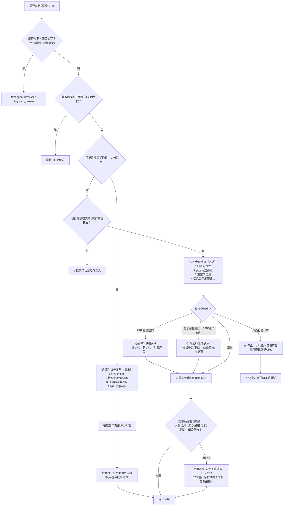

> **来源**：从 `docs/retrospective/reports/competitive-analysis/retrospective-text-to-cad-learning-20260704/insight-extraction.md` 洞察6 提炼，基于8次验证案例（tech-interface-wiki首次使用，text-to-cad-wiki第二次验证，agnes-free-api-learning第三次验证，sunlogin-mouse-bm110-mm110第四次验证双工具兜底机制，sunlogin-offline-hardware第五次验证四步预检查法，volcengine-agentkit-learning第六次验证企业官网SPA场景，minitap-wiki-creation第七次验证llms.txt索引优先发现法和批量提取，vibe-coding-prompts-learning-analysis第八次验证PowerShell ?/#特殊字符陷阱和WebFetch→defuddle降级链）

# defuddle网页内容提取首选模式（Defuddle Preferred for Web Content Extraction）

## 模式类型
方法论模式（工具工程与自动化）

## 成熟度
L3 可复用（8次成功案例：tech-interface-wiki、text-to-cad-wiki、agnes-free-api-learning、sunlogin-mouse-bm110-mm110、sunlogin-offline-hardware、volcengine-agentkit-learning、minitap-wiki-creation、vibe-coding-prompts-learning-analysis）

## 适用场景
需要提取微信公众号文章、技术博客、新闻网页等外部网页内容用于：
- 内部知识库/wiki教程制作
- 文章学习笔记整理
- 开源项目文档内化
- 多源信息整合为教程
- 企业级产品官网/云服务商产品页深度学习分析
- 竞品分析与产品研究
- 技术文档站点批量提取（完整API文档、帮助中心、知识库备份）
- 任何需要获取网页正文内容（非交互）的场景

## 问题背景

直接用WebFetch获取HTML包含大量噪音：
- 导航栏、菜单、页脚
- 广告、推广内容
- 推荐阅读、相关文章
- 评论区、分享按钮
- 微信公众号头部账号信息、底部关注引导

手动清理这些噪音效率低且容易遗漏重要内容，清理质量不稳定。defuddle Skill专门设计用于从网页中提取干净的主要内容，自动过滤噪音元素。

## 核心规则

**网页内容提取任务优先使用defuddle Skill，而非WebFetch+手动清理。**

**双工具兜底机制**：defuddle作为主提取工具，WebFetch作为兜底补全工具。提取完成后必须进行完整性检查；若发现关键信息（技术参数、功能列表、规格表等）缺失，立即切换WebFetch补全缺失部分，而非认定信息不存在或用猜测填充。

**索引优先发现原则**（批量提取技术文档站点时必做）：提取站点内容前，先按优先级检查站点索引文件，确保100%覆盖所有页面，避免遗漏深层页面：
1. **第一优先级**：检查 `<domain>/llms.txt` — 现代文档站点标准配置，为LLM提供的完整站点索引，文本格式列出所有文档URL和标题
2. **第二优先级**：检查 `<domain>/sitemap.xml` — 传统SEO标准站点地图，XML格式包含所有页面URL
3. **第三优先级**：浏览器导航探索 — 通过浏览器手动浏览站点导航栏/目录页发现页面
4. **第四优先级**：递归爬取页面内链接 — 最后才使用的方法，容易遗漏深层页面

**四步预检查法**（提取单页面时必须执行）：在调用defuddle之前，先对目标URL执行四步预检查，避免提取到错误页面或信息不全的页面：
1. **URL可达性检查**：确认URL可正常访问，返回200状态码而非404/403
2. **页面标题验证**：确认页面标题与预期产品/内容一致，避免提取到错误页面
3. **重定向检测**：检测是否存在3xx重定向；若有，在文档开头记录URL映射关系（旧URL→新URL→对应产品）
4. **信息完整度预评估**：快速浏览页面，判断主内容区是否包含所需关键信息（技术参数、功能列表、规格表等）；若主内容区信息密度低（如B2B产品页），提前规划补充信息源（下载中心、技术白皮书、京东详情页等）

## defuddle优势

| 优势项 | 说明 |
|-------|------|
| 自动去噪 | 自动去除导航、广告、推荐、评论、分享按钮等噪音 |
| 结构保留 | 保留原文标题层级、代码块、图片引用、列表等Markdown结构 |
| 输出干净 | 输出干净Markdown，质量稳定，无需大量手动清理 |
| 平台适配 | 对微信公众号等主流平台适配良好，处理效果稳定 |
| 效率提升 | 省去手动清理HTML噪音的时间，聚焦于内容加工 |
| WebFetch兜底 | 对defuddle提取不完整的页面，WebFetch作为通用提取器覆盖兜底 |

## 工具选择决策



### 完整标准操作流程

#### A. 单页面提取流程（文章/博客/单页文档）

**阶段零：索引发现（批量站点提取时前置）**
0. 检查 `<domain>/llms.txt`（第一优先级，现代文档站点标准）
1. 若不存在，检查 `<domain>/sitemap.xml`（第二优先级）
2. 若仍不存在，浏览器探索站点导航结构
3. 最后才是递归爬取页面内链接
4. 获取完整页面URL列表后，逐个执行单页面提取流程

**阶段一：预检查（提取前）**
1. URL可达性检查：确认URL可正常访问
2. 页面标题验证：确认页面内容对应当前产品
3. 重定向检测：发现3xx时记录URL映射关系
4. 信息完整度预评估：B2B/老产品页提前规划补充信息源

**阶段二：主提取**
5. 使用defuddle提取目标网页内容

**阶段三：完整性检查（提取后）**
6. 对照预期内容清单检查提取结果
   - 技术规格表是否完整？
   - 核心功能列表是否齐全？
   - 价格/型号等关键数据是否存在？
7. 兜底补全：若发现缺失，用WebFetch获取原始HTML，定位并补全缺失部分；B2B产品按预检查规划的补充信息源采集
8. 合并输出：将defuddle的干净输出作为主体，WebFetch补全的缺失信息作为补充

### 决策速查表

| 场景 | 推荐工具 |
|-----|---------|
| ✅ 提取文章正文内容 | defuddle（优先）+ 四步预检查 |
| ✅ 获取博客/教程/文档页面内容 | defuddle（优先）+ 四步预检查 |
| ✅ 微信公众号文章内容提取 | defuddle（优先）+ 四步预检查 |
| ✅ 批量提取技术文档站点全部内容 | llms.txt/sitemap.xml索引发现 → defuddle批量提取脚本 |
| 🔄 defuddle提取不完整/缺失关键参数 | defuddle → WebFetch补全 |
| 🔄 电商产品页/规格表提取 | defuddle → WebFetch补全（规格表常被defuddle过滤） |
| 🔄 B2B/老产品/企业级产品页面 | 预检查→评估信息密度→defuddle+多源补全（下载中心/白皮书/电商页） |
| ⚠️ URL发生3xx重定向 | 预检查阶段记录映射关系→确认页面内容正确→再提取 |
| ⚠️ 企业官网/云服务商产品页（SPA架构） | 优先使用integrated_browser/agent-browser直接提取；若先用defuddle/WebFetch发现内容重复/缺失，立即切换浏览器工具 |
| ❌ 需要与网页交互（点击/填表/截图/登录） | agent-browser / integrated_browser |
| ❌ 获取API返回的JSON数据 | 直接HTTP请求 |
| ❌ 需要登录后才能访问的内容 | agent-browser（处理登录）+ defuddle（提取内容） |

## 企业官网SPA架构特殊处理规则

现代企业级产品官网（尤其是云服务商、AI平台、SaaS产品网站）普遍采用React/Vue/Angular等SPA（单页应用）架构。这类网站大量核心内容由JavaScript动态渲染，WebFetch和defuddle均无法执行JS，导致提取内容不完整、重复或缺失关键模块（技术架构、应用场景、产品特性等深度内容）。

**SPA识别特征**：
- 域名属于云服务商/AI平台/SaaS厂商（如volcengine.com、aliyun.com、aws.amazon.com、azure.com等）
- 页面URL包含`/product/`、`/solution/`、`/console/`、`/dashboard/`等路径特征
- 页面有明显的交互式模块（Tab切换、滚动加载、动态展开/折叠、动画效果等）
- WebFetch/defuddle提取结果出现大量重复段落或核心模块缺失

**SPA场景工具选择规则**：
1. **优先直接使用浏览器工具**：integrated_browser MCP或agent-browser Skill，通过CDP协议控制真实浏览器，确保JS动态内容完整加载
2. **降级策略**：若误先用defuddle/WebFetch，发现以下任一情况立即切换浏览器工具：
   - 核心产品能力模块重复出现2次以上
   - 技术架构、应用场景等深度内容完全缺失
   - 页面长度明显短于预期（浏览器中看到的内容远多于提取结果）
   - 无法提取Tab/折叠面板中的隐藏内容
3. **提取方法**：使用browser_navigate加载页面→browser_wait_for等待动态内容渲染→browser_snapshot获取页面结构→browser_evaluate提取结构化数据

## 验证案例

### 案例1：tech-interface-wiki
- 来源：微信公众号技术接口文章
- defuddle效果：成功提取干净Markdown，去除公众号头部账号信息、底部推荐阅读、评论区
- 输出质量：保留完整标题层级、代码块格式、图片引用

### 案例2：text-to-cad-wiki
- 来源：微信公众号text-to-cad教程文章
- defuddle效果：成功去除顶部公众号信息、底部相关推荐、评论区、广告等噪音元素
- 输出质量：输出的Markdown干净且保留了原文的标题层级、代码块、图片引用等结构，可直接用于wiki加工

### 案例3：agnes-free-api-learning
- 来源：微信公众号 Agnes AI 免费模型实操指南文章
- defuddle效果：第一次因 URL 中 `&` 字符在 PowerShell 中被截断而失败，第二次使用单引号包裹 URL 成功
- 输出质量：成功提取完整文章内容，保留代码块、提示词、链接等关键信息
- 特殊发现：PowerShell URL 引号处理是 Windows 环境的关键注意事项（详见下方"PowerShell URL 处理注意事项"章节）

前三次案例均验证：defuddle大幅提升了内容提取效率，省去了手动清理HTML噪音的时间，输出质量稳定可预测。

### 案例4：sunlogin-mouse-bm110-mm110（双工具兜底验证）
- 来源：向日葵BM110鼠标官网产品页
- defuddle效果：对BM110产品页提取不完整，关键技术参数（待机电流、续航、蓝牙版本等规格表数据）被过滤缺失
- 兜底处理：使用WebFetch获取原始HTML，定位并补全缺失的规格参数
- 输出质量：合并后内容完整，defuddle提供干净的正文描述，WebFetch补全结构化的规格参数
- 关键发现：电商产品页/硬件规格页的参数表格区域，defuddle的去噪算法可能将其误判为噪音而过滤；这类页面必须执行完整性检查，发现缺失立即用WebFetch兜底

### 案例5：sunlogin-offline-hardware（四步预检查法验证）
- 来源：向日葵无网远控硬件5款产品（控控2/Q1/Q2Pro/Q0.5/Q5Pro）官网页面
- 预检查发现问题：
  1. Q2Pro-BLE产品URL发生3xx重定向，自动跳转到Q2Pro工业4G版本页面，存在产品混淆风险
  2. 控控2（B2B老产品）主页面信息密度低，核心参数标注"官方未公开"
- 预检查处理：
  1. 记录URL映射关系（Q2Pro-BLE → Q2Pro工业4G版本），在文档中明确标注
  2. 提前规划补充信息源：下载中心产品手册、京东详情页、技术规格子页面
  3. 缺失参数明确标注"官方未公开"，禁止猜测填充
- 关键发现：B2B产品和老产品页面主内容区信息密度远低于消费级产品，预检查环节能提前发现问题、规划应对策略，避免提取后才发现信息不全导致返工

五次案例验证了"预检查+主提取+兜底补全"三段式流程的必要性：预检查防范"提取错误页面"风险，defuddle作为首选工具覆盖80%+的常规网页，WebFetch作为兜底覆盖defuddle失效的特殊页面结构和B2B产品页。

### 案例6：volcengine-agentkit-learning（企业官网SPA场景验证）
- 来源：火山引擎AgentKit企业级AI Agent平台产品页（https://www.volcengine.com/product/agentkit）
- 页面特征：火山引擎官网为React构建的SPA架构，核心产品能力、技术架构、应用广场等模块由JavaScript动态渲染
- 初始提取问题：WebFetch结果不完整且重复，核心能力模块重复展示，应用场景、技术架构、相关产品等关键信息缺失
- 问题根因：WebFetch无法执行JavaScript，只能获取初始HTML中的静态内容，SPA动态渲染的内容完全丢失；核心能力模块在初始HTML中被重复输出（作为SEO或加载fallback）
- 解决方案：立即切换到integrated_browser MCP工具，通过browser_navigate加载页面→browser_wait_for等待动态渲染→browser_snapshot获取页面结构→browser_evaluate提取完整结构化数据
- 输出质量：通过浏览器工具成功获取四大价值支柱、四大产品能力、四大客户收益、应用广场模板、三大技术特性、相关产品生态等完整信息
- 关键发现：（1）企业级产品官网/云服务商网站普遍采用SPA架构，WebFetch/defuddle均无法提取完整动态内容；（2）提取结果出现大量重复段落是SPA网站的典型特征（初始HTML中的fallback内容与JS渲染内容重复）；（3）遇到企业官网域名（volcengine.com、aliyun.com等）或URL路径含/product/时，应优先直接使用浏览器工具，而非先尝试defuddle/WebFetch后再切换

### 案例7：minitap-wiki-creation（llms.txt索引优先发现法+批量提取验证）
- 来源：Minitap官方文档站点（https://www.minitap.ai/docs/minitest 和 https://www.minitap.ai/docs/mobile-use-sdk/introduction）
- 提取目标：完整提取两个技术文档站点的全部45个页面，用于创建中文Wiki教程
- 初始问题：手动从入口页爬取链接只发现部分页面，担心遗漏深层文档
- 解决方案：使用浏览器探索站点结构，发现 `/docs/llms.txt` 标准索引文件，一次性获得完整的45个页面URL列表
- 批量执行：使用defuddle批量提取所有45个页面，获得约293KB纯净Markdown内容
- 输出质量：成功提取minitest 20页 + mobile-use-sdk 25页，覆盖率100%，内容可直接用于Wiki编写
- 关键发现：（1）llms.txt是现代文档站点的标准配置，专门为LLM提供完整站点内容索引；（2）相比递归爬取链接，llms.txt既快速又完整，不会遗漏深层页面；（3）批量提取技术文档站点时，索引发现应作为第一优先级步骤，而非最后才想到

### 案例8：vibe-coding-prompts-learning-analysis（PowerShell ?/#特殊字符陷阱验证）
- 来源：微信公众号"数字生命卡兹克"Vibe Coding神级Prompt文章（https://mp.weixin.qq.com/s/umPqTD_-IubbhXIgiS47eQ）
- WebFetch结果：微信公众号URL直接返回 `Failed to fetch URL content and convert to markdown`，确认微信公众号是WebFetch已知失败场景
- defuddle初始问题：URL中包含 `?from=industrynews&color_scheme=light#rd` 查询参数，在PowerShell中 `?` 和 `#` 被解释为特殊字符，报 `'color_scheme' is not recognized as an internal or external command` 错误
- 问题根因：PowerShell将 `?` 解释为 Where-Object 别名、`#` 解释为注释开头，即使命令返回非零退出码，内容仍可能已成功提取到输出
- 解决方案：（1）使用单引号包裹URL；（2）去掉不必要的查询参数（`from`、`color_scheme`、`#rd`等），只保留核心路径 `https://mp.weixin.qq.com/s/xxx`
- 输出质量：成功提取完整文章内容，基于此产出416行学习分析文档
- 关键发现：（1）微信公众号是WebFetch的已知失败场景，应场景化前置选择defuddle跳过WebFetch；（2）PowerShell中除 `&` 外，`?` 和 `#` 也是URL特殊字符陷阱，需要用单引号包裹并去掉非必要查询参数；（3）defuddle命令在PowerShell中即使报非零退出码，内容仍可能已提取成功，需检查输出而非仅看退出码

## PowerShell URL 处理注意事项

在 Windows PowerShell 环境中使用 defuddle 时，URL 中的特殊字符会被 PowerShell 解释，必须正确处理才能正确传递 URL。

**需要注意的特殊字符**：

| 特殊字符 | PowerShell 中的含义 | 导致的问题 |
|---------|-------------------|-----------|
| `&` | 命令分隔符/调用操作符 | URL 在 `&` 处被截断，后续参数被当作独立命令执行 |
| `?` | Where-Object 别名（位置敏感） | URL 中 `?` 后的查询参数被解释为 PowerShell 命令 |
| `#` | 注释开头 | `#` 后的内容被当作注释丢弃，导致 URL 中 fragment 和后续参数丢失 |

**核心规则**：
- 在 Windows PowerShell 中使用 defuddle 时，**必须使用单引号包裹 URL**：`defuddle parse 'https://example.com/path' --md`
- 双引号无法阻止 `&`、`?`、`#` 被 PowerShell 解析，必须使用**单引号**
- 建议去掉不必要的查询参数（如 `from`、`color_scheme`、`#rd`、`utm_source` 等追踪参数），只保留核心路径
- 微信公众号文章 URL 通常带有多个查询参数（`?from=...&color_scheme=...#rd`），是出错重灾区，必须特别处理
- defuddle 命令在 PowerShell 中即使返回非零退出码（如 exit code 1），内容仍可能已成功提取到输出，需检查输出内容而非仅看退出码

**错误示例**（会失败）：
```powershell
defuddle parse "https://mp.weixin.qq.com/s/xxx?from=industrynews&color_scheme=light#rd" --md
defuddle parse https://mp.weixin.qq.com/s/xxx?from=industrynews&color_scheme=light#rd --md
```
上述命令中双引号无法阻止 `&`/`?`/`#` 被解析，URL 会被截断，导致 defuddle 接收到不完整的 URL，并报类似 `'color_scheme' is not recognized as an internal or external command` 的错误。

**正确示例**（成功）：
```powershell
defuddle parse 'https://mp.weixin.qq.com/s/xxx' --md
```
使用单引号包裹 URL，PowerShell 不会解析单引号内的任何特殊字符；同时去掉了不必要的查询参数和 fragment，只保留核心路径，降低出错风险。

## 与其他模式关系

- `document-content-funnel.md`：defuddle是L1（原始网页层）→L2（干净文本层）的标准工具实现
- `web-extraction-report` Skill：defuddle是该Skill内部使用的核心工具
- `web-to-markdown` Skill：同类功能的Skill封装
- [dry-run-first.md](dry-run-first.md)：双工具兜底机制遵循"先验证再输出"的dry-run安全原则
- [external-website-analysis-fallback-strategy.md](../research-knowledge/external-website-analysis-fallback-strategy.md)：四层信息源分层兜底策略是双工具兜底在信息源层面的扩展
- [triangular-source-verification.md](../retrospective-knowledge/triangular-source-verification.md)：llms.txt+浏览器探索+页面内链接三源验证覆盖完整性是三角验证法在文档提取场景的具体应用

## Changelog

<!-- changelog -->
- 2026-07-08 | update | 添加vibe-coding-prompts-learning-analysis案例（第八次验证），补充PowerShell `?`/`#`特殊字符陷阱处理规则和特殊字符对照表，reuse_count更新为1
- 2026-07-08 | update | 新增llms.txt索引优先发现原则，更新成熟度从L2到L3（7次验证），添加批量文档站点提取流程和minitap-wiki-creation案例验证，完善批量提取SOP
- 2026-07-07 | update | 添加volcengine-agentkit-learning企业官网SPA场景案例（第六次验证），新增SPA架构特殊处理规则
- 2026-07-04 | create | 初始版本，基于5次验证案例提炼，包含四步预检查法和双工具兜底机制
