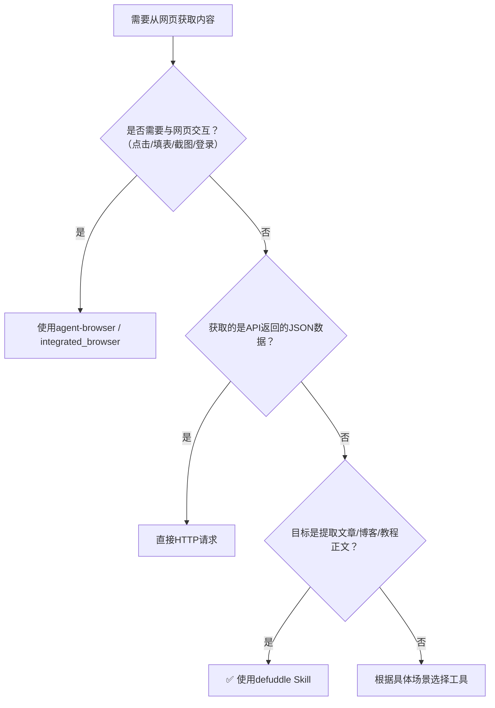

> **来源**：从 `docs/retrospective/reports/competitive-analysis/retrospective-text-to-cad-learning-20260704/insight-extraction.md` 洞察6 提炼，基于2次验证案例（tech-interface-wiki首次使用，text-to-cad-wiki第二次验证）

# defuddle网页内容提取首选模式（Defuddle Preferred for Web Content Extraction）

## 模式类型
方法论模式（工具工程与自动化）

## 成熟度
L2 已验证（2次成功案例：tech-interface-wiki微信公众号技术接口文章提取、text-to-cad-wiki微信公众号教程提取）

## 适用场景
需要提取微信公众号文章、技术博客、新闻网页等外部网页内容用于：
- 内部知识库/wiki教程制作
- 文章学习笔记整理
- 开源项目文档内化
- 多源信息整合为教程
- 任何需要获取网页正文内容（非交互）的场景

## 问题背景

直接用WebFetch获取HTML包含大量噪音：
- 导航栏、菜单、页脚
- 广告、推广内容
- 推荐阅读、相关文章
- 评论区、分享按钮
- 微信公众号头部账号信息、底部关注引导

手动清理这些噪音效率低且容易遗漏重要内容，清理质量不稳定。defuddle Skill专门设计用于从网页中提取干净的主要内容，自动过滤噪音元素。

## 核心规则

**网页内容提取任务优先使用defuddle Skill，而非WebFetch+手动清理。**

## defuddle优势

| 优势项 | 说明 |
|-------|------|
| 自动去噪 | 自动去除导航、广告、推荐、评论、分享按钮等噪音 |
| 结构保留 | 保留原文标题层级、代码块、图片引用、列表等Markdown结构 |
| 输出干净 | 输出干净Markdown，质量稳定，无需大量手动清理 |
| 平台适配 | 对微信公众号等主流平台适配良好，处理效果稳定 |
| 效率提升 | 省去手动清理HTML噪音的时间，聚焦于内容加工 |

## 工具选择决策

### 决策速查表

| 场景 | 推荐工具 |
|-----|---------|
| ✅ 提取文章正文内容 | defuddle |
| ✅ 获取博客/教程/文档页面内容 | defuddle |
| ✅ 微信公众号文章内容提取 | defuddle |
| ❌ 需要与网页交互（点击/填表/截图） | agent-browser / integrated_browser |
| ❌ 获取API返回的JSON数据 | 直接HTTP请求 |
| ❌ 需要登录后才能访问的内容 | agent-browser（处理登录）+ defuddle（提取内容） |

## 验证案例

### 案例1：tech-interface-wiki
- 来源：微信公众号技术接口文章
- defuddle效果：成功提取干净Markdown，去除公众号头部账号信息、底部推荐阅读、评论区
- 输出质量：保留完整标题层级、代码块格式、图片引用

### 案例2：text-to-cad-wiki
- 来源：微信公众号text-to-cad教程文章
- defuddle效果：成功去除顶部公众号信息、底部相关推荐、评论区、广告等噪音元素
- 输出质量：输出的Markdown干净且保留了原文的标题层级、代码块、图片引用等结构，可直接用于wiki加工

两次案例均验证：defuddle大幅提升了内容提取效率，省去了手动清理HTML噪音的时间，输出质量稳定可预测。

## 与其他模式关系

- `document-content-funnel.md`：defuddle是L1（原始网页层）→L2（干净文本层）的标准工具实现
- `web-extraction-report` Skill：defuddle是该Skill内部使用的核心工具
- `web-to-markdown` Skill：同类功能的Skill封装
