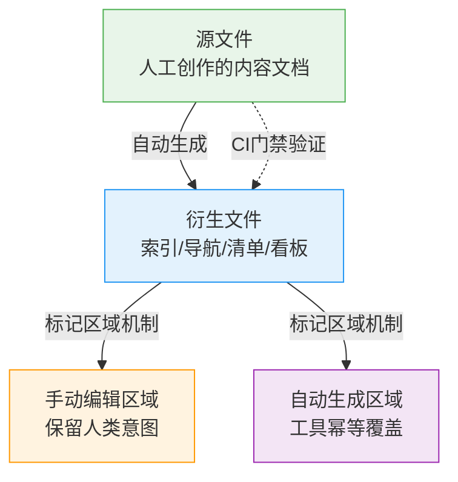

# 衍生文件全自动原则

## 模式类型
工具自动化模式 → 衍生数据管理

## 成熟度
**L2 已验证**（2次验证来源：2026-07-09 best-practices索引遗漏修复任务；2026-07-04 Vibe Coding学习分析知识库索引自动生成实践；熵增定律和公理系统一致性两个第一性原理支撑）

## 问题背景

索引文件、导航清单、目录列表等衍生文件存在"手动维护遗漏"问题：

- **人工编辑索引遗漏**：新增文件时忘记更新索引，导致部分文件"隐形"
- **手动维护与源文件脱节**：新增文件和更新索引是两个独立动作，容易脱节
- **对工具能力认知不足**：担心自动生成会覆盖手动内容，选择可靠性更低的手动方式

根因：衍生数据应自动从源数据派生，违反单一真理源原则会导致数据不一致。

## 核心原则

**衍生文件全自动原则**：凡是可以从源文件自动生成的衍生文件（索引、导航、清单等），一律不手动编辑。



| 原则 | 说明 | 实现机制 |
|------|------|---------|
| 衍生文件全自动 | 索引、导航、清单等一律不手动编辑 | docgen.py / generate-readme.py |
| 标记区域机制 | 自动生成与手动编辑共存 | `<!-- BEGIN-AUTO-GENERATED -->` / `<!-- END-AUTO-GENERATED -->` |
| CI门禁验证 | 自动生成文件与源文件同步 | 构建失败即拦截 |
| 工具能力充分利用 | 使用已有工具，不重复造轮子 | docgen-cmd 技能 |

## 正反例对照

### 反例（手动维护）

- 人工编辑 knowledge/README.md
- 新增 ai-anthropomorphic.md 和 eight-dimensions-concurrent-safety-spec.md 后忘记更新索引
- 结果：2个文件在索引中"隐形"，无法通过导航发现

### 正例（自动生成）

- 运行 `python .agents/scripts/docgen.py nav`
- 一键重新生成索引，所有10个 best-practices 文件自动被纳入
- 标记区域机制确保手动添加的内容不被覆盖
- 结果：索引完整准确，零遗漏

## 标记区域机制

衍生文件采用标记区域机制允许自动生成区域和手动编辑区域共存：

```markdown
<!-- 本段上方可手动编辑 -->

<!-- BEGIN-AUTO-GENERATED -->
| 文档 | 说明 |
|------|------|
| [doc1.md](doc1.md) | ... |
| [doc2.md](doc2.md) | ... |
<!-- END-AUTO-GENERATED -->

<!-- 本段下方可手动编辑 -->
```

- **自动生成区域**：工具每次执行幂等覆盖，禁止手动编辑
- **手动编辑区域**：保留人类意图（如概述、上下文说明、相关资源）

## 适用场景

- ✅ 索引文件（目录 README、知识库导航）
- ✅ 导航清单（文件列表、目录树）
- ✅ 看板数据（Spec 看板、进度看板）
- ✅ 应用清单（apps/ 应用索引）
- ✅ 任何可从源文件派生的衍生数据

## 不适用场景

- 源文件本身（人工创作的内容文档）
- 包含人类判断/决策的内容（如复盘分析）
- 一次性临时文件

## 与其他模式的关系

| 模式 | 关系 |
|------|------|
| [auto-generate-threshold.md](auto-generate-threshold.md) | 阈值模式判断"何时该自动化"，本模式定义"衍生文件必须自动化"的硬性原则 |
| [tool-automation-decision-model.md](tool-automation-decision-model.md) | 决策模型提供自动化决策框架，本模式是其衍生文件场景的具体落地 |
| [entropy-law-automation-principle.md](../governance-strategy/entropy-law-automation-principle.md) | 第一性原理支撑：手动编辑衍生文件是熵增来源，自动生成是熵减手段 |
| [axiom-system-consistency-principle.md](../governance-strategy/axiom-system-consistency-principle.md) | 第一性原理支撑：索引格式/内容一致性是公理系统的要求 |
| [content-entry-index-trinity.md](../document-architecture/content-entry-index-trinity.md) | 三位一体原则中的"索引层"应由本模式的自动生成机制保障 |
| [three-tier-governance.md](../governance-strategy/three-tier-governance.md) | 三层治理模型的"自动化层"具体实现本原则 |
| [spec-as-code-automated-gates.md](spec-as-code-automated-gates.md) | Spec即代码门禁是本原则在规范验证场景的应用 |

## Changelog

- 2026-07-09 | create | 初始版本，从best-practices目录断链修复复盘沉淀，L1成熟度
- 2026-07-13 | update | 补充Vibe Coding学习分析洞察7验证案例，升级L2成熟度；添加熵增定律和公理系统一致性两个第一性原理关联

## 验证状态

- ✅ 验证1（2026-07-09）：重新生成索引后自动修复了best-practices目录下2个遗漏文件
- ✅ 验证2（2026-07-04）：知识库索引使用generate_index.py自动生成，覆盖分类索引+7个tag索引，零遗漏
- ✅ 已有模式参考：docgen-cmd 技能已实现此能力，generate-readme.py 批量补全48个README
- ✅ 第一性原理支撑：本原则是[熵增定律自动化原理](../governance-strategy/entropy-law-automation-principle.md)和[公理系统一致性原理](../governance-strategy/axiom-system-consistency-principle.md)在衍生文件场景的具体落地

## 关联资源

- 来源复盘：[best-practices目录断链修复复盘](../../../reports/task-reports/retrospective-best-practices-readme-link-fix-20260709/README.md)
- 洞察萃取：[insight-extraction.md 洞察2](../../../reports/task-reports/retrospective-best-practices-readme-link-fix-20260709/insight-extraction.md)
- 自动生成工具：[docgen.py](../../../../../.agents/scripts/docgen.py)、[generate-readme.py](../../../../../.agents/scripts/generate-readme.py)
- 技能入口：[docgen-cmd](../../../../../.agents/skills/docgen-cmd/)
