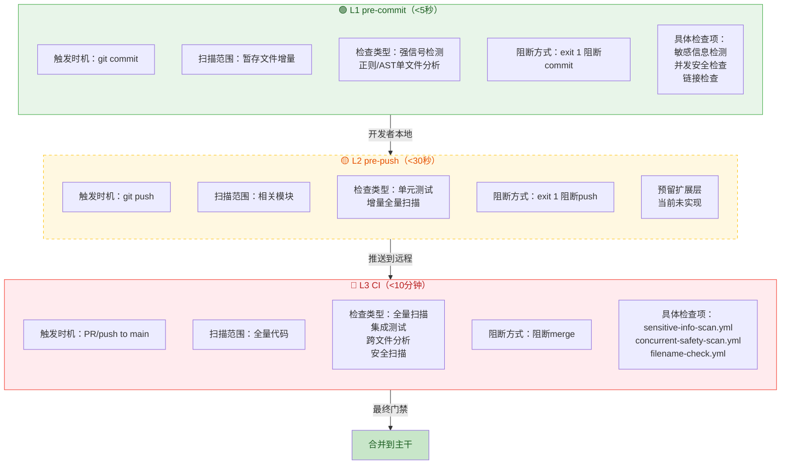
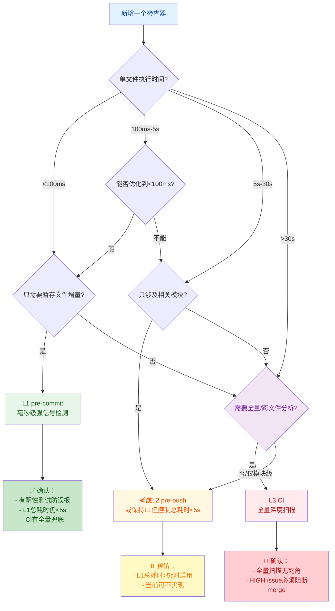

# Git钩子三层信任模型：L1/L2/L3分层防御策略

## 模式类型
方法论模式（DevOps/安全工程）

## 成熟度
L2 已验证（L1 pre-commit + L3 CI 双层在SpecWeave项目实际运行）

## 适用场景
任何需要配置代码质量门禁的项目——pre-commit钩子设计、CI流水线检查分层、新增代码检查器时的层级决策。

典型场景：
- 新团队配置Git钩子和CI门禁时
- pre-commit钩子越来越慢，开发者开始--no-verify时
- 需要新增代码检查器，不确定放在哪一层时
- 设计DevOps流水线质量门禁时

## 问题背景

代码质量检查面临一个根本性矛盾：**检查越全面，速度越慢；速度越快，检查越浅。**

单层检查存在以下问题：
- **全量扫描在pre-commit太慢**：每次commit需要等30秒以上，开发者注意力被打断，最终用`--no-verify`跳过，防线全面失效
- **只有CI没有pre-commit**：反馈周期太长，问题发现时已经写完了一大段代码，修复成本高
- **所有检查堆在一层**：要么pre-commit慢到无法接受，要么CI检查太浅漏过问题

**核心洞察**：信任需要分层递进——本地快速反馈+推送前检查+CI最终门禁，不同层级承担不同职责，用时间预算换取开发者体验和检查深度的平衡。

常见反模式：
- ❌ pre-commit做全量扫描（>10秒）→开发者跳过
- ❌ CI只有报警没有阻断能力→问题持续合入主干
- ❌ 所有检查都堆在pre-commit→钩子越来越慢→防线崩溃

## 核心模型：三层信任架构



> **关键设计说明**：L2空缺是刻意的设计选择——不是必须实现三层，当L1检查项增多总耗时超过5秒时，才需要将部分检查拆分到L2。SpecWeave当前所有L1检查总和<5秒，因此暂不实现L2，避免过度工程。

### 各层详细说明

**L1 pre-commit（<5秒）**：
- 定位：开发者日常提交的快速反馈环
- 原则：快！快！快！5秒是注意力不中断的阈值
- 范围：只扫描git暂存区的文件增量（git diff --cached）
- 检查类型：强信号检测（正则匹配、AST单文件分析），不做跨文件分析
- 失败处理：exit 1直接阻断commit，但提供SKIP环境变量绕过（SKIP=hook-id git commit）

**L2 pre-push（<30秒，预留）**：
- 定位：推送前的中等深度检查
- 原则：30秒是开发者切换窗口看一眼但不会失去耐心的阈值
- 范围：本次push涉及的相关模块，不是全量
- 检查类型：相关模块单元测试、增量全量扫描
- 触发条件：当L1检查项增多总耗时>5秒时才启用

**L3 CI（<10分钟）**：
- 定位：最终安全门禁，兜底所有问题
- 原则：10分钟是CI等待期间可以做其他事的阈值（PR review、喝咖啡）
- 范围：全量代码，没有任何妥协
- 检查类型：全量扫描、集成测试、跨文件分析、安全扫描
- 失败处理：直接阻断PR merge，必须修复才能合入

## 分层原则表

| 层级 | 触发时机 | 耗时上限 | 扫描范围 | 检查类型 | 阻断方式 |
|------|---------|---------|---------|---------|---------|
| L1 pre-commit | git commit | <5秒 | 暂存文件增量 | 强信号检测（正则/AST单文件） | exit 1 阻断commit |
| L2 pre-push | git push | <30秒 | 相关模块 | 单元测试+全量增量扫描 | exit 1 阻断push |
| L3 CI | PR/push to main | <10分钟 | 全量代码 | 全量扫描+集成测试+安全扫描 | 阻断merge |

## 检查项分配决策树

新增一个检查器时，按此决策树判断应该放在哪一层：



**决策判断标准**：
- **执行时间优先**：单文件执行时间是首要判断标准，超过5秒的检查绝对不能放L1
- **增量vs全量**：只需要暂存文件就能判断的放L1，必须看全量代码才能判断的放L3
- **误报风险**：误报率高的检查不要放L1——宁可漏报让CI兜底，也不要误报打断开发者（参见precision-over-recall）

## 验证案例

### 案例一：SpecWeave项目现状

| 层级 | 实现状态 | 具体内容 |
|------|---------|---------|
| **L1 pre-commit** | ✅ 已实现 | 链式架构（chain-pre-commit-hooks），三个检查器：<br>1. 敏感信息检测（正则+AST双引擎）<br>2. 并发安全检查（AST六维扫描）<br>3. 链接检查<br>单文件毫秒级，总耗时<5秒 |
| **L2 pre-push** | ⏸️ 预留未实现 | 当前L1所有检查总和<5秒，暂不需要拆分。预留钩子位置，未来需要时启用 |
| **L3 CI** | ✅ 已实现 | 3个GitHub Actions workflow：<br>1. `sensitive-info-scan.yml` - 全量敏感信息扫描<br>2. `concurrent-safety-scan.yml` - 全量并发安全扫描<br>3. `filename-check.yml` - 文件名规范检查<br>PR创建和push到main时触发，发现问题阻断merge |

**实际运行效果**：
- 开发者日常`git commit`几乎无感知，钩子在后台毫秒级完成
- 偶尔触发敏感信息/并发问题，当场修复，提交质量高
- CI作为最终兜底，拦截pre-commit增量检查可能漏过的场景（例如修改了A文件但问题在B文件）

### 案例二：与链式pre-commit架构的协同

三层信任模型和链式pre-commit架构（chain-pre-commit-hooks）是互补关系，解决不同层面的问题：

| 模式 | 解决的问题 | 层级 |
|------|---------|------|
| **chain-pre-commit-hooks** | L1层内部如何组织多个检查器——单入口、链式执行、fail-fast、统一输出格式 | L1内部架构 |
| **git-hooks-three-tier-trust** | 一个检查器应该放在哪一层——L1/L2/L3的分层决策和时间预算 | 跨层部署策略 |

**协同工作流程**：
1. 用信号识别四步法（signal-identification-four-step）设计检测规则
2. 用TDD五件套（tdd-static-analysis-five-test-suites）验证检查器质量
3. 用本模式的决策树判断检查器放在L1/L2/L3
4. 如果放L1，用链式架构组织多个检查器，确保单入口、fail-fast
5. 放L3的检查器配置到CI workflow，作为最终兜底

## 时间预算计算方法

### 为什么是5秒/30秒/10分钟？——基于开发者行为心理学

| 时间阈值 | 心理影响 | 设计含义 |
|---------|---------|---------|
| **<5秒** | 开发者注意力不中断，几乎无感知，觉得"钩子很快" | pre-commit黄金阈值——超过这个时间开发者会开始烦躁、看手机、切换窗口 |
| **<30秒** | 开发者可以切换窗口看一眼消息、倒杯水，但不会失去耐心，回来刚好看到结果 | pre-push阈值——30秒是"可以接受的等待"上限 |
| **<10分钟** | CI等待期间可以做其他事：Code Review、写下一个函数、喝咖啡，PR提完自然等待结果 | CI阈值——超过10分钟开发者会开始频繁刷新、context switch严重 |

> 这些阈值不是精确数字，而是基于大量DevOps实践的经验值——核心思想是"不要让开发者等"，等待时间越长，绕过防线的动机越强。

### L1总耗时计算

L1总耗时 = 所有检查器在**单个典型文件**上的耗时之和

注意：
- 不是所有文件的总和——链式架构fail-fast，第一个失败就停止
- 是单个文件的耗时——单次commit通常只改几个文件，增量扫描很快
- 必须留余量——比如目标<5秒，实际控制在3秒以内，给未来新增检查器留空间

**优化策略**：
1. **先快后慢**：执行速度最快的检查器放在链的最前面，失败即阻断，不浪费时间跑慢的检查
2. **并行执行**：相互独立的检查器可以并行执行（链式架构当前是串行，但预留并行扩展能力）
3. **增量缓存**：未修改的文件不重复扫描（pre-commit框架原生支持）

## 正反案例对照

### ✅ 正确做法

```yaml
# 通用示例：使用pre-commit.com框架配置L1增量检查
# 注：SpecWeave项目使用自定义shell+Python链式架构（.githooks/pre-commit → pre_commit.py），
# 以下示例展示分层配置的核心原则——L1只扫增量、快速检查优先
repos:
  - repo: local
    hooks:
      - id: sensitive-info-check
        name: 敏感信息检测
        entry: python .agents/scripts/check_sensitive_info.py
        language: system
        files: \.(py|md|yml|yaml|json|toml)$
        stages: [commit]
      - id: concurrent-safety-check
        name: 并发安全检查
        entry: python .agents/scripts/check_concurrent_safety.py
        language: system
        files: \.py$
        stages: [commit]
```

```yaml
# CI配置：全量扫描，阻断merge
name: 全量敏感信息扫描
on: [pull_request, push]
jobs:
  scan:
    runs-on: ubuntu-latest
    steps:
      - uses: actions/checkout@v4
      - name: Run sensitive info scan
        run: python .agents/scripts/check_sensitive_info.py --all-files
      # 发现问题直接exit 1阻断merge
```

**关键设计**：
- pre-commit只扫暂存文件（默认就是增量），CI用`--all-files`全量扫描兜底
- 每层都有绕过机制：L1用`SKIP=hook-id`，L3可以在特殊情况临时关闭（但需审批）
- 快速检查（正则）放在L1，深度检查放CI

### ❌ 错误做法

**错误做法1：pre-commit跑全量测试**
```bash
# ❌ 反模式：pre-commit跑全量单元测试，耗时>30秒
#!/bin/sh
npm test  # 跑几百个测试用例，每次commit等30秒→开发者--no-verify
```
**后果**：第一周大家还遵守，第二周开始有人偷偷用--no-verify，第三周所有人都跳过，防线完全失效。

**错误做法2：CI用WARN_ONLY不阻断**
```yaml
# ❌ 反模式：CI发现问题只发警告不阻断
- name: Security scan
  run: python scan.py || echo "::warning::发现安全问题但不阻断"
```
**后果**：问题持续合入主干，警告越来越多，最后所有人都无视警告，等于没有检查。

**错误做法3：所有检查都放L1**
```
# ❌ 反模式：L1检查器越来越多，越来越慢
pre-commit:
  - 敏感信息检测 (0.1s)
  - 并发安全检查 (0.5s)
  - 链接检查 (1s)
  - 单元测试 (10s)  ← 不该放这
  - 集成测试 (30s)  ← 不该放这
  - 安全扫描 (20s)  ← 不该放这
  总耗时：>60秒 → --no-verify！
```
**后果**：钩子越来越慢，超过阈值后防线崩溃，所有检查形同虚设。

## 检查清单

新增代码检查器时，逐项确认：

- [ ] 新检查器的单文件执行时间是多少？（<100ms才考虑L1）
- [ ] 是否只需要暂存文件增量就能判断（L1候选），还是必须看全量代码（L3候选）？
- [ ] 如果放L1，是否有对应的阴性测试防误报？（参见tdd-static-analysis-five-test-suites）
- [ ] 添加后L1现有检查总耗时是否仍<5秒？
- [ ] CI层是否有对应的全量扫描作为兜底？
- [ ] 是否提供了SKIP/WARN_ONLY环境变量绕过机制？（紧急情况可以临时跳过）
- [ ] exit code语义是否正确？（0=pass，1=fail阻断）
- [ ] 误报率是否足够低？（误报率高的不要放L1，放CI）

## 常见误区

| 误区 | 后果 | 正确做法 |
|------|------|---------|
| "pre-commit应该做所有检查，本地拦截所有问题" | 钩子越来越慢→--no-verify→防线全面失效 | 严格按时间预算分层，pre-commit只做快速增量检查，CI兜底全量 |
| "CI不需要阻断，发个报警让大家知道就行" | 问题持续合入主干→技术债累积→报警泛滥无人看 | CI发现HIGH级别issue必须阻断merge，没有例外 |
| "L2 pre-push必须实现，三层才完整" | 过度工程，增加维护成本，实际用不上 | L2是预留扩展层，当L1总耗时超5秒时才需要拆分，否则两层就够 |
| "检查越多越安全，多一个检查多一份保障" | 误报堆积→开发者产生"警报疲劳"→忽视所有报警 | 精度优先于召回率（precision-over-recall），宁可漏报不可误报 |
| "pre-commit扫全量更安全，不遗漏任何问题" | 速度>10秒开发者就会跳过，反而更不安全 | 增量+CI兜底的组合比pre-commit全量更可靠——因为防线不会被绕过 |
| "我机器快，10秒也能接受" | 团队其他成员机器可能没那么快，而且5秒是心理学阈值不是硬件阈值 | 严格按5秒阈值设计，不要用自己的机器性能作为标准 |

## 与其他模式的关系

- **[chain-pre-commit-hooks.md](../../code-patterns/chain-pre-commit-hooks.md)**：L1层内部组织架构——单入口多检查链，fail-fast，统一输出格式，解决"L1内部怎么组织"的问题
- **[precision-over-recall.md](precision-over-recall.md)**：L1层检查器的核心设计原则——宁可漏报不可误报，误报会导致开发者--no-verify跳过所有检查
- **[tdd-static-analysis-five-test-suites.md](tdd-static-analysis-five-test-suites.md)**：测试五件套确保每层检查器的质量——尤其是阴性测试防误报对L1至关重要
- **[signal-identification-four-step.md](signal-identification-four-step.md)**：信号识别四步法用于设计每层的检测规则——先识别强/中/弱信号，再决定放在哪一层
- **[ast-disambiguation-five-methods.md](../../code-patterns/ast-disambiguation-five-methods.md)**：AST消歧五法帮助控制L1误报率——消歧做得好，才能把检查放在L1而不误报

## 沉淀状态

- ✅ SpecWeave L1 pre-commit（链式架构+3个检查器：敏感信息检测、并发安全检查、链接检查）
- ✅ SpecWeave L3 CI（3个GitHub Actions workflow，PR和push to main时全量扫描阻断merge）
- ⏸️ L2 pre-push：预留扩展层，待L1总耗时超5秒时启用，当前两层架构运行良好
- ⏳ 待复用：未来新项目配置Git钩子/CI门禁时直接套用此分层策略，无需从零设计
