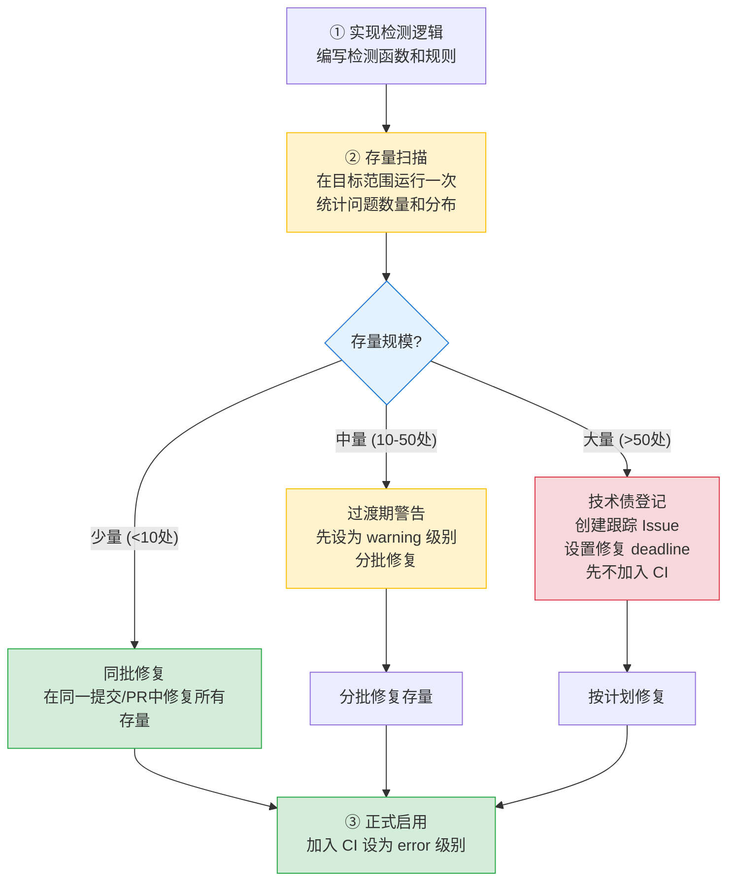
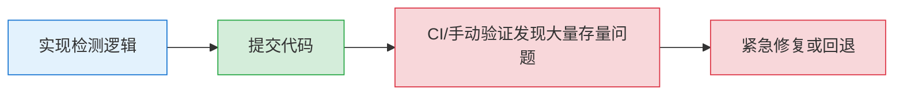

+++
id = "legacy-exposure-effect"
domain = "methodology"
layer = "methodology"
maturity = "L2"
validation_count = 2
reuse_count = 0
documentation_level = "detailed"
source = "docs/retrospective/reports/project-governance/dependency-governance/retrospective-vendor-flexloop-governance-adjustment-20260629/insight-extraction.md"

[bindings]
rules = []
references = []
skills = []
related_patterns = ["point-fix-bias", "tool-self-validation"]
+++

# 新检测规则存量暴露效应：落地前先扫描历史问题

## 模式概述

当你在代码库中添加一个新的检测规则（linter、checker、静态分析规则）时，它不仅会阻止**未来**引入违规，还会暴露**过去**已经存在的存量违规。这是一个可预测但常被忽略的现象——如果不提前扫描和处理存量问题，新规则一落地就会导致 CI 一片红。

## 问题现象

实施 flexloop 反向依赖检测后，提交完成后首次运行 `repo-check vendor --deep` 就发现了 8 处已存在的反向依赖链接。这些链接在检测工具存在之前一直"静默存在"于 flexloop 子模块中，因为没有工具检测所以从未被发现。

类似的现象在之前 Mermaid 治理中也出现过：添加 `\n` 检测后，扫描全项目发现了多个文件中的历史遗留问题。

## 根因分析

新检测规则落地时产生存量问题的三个原因：

1. **规则覆盖盲区**：在规则存在之前，这类问题"不违反任何规定"，开发者没有动力主动修复
2. **问题累积效应**：代码库存在时间越长，历史遗留的同类问题越多
3. **乐观假设偏误**：规则制定者倾向于假设"代码库应该是干净的"，没有预料到存量规模

## 标准落地流程

新检测/检查规则的标准落地三步法：

### 步骤详解

**Step 1：实现检测逻辑**
- 编写检测函数，确保逻辑正确
- 在少量已知的正反例上验证检测准确性
- 支持自动修复的规则先实现 fix 功能

**Step 2：存量扫描（关键！不可跳过）**
- 在完整目标范围（整个仓库或目标目录）运行检测
- 不要只在测试用例上验证，必须在真实代码库上运行
- 统计问题数量、分布文件、问题类型
- 区分"真问题"和"误报"，如果误报多先修复检测逻辑

**Step 3：分类处理存量**

| 存量规模 | 处理策略 | CI 级别 |
|---------|---------|---------|
| < 10 处 | 同一提交直接修复 | error |
| 10-50 处 | 记录清单，分批修复，过渡期设为 warning | warning → error |
| > 50 处 | 创建技术债 Issue，制定修复计划，暂不阻断 | off → warning → error |

## 反模式：落地后才发现

反模式流程（本次 flexloop 任务实际发生的）：

**问题**：
- 提交后才发现问题，打乱节奏
- 如果已经合入主干，会导致所有后续 PR 都红
- 修复压力大，容易引入新 bug
- 如果存量问题在外部子模块中，修复需要跨仓库协调

## 检测规则自检清单

在提交包含新检测规则的代码前，必须确认：

- [ ] 检测逻辑已在正反例上验证
- [ ] 已在完整目标代码库上运行过检测
- [ ] 已统计存量问题数量和分布
- [ ] 已区分真问题和误报，误报已修复
- [ ] 存量问题有明确的处理方案（同批修复/分批/技术债）
- [ ] CI 级别设置与存量处理策略一致
- [ ] （可选）已运行 `--fix` 自动修复可修复的问题

## 适用场景

- 添加新的 linter 规则（ESLint、pylint、ruff 等）
- 添加自定义检查脚本（如 repo-check 的各项检查）
- 启用新的静态分析工具
- 添加 CI 门禁检查
- 添加 pre-commit hook
- 升级现有工具版本导致新规则被启用

## 与其他模式的关系

- 补充 [point-fix-bias](point-fix-bias.md)：点修复偏误是"修复单个问题时不扫描同类问题"，存量暴露效应是"添加新规则时不扫描历史问题"，两者共同构成"新能力+历史扫描"的完整落地流程
- 补充 [tool-self-validation](tool-self-validation.md)：工具自验证是"用工具检测工具自身的文档/测试"，存量扫描是"用工具检测整个代码库的历史问题"，都是"工具落地前必须做的验证"
- 关联 [dry-run-first](dry-run-first.md)：dry-run 原则在这里的具体应用——先运行看结果，再决定怎么落地
