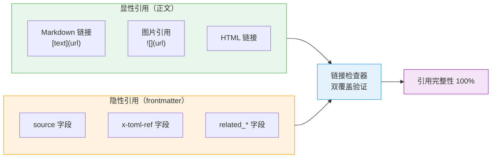

# 链接检查双覆盖原则

## 模式类型
工具自动化模式 → 质量保障

## 成熟度
**L1 实验性**（基于 2026-07-09 frontmatter 检查工具增强任务单次验证；check-links.py 已实现 `--check-frontmatter-paths` 参数）

## 问题背景

Markdown 文档链接完整性检查存在"只检查正文链接，遗漏 frontmatter 元数据"的盲区：

- **初始检查只搜索正文 Markdown 链接** `[text](url)` 格式，未解析 TOML frontmatter
- **frontmatter 中的 source、x-toml-ref 等字段路径错误**导致溯源断链
- **随着派生产物溯源规范强制执行**，source 字段成为所有文档必备字段，其路径错误同样严重

根因：工具检查范围滞后于规范演进，新的必填字段没有被及时纳入质量门禁。

## 核心原则

**双维度检查清单**：引用完整性检查必须覆盖所有引用存在的维度。



| 检查维度 | 引用类型 | 检查方式 |
|---------|---------|---------|
| 显性引用 | 正文 Markdown 链接 `[text](url)` | 正则匹配 |
| 显性引用 | 图片引用 `` | 正则匹配 |
| 显性引用 | HTML `<a href>` | 正则匹配 |
| 隐性引用 | TOML frontmatter `source` 字段 | frontmatter 解析 |
| 隐性引用 | TOML frontmatter `x-toml-ref` 字段 | frontmatter 解析 |
| 隐性引用 | TOML frontmatter `related_*` 字段 | frontmatter 解析 |

## 正反例对照

### 反例（仅检查正文）

- Grep 搜索 `\[.*\]\(\.\./.*retrospective` 找到2个正文链接断链
- 但 frontmatter 中 `source: "external: 不存在-docs/knowledge/..."` 和不完整路径问题未被发现
- 结果：溯源断链在用户点击 source 引用时才会暴露

### 正例（双覆盖检查）

- 正文链接：使用 check-links.py 检查所有 `[text](path)` 格式
- Frontmatter 元数据：解析 TOML frontmatter，验证 source、x-toml-ref、related_* 字段路径有效性
- 结果：引用完整性 100% 覆盖，显性和隐性断链都被提前发现

## 字段级路径验证

对 frontmatter 中所有包含路径的字段做统一的相对路径验证：

```bash
# 推荐用法（检查所有路径字段：source, x-toml-ref, related_*）
python .agents/scripts/check-links.py --path <目录> --check-frontmatter-paths

# 旧参数 --check-x-toml-ref 自动升级为全面检查，输出兼容性提示
```

### 支持能力

| 能力 | 说明 |
|------|------|
| 支持字段 | source、x-toml-ref、所有 related_ 前缀字段 |
| 值类型 | 字符串、列表、多路径分隔（+、\|、,、;） |
| 智能过滤 | 自动跳过 URL、session: 引用、占位符、纯中文描述、枚举 ID 值 |
| 锚点支持 | 正确处理带 # 锚点的路径（只验证文件存在，不验证锚点） |
| 格式检测 | 报告 `docs/` 前缀不规范写法 |
| 向后兼容 | 原 `--check-x-toml-ref` 仍可用，自动升级为全面检查 |

## 格式规范强制

统一要求 source 字段使用相对路径，禁止 `docs/` 开头的绝对路径格式：

| 格式 | 示例 | 状态 |
|------|------|------|
| 相对路径 | `source: "../../retrospective/xxx.md#section"` | ✅ 规范 |
| docs/ 前缀绝对路径 | `source: "external: 不存在-docs/knowledge/xxx.md"` | ❌ 不规范 |
| 不完整路径 | `source: "retrospective/xxx.md"`（缺 `../../`） | ❌ 不规范 |

## 适用场景

- ✅ Markdown 文档链接完整性检查
- ✅ 派生产物溯源验证（source 字段）
- ✅ 元数据同步验证（x-toml-ref 字段）
- ✅ 文档归档/迁移后引用完整性验证
- ✅ CI/pre-commit 质量门禁

## 不适用场景

- 纯代码项目的 import 路径检查（非 Markdown 文档）
- 外部 URL 可达性检查（由 `--check-external` 单独处理）

## 与其他模式的关系

| 模式 | 关系 |
|------|------|
| [tool-self-validation.md](tool-self-validation.md) | 工具自验证原则——本模式的检查工具自身也需通过验证 |
| [multi-signal-detection.md](multi-signal-detection.md) | 多信号组合检测——本模式是引用完整性场景的多维度信号组合 |
| [relative-path-pitfalls.md](relative-path-pitfalls.md) | 相对路径三类踩坑——本模式提供工具化检测，该模式提供人工编写陷阱防范 |
| [spec-reference-validation.md](../governance-strategy/spec-reference-validation.md) | Spec 引用验证——关注 Spec 阶段引用，本模式关注文档全生命周期引用 |
| [three-tier-governance.md](../governance-strategy/three-tier-governance.md) | 三层治理模型的"验证层"具体实现本原则 |

## 验证状态

- ✅ 工具实现：check-links.py 已实现 `--check-frontmatter-paths` 参数（超额交付）
- ✅ 本次任务验证：通过人工检查 frontmatter 发现并修复了2处问题
- ✅ 后续验证：58个现有测试无回归

## 关联资源

- 来源复盘：[best-practices目录断链修复复盘](../../../reports/task-reports/retrospective-best-practices-readme-link-fix-20260709/README.md)
- 洞察萃取：[insight-extraction.md 洞察3](../../../reports/task-reports/retrospective-best-practices-readme-link-fix-20260709/insight-extraction.md)
- 工具实现：[check-links.py --check-frontmatter-paths](../../../../../.agents/scripts/check-links.py)
- 行动项详情：[insight-action-backlog.md P0#1](../../../reports/task-reports/retrospective-best-practices-readme-link-fix-20260709/insight-action-backlog.md)
