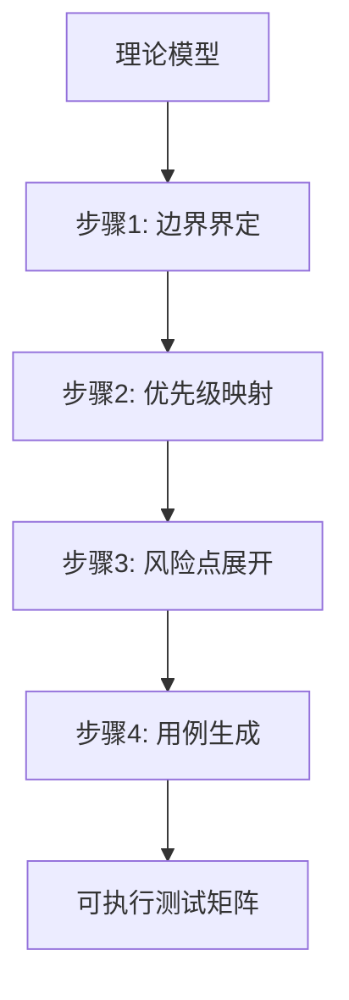

# 理论模型→测试矩阵转化模式（Model-to-Test-Matrix）

## 模式类型
方法论模式

## 成熟度
L1 已提炼（首次从实践中萃取，待独立验证）

## 适用场景
当已有一个技术选型/架构决策的理论模型（如分层模型、决策树、能力矩阵），需要为其某个层级或分支生成可执行的测试计划时。

## 问题背景
理论模型（如"三级决策模型"）通常用于选型和决策指导，但直接用于测试时面临两个问题：
1. **边界模糊**：模型定义了"做什么"，但未定义"测什么"——哪些层级该测、测到什么程度
2. **优先级缺失**：模型不提供测试用例的优先级依据，导致测试矩阵要么过度覆盖（浪费资源）要么覆盖不足（遗漏风险）

## 标准转化步骤

### 步骤1：边界界定
将模型的每个层级/分支转化为测试覆盖规则：
- **覆盖规则**：当前层级→全覆盖
- **排除规则**：其他层级→不覆盖（或单独的测试计划）
- **边界规则**：层级间的交互点→选择性覆盖

### 步骤2：优先级映射
将模型层级的技术特征映射为测试优先级：
- 核心选型标准（如Cookie持久化）→ P0阻塞级
- 辅助能力（如日志系统）→ P1核心级
- 边界条件（如频率限制）→ P2辅助级

### 步骤3：风险点展开
将模型中隐含的技术约束展开为具体测试场景：
- 技术方案的已知限制（如headless反爬）→ 边界测试用例
- 框架的典型故障模式（如DOM选择器失效）→ 异常处理用例
- 状态管理的脆弱点（如会话过期）→ 持久化用例

### 步骤4：用例生成
按"环境→功能→辅助→质量"递进生成测试用例矩阵：
- 每个用例标注：ID、场景、命令、预期结果、优先级
- 提供冒烟测试命令集（P0用例的子集，安全无副作用）

## 关键要点

1. **模型即边界**：理论模型的层级划分直接定义测试覆盖的边界，避免过度测试
2. **技术特征即优先级**：模型中描述的技术方案特征是优先级分配的自然依据
3. **约束即风险点**：模型中隐含的技术约束是测试用例的重要来源
4. **dry-run优先**：所有写操作测试先通过dry-run验证，确保测试本身安全

## 成功案例

| 模型 | 转化产物 | 用例数 | 边界界定效果 |
|------|---------|--------|-------------|
| 浏览器自动化三级决策模型 | forum-bot.py测试计划 | 53个（9阶段） | 排除Level 1(MCP)和Level 3(API)的10+个潜在用例 |

## 适用边界

- **适用于**：有明确分层/分级的理论模型，需要为特定层级生成测试计划
- **不适用于**：无明确结构的散列需求列表；纯探索性测试（无模型指导）

> **关联模块**：
> - `dry-run-first.md` — 测试安全分级的基础机制
> - `tool-automation-decision-model.md` — 工具自动化的决策模型（本模式的输入）
