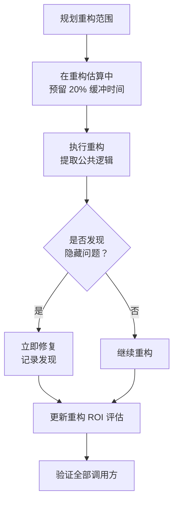

> **来源**：从 `docs/retrospective/reports/retrospective-comprehensive-20260623/execution-s4-s7.md` 七、7.2 发现一 拆分

# 重构中隐藏 Bug 发现（refactoring-hidden-bug-discovery）

## 模式类型
方法论模式

## 成熟度
L1 实验性（1 次成功案例：S4 lib/ 公共库重构中发现 resolve_project_root OR 逻辑 bug）

## 适用场景
执行代码重构时，需要准确评估重构的真实回报率，避免低估其价值。

## 问题背景

重构的价值评估通常只关注"消除重复代码"这一表面收益。但实践中，重构过程往往能暴露隐藏在原始代码中的问题——这些问题在原始结构中从未被触发，因此静态分析或常规测试无法发现。

低估重构价值会导致：
- 重构任务被推迟或跳过（"现在没时间优化代码结构"）
- 重构范围被压缩（"只做必要的提取即可"）
- 隐藏的 bug 继续潜伏，在未来的边缘场景中爆发

## 核心公式

```
重构的真实 ROI = 消除的重复代码 + 发现的隐藏问题 × 风险系数 + 建立的结构基础
```

其中"发现的隐藏问题"的权重通常不低于"消除的重复代码"——在本案例中，隐藏 bug 的发现使实际 ROI 约为表面 ROI 的 2 倍。

## 隐藏 Bug 为什么在重构中暴露

| 机制 | 说明 |
|------|------|
| **被迫遍历逻辑路径** | 提取公共代码时，必须逐行理解原始逻辑，被动的"阅读理解"变成主动的"逻辑审计" |
| **边界条件显式化** | 将隐式行为（如 OR 的短路求值）转化为显式策略时，原有歧义暴露 |
| **调用方上下文切换** | 从单一调用方视角切换到多调用方视角时，发现原有假设在新上下文中不成立 |

## 本案例详解

| 维度 | 内容 |
|------|------|
| **bug** | `resolve_project_root` 使用 `AGENTS.md OR README.md` 的 OR 逻辑向上遍历，先遇到 `.agents/README.md` 即返回 `.agents/` 而非项目根目录 |
| **为何未被触发** | 原始调用方使用硬编码路径 `Path(__file__).parent.parent / "roles"`，不会触发遍历逻辑 |
| **如何在重构中暴露** | 提取公共库时，函数被泛化为"从任意子目录解析项目根"，新调用方触发了遍历路径 |
| **修复** | 改为双层策略：先遍历全部祖先找 AGENTS.md（最精确），未找到则以最近的 README.md 回退 |

## 操作流程



## 实施建议

| 原则 | 具体做法 |
|------|---------|
| **预算缓冲** | 重构任务规划中预留 20% 的时间用于"重构中可能发现的问题修复" |
| **逐行审计** | 提取公共代码时，不止看"是否重复"，更要看"逻辑是否正确" |
| **记录发现** | 每次重构中发现的隐藏问题计入重构收益，形成正向反馈 |
| **不跳过验证** | 即使"只是提取"，也必须回归验证所有调用方——这是发现问题的最后一道防线 |

## 成功案例

| 重构任务 | 表面收益 | 隐藏发现 | 实际 ROI |
|---------|---------|---------|---------|
| S4 lib/ 公共库创建 | 消除约 100 行重复代码 | resolve_project_root OR 逻辑 bug | 约 2× 表面收益 |

## 与现有模式的关系

- `diff-driven-refactoring.md`：本模式是其"回归验证"阶段的深化——当回归验证暴露问题时，这些问题往往不是重构引入的，而是原代码中潜伏的
- `fact-statement-consistency-loop.md`：修正发现的 bug 后，应搜索同类模式确保全局一致性

> **关联模块**：
> - `diff-driven-refactoring.md`
> - `fact-statement-consistency-loop.md`
