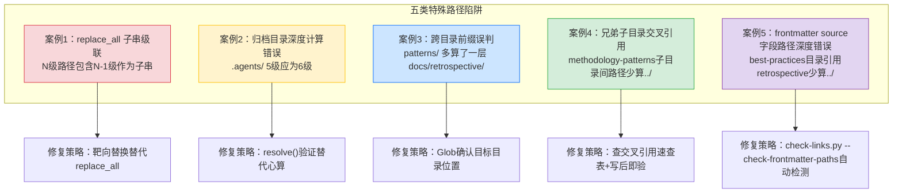

# 相对路径五类特殊踩坑案例

## 核心原则

相对路径修复看似机械，但有五类非直觉的陷阱会导致"越修越多"或"修完仍错"。这五类陷阱的共同特征是：**错误不发生在计算层，而发生在替换机制和目录定位层**——工具的子串匹配行为、目标目录的实际位置、路径前缀的包含关系、兄弟子目录交叉引用、frontmatter字段引用，这些维度单独看都合理，组合在一起却产生级联错误。

## 成熟度评估

| 维度 | 评估 | 依据 |
|------|------|------|
| 实践验证 | 中 | 1 次批量修复 481 个断链时集中触发（analysis-report.md 归档目录） |
| 可复用性 | 高 | 适用于所有涉及 `../` 重复模式的批量替换和跨目录路径编写 |
| 通用性 | 高 | 不限于特定项目——任何使用相对路径的 Markdown/代码项目均可复用 |

## 五类踩坑案例



---

## 案例 1：replace_all 子串级联替换陷阱

### 问题现象

在修复 `analysis-report.md` 中的 `.agents/` 链接时，需要将 5 级 `../../../../../.agents/`（错误）替换为 6 级 `../../../../../../.agents/`（正确）。使用 `replace_all` 执行替换后，断链数从 15 个**增加**到 31 个——原本正确的 6 级路径被再次替换成了 7 级。

### 根因分析

`../` 重复模式有一个数学性质：**N 级路径总是包含 N-1 级作为子串**（从第 3 个字符位置开始）。

```
6级: ../../../../../../../.agents/   (正确，无需修改)
5级:   ../../../../../.agents/        (错误，需要修改)
```

6 级字符串 `../../../../../../.agents/` 中，从位置 3 开始的子串恰好是 `../../../../../.agents/`（5 级）。因此 `replace_all` 在搜索 5 级模式时，会命中 6 级字符串的后半部分，将 6 级也替换成 7 级。

```
替换前: ../../../../../../../.agents/  (6级，正确)
         ↓ replace_all 命中位置3开始的5级子串
替换后: ../../../../../../../../.agents/ (7级，错误)
```

### 影响链

```
15个断链(5级错误)
    ↓ replace_all 级联替换
31个断链(5级未修 + 6级被误伤变7级)
    ↓ 反向替换7级→6级
15个断链(回归原始错误数)
    ↓ 再靶向修复5级→6级
0个断链
```

### 修复方法

**错误做法**（级联触发）——`replace_all` 会把已正确的 6 级路径误伤为 7 级：

```python
# ❌ 危险：old_string 是 new_string 的子串，replace_all 会级联
Edit(
    file_path="analysis-report.md",
    old_string="../../../../../.agents/",   # 5级
    new_string="../../../../../../.agents/", # 6级（包含5级作为子串）
    replace_all=True
)
# 结果：6级路径中的5级子串被命中，6级变7级，断链 15→31
```

**正确做法一**（Grep 定位 + 逐行 Edit 靶向修复，推荐）：

```python
# ✅ Step 1: Grep 精确定位所有 5 级路径所在行
# Grep pattern="\.\./\.\./\.\./\.\./\.\./\.agents/" path="analysis-report.md" -n
# 返回: 535, 637, 648, 649, 671, 673, 707, 708, ...

# ✅ Step 2: 逐行 Edit，用唯一上下文锚定，只改 5 级不改 6 级
Edit(
    file_path="analysis-report.md",
    old_string="[阶段守卫](../../../../../.agents/scripts/stage-guard.py)",  # 含行内上下文
    new_string="[阶段守卫](../../../../../../.agents/scripts/stage-guard.py)",
    replace_all=False  # 逐个替换，不批量
)
```

**正确做法二**（反向修复级联后再靶向修复）：

```python
# Step 1: 反向替换——把被误伤的 7 级回退为 6 级（7级包含6级子串，但6级短，不会级联）
Edit(
    file_path="analysis-report.md",
    old_string="../../../../../../../.agents/",   # 7级（被误伤的）
    new_string="../../../../../../.agents/",       # 6级
    replace_all=True  # 安全：6级短于7级，不会级联
)
# Step 2: 再逐行 Edit 修复原始的 5级→6级（同做法一）
```

**安全批量替换函数**——在调用 `replace_all` 前自动检测子串风险：

```python
from pathlib import Path

def safe_batch_replace(filepath: Path, old: str, new: str) -> int:
    """检测子串风险后选择安全策略执行批量替换，返回替换行数。"""
    if old in new:  # old 是 new 的子串 → replace_all 会级联
        # ⚠️ 子串风险：逐行替换，避免级联
        lines = filepath.read_text(encoding="utf-8").splitlines()
        count = 0
        for i, line in enumerate(lines):
            if old in line:
                lines[i] = line.replace(old, new)
                count += 1
        filepath.write_text("\n".join(lines) + "\n", encoding="utf-8")
        return count
    else:
        # ✅ 安全：可直接 replace_all（通过 Edit 工具）
        # 此处需调用 Edit 工具，Python 中仅示意
        raise NotImplementedError("使用 Edit 工具 replace_all=True")

# 使用示例
count = safe_batch_replace(
    Path("analysis-report.md"),
    old="../../../../../.agents/",
    new="../../../../../../.agents/"
)
print(f"替换了 {count} 行（逐行模式，无级联风险）")
```

### 防范措施

**子串风险检测函数**——一行代码判断 `replace_all` 是否安全：

```python
def is_cascade_risky(old: str, new: str) -> bool:
    """replace_all 子串级联风险检测：old 是 new 的子串则不安全。

    当 old 是 new 的子串时，replace_all 搜索 old 会匹配到文本中
    已有的 new（正确路径）中的 old 子串，导致 new 被误伤为更长的路径。

    注意：只检查 old in new（不检查 new in old）。因为 replace_all
    只搜索 old，如果 old 比 new 长，不会匹配到 new（更短）。
    """
    return old in new

# 检测案例1的替换（5级→6级）
print(is_cascade_risky("../../../../../.agents/", "../../../../../../.agents/"))
# True — 5级(old)是6级(new)的子串，replace_all 会级联！

# 检测案例1的反向替换（7级→6级）
print(is_cascade_risky("../../../../../../../.agents/", "../../../../../../.agents/"))
# False — 7级(old)不是6级(new)的子串，replace_all 安全

# 检测案例3的替换（5级→4级）
print(is_cascade_risky("../../../../../patterns/", "../../../../patterns/"))
# False — 5级(old)不是4级(new)的子串，replace_all 安全
```

| 场景 | replace_all 安全性 | 推荐策略 |
|------|-------------------|---------|
| `../` 重复模式（短→长，N级→N+1级） | ❌ 不安全（old 是 new 的子串） | 逐行 Edit 靶向替换 |
| `../` 重复模式（长→短，N级→N-1级） | ✅ 安全（old 不是 new 的子串） | replace_all |
| 唯一字符串替换（如文件名） | ✅ 安全 | replace_all |
| 短字符串→长字符串（old 是 new 的子串） | ❌ 不安全（级联） | 逐行 Edit |
| 长字符串→短字符串（old 不是 new 的子串） | ✅ 安全 | replace_all |

**通用规则**：使用 `replace_all` 前先调用 `is_cascade_risky(old, new)` ——**如果返回 `True`，禁止使用 `replace_all`，改用逐行 Edit**。

---

## 案例 2：归档目录深度计算错误

### 问题现象

将 `analysis-report.md` 归档到 `docs/retrospective/reports/insight-extraction/external-learning/retrospective-codex-article-analysis-20260706/` 后，附录中引用 `.agents/` 目录的链接全部断链——使用了 5 级 `../../../../../.agents/`，但实际需要 6 级 `../../../../../../.agents/`。

### 根因分析

归档目录距项目根有 6 层深度：

```
docs/                                    ← 1层
  retrospective/                         ← 2层
    reports/                             ← 3层
      insight-extraction/                ← 4层
        external-learning/               ← 5层
          retrospective-codex-.../       ← 6层
            analysis-report.md           ← 文件在此
```

从文件回退到项目根需要 6 个 `../`，但编写附录时心算为 5 层，少算了一层 `external-learning/`。

**常见心算误区**：将 `reports/` 误认为顶层目录，从 `reports/` 开始数层级，漏掉了 `docs/retrospective/` 两层。

### 修复方法

**路径深度自动计算**——用 Python 计算正确的 `../` 层数，替代心算：

```python
from pathlib import Path

def compute_relative_depth(source_file: Path, target_dir: Path, project_root: Path) -> int:
    """计算从源文件到目标目录需要的 ../ 层数。

    Args:
        source_file: 源文件路径（如 analysis-report.md）
        target_dir: 目标目录路径（如 project_root/.agents）
        project_root: 项目根目录

    Returns:
        需要的 ../ 层数
    """
    source_dir = source_file.parent.resolve()
    target = target_dir.resolve()
    # 找到公共祖先
    common = Path(*[p for p in source_dir.parts if p in target.parts] or ["/"])
    # 从源文件到公共祖先的层数 = 需要的 ../ 数
    depth = len(source_dir.relative_to(project_root).parts)
    return depth

# 实际计算：analysis-report.md 到 .agents/ 需要多少层 ../
source = Path("docs/retrospective/reports/insight-extraction/external-learning/"
              "retrospective-codex-article-analysis-20260706/analysis-report.md")
project_root = Path(".")
target = project_root / ".agents"

depth = compute_relative_depth(source, target, project_root)
print(f"需要 {depth} 层 ../")  # 输出: 需要 6 层 ../
print(f"正确路径: {'../' * depth}.agents/")
# 输出: 正确路径: ../../../../../../.agents/
```

**resolve() 验证**——编写路径后立即验证目标是否存在：

```python
from pathlib import Path

source_file = Path("docs/retrospective/reports/insight-extraction/external-learning/"
                   "retrospective-codex-article-analysis-20260706/analysis-report.md")

# ❌ 错误路径（5级，少算一层）
wrong_path = "../../../../../.agents/scripts/stage-guard.py"
resolved_wrong = (source_file.parent / wrong_path).resolve()
print(f"5级路径存在: {resolved_wrong.exists()}")  # False

# ✅ 正确路径（6级）
correct_path = "../../../../../../.agents/scripts/stage-guard.py"
resolved_correct = (source_file.parent / correct_path).resolve()
print(f"6级路径存在: {resolved_correct.exists()}")  # True
```

**check-links.py 即时校验**——归档后立即运行链接检查：

```bash
# 仅检查（不修复）
python .agents/scripts/check-links.py --path "docs/retrospective/reports/insight-extraction/external-learning/retrospective-codex-article-analysis-20260706"

# 自动修复 file:/// 绝对路径和深度错误
python .agents/scripts/check-links.py --path "docs/retrospective/reports/insight-extraction/external-learning/retrospective-codex-article-analysis-20260706" --fix

# 预览修复内容（不写入文件）
python .agents/scripts/check-links.py --path "docs/retrospective/reports/insight-extraction/external-learning/retrospective-codex-article-analysis-20260706" --fix --dry-run
```

### 防范措施

1. **查表优先**：使用 [depth-reference-table.md](depth-reference-table.md) 中的预计算参考表，不依赖心算
2. **resolve() 验证**：编写路径后立即用以下代码验证目标存在：

```python
# 一行验证法：路径写完后立即检查
assert (source_file.parent / relative_path).resolve().exists(), \
    f"断链: {relative_path} 解析到 {(source_file.parent / relative_path).resolve()}"
```

3. **check-links.py 即时校验**：归档后立即运行链接检查（见上方命令）
4. **目录树可视化**：归档前确认实际嵌套深度：

```bash
# Windows PowerShell
Get-ChildItem -Path "docs/retrospective/reports/insight-extraction/external-learning" -Recurse -Depth 1 | Select-Object FullName

# Linux/Mac
find "docs/retrospective/reports/insight-extraction/external-learning" -maxdepth 2 -type d
```

---

## 案例 3：跨目录前缀误判

### 问题现象

同一文件中，`patterns/` 链接使用了 `../../../../../patterns/`（5 级），解析后指向 `docs/patterns/`——但该目录不存在。实际目标 `docs/retrospective/patterns/` 需要 4 级 `../../../../patterns/`。

### 根因分析

此案例的错误不在层级数量，而在**目标目录的实际位置判断错误**：

```
错误假设: patterns/ 在 docs/ 下      → 5级回退到docs/ + patterns/
实际情况: patterns/ 在 docs/retrospective/ 下 → 4级回退到docs/retrospective/ + patterns/
```

```
文件: docs/retrospective/reports/insight-extraction/external-learning/retrospective-codex-.../analysis-report.md

5级回退: ../../../../../ → docs/
         + patterns/     → docs/patterns/  ❌ 不存在

4级回退: ../../../../    → docs/retrospective/
         + patterns/     → docs/retrospective/patterns/  ✅ 正确
```

**深层原因**：编写者知道 `patterns/` 属于 `retrospective` 体系，但未确认它是 `docs/retrospective/patterns/` 而非 `docs/patterns/`。项目目录结构中，`docs/` 下直接子目录与 `docs/retrospective/` 下子目录容易混淆。

### 修复方法

**Glob 确认目标目录位置**——编写跨目录引用前先确认实际位置：

```bash
# 确认 patterns/ 目录的实际位置
# Glob pattern="docs/**/patterns/" → 返回匹配的目录

# 也可以用 Python 验证
python -c "from pathlib import Path; print([p for p in Path('docs').rglob('patterns') if p.is_dir()])"
# 输出: [PosixPath('docs/retrospective/patterns')]  ← 在 docs/retrospective/ 下，不是 docs/ 下
```

**resolve() 双路径验证**——同时验证错误路径和正确路径：

```python
from pathlib import Path

source_file = Path("docs/retrospective/reports/insight-extraction/external-learning/"
                   "retrospective-codex-article-analysis-20260706/analysis-report.md")

# ❌ 错误路径（5级，解析到 docs/patterns/）
wrong_path = "../../../../../patterns/methodology-patterns/tools-automation/path-discipline.md"
resolved_wrong = (source_file.parent / wrong_path).resolve()
print(f"5级路径解析到: {resolved_wrong}")
# 输出: 5级路径解析到: docs/patterns/methodology-patterns/tools-automation/path-discipline.md
print(f"5级路径存在: {resolved_wrong.exists()}")  # False — docs/patterns/ 不存在

# ✅ 正确路径（4级，解析到 docs/retrospective/patterns/）
correct_path = "../../../../patterns/methodology-patterns/tools-automation/path-discipline.md"
resolved_correct = (source_file.parent / correct_path).resolve()
print(f"4级路径解析到: {resolved_correct}")
# 输出: 4级路径解析到: docs/retrospective/patterns/methodology-patterns/tools-automation/path-discipline.md
print(f"4级路径存在: {resolved_correct.exists()}")  # True
```

**安全 replace_all 修复**——确认无子串风险后批量替换：

```python
# 先检测子串风险（见案例1的 is_cascade_risky 函数）
old = "../../../../../patterns/"
new = "../../../../patterns/"
print(is_cascade_risky(old, new))  # False — 5级(old)不是4级(new)的子串

# ✅ 安全：可以直接 replace_all
# Edit(file_path="analysis-report.md", old_string=old, new_string=new, replace_all=True)
```

### 防范措施

1. **Glob 确认目标目录**：编写跨目录引用前，先确认目标目录的实际路径：

```python
from pathlib import Path

def find_target_dir(dirname: str, search_root: str = ".") -> list[Path]:
    """搜索目录的实际位置，避免假设。"""
    return [p for p in Path(search_root).rglob(dirname) if p.is_dir()]

# 确认 patterns/ 的位置
results = find_target_dir("patterns", "docs")
for p in results:
    print(p)  # 输出: docs/retrospective/patterns
```

2. **不要假设目录位置**：项目目录结构可能不符合直觉（如 `patterns/` 不在 `docs/` 下而在 `docs/retrospective/` 下）
3. **路径前缀审计函数**——归档后自动审计所有跨目录引用：

```python
import re
from pathlib import Path

def audit_cross_dir_links(source_file: Path, project_root: Path) -> list[dict]:
    """审计 Markdown 文件中所有跨目录引用，检测前缀误判。

    Returns:
        断链列表: [{line, text, url, resolved, candidates}]
    """
    LINK_RE = re.compile(r'\[([^\]]+)\]\(([^)]+)\)')
    content = source_file.read_text(encoding="utf-8")
    broken = []

    for i, line in enumerate(content.splitlines(), 1):
        for m in LINK_RE.finditer(line):
            text, url = m.group(1), m.group(2)
            if url.startswith(("http", "#", "mailto:")):
                continue
            clean_url = url.split("#")[0]
            if not clean_url:
                continue
            resolved = (source_file.parent / clean_url).resolve()
            if not resolved.exists():
                # 搜索同名目标作为修复建议
                target_name = Path(clean_url).name
                candidates = list(project_root.glob(f"**/{target_name}"))[:3]
                broken.append({
                    "line": i,
                    "text": text,
                    "url": url,
                    "resolved": str(resolved),
                    "candidates": [str(c) for c in candidates]
                })
    return broken

# 使用示例
broken = audit_cross_dir_links(
    Path("docs/retrospective/reports/insight-extraction/external-learning/"
         "retrospective-codex-article-analysis-20260706/analysis-report.md"),
    Path(".")
)
for b in broken:
    print(f"行{b['line']}: [{b['text']}]({b['url']})")
    print(f"  解析到: {b['resolved']}")
    if b['candidates']:
        print(f"  可能目标: {b['candidates']}")
```

---

## 案例 4：兄弟子目录交叉引用深度心算错误

### 问题现象

在 `docs/retrospective/patterns/methodology-patterns/ai-collaboration/` 下创建3个新模式文件时，引用兄弟子目录中的模式出现5处路径错误：
- 引用 `tools-automation/` 下的模式时写成 `tools-automation/xxx.md`（应为 `../tools-automation/xxx.md`）
- 引用 `architecture-patterns/` 下的模式时写成 `../architecture-patterns/xxx.md`（应为 `../../architecture-patterns/xxx.md`）
- 引用 `reports/` 目录下的复盘文件时写成 `../../reports/xxx.md`（应为 `../../../reports/xxx.md`）

### 根因分析

此案例本质上是案例2（深度计算错误）在**兄弟子目录互引**场景下的高频变体，但比"回退到项目根"更容易出错，因为：
1. **不同目标需要不同层级的`../`**：同目录文件0层、兄弟子目录1层、父级目录下兄弟2层、祖父级目录下兄弟3层——每个目标都要单独心算
2. **从export-suggestions.md复制路径前缀导致错误**：export-suggestions.md在`reports/`目录下（深度6），其相对路径前缀与`ai-collaboration/`（深度5）不同，直接复制导致前缀错误
3. **同目录引用不加`../`的直觉误导**：编写同目录链接时不需要`../`，切换到兄弟目录时容易忘记加`../`

### 错误对照

| 引用目标 | 错误写法 | 正确写法 | 错误类型 |
|---------|---------|---------|---------|
| tools-automation/xxx.md | `tools-automation/xxx.md` | `../tools-automation/xxx.md` | 少1层（同目录直觉） |
| architecture-patterns/xxx.md | `../architecture-patterns/xxx.md` | `../../architecture-patterns/xxx.md` | 少1层 |
| reports/xxx.md | `../../reports/xxx.md` | `../../../reports/xxx.md` | 少1层 |

### 修复方法

**查交叉引用速查表**（见 [depth-reference-table.md](depth-reference-table.md) 的"methodology-patterns子目录交叉引用"章节）：

从 `methodology-patterns/<subdir>/` 出发的通用规律：
- 同目录文件：`filename.md`（0层 `../`）
- methodology-patterns 下兄弟子目录：`../<sibling>/`（1层）
- patterns 下兄弟目录：`../../<sibling>/`（2层）
- retrospective 下目录：`../../../<dir>/`（3层）
- 项目根：`../../../../../`（5层）

**写后即验**——写完每个跨目录链接后立即用Python一行验证：

```python
from pathlib import Path
src = Path("docs/retrospective/patterns/methodology-patterns/ai-collaboration/new-pattern.md")
assert (src.parent / "../tools-automation/target.md").resolve().exists(), "断链！"
```

### 防范措施

1. **新文件创建后立即跑链接检查**：不要等全部写完再检查，写完一个文件就验证一次
2. **不要从不同深度的文件复制路径前缀**：export-suggestions.md在reports/下（6层），其前缀与patterns下文件（4-5层）不同
3. **首次引用兄弟目录时先验证一个链接**：确认层级正确后，同类型引用可复用此前缀
4. **查阅速查表替代心算**：见 [depth-reference-table.md](depth-reference-table.md)

---

## 案例 5：frontmatter source 字段路径深度错误

### 问题现象

在 `docs/knowledge/best-practices/` 目录下，2个文档的 frontmatter `source` 字段引用 `docs/retrospective/...` 时使用了错误的相对路径深度——只向上回退1层（`../retrospective/...`），实际需要向上2层（`../../retrospective/...`），导致溯源断链。

### 根因分析

此案例是案例2（深度计算错误）和案例4（兄弟子目录交叉引用）在 **frontmatter 元数据**场景下的变体，但有独特的高频性：

```
文件位置: docs/knowledge/best-practices/b2b-product-info-collection-sop.md
目标位置: docs/retrospective/...

正确相对路径: ../../retrospective/...   (向上2层：best-practices → knowledge → docs)
错误路径:     ../retrospective/...       (只向上1层，少了1个 ../)
```

**深层原因**：
1. **frontmatter 字段比正文链接更容易被忽视**：编写者关注正文链接有效性，但 frontmatter 中的 source 字段作为元数据"隐性引用"常被遗漏
2. **正文链接心算错误的经验未迁移到 frontmatter**：编写者知道正文链接需要正确深度，但未意识到 source 字段同样需要正确的相对路径
3. **工具未覆盖 frontmatter**：原 check-links.py 只检查正文 Markdown 链接，不解析 TOML frontmatter，导致这类错误长期潜伏

### 错误对照

| 字段位置 | 错误写法 | 正确写法 | 错误类型 |
|---------|---------|---------|---------|
| frontmatter source | `../retrospective/...` | `../../retrospective/...` | 少1层（与正文同样的心算错误） |
| frontmatter source | `docs/knowledge/...` | `../../knowledge/...` | 用 docs/ 绝对前缀 |
| frontmatter source | `retrospective/...` | `../../retrospective/...` | 路径不完整（缺 `../../`） |

### 修复方法

**check-links.py --check-frontmatter-paths 自动检测**——增强后的工具可自动解析 frontmatter 中所有路径字段：

```bash
# 检查 frontmatter 中所有路径字段（source, x-toml-ref, related_*）
python .agents/scripts/check-links.py --path "docs/knowledge/best-practices" --check-frontmatter-paths

# 预览修复内容（不写入文件）
python .agents/scripts/check-links.py --path "docs/knowledge/best-practices" --check-frontmatter-paths --dry-run
```

**统一格式规范**——要求 source 字段使用相对路径，禁止 `docs/` 开头的绝对路径：

```yaml
# ✅ 规范：相对路径
source: "external: 不存在-../../retrospective/reports/xxx.md#section"

# ❌ 不规范：docs/ 前缀绝对路径
source: "external: 不存在-docs/knowledge/xxx.md"

# ❌ 不规范：不完整路径
source: "external: 不存在-retrospective/xxx.md"
```

### 防范措施

1. **frontmatter 检查纳入质量门禁**：使用 `--check-frontmatter-paths` 参数验证所有路径字段
2. **格式规范强制**：source 字段必须使用相对路径，禁止 `docs/` 前缀
3. **关联检查双覆盖原则**：见 [link-check-dual-coverage.md](link-check-dual-coverage.md)——正文链接和 frontmatter 元数据需要双维度覆盖
4. **写后即验**：编辑 frontmatter 后立即运行检查，不要等批量检查

---

## 五类案例的共性教训

| 案例 | 错误层 | 根因 | 防范核心 |
|------|--------|------|---------|
| 1. replace_all 级联 | 工具机制层 | `../` 子串包含 | 子串检查后决定是否用 replace_all |
| 2. 归档目录深度计算错误 | 计算层 | 心算漏层（回退到根） | 查表 + resolve() 验证 |
| 3. 跨目录前缀误判 | 定位层 | 目标目录位置假设错误 | Glob 确认实际位置 |
| 4. 兄弟子目录交叉引用 | 计算层 | 心算漏层（兄弟目录互引） | 查交叉引用速查表 + 写后即验 |
| 5. frontmatter source 字段路径错误 | 计算层+工具覆盖层 | 心算漏层+frontmatter未被工具覆盖 | check-links.py --check-frontmatter-paths 自动检测 |

**共性教训**：五类错误都不在"路径语法"层面，而在更上游——工具行为理解、心算可靠性、目录结构确认、前缀复制来源、frontmatter工具覆盖。路径编写的可靠保障不是更仔细地心算，而是**用工具验证替代心算**（resolve / Glob / check-links.py / 速查表），且工具检查范围必须覆盖所有引用存在的维度（见 [link-check-dual-coverage.md](link-check-dual-coverage.md)）。

## 适用条件

- ✅ 批量修复 `../` 重复模式的相对路径
- ✅ 文件归档/迁移后验证链接有效性
- ✅ 跨目录引用编写（尤其是深层嵌套目录）
- ✅ 委派子智能体执行路径修复任务时作为注意事项

## 不适用场景

- 同目录文件引用（无 `../` 前缀）
- 绝对路径场景（项目内禁止使用）
- 单文件单链接修复（直接 Edit 即可）

## 与其他模式的关系

| 方法论 | 关系 |
|--------|------|
| [depth-reference-table.md](depth-reference-table.md) | 深度参考表解决"计算层"错误（案例2），本模式补充"工具机制层"和"定位层"错误 |
| [search-replace-fragility.md](search-replace-fragility.md) | SearchReplace 脆弱性关注多轮替换的 old_str 匹配失败，本模式关注 replace_all 的子串级联——两者是替换工具的两类不同陷阱 |
| [path-discipline.md](path-discipline.md) | 路径纪律关注文件写入位置，本模式关注文件内引用路径的编写与修复 |
| [precision-over-recall.md](precision-over-recall.md) | 精度优先原则在本模式中体现为：宁可逐行 Edit 也不冒 replace_all 级联风险 |
| [link-decay-laws.md](../document-architecture/link-decay-laws.md) | 链接衰变四规律解释了为什么归档后断链高频出现，本模式提供归档断链的具体修复方法 |
| [link-check-dual-coverage.md](link-check-dual-coverage.md) | 双覆盖原则为案例5提供工具化检测能力——本模式记录人工编写陷阱，双覆盖原则提供工具检测兜底 |

> 来源1：2026-07-07 批量修复 `docs/retrospective/reports` 下 481 个断链时，在 `analysis-report.md` 归档目录集中触发三类特殊路径错误
> 来源2：2026-07-08 Vibe Coding Prompt复盘模式沉淀，3个新文件出现5处兄弟子目录交叉引用路径错误（案例4）
> 来源3：2026-07-09 best-practices目录断链修复，2个文档 frontmatter source 字段路径深度错误（案例5）
> 关联模块：`depth-reference-table.md`、`search-replace-fragility.md`、`path-discipline.md`、`link-check-dual-coverage.md`、`.agents/scripts/check-links.py`
