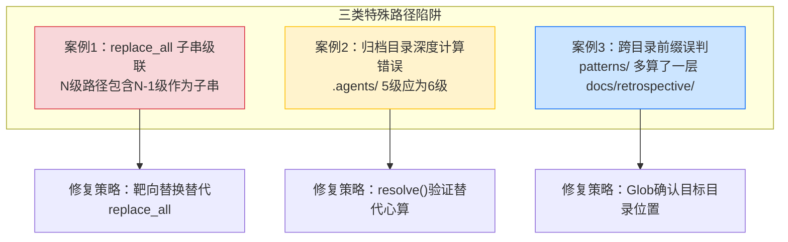

# 相对路径三类特殊踩坑案例

## 核心原则

相对路径修复看似机械，但有三类非直觉的陷阱会导致"越修越多"或"修完仍错"。这三类陷阱的共同特征是：**错误不发生在计算层，而发生在替换机制和目录定位层**——工具的子串匹配行为、目标目录的实际位置、路径前缀的包含关系，这三个维度单独看都合理，组合在一起却产生级联错误。

## 成熟度评估

| 维度 | 评估 | 依据 |
|------|------|------|
| 实践验证 | 中 | 1 次批量修复 481 个断链时集中触发（analysis-report.md 归档目录） |
| 可复用性 | 高 | 适用于所有涉及 `../` 重复模式的批量替换和跨目录路径编写 |
| 通用性 | 高 | 不限于特定项目——任何使用相对路径的 Markdown/代码项目均可复用 |

## 三类踩坑案例



---

## 案例 1：replace_all 子串级联替换陷阱

### 问题现象

在修复 `analysis-report.md` 中的 `.agents/` 链接时，需要将 5 级 `../../../../../.agents/`（错误）替换为 6 级 `../../../../../../.agents/`（正确）。使用 `replace_all` 执行替换后，断链数从 15 个**增加**到 31 个——原本正确的 6 级路径被再次替换成了 7 级。

### 根因分析

`../` 重复模式有一个数学性质：**N 级路径总是包含 N-1 级作为子串**（从第 3 个字符位置开始）。

```
6级: ../../../../../../../.agents/   (正确，无需修改)
5级:   ../../../../../.agents/        (错误，需要修改)
```

6 级字符串 `../../../../../../.agents/` 中，从位置 3 开始的子串恰好是 `../../../../../.agents/`（5 级）。因此 `replace_all` 在搜索 5 级模式时，会命中 6 级字符串的后半部分，将 6 级也替换成 7 级。

```
替换前: ../../../../../../../.agents/  (6级，正确)
         ↓ replace_all 命中位置3开始的5级子串
替换后: ../../../../../../../../.agents/ (7级，错误)
```

### 影响链

```
15个断链(5级错误)
    ↓ replace_all 级联替换
31个断链(5级未修 + 6级被误伤变7级)
    ↓ 反向替换7级→6级
15个断链(回归原始错误数)
    ↓ 再靶向修复5级→6级
0个断链
```

### 修复方法

**错误做法**（级联触发）：
```
replace_all: ../../../../../.agents/ → ../../../../../../.agents/
```

**正确做法一**（反向修复级联）：
```
Step 1: replace_all ../../../../../..//.agents/ → ../../../../../../.agents/  (7级回退6级)
Step 2: 逐行 Edit 靶向修复 5级→6级（用唯一上下文锚定）
```

**正确做法二**（避免级联，推荐）：
```
用 Grep 定位所有匹配行 → 逐行 Edit（带上下文）逐个修复
```

### 防范措施

| 场景 | replace_all 安全性 | 推荐策略 |
|------|-------------------|---------|
| `../` 重复模式（N级↔N±1级） | ❌ 不安全（子串包含） | 逐行 Edit 靶向替换 |
| 唯一字符串替换（如文件名） | ✅ 安全 | replace_all |
| 短字符串→长字符串（目标包含源） | ❌ 不安全（级联） | 逐行 Edit |
| 长字符串→短字符串（源包含目标） | ✅ 安全 | replace_all |

**通用规则**：使用 `replace_all` 前先检查——**如果旧字符串是新字符串的子串，或新字符串是旧字符串的子串，禁止使用 `replace_all`**。

---

## 案例 2：归档目录深度计算错误

### 问题现象

将 `analysis-report.md` 归档到 `docs/retrospective/reports/insight-extraction/external-learning/retrospective-codex-article-analysis-20260706/` 后，附录中引用 `.agents/` 目录的链接全部断链——使用了 5 级 `../../../../../.agents/`，但实际需要 6 级 `../../../../../../.agents/`。

### 根因分析

归档目录距项目根有 6 层深度：

```
docs/                                    ← 1层
  retrospective/                         ← 2层
    reports/                             ← 3层
      insight-extraction/                ← 4层
        external-learning/               ← 5层
          retrospective-codex-.../       ← 6层
            analysis-report.md           ← 文件在此
```

从文件回退到项目根需要 6 个 `../`，但编写附录时心算为 5 层，少算了一层 `external-learning/`。

**常见心算误区**：将 `reports/` 误认为顶层目录，从 `reports/` 开始数层级，漏掉了 `docs/retrospective/` 两层。

### 修复方法

```
Grep 定位所有 .agents/ 链接行
  ↓ 确认当前层级（5级=错误）
  ↓ 确认正确层级（6级）
逐行 Edit 将 ../../../../../.agents/ 改为 ../../../../../../.agents/
  ↓ 运行 check-links.py 验证
```

### 防范措施

1. **查表优先**：使用 [depth-reference-table.md](depth-reference-table.md) 中的预计算参考表，不依赖心算
2. **resolve() 验证**：编写路径后立即用 `(source_dir / relative_path).resolve().exists()` 验证目标存在
3. **check-links.py 即时校验**：归档后立即运行 `python .agents/scripts/check-links.py --path <归档目录>`
4. **目录树可视化**：归档前用 `tree` 或 `Get-ChildItem -Recurse -Depth 1` 确认实际嵌套深度

---

## 案例 3：跨目录前缀误判

### 问题现象

同一文件中，`patterns/` 链接使用了 `../../../../../patterns/`（5 级），解析后指向 `docs/patterns/`——但该目录不存在。实际目标 `docs/retrospective/patterns/` 需要 4 级 `../../../../patterns/`。

### 根因分析

此案例的错误不在层级数量，而在**目标目录的实际位置判断错误**：

```
错误假设: patterns/ 在 docs/ 下      → 5级回退到docs/ + patterns/
实际情况: patterns/ 在 docs/retrospective/ 下 → 4级回退到docs/retrospective/ + patterns/
```

```
文件: docs/retrospective/reports/insight-extraction/external-learning/retrospective-codex-.../analysis-report.md

5级回退: ../../../../../ → docs/
         + patterns/     → docs/patterns/  ❌ 不存在

4级回退: ../../../../    → docs/retrospective/
         + patterns/     → docs/retrospective/patterns/  ✅ 正确
```

**深层原因**：编写者知道 `patterns/` 属于 `retrospective` 体系，但未确认它是 `docs/retrospective/patterns/` 而非 `docs/patterns/`。项目目录结构中，`docs/` 下直接子目录与 `docs/retrospective/` 下子目录容易混淆。

### 修复方法

```
Glob 确认 patterns/ 的实际位置
  ↓ 发现 docs/retrospective/patterns/ 存在，docs/patterns/ 不存在
  ↓ 计算正确层级: 4级
replace_all: ../../../../../patterns/ → ../../../../patterns/
  (此处安全：4级短于5级，旧字符串不包含新字符串，不会级联)
  ↓ 验证
```

### 防范措施

1. **Glob 确认目标目录**：编写跨目录引用前，先用 `Glob "docs/**/patterns/"` 确认目标目录的实际路径
2. **不要假设目录位置**：项目目录结构可能不符合直觉（如 `patterns/` 不在 `docs/` 下而在 `docs/retrospective/` 下）
3. **路径前缀审计**：归档文件后，审计所有跨目录引用的前缀是否与目标目录的实际位置匹配

---

## 三类案例的共性教训

| 案例 | 错误层 | 根因 | 防范核心 |
|------|--------|------|---------|
| 1. replace_all 级联 | 工具机制层 | `../` 子串包含 | 子串检查后决定是否用 replace_all |
| 2. 深度计算错误 | 计算层 | 心算漏层 | 查表 + resolve() 验证 |
| 3. 前缀误判 | 定位层 | 目标目录位置假设错误 | Glob 确认实际位置 |

**共性教训**：三类错误都不在"路径语法"层面，而在更上游——工具行为理解、心算可靠性、目录结构确认。路径修复的可靠保障不是更仔细地心算，而是**用工具验证替代心算**（resolve / Glob / check-links.py）。

## 适用条件

- ✅ 批量修复 `../` 重复模式的相对路径
- ✅ 文件归档/迁移后验证链接有效性
- ✅ 跨目录引用编写（尤其是深层嵌套目录）
- ✅ 委派子智能体执行路径修复任务时作为注意事项

## 不适用场景

- 同目录文件引用（无 `../` 前缀）
- 绝对路径场景（项目内禁止使用）
- 单文件单链接修复（直接 Edit 即可）

## 与其他模式的关系

| 方法论 | 关系 |
|--------|------|
| [depth-reference-table.md](depth-reference-table.md) | 深度参考表解决"计算层"错误（案例2），本模式补充"工具机制层"和"定位层"错误 |
| [search-replace-fragility.md](search-replace-fragility.md) | SearchReplace 脆弱性关注多轮替换的 old_str 匹配失败，本模式关注 replace_all 的子串级联——两者是替换工具的两类不同陷阱 |
| [path-discipline.md](path-discipline.md) | 路径纪律关注文件写入位置，本模式关注文件内引用路径的编写与修复 |
| [precision-over-recall.md](precision-over-recall.md) | 精度优先原则在本模式中体现为：宁可逐行 Edit 也不冒 replace_all 级联风险 |
| [link-decay-laws.md](../document-architecture/link-decay-laws.md) | 链接衰变四规律解释了为什么归档后断链高频出现，本模式提供归档断链的具体修复方法 |

> 来源：2026-07-07 批量修复 `docs/retrospective/reports` 下 481 个断链时，在 `analysis-report.md` 归档目录集中触发三类特殊路径错误
> 关联模块：`depth-reference-table.md`、`search-replace-fragility.md`、`path-discipline.md`、`.agents/scripts/check-links.py`
